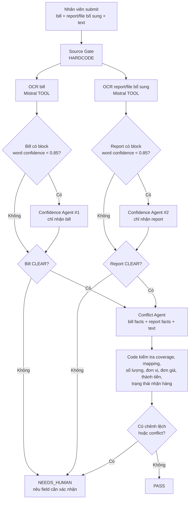
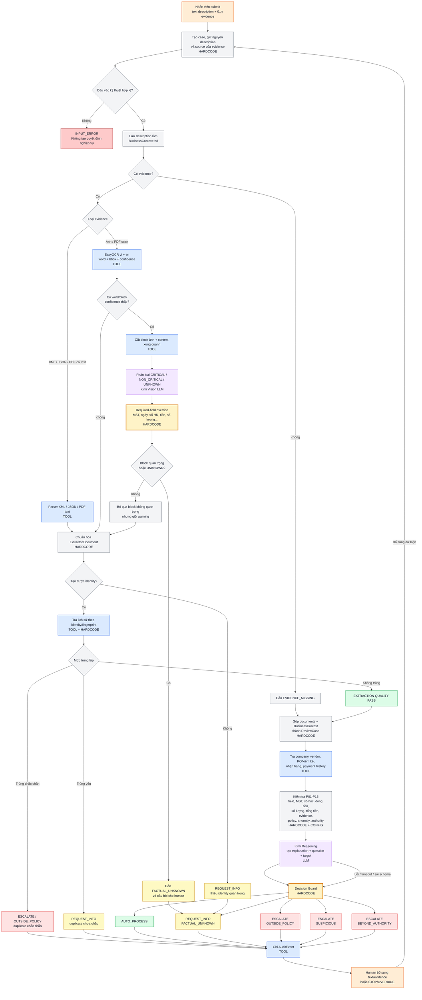
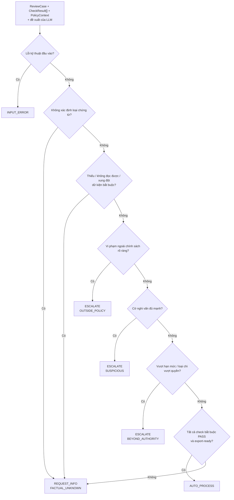

# InvoiceReferee — Workflow chi tiết của tác tử

Ba sơ đồ rút gọn, dễ trình bày cho nhóm và giám khảo nằm trong `WORKFLOW_DIAGRAMS.md`. Tài liệu hiện tại giữ phần điều kiện kỹ thuật chi tiết.

## 1. Chú giải

Workflow dùng bốn loại thành phần:

| Nhãn | Ý nghĩa | Có quyền quyết định cuối không? |
| --- | --- | --- |
| `HARDCODE` | Mã tất định: kiểm tra điều kiện, tính toán, so sánh và ánh xạ chính sách | Có, thông qua Bộ bảo vệ quyết định |
| `CONFIG` | Giá trị cấu hình có thể thay đổi: MST công ty, hạn mức, thời hạn nộp, danh mục cấm, ngưỡng độ tin cậy | Không tự quyết; được mã tất định sử dụng |
| `TOOL` | Bộ phân tích XML/JSON/PDF, EasyOCR, tra cứu cơ sở dữ liệu/API và kho kiểm toán | Không; chỉ cung cấp dữ kiện/bằng chứng |
| `LLM` | Kimi Vision để đọc ảnh; Kimi Reasoning để giải thích, chọn vấn đề chính và tạo câu hỏi | Không; mọi đề xuất phải qua Bộ bảo vệ |
| `HUMAN` | Nhân viên, kế toán, quản lý tài chính hoặc kiểm soát nội bộ | Có quyền bổ sung, dừng hoặc ghi đè |

`HARDCODE` trong tài liệu này nghĩa là **logic tất định được viết bằng mã**, không có nghĩa là ghi trực tiếp mọi giá trị chính sách vào mã nguồn. Ví dụ, phép so sánh `amount > authority_threshold` là `HARDCODE`, còn `authority_threshold = 50.000.000 VND` là `CONFIG` giả lập.

> **Trạng thái hiện tại:** ứng dụng dùng Mistral OCR, Confidence Quality Agent
> theo từng evidence, Cross-source Conflict Agent và policy kiểm kê tất định.
> P01-P15, tra cứu dữ liệu nội bộ và Decision Guard đầy đủ ở các phần sau vẫn là
> workflow mục tiêu, chưa được coi là đã triển khai chỉ vì xuất hiện trong sơ đồ.

### 1.1. Workflow kiểm kê đang triển khai



Ranh giới dữ liệu bắt buộc:

- Mỗi file được OCR độc lập; không lấy text của file này bù cho file khác.
- Mỗi lần gọi Confidence chỉ nhận đúng một evidence, không nhận business context.
- Nếu một evidence bị chặn, không gọi Conflict Agent.
- Conflict Agent chỉ nhận các nguồn đã qua Quality Gate và không tự ra quyết định.
- Kết quả của Conflict Agent phải qua kiểm tra tất định trước khi lưu `PASS` hoặc
  `NEEDS_HUMAN`.

## 2. Workflow tổng thể



`description` không được coi là hóa đơn hoặc bằng chứng thanh toán. Nó được giữ nguyên làm `BusinessContext`, sau đó mới dùng để kiểm tra mục đích kinh doanh, khách hàng/dự án, loại chi và tính phù hợp với evidence.

Khi extraction có vấn đề, Agent vẫn tạo `ReviewCase` với cờ `FACTUAL_UNKNOWN` để có thể thu thập thêm dữ kiện và tạo câu hỏi cụ thể. Tuy nhiên, case đó không được `AUTO_PROCESS`.

## 3. Luồng trích xuất dữ liệu

### 3.1. Bộ định tuyến đầu vào — `HARDCODE`

| Điều kiện | Hành động |
| --- | --- |
| Tệp rỗng, không đọc được, MIME không hỗ trợ hoặc JSON/XML sai cú pháp hoàn toàn | `INPUT_ERROR` |
| JSON/XML có cấu trúc | Gọi parser tương ứng |
| PDF có lớp văn bản | Gọi PDF text parser |
| Ảnh hoặc PDF scan | Gọi EasyOCR; chỉ gọi Kimi Vision cho block confidence thấp |
| Không xác định loại tài liệu sau trích xuất | Gắn `document_type = UNKNOWN` |

### 3.2. EasyOCR — `TOOL`

Đầu ra:

- văn bản theo từng vùng;
- tọa độ `bbox`;
- độ tin cậy;
- văn bản gộp;
- cảnh báo vùng có độ tin cậy thấp.

EasyOCR không được tự gán quyết định, loại chi phí hoặc kết luận hóa đơn hợp lệ.

### 3.3. Cổng confidence và Kimi Vision — `HARDCODE + LLM #1`

Mỗi word/block có `confidence < threshold` sẽ được gom theo dòng hoặc vùng bố cục. Agent cắt block ảnh có lề xung quanh để giữ ngữ cảnh rồi gửi cho Kimi Vision.

Đầu vào của LLM:

- ảnh crop của block confidence thấp;
- text OCR dự đoán;
- các nhãn và block lân cận;
- loại chứng từ dự kiến;
- danh sách trường bắt buộc theo schema.

Đầu ra có cấu trúc:

```json
{
  "importance": "CRITICAL | NON_CRITICAL | UNKNOWN",
  "related_field": "buyer_tax_code | total_amount | ... | null",
  "reason": "...",
  "suggested_text": "... | null"
}
```

Mã tất định luôn ghi đè thành `CRITICAL` nếu block nằm trên hoặc cạnh trường bắt buộc như MST, ngày, số hóa đơn, mẫu số, ký hiệu, tổng tiền, số lượng, đơn giá hoặc thành tiền.

```text
CRITICAL hoặc UNKNOWN
    → FACTUAL_UNKNOWN
    → REQUEST_INFO cho nhân viên/kế toán

NON_CRITICAL
    → tiếp tục extraction
    → vẫn lưu warning, bbox, confidence và kết quả LLM vào audit
```

Kimi Vision chỉ đánh giá tầm quan trọng và có thể đề xuất cách đọc block. `suggested_text` không được tự động thay thế trường quan trọng nếu chưa có nguồn xác nhận.

### 3.4. Đối chiếu nhiều nguồn — `HARDCODE`

Với từng trường quan trọng, áp dụng:

```text
Nếu parser có giá trị hợp lệ
    → ưu tiên parser có cấu trúc

Nếu EasyOCR có confidence đạt ngưỡng CONFIG
    → chấp nhận giá trị OCR và lưu bbox/confidence

Nếu EasyOCR có confidence thấp
    → chạy confidence gate với block-level Kimi Vision

Nếu block là NON_CRITICAL
    → tiếp tục và giữ warning

Nếu block là CRITICAL hoặc UNKNOWN
    → không dùng LLM để tự điền giá trị
    → FACTUAL_UNKNOWN
    → REQUEST_INFO

Nếu hai evidence khác nhau ở trường quan trọng
    → actual = null
    → CHECK_EXTRACTION_CONFLICT = UNKNOWN
    → FACTUAL_UNKNOWN

Nếu mọi nguồn đều không đọc được
    → actual = null
    → CHECK_EXTRACTION_QUALITY = UNKNOWN
    → FACTUAL_UNKNOWN
```

Trường quan trọng gồm: MST, ngày, số hóa đơn, ký hiệu, mẫu số, tổng tiền, số lượng và đơn giá dùng để tính tiền.

### 3.5. Text description — `BusinessContext`

Text nhân viên nhập được lưu cả hai dạng:

- `raw_description`: nội dung gốc, không sửa;
- `structured_context`: người chi, mục đích kinh doanh, khách hàng/dự án, sự kiện/chuyến đi, số tiền khai báo và thời điểm được nhắc đến.

Việc trường có tồn tại hay không được kiểm tra bằng `HARDCODE`. LLM có thể hỗ trợ chuyển text tự do thành `structured_context`, nhưng không được biến lời khai thành bằng chứng thanh toán hoặc tự xác nhận số tiền.

Nếu chỉ có description mà không có evidence cho loại chi bắt buộc chứng từ:

```text
REQUEST_INFO / FACTUAL_UNKNOWN
```

## 4. Các tool cần gọi

| Tool | Khi nào gọi | Đầu ra | Khi tool lỗi |
| --- | --- | --- | --- |
| XML/JSON/PDF parser | Có nguồn tương ứng | `ExtractedDocument` | Thử nguồn trích xuất khác; không còn nguồn thì `INPUT_ERROR` hoặc `REQUEST_INFO` |
| EasyOCR | Ảnh/PDF scan | text, bbox, confidence | Dùng Kimi Vision; nếu Vision cũng lỗi thì `REQUEST_INFO` |
| Kimi Vision | Có block OCR confidence thấp | mức quan trọng, trường liên quan, lý do, text đề xuất | Nếu block có thể quan trọng: `REQUEST_INFO`; không được tự cho qua |
| Company Profile | Cần đối chiếu bên mua | tên công ty, MST | Nếu bắt buộc mà không truy cập được: không `AUTO_PROCESS` |
| Vendor Master | Cần xác minh nhà cung cấp | vendor status, blocked flag | Gắn `UNKNOWN`; hỏi hoặc chuyển theo chính sách |
| Processed History | Kiểm tra trùng lặp | chứng từ đã xử lý | Nếu không truy cập được: duplicate check = `UNKNOWN` |
| PO/GR/Service Acceptance | Loại chi yêu cầu bằng chứng | số lượng, số tiền, trạng thái nhận | Thiếu nguồn bắt buộc → `REQUEST_INFO` |
| Payment History | Kiểm tra đã thanh toán | `UNPAID/PAID/PARTIALLY_PAID/UNKNOWN` | Nếu cần cho quyết định → `REQUEST_INFO` |
| Audit Store | Sau mỗi bước quan trọng | `AuditEvent` chỉ ghi nối tiếp | Lỗi kho kiểm toán → `SYSTEM_ERROR`, không `AUTO_PROCESS` |

`SYSTEM_ERROR` là trạng thái kỹ thuật, không phải một trong ba quyết định nghiệp vụ.

## 5. Bảng điều kiện P01-P15

| Quy tắc | Điều kiện | Xử lý bởi | Kết quả khi không đạt |
| --- | --- | --- | --- |
| P01 | Đủ trường bắt buộc theo `document_type` | `HARDCODE` + `CONFIG` | Thiếu → `REQUEST_INFO / FACTUAL_UNKNOWN` |
| P02 | Trường quan trọng đọc được, không xung đột, đạt ngưỡng tin cậy | `HARDCODE` trên đầu ra OCR/Vision | Không chắc → `REQUEST_INFO / FACTUAL_UNKNOWN` |
| P03 | MST/tên bên mua khớp hồ sơ công ty | `HARDCODE` + Company Profile `TOOL` | Thiếu → `REQUEST_INFO`; khác rõ → `ESCALATE / OUTSIDE_POLICY` |
| P04 | Bên bán/nhà cung cấp truy vết được và không bị chặn | `HARDCODE` + Vendor Master `TOOL` | Không rõ → `REQUEST_INFO`; bị chặn → `ESCALATE / OUTSIDE_POLICY` |
| P05 | `quantity × unit_price - discount + tax/fee` khớp thành tiền; số bằng chữ khớp số | `HARDCODE` | Mâu thuẫn → `REQUEST_INFO / FACTUAL_UNKNOWN` |
| P06 | Không trùng định danh hóa đơn/chứng từ | `HARDCODE` + History `TOOL` | Trùng chắc chắn → `ESCALATE / OUTSIDE_POLICY`; tín hiệu yếu → `REQUEST_INFO` |
| P07 | Trạng thái thanh toán không mâu thuẫn với đề nghị mới | `HARDCODE` + Payment `TOOL` | Đã/một phần đã thanh toán nhưng gửi mới → `REQUEST_INFO` |
| P08 | Có nhân viên, mục đích, loại chi và dự án/khách hàng khi cần | `HARDCODE` + `CONFIG` | Thiếu → `REQUEST_INFO` đến nhân viên |
| P09 | Hóa đơn, đề nghị chi, thanh toán, PO và nhận hàng nhất quán | `HARDCODE` + các `TOOL` dữ liệu | Mâu thuẫn → `REQUEST_INFO` |
| P10 | Có bằng chứng nhận hàng/dịch vụ khi loại chi yêu cầu | `HARDCODE` + `CONFIG` + Evidence `TOOL` | Thiếu → `REQUEST_INFO` |
| P11 | Không thuộc chi phí cá nhân/danh mục cấm | `HARDCODE` + danh mục `CONFIG`; LLM chỉ đề xuất phân loại từ mô tả | Vi phạm rõ → `ESCALATE / OUTSIDE_POLICY` |
| P12 | `submission_date - document_date <= submission_window` | `HARDCODE` + `CONFIG` | Thiếu ngày → `REQUEST_INFO`; quá hạn rõ → `ESCALATE / OUTSIDE_POLICY` |
| P13 | `amount <= authority_threshold` | `HARDCODE` + `CONFIG` | Vượt ngưỡng → `ESCALATE / BEYOND_AUTHORITY` |
| P14 | Không có tín hiệu bất thường đủ mạnh | `HARDCODE` trên lịch sử; có thể dùng LLM để mô tả tín hiệu | Cờ rõ → `ESCALATE / SUSPICIOUS`; tín hiệu thiếu dữ kiện → `REQUEST_INFO` |
| P15 | Đủ trường cho hệ thống kế toán phía sau | `HARDCODE` + schema `CONFIG` | Thiếu → `REQUEST_INFO` |

## 6. Vai trò chính xác của LLM Reasoning

### Được phép

- tóm tắt `ReviewCase`, `CheckResult[]` và `PolicyContext`;
- chọn vấn đề chưa giải quyết quan trọng nhất;
- đề xuất `uncertainty.type` và hành động;
- tạo giải thích bằng tiếng Việt;
- tạo câu hỏi cụ thể, có số liệu và có thể trả lời trực tiếp;
- xác định đối tượng cần trả lời từ danh sách vai trò đã cho;
- đề xuất loại chi phí từ mô tả để mã tất định kiểm tra lại.

### Không được phép

- tự tính lại tiền hoặc số lượng;
- tự sửa MST, ngày, số hóa đơn hoặc tổng tiền;
- tự bỏ qua trường thiếu/cảnh báo OCR;
- tự kết luận không trùng lặp nếu chưa tra lịch sử;
- tự thay đổi hạn mức/chính sách;
- tự chuyển `FACTUAL_UNKNOWN` thành `AUTO_PROCESS`;
- tự thanh toán hoặc ghi sổ kế toán.

### Khi LLM lỗi

```text
Timeout / HTTP error / JSON sai schema
    → ghi LLM_FALLBACK_USED
    → dùng câu hỏi và giải thích dự phòng theo rule_id
    → vẫn chạy Decision Guard
```

LLM lỗi không được làm thay đổi kết quả của các phép kiểm tra tất định.

## 7. Decision Guard — thứ tự điều kiện cuối cùng



Mã giả bắt buộc:

```python
def guard(case, checks, policy, assessment):
    if case.has_technical_input_error:
        return input_error()

    if case.document_type == "UNKNOWN":
        return request_info("FACTUAL_UNKNOWN", "CHECK_DOCUMENT_TYPE")

    if has_missing_unreadable_or_conflicting_required_fact(checks):
        return request_info("FACTUAL_UNKNOWN", primary_factual_check(checks))

    if has_clear_outside_policy_violation(checks, policy):
        return escalate("OUTSIDE_POLICY", primary_policy_check(checks))

    if has_clear_suspicious_flag(checks, policy):
        return escalate("SUSPICIOUS", primary_suspicious_check(checks))

    if is_beyond_authority(case, policy):
        return escalate("BEYOND_AUTHORITY", "CHECK_AUTHORITY")

    if all_required_checks_pass(checks) and is_export_ready(case):
        return auto_process()

    return request_info("FACTUAL_UNKNOWN", primary_unresolved_check(checks))
```

Đề xuất của LLM chỉ cung cấp `explanation`, `question` và `target`. Nếu `proposed_action` trái kết quả trên, Bộ bảo vệ ghi bất đồng vào audit và dùng kết quả tất định.

## 8. Điều kiện của ba quyết định

### `AUTO_PROCESS`

Chỉ trả về khi **tất cả** điều kiện đúng:

1. Xác định được loại chứng từ.
2. Đủ trường bắt buộc.
3. Không có xung đột trích xuất ở trường quan trọng.
4. Bên mua đúng công ty nếu áp dụng.
5. Bên bán truy vết được.
6. Số học và số tiền bằng chữ nhất quán.
7. Không trùng lặp chưa giải quyết.
8. Trạng thái thanh toán không mâu thuẫn.
9. Đủ bối cảnh kinh doanh.
10. Đủ bằng chứng nhận hàng/dịch vụ nếu cần.
11. Không vi phạm chính sách.
12. Không có cờ nghi vấn chưa xử lý.
13. Không vượt thẩm quyền.
14. Đủ trường xuất dữ liệu kế toán.

### `REQUEST_INFO`

Trả về khi có ít nhất một dữ kiện cần thiết đang:

- thiếu;
- không đọc được;
- dưới ngưỡng tin cậy;
- mâu thuẫn giữa hai nguồn;
- chưa tra cứu được;
- chưa có bằng chứng hỗ trợ bắt buộc.

Luôn có `question`, `target`, `policy_rule_ids` và `evidence_refs`.

### `ESCALATE`

Chỉ trả về khi dữ kiện cần thiết đã đủ rõ và thuộc một trong ba loại:

- `OUTSIDE_POLICY`: công ty khác, trùng chắc chắn, danh mục cấm/cá nhân, quá hạn;
- `SUSPICIOUS`: mẫu hành vi hoặc chứng từ có tín hiệu bất thường đủ mạnh;
- `BEYOND_AUTHORITY`: số tiền/loại chi vượt quyền tác tử.

## 9. Ánh xạ test case vào workflow

| Case | Điểm workflow bị tác động | Kết quả kỳ vọng |
| --- | --- | --- |
| Hóa đơn điện tử hợp lệ + description/report #1 | Extraction rõ, không trùng, policy đạt | `AUTO_PROCESS` |
| Hóa đơn điện tử hợp lệ + description/report #2 | Extraction rõ, không trùng, policy đạt | `AUTO_PROCESS` |
| Hóa đơn điện tử hợp lệ nhưng thiếu mục đích kinh doanh/business context | P08 thiếu context | `REQUEST_INFO / FACTUAL_UNKNOWN` |
| Hóa đơn điện tử thiếu trường bắt buộc | P01/P02 | `REQUEST_INFO / FACTUAL_UNKNOWN` |
| Bill ăn uống rõ ràng + description #1 | Extraction rõ, context phù hợp, policy đạt | `AUTO_PROCESS` |
| Bill ăn uống rõ ràng + description #2 | Extraction rõ, context phù hợp, policy đạt | `AUTO_PROCESS` |
| Bill mờ hoặc thiếu trường quan trọng | Confidence gate: `CRITICAL/UNKNOWN` | `REQUEST_INFO / FACTUAL_UNKNOWN` |
| Bill có số tiền không nhất quán | P05 số học không khớp | `REQUEST_INFO / FACTUAL_UNKNOWN` |
| Hóa đơn + phiếu kiểm kê/report rõ ràng, hợp lệ | P09/P10 nhất quán | `AUTO_PROCESS` |
| Hóa đơn và phiếu kiểm kê xung đột #1 | Số lượng hoặc mặt hàng không khớp | `REQUEST_INFO / FACTUAL_UNKNOWN` |
| Hóa đơn và phiếu kiểm kê xung đột #2 | Số tiền hoặc trạng thái nhận không khớp | `REQUEST_INFO / FACTUAL_UNKNOWN` |
| Hóa đơn bất thường | P14 có cờ rõ | `ESCALATE / SUSPICIOUS` |
| Chỉ có description “tiếp khách 2.500.000đ”, không có bill/evidence | `EVIDENCE_MISSING`, P10 | `REQUEST_INFO / FACTUAL_UNKNOWN` |
| Hóa đơn trùng identity với hồ sơ đã xử lý | Duplicate gate: trùng chắc chắn | `ESCALATE / OUTSIDE_POLICY` |
| Hóa đơn hợp lệ nhưng vượt hạn mức tác tử | P13 | `ESCALATE / BEYOND_AUTHORITY` |

Tổng cộng: **15 case**. Nên thêm một case MST bên mua thuộc công ty khác để kiểm tra riêng P03, dù bộ tối thiểu đã đủ số lượng.

## 10. Cấu hình không được ghi trực tiếp trong mã

```text
company_name
company_tax_code
required_fields_by_document_type
critical_field_confidence_thresholds
authority_threshold_vnd
submission_window_days
prohibited_categories
blocked_vendors
evidence_requirements_by_expense_type
escalation_targets
```

Trong Sprint 1, ngưỡng `50.000.000 VND` và thời hạn `30 ngày` là `CONFIG` giả lập. Khi tích hợp doanh nghiệp thật, chúng phải được lấy từ policy store hoặc tệp cấu hình có phiên bản.

## 11. Audit bắt buộc

Mỗi hồ sơ phải ghi tối thiểu:

```text
CASE_CREATED
DOCUMENT_EXTRACTED
EVIDENCE_ATTACHED
CHECK_COMPLETED
LLM_ASSESSMENT_CREATED hoặc LLM_FALLBACK_USED
DECISION_GUARD_APPLIED
DECISION_MADE
INFO_REQUESTED hoặc ESCALATED nếu có
STOPPED hoặc OVERRIDDEN nếu con người can thiệp
```

Không ghi token, secret, ảnh base64 hoặc toàn bộ prompt chứa dữ liệu nhạy cảm vào audit. Chỉ lưu mã tham chiếu, hash, model, prompt version, rule ID và lý do cần thiết.
