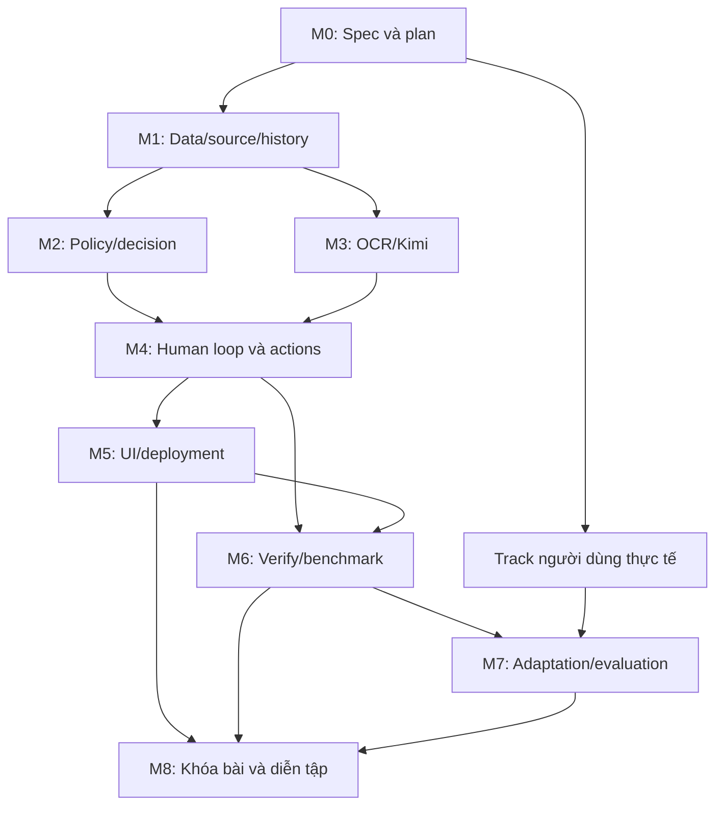

# InvoiceReferee V2 — Roadmap đến chung kết

Phiên bản: 0.2 — cập nhật phạm vi MVP và định nghĩa baseline. Ngày: 04/10/2026.
Trạng thái implementation: **PLANNED**. Không có runtime V2 trong roadmap này.

## 1. Đích đã chốt và nguyên tắc lập roadmap

Người phát triển chọn: hồ sơ thường quy được hệ thống tự xác nhận đủ điều
kiện hoàn ứng, xác định số tiền chấp nhận và tạo đề nghị chi trả. Chuyển tiền
ngân hàng nằm ngoài phạm vi. Hồ sơ cần người được phân loại, chuyển đúng vai
trò với câu hỏi có căn cứ và xử lý tiếp sau phản hồi.

Người phát triển yêu cầu bao phủ toàn bộ yêu cầu đề A/Sprint 2 và không dùng
ước lượng số giờ hoặc nhân lực làm căn cứ cắt scope. Roadmap vì thế được tổ
chức theo kết quả, phụ thuộc và bằng chứng nghiệm thu. Coding agent hỗ trợ
implementation; không dùng tốc độ sinh code làm bằng chứng chất lượng.

Thứ tự tài liệu giữ nguyên: **roadmap -> spec -> implementation plan -> code**.
Roadmap nói cần đạt gì và thứ tự phụ thuộc. Spec chốt hành vi/contracts.
Plan mới chia files/tasks/test commands/ownership; không trộn ba tài liệu.

Căn cứ: [yêu cầu cuộc thi](COMPETITION_REQUIREMENTS.md),
[đề bài gốc](Challenge_Brief_OrganizationAI_VN.docx.md),
[baseline review](reviews/main-baseline-196e266/MAIN_BASELINE_REVIEW.md),
[architecture assessment](reviews/main-baseline-196e266/ARCHITECTURE_ASSESSMENT.md).
Source tham khảo ban đầu: `main@196e266541526123844a60820737f400e09b3a36`.

### Định nghĩa baseline và giới hạn MVP đã được làm rõ

- **B0 — main hiện tại:** nguồn ý tưởng, policy và evidence để xây lại. Đây
  là bản tham khảo lịch sử, không phải baseline duy nhất của mọi cải tiến sau.
- **B1 — MVP viết lại:** hiện thực ý tưởng main với contract/guard đúng hơn,
  giải quyết workflow cốt lõi và có benchmark tái lập. Khi nghiệm thu, B1 trở
  thành baseline mới dùng để so sánh cải tiến.
- **B2 — các cải tiến:** từng thay đổi có giả thuyết, expected effect và phép
  so với B1 trên phần phạm vi chung; giữ policy/dataset version và công bố
  capability mới riêng để không so sánh sai phạm vi.

Người phát triển xác nhận mục tiêu là **MVP giải quyết bài toán chính có kết
quả chất lượng**, không phải production nhiều người dùng. Không đưa multi-tenant,
enterprise authentication/RBAC, scale-out, distributed jobs, HA/SLA, automatic
crash recovery hoặc vận hành cloud phức tạp vào spec. Một app và một người
thao tác tại một thời điểm là đủ cho mục tiêu hiện tại. Vai trò nghiệp vụ
trong demo vẫn cần để phân biệt factual confirmation với approval.

Giữ những bảo đảm trực tiếp ảnh hưởng kết quả: source/quality validation,
không tạo request trùng khi thao tác lại, Stop/Override có tác dụng, lịch sử
đủ giải thích quyết định, Verify và input mới. Những điều này là chức năng
cốt lõi/MVP và yêu cầu cuộc thi, không phải bài toán scale production.

Theo đề bài: khóa bài 15/10, chung kết 17/10; không coi 17/10 là hạn phát triển
còn lại. Các mốc dưới đây chưa được gán thời lượng hoặc cam kết lịch triển
khai. Phản hồi riêng từ giám khảo chưa được cung cấp, cần đối chiếu khi nhận.

## 2. Phạm vi sản phẩm để đưa sang spec

### Phần đã xác nhận

- Bối cảnh công ty; phát triển lại ý tưởng/policy main để tạo MVP baseline B1.
- Có kết quả nghiệp vụ tự động: eligibility, accepted amount và payment request.
- Có đủ ba nhóm bất định: factual unknown, outside policy, beyond authority.
- Có human response/approval, reevaluation, audit và can thiệp hoạt động.
- Bao phủ Verify, input mới, adaptation, independent evaluation và bài nộp.

### Giả định đang đề xuất, chưa phải rulebook được duyệt

- Dùng công ty mô phỏng và policy công bố rõ vì chưa có policy công ty thực.
- Các nhóm chi để khám phá trong spec: công tác/đi lại, tiếp khách, mua vật dụng
  hoặc vật tư phục vụ công việc. Inventory consistency của main áp dụng khi có
  nghiệp vụ nhận hàng; không ép các loại chi khác có report kho.
- Nhân viên, kế toán/reviewer, người phê duyệt và người sở hữu policy là các
  vai trò logic; ma trận quyền cụ thể được chốt trong spec.
- Giữ baseline provider/stack làm phương án tham khảo; không quyết định đổi
  công nghệ khi chưa có căn cứ từ contract hoặc benchmark.
- Tạm ứng, vendor payments, payroll và tax certification chưa được lựa chọn
  làm workflow sản phẩm. Đây không phải yêu cầu bắt buộc riêng của đề A;
  các input thuộc luồng khác cần được nhận diện và xử lý đúng phạm vi.

Hạn mức, danh mục cho phép, bằng chứng thay thế, currency/rounding, ownership,
authority và nghĩa của reject/exception được định nghĩa trong spec. Không
lấy tham số main hoặc chính sách nước ngoài làm quy định công ty mặc định.

## 3. Mốc thiết kế trước implementation

### M0 — Chốt spec và implementation plan từ roadmap

Đầu ra của bước spec:

1. Product/workflow contract và rulebook mô phỏng có phiên bản.
2. Data/source/quality contracts, decision coverage, issue/owner/closure.
3. Human state transitions, payment request và Stop/Override semantics.
4. Provider boundary, recovery/budget, lưu runs/audit và bề mặt UI cần có.
5. Dataset/Verify/evaluation/adaptation và user-study protocol.
6. Acceptance criteria trace tới A01–A07, S01–S03, C01–C10.

Đầu ra của bước plan: tasks có write scope, phụ thuộc, checks và evidence,
chỉ dựa trên spec đã review. Mỗi task có thể nghiệm thu riêng; không dispatch
implementation bằng một lời yêu cầu chung “làm toàn bộ cho tốt”.

Gate: scope, action routine và quyền được giao được định nghĩa đủ để gán
expected behavior; spec/plan không có điều kiện quyết định mơ hồ. M0 chưa
được coi là hoàn tất chỉ vì roadmap này đã tồn tại.

## 4. Các mốc implementation và bằng chứng nghiệm thu

### M1 — Nền dữ liệu hồ sơ, source và lịch sử xử lý

Đầu ra: intake có validation; claim khai báo tách khỏi facts từ chứng từ;
evidence IDs/source registry; field quality/coverage; run/input/policy identity;
case và issue state; lưu sự kiện/hành động đủ để truy lại từng lần xử lý.

Gate: dữ liệu không bị mất/ghi đè âm thầm; source refs resolve đúng; duplicate
item ID bị phát hiện; một decision gắn được với đúng input/policy/run. Vai
trò được mô phỏng rõ trong MVP; không triển khai enterprise identity/tenant.

Phụ thuộc: M0. Yêu cầu: A06, C05, C10.

### M2 — Policy, eligibility, authority và quyết định có căn cứ

Đầu ra: pure evaluators cho profile đã chốt; quality usability, arithmetic,
inventory/consistency khi áp dụng; expense eligibility, accepted amount và
authority. Rule pass/fail/unknown/not-applicable khác nhau; decision tổng hợp
chỉ tự hoàn tất khi mọi điều kiện bắt buộc và quyền được giao đủ.

Giữ invariant đúng từ main; sửa F01–F04 và contradictory quality contract A01.
N/A của một profile không tự tạo approval toàn case. Business purpose khai báo
có thể được dùng theo policy, nhưng không thay giá trị trên hóa đơn.

Gate: cùng facts cho kết quả tái lập; routine cases xử lý đúng; ba nhóm issue
được phân biệt; unresolved evidence/suspicion hoặc thiếu policy không tạo đề
nghị chi trả tự động. Có fixture riêng cho từng finding baseline đã tái hiện.

Phụ thuộc: M1. Yêu cầu: A01, A02, A04, A06.

### M3 — OCR/Kimi và pipeline evidence đủ tin cậy

Đầu ra: adapter OCR; facts có nguồn theo document; quality observations và
semantic proposals theo contract. Validation không chỉ dừng ở JSON shape;
coverage thiếu hoặc assessment mâu thuẫn có kết quả riêng. Các output quan
trọng được đối chiếu với source và requirements của profile.

Gate: empty OCR/missing score/unmapped critical content không bị coi là quality
đạt; không lấy nguồn khác bù vào field mờ; lỗi transport/schema tách khỏi
nghiệp vụ; repair có giới hạn và trace. Kiểm chứng fake trước, live-provider
bằng chứng riêng khi thực hiện; không dùng fake results thay live quality.

Phụ thuộc: M1; phát triển song song với M2 theo contract đã chốt.
Yêu cầu: A06, C03, C05.

### M4 — Luồng hoàn chỉnh và can thiệp của con người

Đầu ra: submit -> evaluate -> routine action hoặc issue -> human response/
approval -> reevaluate. Khi đủ điều kiện, tạo payment request có ID, amount,
beneficiary, căn cứ và run liên quan; chống tạo hai request cho cùng một
hành động đủ điều kiện. Không đánh dấu đã chuyển tiền khi chỉ tạo đề nghị.

Issue có owner, dữ kiện/căn cứ, câu hỏi và closure condition. Confirm một
field chỉ đóng issue liên quan; approval ngoại lệ không tự sửa evidence.
Authority, phạm vi và policy version được kiểm tra lại trước hành động.

Stop được nhận và có hiệu lực khi workflow đang xử lý; kết quả provider muộn
không được tự tạo action sau stop. Có thể dùng execution đơn giản trong một
process; không yêu cầu durable worker, broker hoặc resume tự động sau crash.
Override lưu quyết định gốc, vai trò thao tác, lý do, phạm vi và kết quả mới;
mọi check không được miễn vẫn áp dụng. Không mô tả remote provider request
đã bị hủy nếu chỉ ngăn áp dụng kết quả của nó.

Gate: có routine path hoàn tất không cần duyệt từng case; ba loại human case
đi đúng role và tiếp tục đúng; retry/resubmit/late completion không tạo request
trùng hoặc áp dụng quyết định stale; Stop/Override có kiểm chứng hành vi.

Phụ thuộc: M2 + M3. Yêu cầu: A02, A04, A05, A06, C05, C06.

### M5 — Trải nghiệm sử dụng và deployment kiểm chứng được

Đầu ra: nộp hồ sơ, xem evidence/decision/issue, bổ sung dữ kiện, approve/override/
stop theo vai trò demo, xem payment request và audit. Trang đầu có một hướng
dẫn thao tác chính. Bản demo công khai dùng dữ liệu an toàn và thể hiện rõ
thành phần thực/giả lập. Không triển khai login/tenant isolation hoặc thiết
kế cho nhiều người dùng công ty trong mốc này.

Deployment smoke và runbook clean-clone được thử sớm; UI layout và copy có
thể làm song song với M2/M3 theo contract. Nghiệm thu UI đầy đủ cần M4.

Gate: người ngoài truy cập và xử lý được input mới qua cùng production path;
lỗi và pending state nhìn thấy; live URL và clean-clone runbook được kiểm
chứng riêng. Không kết luận deployment hoạt động chỉ vì có source hoặc URL.

Phụ thuộc nghiệm thu: M4. Yêu cầu: C01, C03, C04, C10.

### M6 — Verify và benchmark so sánh với main

Đầu ra:

- Bộ case nghiệp vụ ít nhất 15 tình huống có inputs/evidence/expected/owner.
- Core: 4 case tuần tự, một thao tác, có ít nhất một correct refusal/escalation.
- Escalation: 5 case gồm 3 routine + 2 human, hiển thị nhóm và câu hỏi.
- Expected/actual, testcase pass/fail, timestamp, run identity và trace.
- Bộ replay kiểm tra tham chiếu B0 và đóng băng kết quả B1; cải tiến B2 so với
  B1 trên năng lực chung, bộ nghiệp vụ mới được báo riêng.
- Tập điều chỉnh và tập evaluation độc lập tách từ trước adaptation.

Case expectation/nhãn được xây từ rulebook trước khi code, không do production
rule tự gán rồi tự chấm. 15 scenario candidates trong research chưa phải bộ
case official có đầy đủ evidence và execution results. Runner không lookup
expected trong production và không ép số 3/2 bằng tên file.

Gate: test pass/fail khác business status; suite chạy production path và tái
lập được; giữ runs; có denominator cho metrics. Input mới và các probes biên
được kiểm tra. Không coi main không có capability mới là regression của
inventory; so đúng phạm vi và ghi capability coverage riêng. Khi M1–M6 đạt
gate workflow cốt lõi và benchmark, ghi nhận B1 là baseline MVP mới; các mốc
cải tiến tiếp theo không tự coi main cũ là ground truth toàn sản phẩm.

Phụ thuộc nghiệm thu: M4 + M5; thiết kế cases có thể bắt đầu từ M0.
Yêu cầu: A03, A07, S02, C02, C03, C05.

### M7 — Sprint 2: feedback, adaptation, independent eval và người dùng

Đầu ra kỹ thuật: feedback có provenance; system tự điều chỉnh tham số chuyển
tiếp được phép theo cơ chế chốt trong spec; version/before-after/rollback;
đánh giá trên tập độc lập; freeze policy/threshold cho một run đánh giá.
Policy limits, authority và evidence hard gates không tự bị thay bởi feedback.

Đầu ra thực tế: ít nhất 3 nhân sự trực tiếp làm nghiệp vụ thử sản phẩm; phản
hồi của chính họ; ít nhất một cải tiến có bằng chứng; đo cả lợi ích và gánh
nặng mới. Tách thời gian làm việc khỏi thời gian chờ; không đặt trước số
tiết kiệm, accuracy hoặc người dùng chưa tồn tại.

Gate kỹ thuật: feedback thực sự làm cập nhật tham số tự động và có trace;
không leakage evaluation; báo missed escalation, unnecessary escalation,
wrong automation, correct owner và human closure với số case rõ ràng.

Gate user evidence: có người/role/consent/feedback và thay đổi truy được.
Research, coding agent đóng vai kế toán, self-test hoặc synthetic feedback
chỉ là evidence mô phỏng; không đóng được gate 3 nhân sự thực tế.

Phụ thuộc kỹ thuật: M4 + M6. Track tiếp cận người thử bắt đầu từ M0, không
đợi đến M7 mới khởi động. Yêu cầu: S01, S02, S03, C09, C10.

### M8 — Gói bài nộp và diễn tập chung kết

Đầu ra: live URL đã kiểm chứng; public repo đủ history; runbook; Verify/data
package có provenance; đúng 5 slide; video dưới 3 phút; build log 1 trang;
ledger khả năng/giới hạn và evidence index.

Diễn tập demo và phản biện: 5 input mới dựa trên rulebook, đúng case routine/
human và nhóm; câu hỏi có thể trả lời; chọn một action bất kỳ để giải thích
input/policy/source/reason; thử Stop/Override; chỉ ra giới hạn và kết quả
independent eval/user feedback đã có.

Gate: từng yêu cầu trong mapping có bằng chứng hoặc khoảng cách được ghi
trung thực. Chưa có bằng chứng không được tự đánh complete; không thể gọi
toàn bộ Sprint 2 đã hoàn thiện nếu user gate hoặc live checks chưa đạt.

Phụ thuộc: M5 + M6 + M7 và workstreams bài nộp/history. Nghiệm thu và khóa
gói theo mốc 15/10; 16–17/10 phục vụ diễn tập trong giới hạn quy định BTC,
không tự coi là thời gian tiếp tục thay bản đã khóa.

## 5. Phụ thuộc và công việc song song

Các cạnh là phụ thuộc nghiệm thu, không cấm chuẩn bị trước. Sau khi contract
đủ rõ, có thể chia coding agents cho các write scopes độc lập: policy, adapter,
UI, Verify, docs. Một người tổng hợp kiểm tra integration và evidence; worker
report hoặc test xanh không thay kiểm tra luồng xử lý thật. Không auto-stage,
commit/push hay publish vì roadmap liệt kê những deliverables đó.

Track chạy xuyên suốt: case/labels và baseline replay; provider/deployment
smoke; user recruitment/feedback; audit/evidence; build log và Git history.
Các hoạt động có người hoặc bên ngoài không tự hoàn tất bởi code generation.

## 6. Coverage toàn bộ requirement mapping

| Yêu cầu | Mốc chịu trách nhiệm nghiệm thu |
| --- | --- |
| A01 | M0, M2 |
| A02 | M2, M4 |
| A03 | M0, M6 |
| A04 | M2, M4 |
| A05 | M4 |
| A06 | M1, M2, M3, M4 |
| A07 | M6 |
| S01 | M7 |
| S02 | M6, M7 |
| S03 | Track người dùng, M7 |
| C01 | M5, M8 |
| C02 | M6 |
| C03 | M3, M5, M6 |
| C04 | M5, M8 |
| C05 | M1, M4, M6, M8 |
| C06 | M4 |
| C07 | Track Git history, M8 |
| C08 | M8 |
| C09 | M7, M8 |
| C10 | M0, M5, M7, M8 |

ID là của tài liệu mapping nội bộ, không phải ID do BTC đặt. Chưa có row nào
trong bảng tự chứng minh requirement đã đạt.

## 7. Tiêu chí chất lượng và trạng thái phải giữ rõ

- Functional: đúng hành vi và authority theo policy đã chốt, routine action
  được thực thi, các issue chưa đóng vẫn chặn.
- Evidence: field có source và coverage, không mất dòng, không chấp nhận output
  mâu thuẫn chỉ vì đúng schema; baseline bugs không trở thành expected đúng.
- Workflow: thao tác lại/resubmit/human response/Stop/Override có state và history,
  không hành động trùng, stale hoặc ngoài quyền.
- Evaluation: frozen inputs/versions, expected độc lập, đúng denominator,
  technical failures riêng, fake vs live và synthetic vs real được công bố.
- Product: nhân viên/reviewer hiểu việc cần làm và lý do; không phải đọc raw
  technical output để giải quyết một yêu cầu nghiệp vụ.
- Submission: demo, phản biện và input mới tái lập được; giới hạn không bị giấu.

Không gán target latency/accuracy trước khi có baseline và protocol. Spec
sẽ chốt acceptance thresholds dựa trên yêu cầu, dữ liệu và phép đo thực tế.
Chưa có runtime hoặc evidence mới thì dùng PLANNED/INCONCLUSIVE; chỉ dùng
IMPLEMENTED/VERIFIED khi có source wiring và thực thi tương ứng.

## 8. Bước tiếp theo sau roadmap

Thiết kế spec theo M0: chốt các loại chi phí, rulebook mô phỏng, authority,
accepted amount, payment request lifecycle, các kiểu issue và human actions;
rồi source/quality contracts, orchestration, audit/control và evaluation.

Những quyết định cần giải ở spec, không trì hoãn roadmap: hạn mức/rule cụ thể,
rounding/currency và refunds, evidence thay thế, dữ liệu/role của người trả
lời, tham số adaptation, storage/concurrency/UI/provider configuration và
dataset/evaluation size. Không coi chúng đã được người phát triển đồng ý chỉ
vì xuất hiện như đề xuất trong một tài liệu research hoặc architecture review.

Spec ưu tiên MVP: một pipeline có kết quả đúng, dễ giải thích và so sánh;
không thêm hạ tầng phục vụ scale hoặc recovery production. Thay đổi scope này
không loại bỏ các bằng chứng Sprint 2 và bài nộp đã nêu trong requirements.

Implementation plan đã được viết ngày 04/10 sau khi người phát triển đồng ý
tiến hành: [master và ba work packages](superpowers/plans/2026-10-04-invoice-referee.md).
Plan chia T01–T16, có contracts/dependencies/tests/gates và mapping requirements.
Các tasks còn PLANNED; lập plan không tự xác nhận policy đã active hoặc code đã có.
