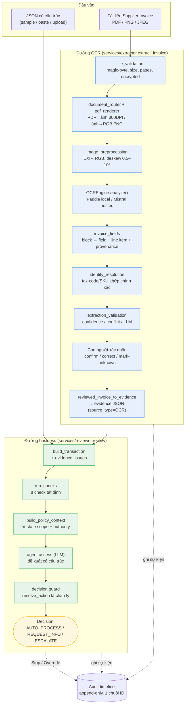
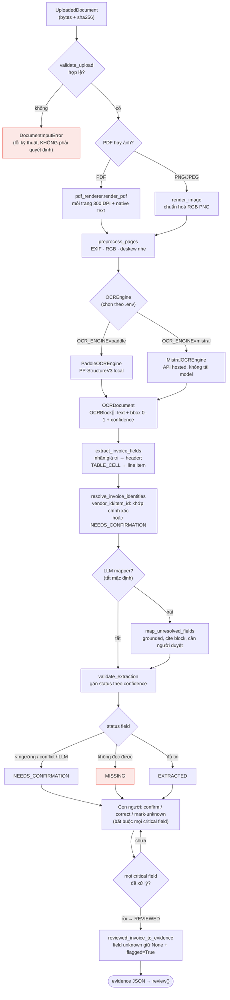
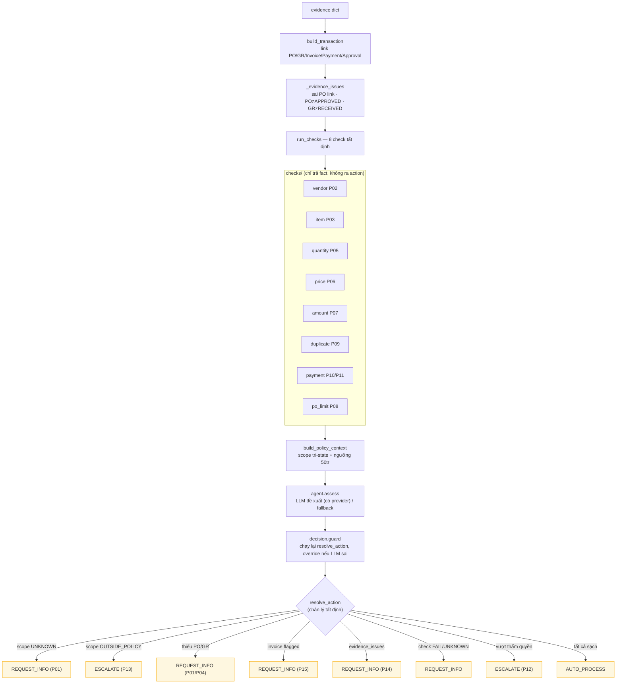

# InvoiceReferee — System Flow

Sơ đồ kiến trúc và luồng dữ liệu của toàn hệ thống (Sprint 1), khớp với mã nguồn
hiện tại. Có 2 đường vào: **JSON có cấu trúc** và **OCR tài liệu** (Supplier
Invoice PDF/ảnh). Cả hai đều đổ về đúng một `review()` production. OCR chỉ trích
fact ứng viên, con người xác nhận, quyết định cuối luôn do Decision Guard.

---

## 1. Toàn cảnh (end-to-end)

---

## 2. Đường OCR chi tiết (ảnh/PDF → evidence)

---

## 3. Đường business review (evidence → quyết định)

---

## 4. Sở hữu module (kiến trúc theo lớp)

```mermaid
flowchart LR
    subgraph domain["domain/"]
        M["models.py<br/>contracts: Transaction, CheckResult,<br/>OCRBlock, FieldCandidate, EvidenceIssue..."]
    end

    subgraph ingestion["ingestion/"]
        NORM["normalization (fail-closed)"]
        JADP["json_adapter"]
        FVAL["file_validation"]
        REND["document_router / pdf_renderer"]
        PREP["image_preprocessing"]
        OCRM["ocr (OCREngine + Paddle/Mistral)"]
        OCFG["ocr_config (chọn engine)"]
        IFLD["invoice_fields"]
        IDRS["identity_resolution"]
        EVAL["extraction_validation"]
        LMAP["llm_mapper (tuỳ chọn)"]
        PIPE["pipeline (FieldReview, handoff)"]
    end

    subgraph core["Lõi nghiệp vụ"]
        TX["transaction/builder"]
        CHK["checks/ (8 + engine)"]
        POL["policy/ (config + engine)"]
        AG["agent/ (llm_client, service, prompts)"]
        GRD["decision/ (guard, fallback_questions)"]
        AUD["audit/store"]
    end

    subgraph svc["services/"]
        EXT["extractor.extract_invoice"]
        REV["reviewer.review"]
    end

    subgraph edge["Rìa hệ thống"]
        APP["app/ (streamlit + presentation)"]
        VFY["verify/ (harness, manifest, ocr_harness)"]
    end

    APP --> EXT
    APP --> REV
    VFY --> REV
    VFY --> EXT
    EXT --> ingestion
    REV --> TX --> CHK --> POL --> AG --> GRD
    EXT --> AUD
    REV --> AUD
    ingestion --> M
    core --> M
```

---

## 5. Bất biến then chốt (đọc kèm sơ đồ)

- OCR **chỉ trích fact ứng viên**, không bao giờ tự ra action; mọi field máy trích
  có provenance (page + bbox + block IDs).
- `resolve_action` là **nguồn chân lý duy nhất**; Decision Guard chạy lại và
  override nếu đề xuất LLM không an toàn.
- Evidence **fail-closed**: field thiếu giữ `None`, không hoá `""`/`0`; check trả
  `UNKNOWN` khi thiếu fact.
- `vendor_id`/`item_id` chỉ resolve khi **khớp chính xác** tax-code/SKU; không
  đoán từ tên.
- Con người phải confirm/correct/mark-unknown **mọi critical field** trước khi
  vào `review()`.
- Một **audit timeline duy nhất** cho cả extraction, review, Stop, Override.
- Chỉ có 3 action: `AUTO_PROCESS` / `REQUEST_INFO` / `ESCALATE`. Stop đổi workflow
  status, Override giữ nguyên quyết định gốc (chỉ đổi `effective_action`).
