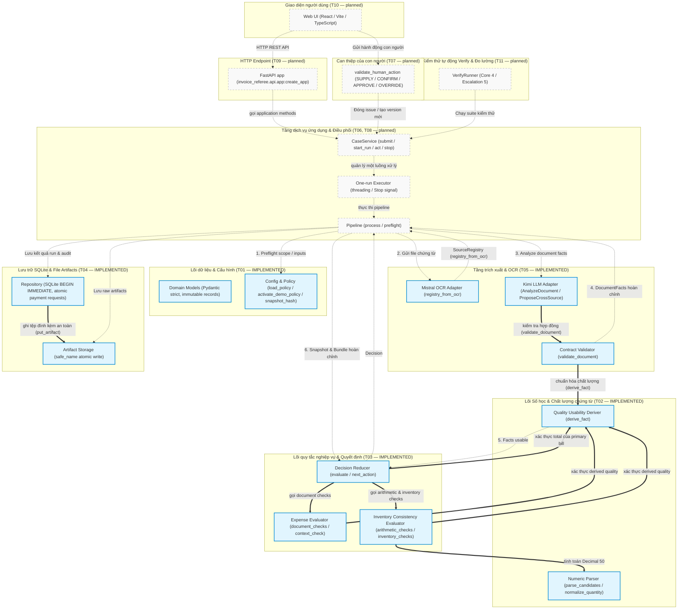

# InvoiceReferee — System Flow Atlas

> **Bản đồ tổng thể, không sao chép văn bản (Map, not a copy)**
> - Task: `T01 + T02 + T03 + T04 + T05` (Domain contracts, demo policy, test builders, numeric parsing, source resolution, quality usability, pure policy evaluators, inventory/arithmetic, authority, decision reducer, SQLite history, evidence artifacts, atomic request lifecycle, Mistral OCR, per-document Kimi & cross-source proposals).
> - Package: `Work Package 01 — Core (T01–T05; hoàn thành toàn bộ Work Package 01)`.
> - Accepted Revision: `e5eadd2` (`feat(T05): Mistral OCR, per-document Kimi và cross-source proposals` trên nhánh `rebuild`).
> - Status: `Living Page Updated` — **T01, T02, T03, T04 & T05 IMPLEMENTED & VERIFIED (226 unit & integration tests passing)**. Các task từ T06 đến T16 ở trạng thái kế hoạch (`PLANNED — not built`).
> - Updated At: `2026-10-05T07:45:00+07:00`.
> - Quy tắc: Atlas là **bản đồ điều hướng** (zoom-out), áp dụng các nguyên lý **ASD-STE100** (câu ngắn, một nghĩa, điều kiện trước hành động sau, triệt tiêu mơ hồ, bảo toàn dữ kiện kỹ thuật). Không sao chép văn xuôi từ các tài liệu đặc tả ([B1_PRODUCT_SPEC.md](specs/B1_PRODUCT_SPEC.md), [B1_RULEBOOK.md](specs/B1_RULEBOOK.md), [B1_SYSTEM_SPEC.md](specs/B1_SYSTEM_SPEC.md)) hay kế hoạch thực thi ([Master Plan](superpowers/plans/2026-10-04-invoice-referee.md)).

---

## 1. Sơ đồ tổng thể toàn hệ thống (Master End-to-End System Flow)

Sơ đồ thể hiện toàn bộ các thành phần của InvoiceReferee tính đến thời điểm hoàn thành **T01 + T02 + T03 + T04 + T05** (hoàn tất Work Package 01 — Core). 
- Các khối **nền xanh viền đậm** (`IMPLEMENTED`) là các module nghiệp vụ thuần túy, tầng lưu trữ và tầng trích xuất đã hoàn thành và vượt qua 226 bài kiểm tra độc lập.
- Các khối **nền xám viền nét đứt** (`planned — not built`) đại diện cho các tầng dịch vụ ứng dụng, pipeline, tương tác con người và giao diện sẽ được nối dây ở các task tiếp theo (T06 – T16).



```text
revision: e5eadd2
- MODELS → src/invoice_referee/domain/models.py (T01 - IMPLEMENTED)
- CFG → src/invoice_referee/config.py (T01 - IMPLEMENTED)
- NUM → src/invoice_referee/policy/numeric.py:parse_candidates,normalize_quantity (T02 - IMPLEMENTED)
- QUAL → src/invoice_referee/policy/quality.py:derive_fact (T02 - IMPLEMENTED)
- EXP → src/invoice_referee/policy/expenses.py:document_checks,context_check (T03 - IMPLEMENTED)
- INV → src/invoice_referee/policy/inventory.py:arithmetic_checks,inventory_checks (T03 - IMPLEMENTED)
- DEC → src/invoice_referee/policy/decision.py:evaluate (T03 - IMPLEMENTED)
- REPO → src/invoice_referee/storage/repository.py:Repository (T04 - IMPLEMENTED)
- ART → src/invoice_referee/storage/artifacts.py:put_artifact,safe_name (T04 - IMPLEMENTED)
- MISTRAL → src/invoice_referee/extraction/providers.py:Providers.ocr,registry_from_ocr (T05 - IMPLEMENTED)
- KIMI → src/invoice_referee/extraction/providers.py:Providers.analyze,Providers.cross_source (T05 - IMPLEMENTED)
- VAL → src/invoice_referee/extraction/validation.py:validate_document,is_applicable (T05 - IMPLEMENTED)
- PIPE → src/invoice_referee/application/pipeline.py:process (T06 - planned — not built)
- HUMAN → src/invoice_referee/application/human.py:validate_human_action (T07 - planned — not built)
- SVC → src/invoice_referee/application/service.py:CaseService (T08 - planned — not built)
- EXEC → src/invoice_referee/application/executor.py (T08 - planned — not built)
- APP → src/invoice_referee/api/app.py:create_app (T09 - planned — not built)
- UI → frontend/src/App.tsx (T10 - planned — not built)
- VERIFY → src/invoice_referee/verify/runner.py:VerifyRunner (T11 - planned — not built)
edges: 
- Mũi tên đôi đậm (==>): Các lệnh gọi trực tiếp giữa các module thuần túy, tầng lưu trữ và tầng trích xuất T01–T05 đã được IMPLEMENTED và VERIFIED bằng 226 bài kiểm tra (DEC gọi EXP, INV, QUAL; EXP và INV gọi QUAL; INV dùng NUM; REPO gọi ART; KIMI gọi VAL; VAL gọi QUAL).
- Mũi tên nét đứt (-.->): Luồng tương tác kiến trúc dự kiến khi nối dây toàn bộ hệ thống từ UI, API tới Pipeline và Storage.
```

---

## 2. Mục lục các luồng cốt lõi (Core-Flow Index)

*Tuân thủ quy tắc ASD-STE100: Câu ngắn dưới 25 từ, một thông tin kỹ thuật mỗi câu, ưu tiên thể chủ động, nêu điều kiện trước hành động.*

### 2.1 Hợp đồng dữ liệu & Cấu hình chính sách (Domain Contracts & Demo Policy — T01)
- Hệ thống định nghĩa toàn bộ dữ liệu bằng các bản ghi Pydantic v2 bất biến (`Record`).
- Mọi bản ghi cấm nhận trường thừa (`extra='forbid'`) và không cho phép thay đổi (`frozen=True`).
- Hàm `snapshot_hash` tính toán mã băm SHA-256 xác định cho từng trạng thái hồ sơ.
- Cấu hình `PolicyConfig` tải từ file bắt đầu ở trạng thái chưa kích hoạt (`active=False`).
- Chỉ hàm `activate_demo_policy` mới chuyển trạng thái cấu hình sang kích hoạt với lý do rõ ràng.
- Chi tiết: [models.py](../src/invoice_referee/domain/models.py), [config.py](../src/invoice_referee/config.py), [task-T01.md](evidence/task-T01.md).

### 2.2 Phân tích số học & Chuẩn hóa đơn vị (Numeric Parsing & Unit Normalization — T02)
- Hàm `parse_candidates` phân tích văn bản số bằng ba ngữ pháp: `CANONICAL`, `VI`, `US`.
- Nếu chuỗi số mang nghĩa mơ hồ như `'1.234'`, hàm trả về toàn bộ ứng viên khả dĩ.
- Hệ thống không tự ý chọn một giá trị duy nhất khi chưa có căn cứ ngữ cảnh.
- Hàm `normalize_quantity` quy đổi các đơn vị g, kg, tấn về đơn vị gam cơ sở.
- Phép tính số học luôn chạy trong ngữ cảnh `Decimal` 50 chữ số độc lập (`prec=50`).
- Hệ thống cấm số lượng nhỏ hơn hoặc bằng 0.
- Số tiền tối đa 15 chữ số nguyên.
- Số lượng và đơn giá tối đa 12 chữ số nguyên và 6 chữ số thập phân.
- Chi tiết: [numeric.py](../src/invoice_referee/policy/numeric.py), [task-T02.md](evidence/task-T02.md).

### 2.3 Xác thực nguồn gốc & Chất lượng chứng từ (Source Resolution & Derived Usability — T02)
- Hàm thuần `derive_fact` đối chiếu tọa độ `SourceRef` với `SourceRegistry` thực tế của chứng từ.
- Hàm trả về một đối tượng `FieldFact` mới với trạng thái chất lượng (`usability`) tương ứng.
- Nếu trường số thiếu điểm tin cậy hoặc có bất kỳ từ cấu thành nào dưới ngưỡng tin cậy, trạng thái là `UNCERTAIN`.
- Ngưỡng tin cậy là tham số của hàm. Giá trị khởi điểm lấy từ cấu hình `word_review_threshold` (0.85).
- Nhãn "READABLE" từ mô hình ngôn ngữ không bao giờ được miễn trừ kiểm tra điểm tin cậy số học.
- Nếu tọa độ trỏ sai chứng từ hoặc khối không tồn tại, hàm ném lỗi `INVALID_ANALYSIS`.
- Kế toán xác nhận bằng `CONFIRM_FIELD` hợp lệ có thể chuyển trường thành `USABLE` mà không sửa OCR thô.
- Chi tiết: [quality.py](../src/invoice_referee/policy/quality.py), [task-T02.md](evidence/task-T02.md).

### 2.4 Đánh giá quy tắc chi phí & Rút gọn quyết định (Expense Policy & Decision Reducer — T03)
- Hàm thuần `evaluate` nhận `CaseSnapshot` và `EvidenceBundle` để tạo phán quyết `Decision`.
- Hệ thống kiểm tra đầy đủ ma trận 15 quy tắc nghiệp vụ theo [B1_RULEBOOK.md](specs/B1_RULEBOOK.md).
- Nếu cấu hình chính sách chưa kích hoạt, hàm trả về hành động kỹ thuật `NONE`.
- Nếu hồ sơ rơi vào quy định cấm rõ ràng (`MODE-01`, `ELIG-01`), hàm trả về `REJECT`.
- Nếu còn vướng mắc dữ kiện chưa rõ, hàm trả về `REQUEST_INFO`.
- Nếu có vướng mắc dữ kiện, hệ thống tạo câu hỏi cụ thể gửi tới đúng người chịu trách nhiệm.
- Nếu không còn vướng mắc dữ kiện và chi phí vượt thẩm quyền, hàm trả về `ESCALATE`.
- Nếu mọi quy tắc đạt và đủ thẩm quyền phê duyệt, hàm trả về `CREATE_PAYMENT_REQUEST`.
- Chi phí hợp lệ từ 2.000.000đ trở xuống được hệ thống tự động hoàn tất (`ROUTINE_AUTO`).
- Chi phí trên 2.000.000đ và tối đa 5.000.000đ yêu cầu người phê duyệt (`APPROVER`) cấp quyền.
- Chi phí trên 5.000.000đ kích hoạt đồng thời vi phạm chính sách `LIM-01` và vượt thẩm quyền `AUTH-01`.
- Kiểm kê (`INV-01`, `INV-02`) chỉ áp dụng cho hồ sơ mua sắm vật tư (`WORK_PURCHASE`).
- Chi tiết: [decision.py](../src/invoice_referee/policy/decision.py), [expenses.py](../src/invoice_referee/policy/expenses.py), [inventory.py](../src/invoice_referee/policy/inventory.py), [task-T03.md](evidence/task-T03.md).

### 2.5 Lưu trữ SQLite có bảo vệ & Vòng đời đề nghị chi trả (Storage & Atomic Lifecycle — T04)
- Lớp `Repository` quản lý lưu trữ SQLite với một kết nối độc lập cho mỗi giao dịch.
- Mọi kết nối SQLite đều kích hoạt kiểm tra ràng buộc khóa ngoại (`PRAGMA foreign_keys = ON`).
- Mọi giao dịch ghi mở bằng lệnh `BEGIN IMMEDIATE`.
- Lệnh này tuần tự hóa các tác vụ ghi để tránh ghi đè dữ liệu.
- Chỉ mục một phần `one_current_payment_request` bảo đảm mỗi hồ sơ có tối đa một đề nghị chi trả trạng thái `CREATED`.
- Hệ thống lưu giữ toàn bộ đề nghị chi trả bị thay thế hoặc thu hồi để giải thích thao tác ghi đè.
- Hàm `finalize_run` thực thi nguyên tử trong một giao dịch duy nhất.
- Hàm mang tính idempotent: gọi lại nhiều lần không tạo kết quả trùng lặp.
- Nếu gọi lại `finalize_run` trên một lượt chạy đã kết thúc, hàm trả về bản ghi cũ và bỏ qua kết quả mới.
- Nếu người vận hành yêu cầu dừng trước khi hoàn tất, hàm `finalize_run` ghi nhận trạng thái `STOPPED` và không tạo đề nghị chi trả.
- Nếu lượt chạy đã lưu kết quả cuối cùng, hàm `request_stop` trả về trạng thái `ALREADY_COMPLETED` và bảo toàn kết quả.
- Nếu hành động con người thay đổi dữ liệu đầu vào, hệ thống tăng `case_version` và tự động thu hồi đề nghị chi trả hiện hành.
- Hàm `put_artifact` ghi tệp nguyên tử bằng tệp tạm, đồng bộ đĩa qua `fsync` và thay thế qua `os.replace`.
- Hàm `safe_name` từ chối mọi tên tệp chứa dấu phân cách đường dẫn hoặc nguy cơ chuyển hướng thư mục.
- Khi ứng dụng khởi động lại, hàm `mark_interrupted_runs` kiểm tra các lượt chạy chưa kết thúc.
- Nếu lượt chạy đã nhận yêu cầu dừng, hàm kết thúc lượt chạy ở trạng thái `STOPPED`.
- Nếu lượt chạy đang xử lý dở dang, hàm chuyển trạng thái sang `FAILED`.
- Hệ thống không tự động chạy lại bất kỳ lượt chạy nào bị gián đoạn.
- Chi tiết: [repository.py](../src/invoice_referee/storage/repository.py), [artifacts.py](../src/invoice_referee/storage/artifacts.py), [schema.sql](../src/invoice_referee/storage/schema.sql), [task-T04.md](evidence/task-T04.md).

### 2.6 Tầng chuyển đổi OCR & Phân tích văn bản (Provider Adapters — T05)
- Bộ điều hợp `Providers` cung cấp ba giao diện: `ocr`, `analyze`, và `cross_source`.
- Lớp `LiveProviders` gọi trực tiếp API Mistral OCR và API Kimi LLM qua thư viện `httpx`.
- Mọi lệnh gọi API ngoài đặt thời gian chờ mặc định 60 giây.
- Thư viện `httpx` không tự thử lại khi lỗi truyền thông.
- Nếu thiếu khóa API trong cấu hình, hệ thống ném lỗi `CONFIG_NOT_ACTIVE`.
- Hàm `registry_from_ocr` trích xuất điểm tin cậy từng từ (`word_confidence_scores`) trực tiếp từ Mistral OCR.
- Nếu chứng từ thiếu điểm tin cậy từng từ, hệ thống giữ giá trị `None` thay vì tự tạo điểm số.
- Hàm `analysis_payload` chỉ gửi dữ liệu chứng từ cần thiết và không bao giờ gửi văn bản của nhân viên.
- Hệ thống giới hạn một lần sửa lỗi chung (`REPAIR_BUDGET = 1`) cho mỗi lượt gọi phân tích chứng từ.
- Nếu mô hình phản hồi sai cấu trúc lần thứ hai, hệ thống dừng lại với lỗi `INVALID_ANALYSIS`.
- Lượt gọi đề xuất đối chiếu chéo được cấp thêm một lần sửa lỗi trước khi báo lỗi kỹ thuật.
- Nếu chứng từ vi phạm quyền sở hữu hoặc trùng lặp mã dòng hàng, hàm `validate_document` ném lỗi `INVALID_ANALYSIS`.
- Nếu OCR phát hiện bảng biểu, hồ sơ khai báo mẫu `TOTAL_ONLY` bị từ chối để chống bỏ qua chi tiết.
- Mã nguồn quyết định tính áp dụng của các phép kiểm tra (`is_applicable`) thay vì dựa vào mô hình.
- Nếu quan sát chất lượng ghi nhận không đọc được nhưng tuyên bố không cần xác minh, hàm `validate_document` ném lỗi `INVALID_ANALYSIS`.
- Hàm `validate_document` tính toán lại chất lượng dữ kiện bằng hàm thuần `derive_fact` thay vì tin tưởng mô hình.
- Chi tiết: [providers.py](../src/invoice_referee/extraction/providers.py), [validation.py](../src/invoice_referee/extraction/validation.py), [task-T05.md](evidence/task-T05.md), [provider-contract.md](evidence/provider-contract.md).

### 2.7 Quy trình xử lý hồ sơ toàn trình (Application Pipeline — T06) — `planned`
- Quy trình đi tuần tự từ kiểm tra sơ bộ, OCR, trích xuất dữ liệu đến đánh giá quy tắc.
- Điểm kiểm tra chốt chặn tiếp nhận tín hiệu dừng `Stop` trước và sau mỗi lệnh gọi API ngoài.
- Nếu người vận hành bấm dừng, hệ thống không áp dụng kết quả trả về muộn của mô hình.
- Chi tiết thiết kế: [Workflow Plan T06](superpowers/plans/2026-10-04-invoice-referee-02-workflow.md#t06--production-pipeline-và-vertical-slice).

### 2.8 Tương tác con người & Tái đánh giá (Human Action Loop — T07, T08) — `planned`
- Hàm `validate_human_action` kiểm tra thẩm quyền nghiệp vụ trước khi áp dụng hành động.
- Hành động con người chỉ đóng đúng vấn đề được giải quyết tương ứng.
- Khi dữ liệu đầu vào thay đổi, các phê duyệt cũ bị ảnh hưởng tự động hết hiệu lực.
- Thao tác ghi đè `OVERRIDE` bảo toàn nguyên vẹn phán quyết gốc để phục vụ kiểm toán.
- Chi tiết thiết kế: [Workflow Plan T07–T08](superpowers/plans/2026-10-04-invoice-referee-02-workflow.md#t07--human-action-validation-closure-và-input-revision).

### 2.9 Giao diện Web & Điểm cuối API (FastAPI & React UI — T09, T10) — `planned`
- FastAPI cung cấp các điểm cuối REST API phục vụ vận hành hồ sơ và kiểm thử.
- Giao diện Web hỗ trợ chuyển đổi linh hoạt bốn vai trò trình diễn nghiệp vụ.
- Bảng điều khiển hiển thị đầy đủ chứng từ gốc, cảnh báo và nhật ký kiểm toán minh bạch.
- Chi tiết thiết kế: [Workflow Plan T09–T10](superpowers/plans/2026-10-04-invoice-referee-02-workflow.md#t09--fastapi-composition-và-contract-responses).

### 2.10 Bộ kiểm thử tự động Verify & Đóng băng Baseline B1 (Verify Harness — T11, T12) — `planned`
- Bộ công cụ Verify chạy trực tiếp trên đường dịch vụ chính của ứng dụng.
- Bộ công cụ Verify in bảng tổng hợp đạt/không đạt kèm dấu thời gian thực.
- Hai bộ kiểm thử chuẩn gồm Core 4 ca và Escalation 5 ca theo đúng thể lệ cuộc thi.
- Chi tiết thiết kế: [Evidence/Release Plan T11–T12](superpowers/plans/2026-10-04-invoice-referee-03-evidence-release.md#t11--corpus-có-gold-độc-lập-và-verify-qua-production-service).

---

## 3. Các luồng dự kiến — chưa xây dựng (Planned — not built)

Các module và tính năng dưới đây đã có thiết kế chi tiết nhưng **hoàn toàn chưa được xây dựng hoặc nối dây trong mã nguồn**:

1. **Đường ống xử lý hoàn chỉnh & Dịch vụ ứng dụng (`T06`, `T08`)** — `planned — not built`:
   - Các tệp dự kiến: `src/invoice_referee/application/{pipeline.py, service.py, executor.py}`.
   - Trách nhiệm: Nối dây toàn trình từ tệp tải lên tới phán quyết, quản lý hàng đợi đơn và nút Stop.

2. **Xử lý hành động can thiệp của con người (`T07`)** — `planned — not built`:
   - Tệp dự kiến: `src/invoice_referee/application/human.py`.
   - Trách nhiệm: Xác thực thẩm quyền vai trò demo, hủy hiệu lực phê duyệt cũ khi đầu vào thay đổi.

3. **Giao diện Web & Điểm cuối API (`T09`, `T10`)** — `planned — not built`:
   - Các tệp dự kiến: `src/invoice_referee/api/app.py`, toàn bộ thư mục `frontend/`.
   - Trách nhiệm: REST API FastAPI và giao diện React phục vụ ban giám khảo thao tác trực tiếp.

4. **Bộ kiểm thử tự động Verify & Thích ứng ngưỡng (`T11` – `T16`)** — `planned — not built`:
   - Các tệp dự kiến: `src/invoice_referee/verify/`, `src/invoice_referee/adaptation/`, tài liệu chung kết.
   - Trách nhiệm: Tự động hóa đánh giá trên tập kiểm thử độc lập, học ngưỡng từ phản hồi người dùng.
