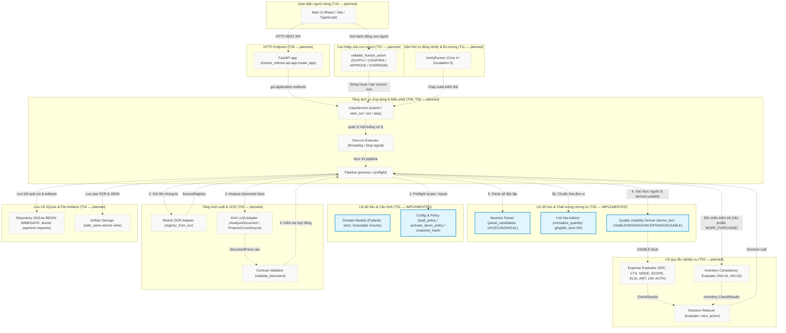

# InvoiceReferee — System Flow Atlas

> **Bản đồ tổng thể, không sao chép văn bản (Map, not a copy)**
> - Task: `T01 + T02` (Domain contracts, demo policy, test builders, numeric parsing, source resolution & derived quality).
> - Package: `Work Package 01 — Core (T01 & T02)`.
> - Accepted Revision: `eb11ab0` (T01 `064dc7d` + T02 `eb11ab0` trên nhánh `rebuild`).
> - Status: `Living Page Created` — **T01 & T02 IMPLEMENTED & VERIFIED (100 unit tests passing)**. Các task từ T03 đến T16 ở trạng thái kế hoạch (`PLANNED — not built`).
> - Updated At: `2026-10-04T21:55:00+07:00`.
> - Quy tắc: Atlas là **bản đồ điều hướng** (zoom-out), không sao chép lại chi tiết văn xuôi từ các tài liệu đặc tả ([B1_PRODUCT_SPEC.md](specs/B1_PRODUCT_SPEC.md), [B1_RULEBOOK.md](specs/B1_RULEBOOK.md), [B1_SYSTEM_SPEC.md](specs/B1_SYSTEM_SPEC.md)) hay kế hoạch thực thi ([Master Plan](superpowers/plans/2026-10-04-invoice-referee.md)).

---

## 1. Sơ đồ tổng thể toàn hệ thống (Master End-to-End System Flow)

Sơ đồ thể hiện toàn bộ các thành phần của InvoiceReferee tính đến thời điểm hoàn thành **T01 + T02**. Các module đóng khung nền xanh viền đậm đã được cài đặt và kiểm thử đạt 100% qua unit test độc lập; các module nền xám viền nét đứt đại diện cho các tầng dịch vụ, lưu trữ, pipeline và giao diện dự kiến sẽ được nối dây ở các task tiếp theo (T03 – T16):



```text
revision: eb11ab0
- MODELS → src/invoice_referee/domain/models.py (T01 - IMPLEMENTED)
- CFG → src/invoice_referee/config.py (T01 - IMPLEMENTED)
- NUM → src/invoice_referee/policy/numeric.py:parse_candidates (T02 - IMPLEMENTED)
- NORM → src/invoice_referee/policy/numeric.py:normalize_quantity (T02 - IMPLEMENTED)
- QUAL → src/invoice_referee/policy/quality.py:derive_fact (T02 - IMPLEMENTED)
- EXP → src/invoice_referee/policy/expenses.py (T03 - planned — not built)
- INV → src/invoice_referee/policy/inventory.py (T03 - planned — not built)
- DEC → src/invoice_referee/policy/decision.py:evaluate (reducer nội bộ next_action, T03 - planned — not built)
- REPO → src/invoice_referee/storage/repository.py:Repository (T04 - planned — not built)
- ART → src/invoice_referee/storage/artifacts.py (T04 - planned — not built)
- MISTRAL → src/invoice_referee/extraction/providers.py:Providers.ocr (T05 - planned — not built)
- KIMI → src/invoice_referee/extraction/providers.py:Providers.analyze (T05 - planned — not built)
- VAL → src/invoice_referee/extraction/validation.py:validate_document (T05 - planned — not built)
- PIPE → src/invoice_referee/application/pipeline.py:process (T06 - planned — not built)
- HUMAN → src/invoice_referee/application/human.py:validate_human_action (T07 - planned — not built)
- SVC → src/invoice_referee/application/service.py:CaseService (T08 - planned — not built)
- EXEC → src/invoice_referee/application/executor.py (T08 - planned — not built)
- APP → src/invoice_referee/api/app.py:create_app (T09 - planned — not built)
- UI → frontend/src/App.tsx (T10 - planned — not built)
- VERIFY → src/invoice_referee/verify/runner.py:VerifyRunner (T11 - planned — not built)
edges: Toàn bộ mũi tên nét đứt (-.->) biểu diễn luồng tương tác kiến trúc dự kiến khi nối dây; hiện tại ở Gate T01+T02 các module lõi (MODELS, CFG, NUM, NORM, QUAL) đã được IMPLEMENTED và kiểm thử unit test độc lập, chưa có luồng runtime end-to-end liên module (chờ T06 nối dây Pipeline).
```

---

## 2. Mục lục các luồng cốt lõi (Core-Flow Index)

1. **Hợp đồng dữ liệu & Cấu hình chính sách (Domain Contracts & Demo Policy — T01)**:
   - Toàn bộ hồ sơ (`Claim`), chứng từ (`Evidence`), nguồn trích xuất (`SourceRegistry`, `SourceBlock`, `SourceWord`), phán quyết (`Decision`), vấn đề phát hiện (`Issue`), yêu cầu chi trả (`PaymentRequest`) và các sự kiện kiểm toán (`AuditEvent`) được định nghĩa bằng các bản ghi Pydantic v2 bất biến (`extra='forbid', frozen=True`).
   - Quản lý cấu hình `PolicyConfig` có nguồn gốc rõ ràng (`proposed` vs. `developer_activated_demo` vs. `proposed_test_fixture`), không kích hoạt ngầm trong runtime. Băm snapshot xác định qua SHA-256 canonical.
   - Chi tiết: [models.py](../src/invoice_referee/domain/models.py), [config.py](../src/invoice_referee/config.py), [task-T01.md](evidence/task-T01.md).

2. **Phân tích số học & Chuẩn hóa đơn vị (Numeric Parsing & Unit Normalization — T02)**:
   - Phân tích cú pháp số học không đoán mò bằng các ngữ pháp rõ ràng (`CANONICAL`, `VI`, `US`). Các trường hợp số mơ hồ (như `'1.234'`) trả về toàn bộ ứng viên khả dĩ `(Decimal('1.234'), Decimal('1234'))` để tầng nghiệp vụ quyết định, không chọn tùy tiện.
   - Chuẩn hóa đơn vị đo lường (g/kg/tấn) về đơn vị cơ sở `g` qua hàm độc lập `normalize_quantity` dưới ngữ cảnh `Decimal` 50 chữ số độc lập (`prec=50`), không kế thừa ngữ cảnh môi trường ngoài. Giữ nguyên đơn vị đóng gói opaque (thùng, hộp) để đối chiếu trực tiếp.
   - Chặn tràn số kỹ thuật: tiền tệ tối đa 15 chữ số nguyên; số lượng/đơn giá tối đa 12 chữ số nguyên + 6 chữ số thập phân; số lượng bắt buộc > 0.
   - Chi tiết: [numeric.py](../src/invoice_referee/policy/numeric.py), [task-T02.md](evidence/task-T02.md).

3. **Xác thực nguồn gốc & Chất lượng chứng từ (Source Resolution & Derived Usability — T02)**:
   - Hàm thuần `derive_fact` đối chiếu tọa độ `SourceRef` với `SourceRegistry` thực tế để gán trạng thái `usability` cho từng trường thông tin (`USABLE`, `MISSING`, `UNCERTAIN`, `UNUSABLE`). *(Lưu ý: Mô hình `models.py:39` định nghĩa 5 giá trị enum `Usability` gồm cả `NOT_APPLICABLE`; `derive_fact` đánh giá chất lượng chứng từ cụ thể nên sinh 4 trạng thái đầu; `NOT_APPLICABLE` được quản lý ở mức trích xuất/profile khi trường không áp dụng).*
   - Cơ chế chặn nghiêm ngặt (Fail-closed): Một trường số chỉ đạt `USABLE` khi tất cả các từ cấu thành đều có điểm tin cậy OCR đạt ngưỡng cấu hình `word_review_threshold` (khởi điểm 0.85 trong `config/demo-policy.json`, có thể tùy biến qua tham số và sẽ được tối ưu hóa ở T13). Mô hình LLM đọc chữ "READABLE" không bao giờ được phép miễn trừ kiểm tra điểm tin cậy số học.
   - Bắt lỗi vi phạm hợp đồng (`DomainError('INVALID_ANALYSIS')`): Tọa độ trỏ sai chứng từ, mã khối/từ không tồn tại, điểm số ngoài `[0, 1]`, hoặc mâu thuẫn đánh giá (quan sát `UNREADABLE`/`UNKNOWN` nhưng khẳng định `requires_verification=False`).
   - Cơ chế cứu vãn có kiểm soát: Xác nhận `CONFIRM_FIELD` của vai trò Kế toán (`REVIEWER`) có căn cứ tọa độ thực tế có thể chuyển trạng thái trường thành `USABLE` mà không sửa đổi dữ liệu thô của OCR.
   - Chi tiết: [quality.py](../src/invoice_referee/policy/quality.py), [task-T02.md](evidence/task-T02.md).

4. **Đánh giá quy tắc chi phí & Rút gọn quyết định (Expense Policy & Decision Reducer — T03)** — `planned — not built`:
   - Kiểm tra các quy tắc nghiệp vụ theo ma trận [B1_RULEBOOK.md](specs/B1_RULEBOOK.md) (`SRC-01..03`, `CTX-01`, `MODE-01..02`, `SCOPE-01..02`, `ELIG-01`, `AMT-01..02`, `LIM-01`, `AUTH-01`).
   - Phân loại rõ 3 nhóm bất định: `FACTUAL_UNKNOWN`, `OUTSIDE_POLICY`, `BEYOND_AUTHORITY`.
   - Đối chiếu số học dòng hàng (`SIMPLE_ITEMIZED`, `ITEMIZED_WITH_ADJUSTMENTS`) và kiểm kê đối với profile `WORK_PURCHASE` (`INV-01`, `INV-02`).
   - Giao diện public là hàm `evaluate`, sử dụng bộ rút gọn quyết định nội bộ `next_action`: `NONE` (lỗi kỹ thuật/cấu hình), `REJECT` (từ chối đã rõ căn cứ), `REQUEST_INFO` (còn vướng mắc thông tin thực tế), `ESCALATE` (vượt trần chính sách hoặc thẩm quyền), `CREATE_PAYMENT_REQUEST` (đủ điều kiện và thẩm quyền).
   - Chi tiết thiết kế: [Master Plan §3.2 T03](superpowers/plans/2026-10-04-invoice-referee-01-core.md#t03--policy-inventoryarithmetic-authority-và-decision-reducer).

5. **Lưu trữ SQLite có bảo vệ & Vòng đời đề nghị chi trả (Storage & Atomic Lifecycle — T04)** — `planned — not built`:
   - Giao dịch SQLite với `BEGIN IMMEDIATE` bảo vệ snapshot, ngăn chặn race condition giữa nút Stop và commit kết quả cuối cùng.
   - Ràng buộc duy nhất `one_current_payment_request` bảo đảm mỗi hồ sơ chỉ có tối đa một đề nghị chi trả có hiệu lực tại một thời điểm (`CREATED`); thay đổi hồ sơ sẽ thu hồi/thay thế (`SUPERSEDED`/`REVOKED`) bản ghi cũ trong cùng một transaction.
   - Quản lý file an toàn trên ổ đĩa (`safe_name`), tính toán băm SHA-256 nguyên bản và sanitize đường dẫn.
   - Chi tiết thiết kế: [Master Plan §3.2 T04](superpowers/plans/2026-10-04-invoice-referee-01-core.md#t04--sqlite-history-evidence-artifacts-và-atomic-request-lifecycle).

6. **Tầng chuyển đổi OCR & Phân tích văn bản (Provider Adapters — T05)** — `planned — not built`:
   - Tách biệt trích xuất từng tài liệu độc lập (`AnalyzeDocument`) với đề xuất đối chiếu chéo (`ProposeCrossSource`).
   - Giới hạn ngân sách sửa lỗi (repair budget <= 1 lần) cho việc kiểm tra schema và coverage.
   - Chi tiết thiết kế: [Master Plan §3.2 T05](superpowers/plans/2026-10-04-invoice-referee-01-core.md#t05--mistral-ocr-per-document-kimi-và-cross-source-proposals).

7. **Quy trình xử lý hồ sơ toàn trình (Application Pipeline — T06)** — `planned — not built`:
   - Chuỗi xử lý hoàn chỉnh: Preflight (kiểm tra scope và chứng từ gốc bắt buộc) → OCR → Trích xuất DocumentFacts → Kiểm định hợp đồng → Đánh giá chất lượng T02 → Đánh giá Policy T03 → Tạo kết quả `PipelineResult`.
   - Điểm kiểm tra chốt chặn (`checkpoint`) trước và sau mỗi lệnh gọi API bên ngoài để tiếp nhận tín hiệu `Stop`.
   - Chi tiết thiết kế: [Workflow Plan T06](superpowers/plans/2026-10-04-invoice-referee-02-workflow.md#t06--production-pipeline-và-vertical-slice).

8. **Tương tác con người & Tái đánh giá (Human Action Loop — T07, T08)** — `planned — not built`:
   - Kiểm tra thẩm quyền nghiêm ngặt của từng hành động con người (`validate_human_action`): `SUPPLY_DECLARATION`, `CONFIRM_FIELD`, `GRANT_POLICY_EXCEPTION`, `APPROVE_AMOUNT`, `OVERRIDE`, `DENY`.
   - Thay đổi đầu vào làm vô hiệu hóa các phê duyệt cũ bị ảnh hưởng; chỉ đóng đúng issue được giải quyết; bảo toàn quyết định gốc khi áp dụng Override.
   - Dịch vụ `CaseService` với executor đơn luồng, hỗ trợ nút `Stop` có xác nhận và bảo toàn lịch sử kiểm toán đầy đủ.
   - Chi tiết thiết kế: [Workflow Plan T07–T08](superpowers/plans/2026-10-04-invoice-referee-02-workflow.md#t07--human-action-validation-closure-và-input-revision).

9. **Giao diện Web & Điểm cuối API (FastAPI & React UI — T09, T10)** — `planned — not built`:
   - FastAPI cung cấp REST API cho toàn bộ tác vụ hồ sơ, tiến trình xử lý, can thiệp con người và kiểm thử Verify.
   - Giao diện người dùng Web (React + TypeScript + Vite) hỗ trợ 4 chế độ demo rõ ràng (`EMPLOYEE`, `REVIEWER`, `APPROVER`, `POLICY_OWNER`), form nộp hồ sơ, khung xem chứng từ gốc và dòng thời gian kiểm toán minh bạch.
   - Chi tiết thiết kế: [Workflow Plan T09–T10](superpowers/plans/2026-10-04-invoice-referee-02-workflow.md#t09--fastapi-composition-và-contract-responses).

10. **Bộ kiểm thử tự động Verify & Đóng băng Baseline B1 (Verify Harness — T11, T12)** — `planned — not built`:
    - Bộ công cụ Verify tự động chạy trực tiếp trên đường production service của ứng dụng, xuất báo cáo kết quả kèm timestamp và số liệu đối chiếu expected/actual.
    - Hai suite chuẩn: **Core 4** (chạy tuần tự 4 case) và **Escalation 5** (3 routine + 2 escalation).
    - Bộ ngữ liệu chuẩn >= 15 ca thử nghiệm có nhãn độc lập; đóng băng bộ artifacts B1 để làm thước đo so sánh cho B2.
    - Chi tiết thiết kế: [Evidence/Release Plan T11–T12](superpowers/plans/2026-10-04-invoice-referee-03-evidence-release.md#t11--corpus-có-gold-độc-lập-và-verify-qua-production-service).

---

## 3. Các luồng dự kiến — chưa xây dựng (Planned — not built)

Các module và tính năng dưới đây đã có hợp đồng và kế hoạch chi tiết nhưng **hoàn toàn chưa được xây dựng hoặc nối dây trong mã nguồn** tại trạng thái hiện tại:

1. **Pure Policy Evaluators & Decision Reducer (`T03`)** — `planned — not built`:
   - Các file: `src/invoice_referee/policy/expenses.py`, `src/invoice_referee/policy/inventory.py`, `src/invoice_referee/policy/decision.py`.
   - Mục đích: Đánh giá hợp lệ chi phí, hạn mức tự động 2tr/5tr, đối chiếu số học hóa đơn/kiểm kê và gom nhóm issue bất định.

2. **Persistence Layer & Artifact Repository (`T04`)** — `planned — not built`:
   - Các file: `src/invoice_referee/storage/schema.sql`, `src/invoice_referee/storage/repository.py`, `src/invoice_referee/storage/artifacts.py`.
   - Mục đích: Lưu trữ cơ sở dữ liệu SQLite, quản lý file vật lý an toàn và bảo đảm chỉ có một `PaymentRequest` hoạt động cho mỗi hồ sơ.

3. **External Providers Adapters (`T05`)** — `planned — not built`:
   - Các file: `src/invoice_referee/extraction/providers.py`, `src/invoice_referee/extraction/validation.py`, prompts phân tích.
   - Mục đích: Nối API Mistral OCR và mô hình Kimi để đọc chứng từ theo định dạng `SourceRegistry` và `DocumentFacts`.

4. **Vertical Slice Pipeline & Service Orchestration (`T06`, `T08`)** — `planned — not built`:
   - Các file: `src/invoice_referee/application/pipeline.py`, `src/invoice_referee/application/service.py`, `src/invoice_referee/application/executor.py`.
   - Mục đích: Nối các module thành một chuỗi xử lý khép kín từ lúc nhận file tới khi ra quyết định, quản lý tiến trình và nút dừng `Stop`.

5. **Human Actions & Revision (`T07`)** — `planned — not built`:
   - Các file: `src/invoice_referee/application/human.py`.
   - Mục đích: Kiểm định và áp dụng các hành động can thiệp của con người vào hồ sơ đang xử lý.

6. **Web API & Frontend Client (`T09`, `T10`)** — `planned — not built`:
   - Các file: `src/invoice_referee/api/app.py`, toàn bộ mã nguồn trong thư mục `frontend/`.
   - Mục đích: Giao diện trực quan và REST API phục vụ vận hành, demo và chấm thi.

7. **Verify Harness, Feedback Adaptation & Release (`T11` – `T16`)** — `planned — not built`:
   - Các file: `src/invoice_referee/verify/`, `src/invoice_referee/adaptation/`, tài liệu bài thi chung kết.
   - Mục đích: Đo lường độ chính xác, tự điều chỉnh ngưỡng từ phản hồi và đóng gói sản phẩm hoàn chỉnh.
