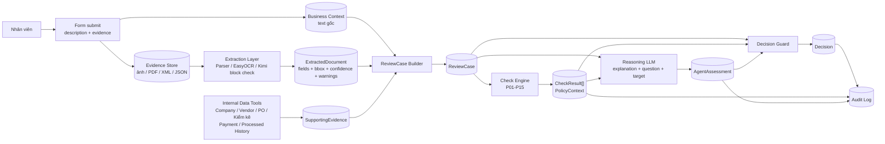
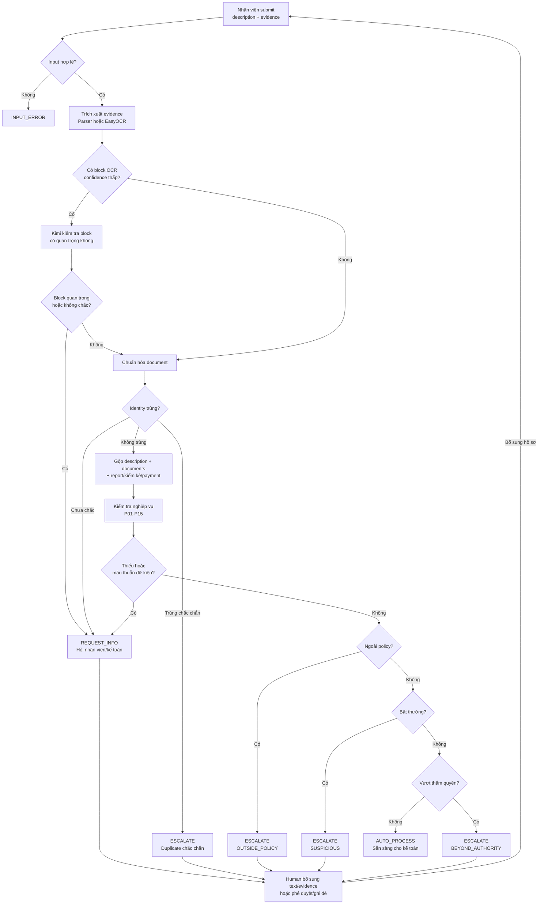
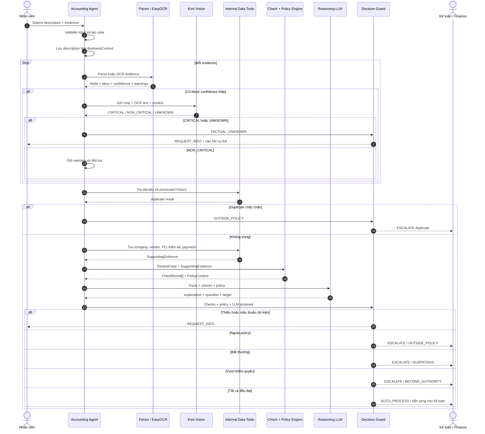

# InvoiceReferee — Data Flow và Workflow

Tài liệu này tách hệ thống thành ba góc nhìn. Đọc theo thứ tự:

1. **Data Flow:** dữ liệu nào được tạo ra và truyền sang đâu.
2. **Business Workflow:** hồ sơ đi qua những điều kiện nào để ra quyết định.
3. **Agent Workflow:** Agent gọi tool, LLM và con người theo trình tự nào.

Chi tiết P01-P15 và các điều kiện kỹ thuật đầy đủ nằm trong `AGENT_WORKFLOW.md`.

## 1. Data Flow

### Dữ liệu chính

| Dữ liệu | Nội dung |
| --- | --- |
| `BusinessContext` | description gốc, người chi, mục đích, khách hàng/dự án, số tiền khai báo |
| `ExtractedDocument` | dữ liệu OCR/parser, bbox, confidence, warning, source reference |
| `SupportingEvidence` | hồ sơ công ty, vendor, PO, kiểm kê, nhận hàng, thanh toán, lịch sử |
| `ReviewCase` | toàn bộ dữ liệu của một lần đề nghị kiểm tra/hoàn ứng |
| `CheckResult[]` | kết quả P01-P15, expected, actual, reason, evidence refs |
| `AgentAssessment` | giải thích và câu hỏi do LLM đề xuất |
| `Decision` | `AUTO_PROCESS`, `REQUEST_INFO` hoặc `ESCALATE` |

## 2. Business Workflow

### Ý nghĩa ba kết quả

| Kết quả | Khi nào dùng |
| --- | --- |
| `AUTO_PROCESS` | Extraction rõ, không trùng, dữ liệu nhất quán, đúng policy và trong thẩm quyền |
| `REQUEST_INFO` | Thiếu, mờ, confidence thấp ở vùng quan trọng hoặc evidence mâu thuẫn |
| `ESCALATE` | Dữ kiện đã rõ nhưng trùng, ngoài policy, bất thường hoặc vượt thẩm quyền |

## 3. Agent Workflow

## 4. Ai chịu trách nhiệm việc gì?

| Thành phần | Trách nhiệm |
| --- | --- |
| Parser/EasyOCR `TOOL` | Đọc evidence và trả text, field, bbox, confidence |
| Kimi Vision `LLM` | Chỉ đánh giá block confidence thấp có quan trọng hay không |
| Internal Data `TOOL` | Tra company, vendor, duplicate, PO, kiểm kê, payment |
| Check Engine `HARDCODE` | Kiểm tra field, MST, số học, số lượng, tổng tiền và consistency |
| Policy Engine `HARDCODE + CONFIG` | Kiểm tra policy, hạn nộp, danh mục cấm và thẩm quyền |
| Reasoning LLM | Viết giải thích, câu hỏi và chọn người cần trả lời |
| Decision Guard `HARDCODE` | Quyết định cuối, có quyền bác đề xuất sai của LLM |
| Human | Bổ sung evidence, phê duyệt, dừng hoặc ghi đè |

## 5. Hai nguyên tắc không được phá

1. `description` là business context, không thay thế bill/evidence.
2. LLM không được tự `AUTO_PROCESS`; quyết định cuối luôn do Decision Guard dựa trên dữ kiện và policy.
