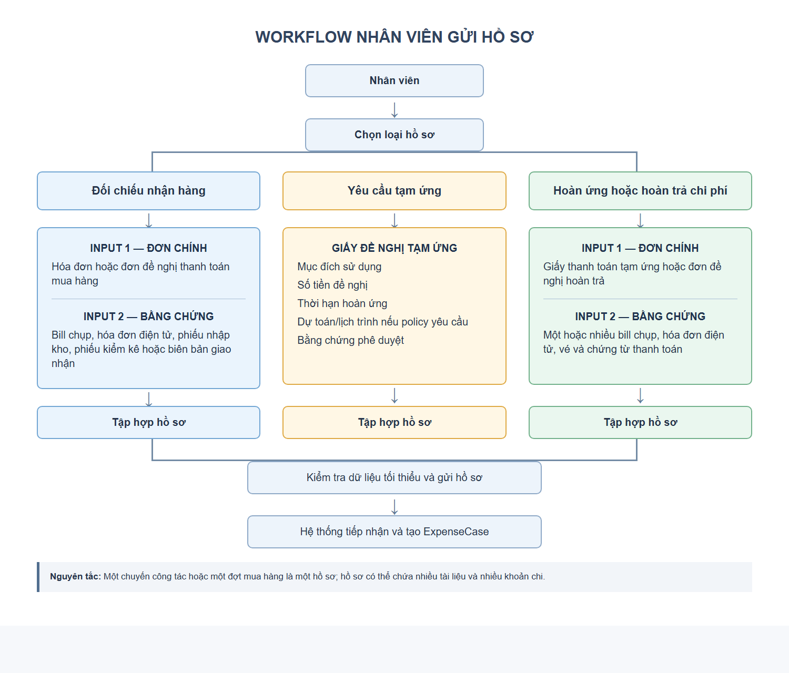
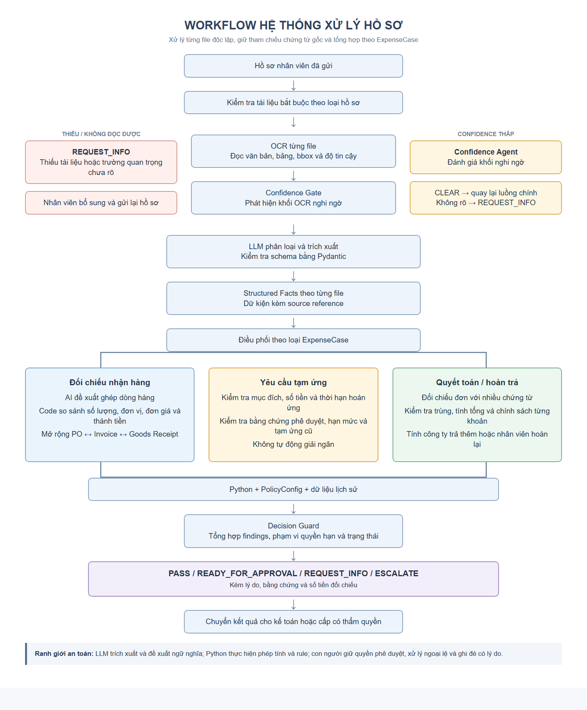

# 1. Vấn đề hiện trạng

Trong doanh nghiệp, nhân viên thường phát sinh các khoản chi phục vụ công việc như:

- Đi công tác.
- Mua vật tư, thiết bị hoặc tiếp khách.
- Nhân viên có thể nhận tiền tạm ứng trước hoặc tự thanh toán rồi đề nghị công ty hoàn trả.

Sau khi hoàn thành công việc, nhân viên cần tập hợp chứng từ và gửi hồ sơ để kế toán kiểm tra, quyết toán.

Một hồ sơ có thể bao gồm nhiều loại tài liệu như:

- giấy đề nghị tạm ứng, bảng kê chi phí, hóa đơn, vé, bằng chứng phê duyệt và biên bản giao nhận hàng. Các tài liệu được cung cấp dưới dạng ảnh chụp, bản scan hoặc PDF, có chất lượng và cách trình bày khác nhau. Thông tin cần kiểm tra vì vậy nằm rải rác trên nhiều chứng từ.

Khi xử lý hồ sơ thủ công, kế toán phải đọc từng tài liệu, kiểm tra thông tin, đối chiếu các khoản khai báo và tính tổng chi phí. Với hồ sơ mua hàng, cần so sánh hóa đơn với chứng từ nhận hàng và đơn đặt hàng nếu có. Với hồ sơ hoàn ứng, cần đối chiếu chi phí được chấp nhận với khoản tiền đã tạm ứng để xác định công ty phải trả thêm hay nhân viên phải hoàn lại.

Quá trình này có thể gặp những khó khăn sau:

- Tốn thời gian kiểm tra: Một hồ sơ có nhiều chứng từ, mỗi chứng từ có định dạng khác nhau.
- Thông tin thiếu hoặc khó đọc: Ảnh mờ, mất góc hoặc thiếu trang khiến số tiền, ngày tháng và thông tin quan trọng không xác định được rõ ràng.
- Dữ liệu không thống nhất: Tổng trên giấy đề nghị có thể khác tổng chứng từ; số lượng trên hóa đơn có thể khác số lượng thực nhận.
- Nguy cơ thanh toán trùng: Một chứng từ có thể được nộp nhiều lần trong cùng hồ sơ hoặc ở những hồ sơ khác nhau.
- Khó truy vết kết quả kiểm tra: Nếu thiếu ghi nhận rõ ràng, người duyệt khó biết khoản chi nào có vấn đề và kết luận dựa trên chứng từ nào.

Từ hiện trạng trên, cần một hệ thống hỗ trợ tổng hợp dữ liệu, kiểm tra chứng từ và đối chiếu chi phí, đồng thời cung cấp căn cứ rõ ràng để kế toán ra quyết định. Đây là cơ sở để mở rộng InvoiceReferee sang xử lý hồ sơ tạm ứng, quyết toán và hoàn trả chi phí.

# 2. Nỗi đau ngành kế toán và quá trình kiểm kê, hoàn ứng

- Đối chiếu hóa đơn và nhận hàng
    - Kế toán cần xác định hàng được lập hóa đơn có khớp với hàng đặt mua và thực tế nhận hay không. Tuy nhiên, tên hàng, đơn vị tính và cách trình bày có thể khác nhau giữa các chứng từ, khiến việc đối chiếu từng dòng mất nhiều thời gian.
    - Khi phát sinh nhận thiếu, giao nhiều đợt hoặc chênh lệch đơn giá, kế toán phải liên hệ bộ phận mua hàng, kho và nhà cung cấp để làm rõ. Khó khăn chính là có hóa đơn nhưng chưa đủ căn cứ xác nhận hàng đã được nhận đúng và đủ, dẫn đến hồ sơ thanh toán bị kéo dài.
- Xử lý yêu cầu tạm ứng
    - Kế toán phải kiểm tra mục đích sử dụng, số tiền đề nghị, thời hạn hoàn ứng và bằng chứng phê duyệt. Đồng thời, cần xác định nhân viên còn khoản tạm ứng chưa quyết toán hay không và yêu cầu mới có nằm trong hạn mức được phép.
    - Nếu thông tin nằm rải rác trong bảng tính, email và chứng từ, việc theo dõi dễ bị gián đoạn. Nỗi đau là khó quản lý đồng thời số tiền đã ứng, người đang giữ tiền và thời điểm cần quyết toán, khiến kế toán phải thường xuyên nhắc nhở và tra cứu thủ công.
- Quyết toán và hoàn trả chi phí
    - Sau chuyến công tác hoặc mua sắm, nhân viên có thể nộp nhiều hóa đơn, vé và bảng kê. Kế toán phải kiểm tra từng khoản có phục vụ công việc, đủ chứng từ và phù hợp chính sách hay không.
    - Tổng tiền nhân viên khai báo chưa chắc là tổng tiền được chấp nhận. Kế toán còn phải xử lý khoản vượt hạn mức, chứng từ thiếu hoặc mờ, hóa đơn trùng và chênh lệch giữa bảng kê với chứng từ. Sau đó mới đối chiếu với tiền tạm ứng để xác định số tiền trả thêm hoặc thu hồi.
    - Nỗi đau lớn nhất là vừa phải kiểm tra từng khoản chi, vừa phải bảo đảm kết quả quyết toán chính xác và giải thích được cho nhân viên. Hồ sơ thiếu thông tin thường phải bổ sung nhiều lần, kéo dài thời gian hoàn trả.

# 3. Hướng phát triển và giới thiệu dự án

## 3.1. Hướng giải quyết

- Để giảm khối lượng kiểm tra thủ công, giải pháp đề xuất là xây dựng hệ thống hỗ trợ xử lý hồ sơ kế toán bằng cách kết hợp **OCR, AI và các quy tắc nghiệp vụ**.
- Hệ thống tiếp nhận hồ sơ, đọc từng chứng từ và trích xuất thông tin cần thiết. Trước khi đối chiếu, hệ thống kiểm tra chất lượng dữ liệu để phát hiện những trường quan trọng bị mờ hoặc thiếu, từ đó yêu cầu người nộp bổ sung.
- Các dữ kiện đủ rõ được dùng để kiểm tra tính đầy đủ, sự thống nhất giữa chứng từ và mức độ phù hợp với chính sách doanh nghiệp.
- AI hỗ trợ hiểu nội dung và ghép thông tin có cách diễn đạt khác nhau. Các phép cộng tiền, tính chênh lệch và kiểm tra hạn mức được thực hiện bằng chương trình để bảo đảm tính nhất quán. Kết quả kiểm tra đi kèm lý do và tham chiếu chứng từ, giúp kế toán xác minh trước khi quyết định.

## 3.2. Giới thiệu dự án InvoiceReferee

InvoiceReferee là hệ thống AI hỗ trợ kiểm tra và đối chiếu hồ sơ chi phí trong doanh nghiệp, được định hướng xử lý ba nhóm nghiệp vụ:

|Nghiệp vụ|Chức năng hỗ trợ|
|---|---|
|**Đối chiếu hóa đơn và nhận hàng**|So sánh hóa đơn với chứng từ nhận hàng và đơn đặt hàng nếu có; phát hiện chênh lệch số lượng, đơn giá và thành tiền.|
|**Yêu cầu tạm ứng**|Kiểm tra thông tin đề nghị, bằng chứng phê duyệt, thời hạn hoàn ứng, hạn mức và khoản tạm ứng chưa quyết toán.|
|**Quyết toán và hoàn trả chi phí**|Tổng hợp nhiều chứng từ, kiểm tra khoản chi, phát hiện trùng lặp và xác định số tiền công ty trả thêm hoặc nhân viên hoàn lại.|

Nhân viên chọn loại hồ sơ, nhập thông tin công việc và tải tài liệu. Hệ thống xử lý từng chứng từ độc lập, sau đó tổng hợp dữ liệu để kiểm tra toàn bộ hồ sơ. Kết quả cho biết hồ sơ đã vượt qua kiểm tra, cần bổ sung thông tin hay cần chuyển cấp có thẩm quyền xem xét.

## 3.3. Giá trị hướng tới

InvoiceReferee hướng tới giảm thời gian đọc và đối chiếu chứng từ, hỗ trợ phát hiện sớm sai lệch và hạn chế việc hồ sơ phải bổ sung nhiều lần. Với nhân viên, hệ thống giúp làm rõ thông tin còn thiếu và kết quả quyết toán. Với kế toán, hệ thống cung cấp bảng tổng hợp khoản chi, các vấn đề cần xử lý và bằng chứng tương ứng.

Kế toán và người có thẩm quyền vẫn giữ quyền phê duyệt cuối cùng. InvoiceReferee đóng vai trò hỗ trợ kiểm tra, tính toán và cung cấp căn cứ; hệ thống không tự động giải ngân.

# 4. Đối tượng sử dụng

## 4.1. Nhân viên

Nhân viên tạo hồ sơ đề nghị tạm ứng, quyết toán chi phí hoặc thanh toán mua hàng. Một chuyến công tác hay một đợt mua hàng được quản lý như một `ExpenseCase`; trong đó có thể có nhiều tài liệu và nhiều khoản chi.

Nhân viên thực hiện các công việc sau:

- Chọn đúng loại hồ sơ: đối chiếu nhận hàng, yêu cầu tạm ứng hoặc hoàn ứng/hoàn trả chi phí.
- Khai báo mục đích, số tiền và thời hạn hoàn ứng nếu nghiệp vụ yêu cầu.
- Tải chứng từ chính và bằng chứng bổ sung theo đúng loại hồ sơ.
- Theo dõi yêu cầu bổ sung, tải lại tài liệu khó đọc hoặc giải trình dữ kiện chưa rõ.

Phần mô tả bằng văn bản là **business context**, không tự động thay thế hóa đơn, phiếu nhận hàng hoặc giấy phê duyệt bắt buộc.

## 4.2. Vai trò và trách nhiệm của AI

Sau khi nhân viên gửi hồ sơ, hệ thống xử lý từng file độc lập. OCR đọc văn bản, bảng và vị trí; Confidence Gate phát hiện vùng có độ tin cậy thấp. Confidence Agent chỉ đánh giá mức ảnh hưởng nghiệp vụ của các vùng nghi ngờ, không tự kết luận hồ sơ hợp lệ. Khi dữ liệu đủ rõ, AI phân loại tài liệu, trích xuất dữ kiện và giữ tham chiếu về nguồn gốc của từng dữ kiện.

|Loại hồ sơ|AI hỗ trợ|Chương trình và quy tắc nghiệp vụ xử lý|
|---|---|---|
|**Đối chiếu hóa đơn và nhận hàng**|Trích xuất nhà cung cấp, dòng hàng và đề xuất ghép dòng giữa các chứng từ.|So sánh số lượng, đơn vị, đơn giá, thành tiền và dung sai được cấu hình.|
|**Yêu cầu tạm ứng**|Trích xuất người đề nghị, mục đích, số tiền, hạn hoàn ứng và dấu hiệu có phê duyệt.|Kiểm tra trường bắt buộc, hạn mức, thẩm quyền và khoản tạm ứng cũ chưa quyết toán.|
|**Hoàn ứng và hoàn trả chi phí**|Trích xuất từng khoản chi và liên kết với chứng từ tương ứng.|Kiểm tra trùng, áp dụng chính sách, tính tổng được chấp nhận và đối chiếu tiền đã tạm ứng.|

AI phải bám sát dữ liệu gốc, thể hiện mức chưa chắc chắn và không tự điền dữ kiện còn thiếu. Các phép tính tiền và điều kiện quyết định được thực hiện bằng chương trình. Kết quả AI là đề xuất hỗ trợ kiểm tra, không phải lệnh giải ngân.

## 4.3. Kế toán và người phê duyệt

Kế toán rà soát hồ sơ, xác minh các phát hiện và xử lý theo chính sách doanh nghiệp. Người có thẩm quyền giữ quyết định phê duyệt cuối cùng.

- Kiểm tra các dữ kiện quan trọng và mở đúng vùng chứng từ được tham chiếu.
- Xử lý chênh lệch số lượng, số tiền, chứng từ trùng hoặc khoản chi thiếu căn cứ.
- Chấp nhận, điều chỉnh hoặc loại khoản chi và ghi rõ lý do.
- Yêu cầu bổ sung hoặc chuyển cấp có thẩm quyền.
- Xác nhận số tiền thanh toán, thu hồi hoặc quyết toán.
- Lưu quyết định, người thao tác, thời gian và lý do ghi đè.

## 4.4. So sánh trước và sau khi có hệ thống

|Công việc|Trước khi có hệ thống|Sau khi có hệ thống|
|---|---|---|
|**Đọc và nhập dữ liệu**|Kế toán đọc từng chứng từ và nhập lại thông tin.|AI trích xuất; kế toán rà soát và chỉnh sửa khi cần.|
|**Kiểm tra hồ sơ đầy đủ**|Kế toán tự dò từng tài liệu.|Hệ thống kiểm tra theo loại hồ sơ và chỉ ra tài liệu còn thiếu.|
|**Đối chiếu mua hàng**|Kế toán dò từng dòng giữa các chứng từ.|Hệ thống đề xuất ghép dòng và hiển thị chênh lệch để xác minh.|
|**Kiểm tra tạm ứng**|Kế toán tra cứu khoản cũ, thời hạn và hạn mức.|Hệ thống kiểm tra trên dữ liệu lịch sử và chính sách đã cấu hình.|
|**Tổng hợp chi phí**|Kế toán cộng tiền và đối chiếu bảng kê thủ công.|Chương trình tính tổng, phân loại chênh lệch và giữ căn cứ nguồn.|
|**Ra quyết định**|Kế toán hoặc người có thẩm quyền quyết định.|Người có thẩm quyền quyết định trên kết quả kiểm tra có thể truy vết.|

# 5. Nghiệp vụ và phạm vi bài toán

|Loại `ExpenseCase`|Tài liệu tối thiểu|Mục tiêu kiểm tra|Kết quả nghiệp vụ|
|---|---|---|---|
|**Đối chiếu nhận hàng**|Chứng từ chính và ít nhất một chứng từ nhận hàng/kiểm kê độc lập.|Hai nguồn có cùng giao dịch và khớp hàng hóa, số lượng, đơn vị, đơn giá hay không.|Bảng ghép dòng, sai lệch và câu hỏi cần xác minh.|
|**Yêu cầu tạm ứng**|Giấy đề nghị tạm ứng; mục đích, số tiền, hạn hoàn ứng; bằng chứng phê duyệt theo policy.|Đề nghị có đủ căn cứ, đúng hạn mức và đúng thẩm quyền hay không.|Số tiền đề nghị, trạng thái phê duyệt và các điều kiện chưa đạt.|
|**Hoàn ứng/hoàn trả**|Giấy thanh toán tạm ứng hoặc đề nghị hoàn trả; một hay nhiều chứng từ chi phí.|Khoản khai báo có chứng từ, không trùng, đúng chính sách và khớp tổng hay không.|Tổng khai báo, tổng được chấp nhận, công ty trả thêm hoặc nhân viên hoàn lại.|

Kiểm tra thiếu tài liệu được thực hiện bằng điều kiện xác định theo loại hồ sơ. LLM không được dùng để suy đoán rằng một tài liệu bắt buộc đã tồn tại. Mọi file được OCR và qua Confidence Gate riêng trước khi dữ kiện giữa các nguồn được đối chiếu.

# 6. Dữ liệu đầu ra và trạng thái

Mỗi kết quả phải chứa `case_id`, loại hồ sơ, danh sách tài liệu, dữ kiện đã trích xuất, tham chiếu nguồn, các phát hiện, số tiền đối chiếu, trạng thái và lịch sử xử lý.

|Trạng thái|Ý nghĩa|Hành động tiếp theo|
|---|---|---|
|`PASS`|Các kiểm tra tự động trong phạm vi hiện có không phát hiện lỗi chặn.|Chuyển kế toán rà soát; không đồng nghĩa đã thanh toán.|
|`READY_FOR_APPROVAL`|Hồ sơ đủ điều kiện để người có thẩm quyền xem xét.|Chờ phê duyệt thủ công hoặc chữ ký hợp lệ.|
|`REQUEST_INFO`|Thiếu tài liệu bắt buộc hoặc dữ kiện quan trọng chưa đọc/đối chiếu được.|Trả câu hỏi cụ thể cho nhân viên bổ sung.|
|`ESCALATE`|Hồ sơ vượt hạn mức, có ngoại lệ hoặc dấu hiệu rủi ro.|Chuyển đúng cấp có thẩm quyền.|

Một `CRITICAL/ASK_HUMAN` ở trường quan trọng phải chặn `PASS`. Cảnh báo không chặn chỉ được dùng khi sai số không ảnh hưởng đến số tiền, danh tính chứng từ hoặc quyết định nghiệp vụ.

# 7. Giới hạn hệ thống và quyền quyết định của con người

## 7.1. Giới hạn của hệ thống

- **Phụ thuộc vào chất lượng chứng từ:** OCR có confidence cao vẫn có thể đọc sai; confidence chỉ là tín hiệu, không phải bằng chứng đúng tuyệt đối.
- **Không xác nhận được thực tế phát sinh:** Chứng từ là căn cứ đối chiếu nhưng không đủ để tự khẳng định hàng đã giao hoặc khoản chi thực sự phát sinh.
- **Không tự xác thực người ký:** Phát hiện vùng chữ ký không đồng nghĩa xác minh danh tính, chức danh hay hiệu lực phê duyệt.
- **Phụ thuộc vào dữ liệu được kết nối:** Hạn mức, tạm ứng cũ, chứng từ trùng và thẩm quyền chỉ kiểm tra được khi có PolicyConfig và dữ liệu lịch sử phù hợp.
- **Có thể ghép sai dữ kiện:** AI có thể đề xuất sai khi tên hàng gần nghĩa, đơn vị quy đổi hoặc bố cục chứng từ phức tạp.

## 7.2. Quyền quyết định của con người

- Yêu cầu nhân viên bổ sung hoặc giải trình hồ sơ.
- Điều chỉnh dữ liệu trích xuất sau khi kiểm tra chứng từ gốc.
- Chấp nhận, loại hoặc điều chỉnh khoản chi và ghi lý do.
- Xử lý ngoại lệ hoặc chuyển hồ sơ lên cấp có thẩm quyền.
- Xác nhận số tiền thanh toán hoặc thu hồi.
- Ghi đè đề xuất của hệ thống trong phạm vi quyền hạn và để lại audit log.

# 8. Sơ đồ kiến trúc và workflow mới

## 8.1. Workflow nhân viên gửi hồ sơ

Luồng vào được chuẩn hóa theo ba loại hồ sơ. Hệ thống tạo một `ExpenseCase` cho toàn bộ nghiệp vụ thay vì coi từng hóa đơn là một yêu cầu độc lập. Nhờ đó, một chuyến công tác có thể chứa nhiều hóa đơn và một lần hoàn ứng có thể quyết toán nhiều khoản chi.

## 8.2. Workflow hệ thống xử lý hồ sơ

Luồng xử lý gồm bốn lớp:

1. **Tiếp nhận:** kiểm tra tài liệu bắt buộc theo loại hồ sơ bằng code.
2. **Hiểu chứng từ:** OCR từng file, kiểm tra confidence, phân loại và trích xuất dữ kiện có tham chiếu nguồn.
3. **Kiểm tra nghiệp vụ:** điều phối sang policy đối chiếu nhận hàng, tạm ứng hoặc hoàn ứng.
4. **Decision Guard:** tổng hợp phát hiện, mức độ nghiêm trọng và phạm vi thẩm quyền để tạo trạng thái cuối.

Luồng kế toán sau đó là: nhận hàng đợi hồ sơ, mở phát hiện và chứng từ gốc, yêu cầu bổ sung hoặc điều chỉnh khoản được chấp nhận, phê duyệt trong phạm vi quyền hạn hoặc chuyển cấp, rồi lưu toàn bộ lịch sử quyết định.

# 9. Phân chia trách nhiệm kỹ thuật

|Thành phần|Được làm|Không được làm|
|---|---|---|
|**OCR**|Đọc text, bảng, bbox và confidence theo từng file.|Tự kết luận khoản chi hợp lệ.|
|**LLM/AI Agent**|Phân loại, trích xuất, đề xuất ghép ngữ nghĩa và giải thích phát hiện.|Tự bịa dữ kiện, thực hiện phép tính tài chính cuối cùng hoặc tự phê duyệt.|
|**Python + PolicyConfig**|Kiểm tra trường bắt buộc, tính tổng, dung sai, hạn mức, trùng lặp và chuyển trạng thái.|Suy luận ý nghĩa mơ hồ ngoài rule đã cấu hình.|
|**Kế toán/người phê duyệt**|Xác minh, xử lý ngoại lệ, điều chỉnh và ra quyết định.|Phê duyệt mà không để lại căn cứ hoặc lịch sử thao tác.|

# 10. Review nghiêm khắc: các vấn đề còn phải giải quyết

## 10.1. P0 - Bắt buộc trước khi gọi đây là hệ thống nghiệp vụ

1. **Phân biệt rõ đã triển khai và kiến trúc mục tiêu.** Mỗi chức năng trong tài liệu cần nhãn `Implemented`, `Prototype` hoặc `Planned`; hiện sơ đồ có thể khiến giám khảo hiểu nhầm PolicyConfig, dữ liệu lịch sử và phân quyền đã hoàn chỉnh.
2. **Chốt state machine và điều kiện chặn.** Phải định nghĩa máy trạng thái từ `DRAFT` đến `PAID/CLOSED`, ai được chuyển trạng thái và vì sao `CRITICAL` tuyệt đối không được rơi xuống `PASS`.
3. **Chốt hợp đồng đầu vào cho ba loại hồ sơ.** Cần schema phiên bản hóa về tài liệu bắt buộc, trường bắt buộc, vai trò tài liệu và trường hợp ngoại lệ; text mô tả không được tự biến thành phiếu kiểm kê.
4. **Thiết kế data model theo hồ sơ.** Cần quan hệ giữa `ExpenseCase`, `Document`, `ExpenseItem`, `Advance`, `Approval`, `Finding` và `Decision`; nếu không, hoàn ứng nhiều hóa đơn và theo dõi tạm ứng cũ sẽ vỡ ngay khi demo dữ liệu thật.
5. **Giải quyết tính xác thực phê duyệt.** Nhìn thấy chữ ký trên ảnh không chứng minh người ký là giám đốc hay kế toán trưởng. MVP phải ghi rõ đây là kiểm tra sự hiện diện; bản sản phẩm cần chữ ký số, tài khoản phê duyệt hoặc tích hợp hệ thống nội bộ.
6. **Bảo đảm audit và source lineage.** Mọi số tiền và phát hiện phải mở được đúng file, trang, bbox; mọi chỉnh sửa và ghi đè phải lưu người thực hiện, thời gian, giá trị cũ/mới và lý do.

## 10.2. P1 - Cần hoàn thiện để kết quả đáng tin cậy

1. Xây dựng PolicyConfig theo doanh nghiệp: hạn mức, thời hạn nộp, danh mục cấm, dung sai, cấp phê duyệt và ngoại lệ.
2. Định nghĩa công thức quyết toán: tổng khai báo, tổng hợp lệ, số đã tạm ứng, công ty trả thêm, nhân viên hoàn lại, thuế, chiết khấu, làm tròn và nhiều loại tiền tệ.
3. Thiết kế đối chiếu dòng hàng có dung sai và quy đổi đơn vị; AI chỉ đề xuất cặp ghép, code quyết định chênh lệch.
4. Phát hiện trùng trong cùng hồ sơ và xuyên lịch sử bằng nhiều tín hiệu; không chỉ dựa vào tên file hoặc ảnh giống hệt.
5. Xử lý retry, idempotency, timeout và rate limit của OCR/LLM để gửi lại không tạo hồ sơ hoặc chi phí gọi API trùng.
6. Có cơ chế sửa dữ liệu trích xuất và chạy lại policy mà không cần OCR lại toàn bộ hồ sơ.
7. Thiết kế quyền truy cập, mã hóa, thời hạn lưu trữ và ẩn dữ liệu nhạy cảm trên hóa đơn/chứng từ ngân hàng.

## 10.3. P2 - Bằng chứng cần có cho bài thi

1. Chuẩn bị bộ test có ground truth cho cả happy path, thiếu tài liệu, OCR mờ, xung đột, trùng lặp và vượt thẩm quyền.
2. Đo precision/recall cho trường quan trọng và quyết định policy; không chỉ trình bày vài ảnh demo thành công.
3. Đo thời gian xử lý thủ công trước và sau, tỷ lệ hồ sơ phải hỏi lại và chi phí OCR/LLM trên mỗi hồ sơ.
4. Demo một hồ sơ nhiều chứng từ từ lúc nhân viên gửi đến lúc kế toán xem căn cứ, cùng một case lỗi được chặn đúng.
5. Thu phản hồi từ kế toán thật và chỉ ra ít nhất một thay đổi sản phẩm được thực hiện từ phản hồi đó.

Tiêu chí tối thiểu để chấp nhận MVP: không tự giải ngân; không `PASS` khi trường quan trọng chưa rõ; không mất liên kết về chứng từ gốc; mọi phép tính có thể tái lập bằng code; và kế toán có thể hiểu lý do xử lý mà không cần đọc log kỹ thuật.
