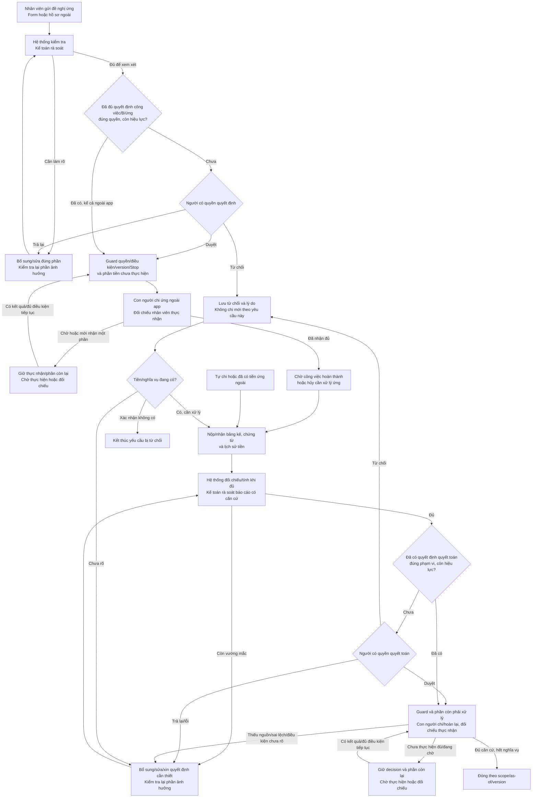

# InvoiceReferee — Product và workflow hiện hành

Ngày 09/10/2026. **Thiết kế đã được chủ dự án đồng ý; chưa nghiệm thu implementation hoặc baseline mới.** Bản hợp nhất không bổ sung quy tắc nghiệp vụ. Các bước thảo luận và review gốc được giữ trong [lưu trữ](../archive/README.md).

Authority: [đề cuộc thi gốc](../Challenge_Brief_OrganizationAI_VN.docx.md) quyết định yêu cầu BTC; tài liệu này, [Rulebook](RULEBOOK.md), [System](SYSTEM.md), [Evaluation](EVALUATION.md) và [plan](../superpowers/plans/2026-10-09-settlement-mvp.md) quyết định thiết kế mới. Source và fresh execution xác định phần đã tồn tại. Spec B1/plan 04-10 là tham chiếu implementation cũ, không quy định mới.

## P1. Bài toán và giá trị cần chứng minh

Hỗ trợ kế toán xử lý hồ sơ công tác từ nhiều chứng từ và nguồn tài chính: tìm/ghép nguồn, kiểm tra số liệu, payer, policy và lịch sử, chuẩn bị bảng đối chiếu có căn cứ. Kế toán rà soát bảng, mở nguồn cần xác minh và trình quyết định; không bị buộc thu gom/ghép/cộng lại mọi nguồn từ đầu.

Nhân viên có thể xin ứng trước hoặc tự chi rồi đề nghị hoàn trả. Giấy đề nghị/approval không chứng minh đã nhận tiền; hóa đơn không chứng minh ai trả. Quyết toán cần tổng chi phí được chấp nhận và tiền đã thực nhận đúng phạm vi. Hệ thống không tự giải ngân.

Hai tiêu chí riêng: **đúng** về facts/links/rules/money/workflow; **có ích** về tổng công sức chuẩn bị, bổ sung, rà soát, quyết định và đối chiếu. LLM nhanh hơn không tự chứng minh kế toán làm ít hơn. Quy trình thủ công so sánh hiện là giả định thiết kế, chưa được doanh nghiệp thật xác nhận.

## P2. Phạm vi MVP

- Hồ sơ công tác trong nước, VND, một nhân viên/một công việc; nhiều khoản, chứng từ và lần bổ sung trong cùng phạm vi lũy kế.
- Vé/di chuyển, khách sạn, ăn phục vụ công việc/tiếp khách; nhận cả hủy công việc có tiền/nghĩa vụ cần xử lý. Không tự mở sang mua hàng–PO–nhận hàng/tồn kho, ngoại tệ hoặc phân bổ kế toán tổng quát.
- Nhân viên tạo form chính hoặc nhập hồ sơ ngoài; công việc/quyết định bên ngoài hợp lệ được dùng lại. Hồ sơ đã ở giai đoạn sau có thể nhập đúng giai đoạn, không bắt chạy lại mọi bước.
- Bảng kê, ảnh/PDF/text được hỗ trợ, bảng nguồn tài chính nhập/import với provenance và coverage. Không hứa đọc mọi format/mẫu hoặc xác thực forensic/tax/legal.
- Khoảng 5 người trong pilot; ba vai demo. Một người có thể mô phỏng các vai; role picker không xác thực danh tính/quyền thật. Không enterprise auth/tenancy, bank/ERP hoặc hạ tầng phân tán.
- Scope/history có thể liên quan nhiều hồ sơ trong dataset được quản lý; không suy toàn công ty đã được kết nối. Unknown nguồn/phân bổ giữ vướng mắc.

## P3. Ba vai và ranh giới quyết định

| Vai | Công việc | Ranh giới |
| --- | --- | --- |
| Nhân viên | Nộp/bổ sung, khai mục đích và phạm vi; cung cấp nguồn phía mình; hoàn lại khi có nghĩa vụ | Không tự khai thay company-side absence hoặc tạo ngân sách/quyền |
| Kế toán | Rà soát report/căn cứ, xử lý facts trong scope, trình quyết định; thực hiện chi và đối chiếu công ty nhận tiền | Không có quyền phê duyệt tài chính mặc định; review không miễn quality gates |
| Người duyệt có quyền | Cho phép công việc, duyệt B/ứng, chấp nhận chi phí/ngoại lệ/quyết toán trong phạm vi được giao | Chức danh/role không tự cấp quyền; approval không tạo receipt hoặc sửa số mờ |

Hệ thống là bên chuẩn bị/kiểm tra, không thêm một vai con người. Quyết định công việc, ngân sách, ứng và quyết toán có nội dung riêng; có thể cùng thao tác khi đủ quyền/phạm vi, không một boolean Approved cho tất cả.

## P4. Hai jobs tự động và A/B

| Job | Input và điểm bắt đầu | Hoàn thành thường quy |
| --- | --- | --- |
| B3 kiểm tra đề nghị ứng | Submit đề nghị/dự toán/context/history/quyền hiện có, kể cả thiếu/mâu thuẫn | Lưu checks/rule/refs, nghĩa số xin, nội dung/người quyết định tiếp, không cần người ghép/tính lại |
| B7 kiểm tra/quyết toán | Submit khoản/chứng từ và nguồn tài chính trong scope, kể cả thiếu/mâu thuẫn | Lưu khoản/phần, source/rule/links/history/coverage; tính E/S khi mọi phần ảnh hưởng đủ căn cứ |

Job chưa đủ giữ phần đã rõ và câu hỏi đúng owner/refs, hoặc lỗi kỹ thuật đúng nghĩa. Bổ sung→re-check thuộc cùng lifecycle; không đổi case ban đầu thành first-pass routine. Input preparation/handmatching phải đo và ghi assisted khi phù hợp, không free preprocessing.

**A — baseline trước:** report/questions, human decisions, ghi/đối chiếu nguồn tiền, history/controls/closure. Handoff là report+decision+refs đang áp dụng có audit; không entity/lệnh chi/thu tự tạo.

**B — cải tiến sau:** tự tạo đối tượng đề nghị chi/thu sau decision và action gates, có ID/status/version và chống trùng. Độ đúng A không chứng minh an toàn B. Cả A/B không chuyển tiền, khấu trừ lương hoặc tự thu hồi.

B7 là job đánh giá chính; B3 có tập/metrics riêng. Report complete khác kế toán đã review, phê duyệt tài chính, actual receipt và đóng. Các checkpoint con người thường quy vẫn được đo, không gọi là false escalation hoặc giấu công sức.

## P5. Work flow tổng quan

Guard chưa đạt thì chưa handoff/chi/đóng; trạng thái chờ rõ không mặc định cần nhân viên bổ sung. S dương công ty chi thêm; âm nhân viên hoàn lại và kế toán xác minh công ty nhận;0 kiểm tra closure, không chuyển 0 đồng. N không suy đã cấp ứng hoặc xóa nghĩa vụ. X khác Z. K/H2 có thể nhận combined exception+approval; re-check phần thay đổi mà không bắt duyệt lần hai khi decision đã bao phủ.

Khung 9 bước: B1 nộp→B2 cho phép công việc→B3 check ứng→B4 decision ứng/B→B5 actual ứng→B6 chứng từ sau chi→B7 check/net→B8 decision quyết toán→B9 actual chi/thu/closure. Trình tự bàn giao không bắt buộc chín màn hình/lần bấm. Đã nhận ứng không đóng cả hồ sơ.

## P6. Trạng thái và hành vi người dùng

Stage nghiệp vụ: CHECKING, ACCOUNTING_REVIEW, AWAITING_DECISION, AWAITING_MONEY, AWAITING_WORK_SETTLEMENT, RESOLVING_OBLIGATIONS, REJECTED_REQUEST_ENDED, SETTLEMENT_CLOSED. Stage suy ra từ records/gates, không client PATCH tùy ý.

Issues/Stop/decision validity/fulfillment là trục riêng. Một hồ sơ có nhiều vướng mắc, owner/phần bị chặn riêng. Câu hỏi: chờ→nhận phản hồi chưa xác thực→chưa đủ hoặc resolved sau re-check; revision thay thế có thể làm câu hỏi không còn áp dụng nhưng không coi đã được trả lời đúng.

UI phải mở được nguồn từ từng số/quan hệ/check; giữ phần rõ/chưa rõ. Sếp và kế toán có thể xem mọi chứng từ nhưng không bị bắt tự ghép lại toàn bộ. UI phân biệt proposed/approved/actual/remaining, không dùng debug JSON làm màn nghiệp vụ chính.

## P7. Ranh giới đóng và lịch sử

Đóng chỉ khi decision/source hiện áp dụng đúng quyền/phạm vi, money đã đối chiếu đủ hoặc cân bằng hợp lệ, không Stop/stale/pending/incident/nguồn bắt buộc/ngoại lệ/nghĩa vụ chưa giải quyết, và history được lưu. S0, refusal hoặc Paid label đơn độc không đủ.

Nguồn mới có ảnh hưởng sau closure tạo bản điều chỉnh liên kết và giữ lần đóng as-of trước. Exact resubmission không mở nghĩa vụ mới. Dùng lại decision bên ngoài khi hợp lệ; giữ mâu thuẫn decision và source, không ưu tiên latest hoặc trong app vô điều kiện.

## P8. Cuộc thi và giới hạn bằng chứng

[Đề gốc](../Challenge_Brief_OrganizationAI_VN.docx.md) yêu cầu routine tự xử lý, escalation fact/policy/authority có câu hỏi cụ thể, Verify/newinputs, adaptation từ feedback, independent miss/unnecessary metrics, ít nhất 3 professional participants, audit/Stop/Override và submission. Hạn khóa 15/10; demo 17/10.

Diễn giải job B3/B7 tự hoàn tất report trong khi toàn workflow có checkpoint người là lựa chọn dự án; BTC chưa xác nhận nó đủ ranh giới routine. Không thay mẫu số để che rủi ro này. Research/agent/synthetic feedback không thay thử người làm nghiệp vụ thật. Nguồn/quyền/policy trong fixtures là giả lập, không chứng minh dữ liệu công ty thật authenticated.
