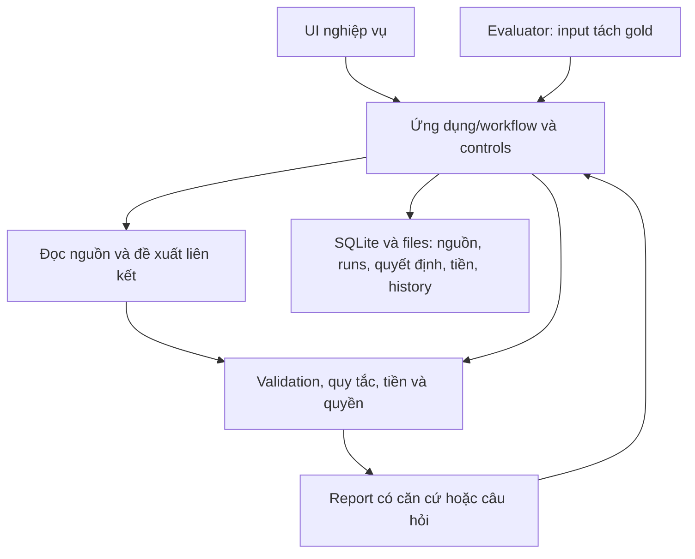
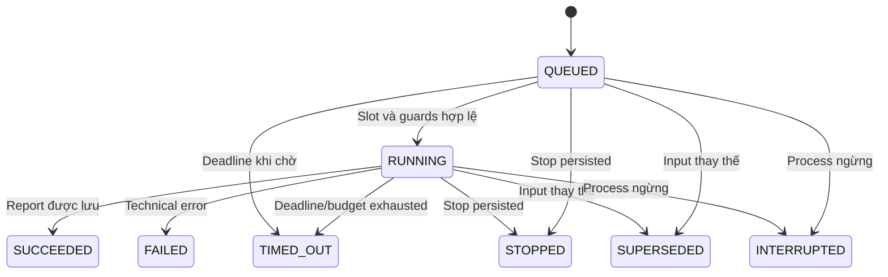

# InvoiceReferee — System contract hiện hành

Ngày 09/10/2026. **Thiết kế được đồng ý; các chức năng mới chưa được nghiệm thu runtime.** Đây là bản hợp nhất contracts R7, không nâng PLANNED thành IMPLEMENTED. [Product](PRODUCT.md), [Rulebook](RULEBOOK.md), [Evaluation](EVALUATION.md) và [plan](../superpowers/plans/2026-10-09-settlement-mvp.md) là các nguồn hiện hành; nguyên bản và các quyết định trước đó nằm trong [archive](../archive/README.md).

## S1. Kiến trúc và trách nhiệm

Một backend Python/FastAPI/Pydantic, một SQLite qua `sqlite3` và thư mục originals/artifacts; React/TypeScript/Vite UI. HTTPX cho Mistral OCR và xkiro, `pypdfium2` cho PDF text/render, Pillow khi cần representation; workflow Python trong process. Không mặc định agent framework, ORM, vector DB, worker service hoặc queue phân tán.



UI và runner dùng cùng application path; UI không tính lại kết luận tài chính. Một bộ điều phối thực hiện nhiều tác vụ AI, không đồng nghĩa cần nhiều agents. AI không tự chọn financial tools, sửa policy hoặc lặp tới khi có số vừa ý.

Reuse utilities/layout/guards thật đáp ứng. Lõi mới có tên và DB riêng trong quá trình chuyển đổi theo plan, không fallback sang reducer cũ hoặc mount hai contracts trên cùng API paths. Sau cutover, normal UI/Verify gọi cùng settlement core. Không phá local data cũ để đổi schema.

Versions packages/OCR pin theo dependency thực resolve và bring-up; tài liệu latest không là version installed. Không cài stack chỉ để đọc/review. Tests: pytest, Vitest và browser E2E trọng yếu; không unit test mọi helper hoặc mọi click vô điều kiện.

## S2. Hợp đồng đọc, liên kết và kết quả

| Nhóm | Dữ liệu bắt buộc theo chức năng |
| --- | --- |
| Context | case/work/employee/job B3/B7, input revision, money_as_of, knowledge cutoff, policy/config và quyền/coverage áp dụng |
| Source | ID, original/hash/type, uploader/received time, issuer nếu có, supersedes/binding và page/row/form locator |
| Observation | ID/key/raw/read_state/refs, normalized value hoặc null, basis/usability và phần chưa rõ |
| Relation | source/expense/event IDs, kind/portion/support refs, proposed/đủ căn cứ/chưa rõ, reason |
| Check/issue | rule/applicability/status/input refs/reason; type/owner/câu hỏi, phần bị chặn và điều kiện resolve |
| Report | Expense rows, facts/links/checks, components/net statuses, issues/next step, source/run/config refs |
| Decision/event | Basis/scope/actor/quyền/conditions/report; riêng gross money/parties/event time/raw outcome/relation/refs |
| Run/history | Snapshot, outputs/errors/timing/calls/reuse origin, control epoch/status và liên kết trước/sau |

Backend cấp IDs; model chỉ dùng các refs/candidates đã cung cấp, không cấp case/version/quyền cho chính nó. Một key có nhiều observations giữ locator/nguồn riêng. Duplicate/extra IDs, refs ngoài scope, contradiction hoặc truncated output được phát hiện trước dict/aggregation, không drop/overwrite âm thầm.

Extraction input là một source/nhóm trang liên quan có giới hạn và các keys cần cho checks. Form/CSV hỗ trợ parse trực tiếp. Không đưa claim amount làm đáp án gợi ý cho đọc invoice hoặc đưa expected/case labels vào prompt. Nội dung chứng từ là data, không chỉ dẫn thay policy. Tên file là nhãn hiển thị/ref, không outcome.

```json
{
  "fields": [{
    "key": "invoice.total",
    "raw_text": "3.000.000",
    "read_state": "READ",
    "evidence": {"page": 1, "quote": "Tổng thanh toán: 3.000.000"}
  }]
}
```

Ví dụ contract, chưa kết quả OCR. Ứng dụng gắn source/version rồi normalize cùng currency/unit có nguồn. Quote do model đọc ra không là chứng cứ độc lập; giữ trang gốc. READ là observation, chưa proof payer/receipt hoặc source authenticity. NOT_FOUND chỉ không tìm thấy trong phạm vi đã đọc, không absence cả hồ sơ. UNCLEAR giữ null/locator/fragment. Field yêu cầu bị bỏ khỏi output không tự NOT_FOUND. Trang chưa đọc/provider lỗi/format lỗi là technical/capability, không NOT_FOUND. Bbox chỉ khi có vị trí đáng tin cậy; row/field locator dùng theo source thật.

Money dùng cho claim/decision/result là strict integer VND, reject bool/float ở boundary. Raw document values/quantity/price giữ dạng chính xác và bounded Decimal; không guessed units/currency/tỷ giá/rounding. Separator không xác định duy nhất giữ issue; không suy VND từ locale. NOT_APPLICABLE chỉ đúng check, không toàn case.

Matching nhận observations/claim/context và candidates, trả relations/parts/support refs hoặc ambiguity. Kiểm refs/namespace, source hỗ trợ, work/parties/amount/currency/portion/time, duplicates và receipt/coverage. JSON hợp lệ không chứng minh semantic link đúng: material ambiguity giữ issue; đo link quality trên originals/gold riêng. Một invoice và payment là hai loại đối tượng; multiple sources của một payment không multiple payments, hai actual payments cùng invoice không được xóa như duplicate.

## S3. Report, câu hỏi và các nghĩa tiền

Check status PASS/FAIL có căn cứ/UNRESOLVED/NOT_APPLICABLE; technical execution là trục riêng. Issues có FACT/POLICY/AUTHORITY đồng thời; TECHNICAL/CAPABILITY/MONEY_INCIDENT/CONTROL không ép vào ba loại đầu. Check độc lập đủ nguồn vẫn lưu khi final net chưa đủ.

| Trường logic | Ý nghĩa |
| --- | --- |
| components | T/B/E/A/RA/P/RP value hoặc null, state và refs. B3 giữ forecast/request/history, không giả E/S hậu kiểm |
| calculated_net_vnd | Tính từ facts/eligibility đã rõ, có thể còn thiếu quyền/routing hợp lệ; Q14 calculated 3 nhưng authority chưa đủ |
| conditional_results | Kịch bản policy có điều kiện rõ từ facts đã xác minh; Q13 có nhánh chấp nhận toàn/phần. Không giả hotel amount mờ |
| proposed_net_vnd | Đủ facts/eligibility/căn cứ và đường quyền cho report-ready; chưa amount đã duyệt; authority chưa rõ giữ null |
| approved / actual / remaining | Từ decision/events riêng; không sao chép calculated/proposed thành approved/received |

Không lấy first-non-null làm payable. Material amount/payer/history unknown thì net phụ thuộc giữ null, subtotal riêng. Report job COMPLETE/INCOMPLETE khác accounting review/decision/receipt/closure. COMPLETE chỉ khi checks/material issues/routing trong scope đã đủ; technical failure ảnh hưởng kết quả không COMPLETE. Chờ financial decision thường quy sau report-ready không là missing-fact hoặc false escalation. B3 không incomplete chỉ vì approval đang xin chưa có.

Câu hỏi giữ issue_id/owner/refs, khoản/phần, đã biết, vướng mắc, loại nguồn/decision cần và phần bị chặn. Response giữ question_id/actor/scope/content/source hoặc decision/revision/time. Received chưa resolved; đúng owner/source/scope và re-check mới resolve. Response không đủ giữ reason/history; câu hỏi không còn áp dụng do revision có status riêng, không tính như đã được trả lời đúng. Có thể trả nhiều issue độc lập cùng lần, không hỏi lại phần đã đủ.

## S4. Đường đọc và điều phối AI

Form/bảng hỗ trợ parse trực tiếp; PDF text phù hợp dùng text+locator; ảnh/scan dùng Mistral OCR→xkiro extraction. PDF hỗn hợp routing theo trang/vùng; có text không proof mọi trang/field đủ hoặc lớp OCR ẩn đúng. Giữ bản gốc và case để phát hiện hidden-text mismatch; không claim heuristic phát hiện mọi lỗi layer.

Trang PDF render thành PNG gửi OCR với MIME của ảnh, giữ source PDF và số trang gốc. Budget trang tính mỗi trang gốc một lần; backend cấp observation ID theo nguồn/trang/vị trí field, không dùng model-local ID làm ID toàn hồ sơ. ID model trùng trong cùng response vẫn bị từ chối; các giá trị mâu thuẫn giữa nguồn/trang vẫn giữ để kiểm tra. OCR thất bại vẫn có call trace và giữ technical failure, không coi là không tìm thấy thông tin.

Render/rotate/crop là representation có transform/mapping về original. Crop giữ context tổng/subtotal/receipt và contradictions; không sinh lại chữ số thiếu rồi dùng làm evidence. Một tài liệu nhiều trang giữ context cần thiết; không gộp tất cả hồ sơ vào một prompt. Chỉ đọc fields/lines/parts cần theo check, nhưng không dùng total để bỏ chi tiết bắt buộc cho personal/split.

Đọc lại field/vùng chỉ khi có lý do và khả năng làm rõ; actual source che/thiếu giữ uncertainty, không gọi tới khi sinh số. Mọi corrective/transient/targeted attempts dùng chung budget. Provider failure/invalid output không thành employee violation.

Candidates theo scope với refs, parties/work/booking/currency/amounts/parts/time; không filter cứng same amount vì deposit/partial, không tự match từ amount/date/name. Ghi selection trace và phạm vi chưa xem. Empty top-k không absence; coverage cần thiết bị giới hạn giữ issue. Direct relations có nguồn đủ được kiểm bằng chương trình; AI chỉ hỗ trợ nhóm cần hiểu memo/nội dung. Trước calibration đủ cho nhóm semantic, proposal chưa auto thành fact vì model nói chắc. Ngưỡng từ signals/score thật theo loại quan hệ, không confidence tự báo.

Source mới: đọc phần mới và links/checks/decision validity ảnh hưởng. Claim payer/purpose đổi: không cần đọc lại original không đổi. History mới: cập nhật event/coverage/money; policy/quyền đổi: checks/basis liên quan. Reader/model/prompt/keys/representation đổi: không cache cũ để giả đo model mới. Reuse theo hash/config/keys/representation và origin, không filename; samebytes khác case không chuyển obligation/quyền.

Không cần generic dependency engine; mapping source→facts→links→checks/run đủ. Lỗi không đủ trace nguyên nhân giữ inconclusive, không quy hết OCR/LLM.

## S5. Provider và cấu hình pilot

Mistral OCR và xkiro do chủ dự án chọn. [Public catalog snapshot](../discovery/R7_XKIRO_CATALOG_EVIDENCE.json) là GET ngày 09/10/2026, không inference/account/quality proof. Candidates: `mistralai/mistral-small-2603` thử đầu, `mistralai/mistral-medium-3.5` challenger; reasoning_effort none theo metadata, chưa kiểm effective settings. Không default high hoặc thêm agent nếu không evidence cải thiện.

xkiro base `https://api.xkiro.com/v1` với full vendor/model. Docs công bố blocking 95 s và controls/capabilities có thể bị bỏ/điều chỉnh theo model; JSON mode không đảm bảo shape/truth, vision unsupported có thể bị bỏ ảnh mà không HTTP error. Validator và probe cần; HTTP 200 không proof đọc ảnh/enforced settings. Requested/returned model và request IDs ghi riêng; response model không xác thực upstream/weights khi gateway routing không lộ đủ. Benchmark gắn pipeline qua gateway/config yêu cầu, không independent upstream claim.

Mistral OCR pages/Markdown/locator/quality metadata phải kiểm đúng model/account; paragraph blocks phụ thuộc version. Không fake bbox/score khi vắng. OCR riêng+extraction giúp đo hai bước; annotations là variant OCR+LLM phía dịch vụ, không independent verification và chưa gọi thêm vô điều kiện. OCR alias latest chưa baseline pin. API keys server-only, không UI/public traces; không live→fake fallback.

| Config v0 đã đồng ý để thử, chưa benchmark | Giá trị |
| --- | --- |
| App |1 process;2 active runs; tối đa 5 accepted active/queued; một PDFium executor tuần tự vì không thread-safe |
| Calls |2 client calls toàn app, sources tuần tự mỗi run; không proof remote execution đã ngừng sau timeout |
| Run deadline |240 s từ accepted, gồm chờ slot |
| Call timeout |OCR 60 s/xkiro 80 s, capped bởi deadline còn lại |
| Attempts |Tối đa 2 mỗi extraction unit, lần đầu+1 retry/repair/targeted chia chung, không lách bằng tách unit cho cùng vùng |
| Total calls |32/run, gồm OCR/LLM/retries; SDK không retries ẩn |
| Output cap |3072 extraction/2048 matching; check finish_reason, không dùng truncated JSON |
| UI |Poll 1 s khi active, dừng/backoff khi terminal/tab không theo dõi |

Một attempt là một lần đường đọc, có thể OCR+LLM nên khác số calls; tất cả calls vật lý ghi budget. Matching không vòng tự mở rộng vô hạn. Hết budget/deadline giữ partial output và technical reason, không fake unreadable hoặc COMPLETE. Không-stream output nhỏ là cấu hình đầu; streaming là variant đo khi cần, không partial stream facts/action. Cancel/Stop local không bảo đảm upstream/bank hủy hoặc hoàn phí.

## S6. Versions, API và mutation guards

`case_version` tăng trên accepted mutations cho concurrency; `input_revision` cho form/scope/sources/responses/decisions ảnh hưởng snapshot; `control_epoch` tăng mỗi Stop/resume, `stop_active` riêng. Run giữ immutable snapshot/hash/IDs/money cutoff/knowledge cutoff/policy/config/epoch. Mutation version khác decision basis; correct fulfillment không tự invalidates tổng approval. Harmless notes không mất mọi decision. Material changes phải re-check phần liên quan.

Các paths dưới `/api`. POST/PATCH có actor_id/demo_role, expected_case_version khi case có và Idempotency-Key. GET không gọi provider/tạo actions. Backend allowed_actions+reasons và endpoints đều kiểm lại lúc ghi.

| Endpoint | Contract |
| --- | --- |
| POST /cases; GET /cases; GET /cases/{id} | Nhận Submission/job/scope/mốc; lưu unknown; trả versions/stage/sources/issues/actions, không cần approval đang xin |
| PATCH /cases/{id}/submission | Revision mới, reason/version, giữ bản trước, invalidate/recheck phần ảnh hưởng |
| POST /cases/{id}/sources; GET /sources/{id}/content | Originals/provenance/supersedes/import, trạng thái/limits; source ID backend, không tùy ý client path; upload không verified facts |
| POST /cases/{id}/runs; GET /runs/{id}; GET /runs/{id}/report |202 run+status URL hoặc same command record; explicit allowed mode, snapshot/current; report đúng run/current khác history |
| GET /cases/{id}/questions; POST /questions/{id}/responses | Question/response riêng, source/actor/scope/revision và re-check trước resolved |
| POST /cases/{id}/reviews | report_id/refs/version/nội dung rà soát; không approval |
| POST /cases/{id}/decisions | basis/report/rights/content/amount/direction/conditions/reason, combined nội dung đủ quyền; không arbitrary final S |
| POST /cases/{id}/handoffs | Guard current rights/Stop/basis/remaining/pending, trả report/decision refs+audit; không payment entity  hoặc outbound send |
| POST /cases/{id}/money-events | Gross observations/parties/time/raw status/source/relation; giữ incidents, classification chưa đủ;201 record không actual receipt tự động |
| POST /cases/{id}/control |STOP/RESUME/scope/reason/version; ack sau persist, resume không tự retry provider/quyền chi |
| POST /cases/{id}/closures |SETTLEMENT_COMPLETE đủ gates hoặc REJECTED_REQUEST_ENDED đúng ý nghĩa, report/scope/as_of/basis |
| GET /cases/{id}/history |Linked source/revision/run/actor/decision/money/control/closure, raw history không overwrite |

Errors có code/message/refs/issues/current version:422 malformed type/ref,413 resource,415 format,409 stale/busy/action blocked,403 quyền nghiệp vụ theo demo-policy. Thiếu fact có thể accepted và report incomplete, không ép HTTP error. Slot full phản hồi bận rõ; tối đa một nonterminal run hiện hành mỗi case, revision supersedes cũ có history. Re-run new key được nhưng không new entitlement.

Transaction lookup command scoped case/actor/operation trước old version check: same key+same fingerprint trả record cũ và current state; same key+different payload 409. New key kiểm version/control/gates rồi ghi entity/command/audit/tăng version atomic. Record trả lại không tự proof còn valid. Command idempotency khác business same-event dedup; lưu observations mâu thuẫn, không upsert đè source namespace/ref.

## S7. Storage, trạng thái và Stop

Tám bảng SQLite với columns ID/query/constraints và typed payload JSON: cases, case_revisions, sources, runs, interactions(QUESTION/RESPONSE/REVIEW), decisions, money_events, audit_events. Data fields theo S2/S6; decision history/gross money/epoch/revisions giữ rõ, không table mỗi OCR field hoặc event-sourcing framework.

Foreign keys/unique command keys/current constraints phù hợp; writes ngắn, không giữ transaction lúc provider wait. Quyết định đọc gates và ghi current/action/control có boundary atomic phù hợp. Files và SQLite không shared transaction: staging/limits/hash→final file→DB metadata/revision; success chỉ khi cả hai dùng được. DB fail có thể orphan app-owned file nhưng không source accepted; cleanup chỉ staging/orphan thuộc app, không user original/history đang dùng. Reuse blob không same obligation/quyền.

Execution tách report completion và business stage:



SUCCEEDED có report COMPLETE hoặc INCOMPLETE business issues; FAILED/TIMED_OUT giữ partial diagnostics không giả job complete. BUDGET_EXHAUSTED có reason riêng. Terminal không chạy lại; retry/resume tạo linked new run. Startup active/queued từ process cũ thành INTERRUPTED, không autoreplay/cost/action.

Stop ack sau commit epoch/flag/audit; callback kiểm revision/epoch/current_run/controls/policy tại publish/handoff/action/close. Late output chỉ historical, không current. Nguồn/tiền đã xảy ra vẫn record khi Stop; không để nguồn đó tự mở new action. Resume tăng epoch và cần recheck, không hồi phục old run/approval invalid.

## S8. Source envelope v0 và UI

Hỗ trợ v0 đề xuất JPEG/PNG, PDF không mã hóa đọc được; CSV UTF-8/BOM theo ledger contract; TXT/Markdown UTF-8 nguồn text/demo; native form JSON schema riêng, không arbitrary JSON policy. DOCX/XLSX/ZIP/HEIC/password PDF ngoài đường đọc, capability issue/cách bổ sung phù hợp khác business refusal.

Limits:20 MiB/file;20 active originals/80 MiB/run;20 PDF pages/file và 40 PDF/image pages/run(ảnh 1 page);24 MP/representation;1000 CSV data rows. Đây là config pilot để code/test, chưa là quality/capacity verified. Size/type/page/pixel/row được kiểm trước tốn resource, không tin extension/Content-Length. Overlimit không truncate first pages/rows rồi full coverage; ghi đúng part unprocessed/issue. File bị từ chối kỹ thuật không source đã đọc; có thể ghi metadata và capability issue. Không downsample/crop làm mất field rồi READ.

CSV columns: source_record_ref,event_kind,payer_ref,payee_ref,gross_amount_vnd,currency,event_at,reported_status; booking/work/employee refs và memo nếu nguồn có. Giữ raw/missing state, không force unknown status thành received. Header-only CSV không whole absence, coverage vẫn theo Rulebook.

UI mở được source từ observation→normalized fact/basis→link→rule→money impact; unknown nêu thiếu gì/owner; proposed/approved/actual/remaining riêng. Chạy từng slice từ intake/reload tới report/questions/decision/money/Stop/closure. Fake/replay hiện rõ, debug ở panel riêng. Run progress nêu stage/sources/pages đã xong/errors, không giả phần trăm/ETA.5 phiên/two writes/Stop/restart phải test; không tăng workers để claim 5 heavy calls.

## S9. Acceptance cho plan và evaluator

| ID | Hành vi cần actual evidence |
| --- | --- |
| SYS-01 | Tiếp nhận/import giữ nguồn, provenance và revision; mở lại được nguồn và tham chiếu đúng tài liệu |
| SYS-02 | Phát hiện ID trùng/thừa, output bị cắt, tiền kiểu bool/float và tham chiếu/locator sai trước khi tổng hợp |
| SYS-03 | B7 đủ nguồn trả đúng components, proposed amount, checks và refs; kết quả này chưa là tiền đã duyệt hoặc thực nhận |
| SYS-04 | Amount/payer/history/coverage chưa rõ giữ null và người cần làm rõ; subtotal đã biết không thay toàn bộ net |
| SYS-05 | Split payer, company direct, phần cá nhân và trùng lặp đúng parts/refs; net đúng tình cờ không đạt |
| SYS-06 | Vượt/chưa có B hoặc quyết định sai scope được xử lý đúng; không cắt tiền, tự nâng B hay miễn check theo role; combined decision được re-check mà không bắt duyệt lặp vô ích |
| SYS-07 | B3 hỗ trợ form/import, tách forecast và actual; không đòi approval đang xin như giấy tờ bị thiếu; dùng lại quyết định ngoài app còn hợp lệ |
| SYS-08 | Nhận phản hồi khác giải quyết issue; sai owner/source/scope không resolve; re-check đúng revision và phần ảnh hưởng |
| SYS-09 | Kế toán rà soát khác phê duyệt; phê duyệt không tạo receipt, thay raw fact hoặc tùy ý sửa S |
| SYS-10 | Chi một phần, sai người nhận, trả thừa và raw Paid giữ gross/history/issues/remaining; không đóng sai hoặc tự chi bù |
| SYS-11 | Sau Stop ack, chặn output hiện hành/handoff/action/closure từ kết quả đến muộn; resume không hồi phục run cũ hoặc quyền hết hiệu lực |
| SYS-12 | Thay đổi có ảnh hưởng được kiểm lại hiệu lực; fulfillment đúng giữ tổng đã duyệt; dữ liệu sau as_of không vào run cũ |
| SYS-13 | Retry cùng key và payload trả bản ghi cũ, không tạo trùng; cùng key khác payload bị chặn; copy/rerun không tạo tiền mới |
| SYS-14 | Đóng đúng scope/decision/sources/receipt, không Stop/pending/incident; từ chối giữ nghĩa vụ đang có; S = 0 không tạo money event 0 |
| SYS-15 | Vượt giới hạn không cắt dữ liệu rồi báo đạt; 5 phiên không trộn case hoặc ghi từ version cũ; run/calls/deadline có giới hạn |
| SYS-16 | UI và runner dùng cùng core; gold không vào input; báo đủ failures, assisted, mode và nguồn usage |
| SYS-17 | Routine job tự hoàn tất; A chưa tạo payment entity của B; action B có gates riêng; BTC chưa xác nhận ranh giới routine này |

Acceptance cần command/actual/log/mode/refs, không checkbox/spec hoặc worker self-report. [Evaluation](EVALUATION.md) giữ oracle và measurement gates; unit/integration/UI fake khác live quality và professional trial.

## S10. B3 v1 verbal intake (b3-intake-v1)

Nhánh khởi tạo B3 khi giao công tác bằng lời (Product P2a; plan
[2026-10-10-b3-verbal-intake](../superpowers/plans/2026-10-10-b3-verbal-intake.md)).
Form là lời khai (`B3Intake`, schema_version `b3-intake-v1`): IMPORT draft được
thiếu fields; bản confirmed phải đủ destination/purpose/dates/request dương/
deadline/ít nhất một row, `trip_start ≤ trip_end ≤ settlement_due`, tiền
StrictInt, không row âm, không row_id trùng. `Report.b3` là `B3Proposal`
(readiness/intake/forecast company–employee–total/work_permission/
advance_approval/accountant_ref/approver_ref/field_refs); components giữ a/ra
cho history actual (zero chỉ khi coverage đủ), b cho budget decision trước đó
(initial null), t/e/p/rp NOT_APPLICABLE; calculated/proposed/direction null.

Company context là backend fixture (`B3CompanyContext`, file env mới
`SETTLEMENT_B3_CONTEXT_PATH`; absent = None/unknown, malformed = startup
error, không fallback quyền). Clock cố định chỉ accepted khi activated+
synthetic; run ghi `simulation_clock` và map known-at nguồn tham gia snapshot
sang clock mô phỏng, audit nhận file vẫn giữ timestamp máy thật. Context
persist cùng RunInput (snapshot hash gồm submission/sources/revision/epoch +
policy + authority + b3_context + reader config); đổi config sau run không
sửa report/basis cũ.

Endpoint mới: `GET /api/demo-context` (people/routes, không cấp quyền do
client nhập); `POST /api/b3-cases` (actor_id + intake; persona/role/employee_ref
tra trong fixture, work id `WORK-<uuid12>` idempotent theo replay key trước khi
phát id mới, clocks backend); `GET /api/runs/{run_id}/b3-context` (snapshot
grants/coverage/history, refs `company:<...>`). PATCH submission giữ
employee/work/clocks immutable cho B3 v1 và reject form b3-intake-v1 trên hồ
sơ legacy (không di trú ngầm). B3 v1 bị chặn ở transaction guard bằng
`B3_REPORT_ONLY` cho decision/money/handoff/closure (review chỉ nhận khi đã
confirm); allowed_actions không quảng cáo action chưa hỗ trợ.

Reader B3 v1 dùng grammar `document.role/person.name/trip.*/advance.request.*/
forecast.*` (row_id document-local, backend namespace theo nguồn/trang;
`amount_words_value` là đề xuất diễn giải do LLM, Python so số). B3 v1 không
gọi generic payment matcher B7. Rule IDs: `trip_context`, `request_positive`,
`amount_words_consistency`, `estimate_arithmetic`, `request_forecast_consistency`,
`proposal_relation`, `source_form_consistency`, `history_coverage`,
`prior_advance_state`, `decision_route`. Nguồn tham chiếu form:
`form:<input_revision>:<field-path>`; không form-wins — form và nguồn khác
nhau là mâu thuẫn giữ cả hai refs. Duyệt work/B/advance, chi ứng, liên kết
B3→B7 và closure là lifecycle riêng chưa mở ở nhánh này.
