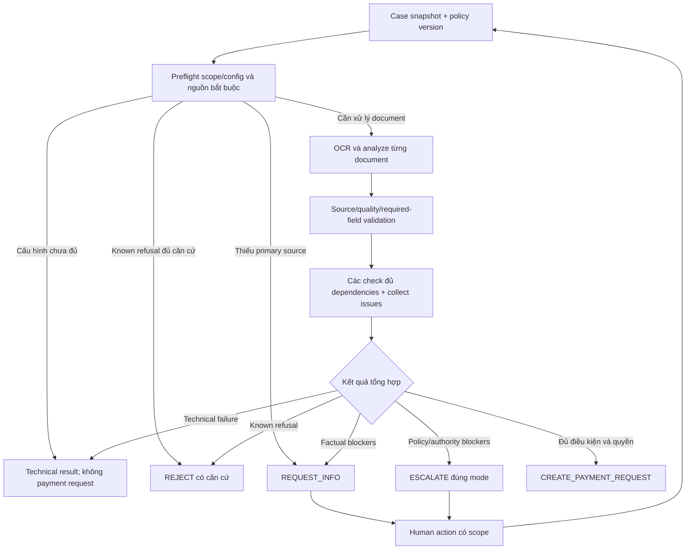

# B1 — System và data contracts cho MVP

Version 0.1, 04/10/2026. **DRAFT — thiết kế để review, chưa implementation**.
Product: [B1_PRODUCT_SPEC.md](B1_PRODUCT_SPEC.md).
Business rules: [B1_RULEBOOK.md](B1_RULEBOOK.md), profile PROPOSED 2/5 triệu.
Các con số policy chưa được người phát triển chốt; giữ là cấu hình có version.

## 1. Ranh giới

React/TypeScript/Vite gọi API Python/FastAPI. Application layer điều phối;
domain/policy evaluators không phụ thuộc UI hoặc SDK. SQLite lưu structured
state/history; filesystem lưu evidence, OCR, model responses và reports.
Một app, một người thao tác, một case đang chạy là đủ.

Không có tenant/auth doanh nghiệp, broker, distributed jobs, crash recovery
engine hoặc bank payment. Các mode EMPLOYEE/REVIEWER/APPROVER/POLICY_OWNER là
vai trò demo, được công bố; backend vẫn kiểm tra action đúng nghĩa nghiệp vụ.

B0 main là tham chiếu; B1 là baseline mới sau nghiệm thu. B2 là các thử nghiệm
cải tiến có version và cùng input/ground truth, không phải mặc định thêm hạ tầng.

## 2. Các contract tối thiểu

| Record | Fields cốt lõi | Invariant |
| --- | --- | --- |
| Case | id, case_version, Claim, current_run_id, workflow_state | Thay input tạo version; không sửa history trước |
| Claim | employee_id, profile/OTHER, purpose_type/purpose, trip, requested_amount_vnd, payer_type | Khai báo được lưu riêng với chứng từ; amount thiếu khác amount invalid |
| Evidence | id, case_id, role, original_name, stored_path, sha256, mime, size | Path backend cấp; không lấy path client tùy ý; cùng bytes không thành hai nguồn độc lập |
| SourceRef | evidence_id, page_index, block_id, span/locator, raw_value | Resolve trong registry thật; phải thuộc evidence/run đang xét |
| FieldFact | field, normalized_value, raw_value, refs, source_kind, observations, usability | Model proposal khác derived usability; value có source và normalization trace |
| DocumentFacts | evidence_id, kind/template, merchant/date/currency/totals/items | Đúng evidence; item IDs duy nhất và thuộc document |
| CheckResult | rule_id, status, dependency fields, refs, reason, issue_ids | PASS/FAIL/UNKNOWN/NOT_APPLICABLE; N/A không là toàn-case approval |
| Issue | id, stable_key, class, owner_mode, question, refs, blockers, status | Factual/policy/authority riêng; giải quyết theo dữ liệu/action mới |
| Run | id, case_version, input_hash, policy/threshold/prompt/model identities, status, result | Output gắn đúng snapshot; không ghi đè run gốc |
| HumanAction | id, case_version, issue_id/scope, mode, action, value/ref/reason | Kiểm tra mode và scope; action không tự đóng mọi issue |
| Decision | action, completion_basis, accepted_amount, checks, issues, reasons | Auto action chỉ nếu đủ coverage/usability/policy/authority |
| PaymentRequest | id, case/run, payee, VND amount, basis, status | Một request hiện hành/case; CREATED không là PAID |

Không bắt đầu bằng generic schema framework, generic rule engine hoặc một
plugin registry. Records phục vụ các use case và acceptance cụ thể.

## 3. Source và quality

Source kind: DOCUMENT, EMPLOYEE_DECLARATION, HUMAN_CONFIRMATION. Một field
chỉ có value chưa chứng minh field đó usable. Derived usability:

- USABLE: value/source/normalization/quality đủ cho check đang dùng.
- MISSING: required field chưa có dữ kiện.
- UNCERTAIN: có candidate nhưng chưa đủ căn cứ chọn giá trị/ý nghĩa.
- UNUSABLE: dữ liệu đã có không thể được dùng cho check.
- NOT_APPLICABLE: field/check không thuộc profile/template đã xác định.

Required fields theo profile/rulebook. Không dùng toàn-page average confidence
làm bằng chứng riêng cho một chữ số. Các word/span liên quan required field
phải có mapping; missing quality coverage không được coi là không có lỗi.
Word threshold ban đầu 0.85 là review parameter, không là business probability.
Trong B1 đề xuất, required numeric value chỉ auto-usable khi source/normalization
hợp lệ, relevant score coverage có và đạt threshold, không contradictory
observation; hoặc có HumanConfirmedFact hợp lệ. Model READABLE không tự miễn
missing/low-score coverage của chữ số. B2 có thể thử threshold khác theo
calibration/evaluation, không miễn source/normalization hard gates.

Nếu required numeric span chưa đủ căn cứ, model đọc ngữ nghĩa không tự phục
hồi chữ số. Human confirmation được phép theo rulebook, gắn source/reason và
không sửa raw OCR. Name semantic readability không miễn numeric requirements.

Với field cần cho check áp dụng, observation UNREADABLE/UNKNOWN nhưng model
đồng thời khẳng định usable/không cần xác minh không được chuyển thành USABLE
bằng boolean đó. Field không cần dùng có thể giữ unknown/warning mà không
chặn case; không giả gắn nó USABLE để bỏ qua sự không chắc chắn.
Contradictory output phải được reject/repair có giới hạn hoặc có technical
invalid-analysis result. Không sử dụng assessments thiếu/trùng/lạ.

Source refs chỉ chứng minh trace tới input/OCR đã nhận, không tự chứng minh
authenticity của tài liệu hay sự kiện chi trả ngoài đời.

## 4. Provider contracts và hai nhiệm vụ Kimi

Mistral adapter nhận file và trả raw OCR/pages/blocks/words/score metadata;
lưu provider/model/timestamp. Validator phát hiện no content, broken structure
và missing coverage; không tự gắn quality PASS vì call không throw exception.

Kimi B1 có hai nhiệm vụ logic đề xuất:

1. **AnalyzeDocument**: một evidence mỗi invocation, nhận OCR/source registry,
   role và required-field hints; trả DocumentFacts + quality observations.
   Không nhận documents khác hoặc employee prose để điền values vào nguồn.
2. **ProposeCrossSource**: chỉ khi profile cần đối chiếu và có usable facts;
   nhận facts có source, đề xuất item matches và semantic conflicts. Không
   viết lại document facts hoặc đưa ra final decision.

Đây là thay đổi có chủ đích so B0: per-document facts tách khỏi joint conflict
extraction; logical quality/extraction có thể trong một per-document call để
không đọc cùng source hai lần. Vẫn phải benchmark chất lượng và call cost;
không nói tách call tự chứng minh mọi dữ kiện đúng.

Model output được kiểm tra schema, đúng ID/coverage, uniqueness, refs/ownership,
normalization và quality consistency. Tối đa một JSON/contract repair mỗi
invocation; coverage repair cross-source, nếu cần, tối đa một invocation bổ
sung. Ghi repair reason và budget; không loop tới khi model nói hợp lệ.

Applicability do code từ profile/template/requirements quyết định. Model chỉ
đề xuất; nó không được miễn inventory check bắt buộc bằng NOT_APPLICABLE.
Template cũng là proposal: TOTAL_ONLY không được dùng khi OCR có item regions
chưa cover hoặc facts đã có quantity/unit price mà arithmetic bị bỏ qua.
Supported template/basis không xác định được thì check liên quan UNKNOWN,
không fallback thành N/A để tránh kiểm tra.
B1 tự ghép dòng normalized name duy nhất khi không có contradiction; mapping
đồng nghĩa do model đề xuất phải có refs và đủ checks, nếu còn ambiguity thì
reviewer xác nhận mapping. Code không tự đoán unit conversion ratio.

SDK/model/endpoint được cấu hình và pin khi lập plan/integration; không đưa
credential vào UI/source. Không giả định API vision khi adapter chưa có nó.

## 5. Numeric và policy evaluators

Canonical numeric strings không có separators; parse có trace từ raw source.
Raw number hỗ trợ các grammar canonical decimal-dot, VI grouped-dot/decimal-
comma và US grouped-comma/decimal-dot khi format có căn cứ. Code liệt kê các
parse candidates phù hợp field/currency/template; nếu còn nhiều giá trị hợp
lệ (ví dụ quantity 1.234 có thể là 1.234 hoặc 1234), đánh uncertain thay vì
chọn giá trị do model thích. Human confirmation có thể chọn đúng value và
lưu căn cứ; không sửa raw source.
Không dùng float cho tiền; không chấp nhận NaN/Infinity hoặc số mơ hồ. Claim/
payment amount là integer VND; quantity/unit price là Decimal. Các bound kỹ
thuật đề xuất: money tối đa 15 integer digits; quantity/unit price tối đa
12 integer + 6 fractional digits; tối đa 200 items/document. Ngoài domain
không được round âm thầm để thành hợp lệ. Đây là bound parser, không phải
company allowance.

Document monetary facts giữ Decimal và currency nguồn; không ép amount USD
thành integer VND trước scope check. Integer VND constraint áp cho claim/
accepted/payment amounts thuộc workflow VND. Foreign currency không tự có
conversion chỉ vì requested amount có kiểu VND.

Decimal arithmetic dùng context explicit đủ cho domain này, precision 50;
không kế thừa ambient context. Rounding/template và tolerance theo rulebook.
Signed values phải có document kind/nghiệp vụ phù hợp; B1 không tự xử lý
refund/credit-note ngoài workflow hỗ trợ.

Evaluators thuần:

- source/quality coverage và field usability;
- document arithmetic khi template đủ terms;
- bill/receipt consistency, uniqueness, units và refs;
- expense eligibility/accepted amount;
- standard policy limits/case exception;
- system authority/explicit human amount approval;
- decide next action trên toàn bộ check coverage/issues.

Check chỉ chạy với dependencies đủ usable. Check independent có thể tiếp tục
để gom issues; missing dependency tạo UNKNOWN, không PASS. Không có supporting
không tự kết thúc case; chỉ inventory N/A khi profile thực sự không cần nó.

Decision actions đề xuất: CREATE_PAYMENT_REQUEST, REQUEST_INFO, ESCALATE,
REJECT, NONE. Completion basis là ROUTINE_AUTO hoặc HUMAN_AUTHORIZED, để
phân biệt routine với kết quả sau approval. NONE dùng khi technical block/Stop.
Tên này là lựa chọn project, không phải tên BTC bắt buộc.

## 6. Orchestration và trạng thái

Execution status: QUEUED, RUNNING, STOP_REQUESTED, STOPPED, SUCCEEDED, FAILED.
Workflow state: DRAFT, REVIEWING, WAITING_INPUT, WAITING_APPROVAL,
REQUEST_CREATED, REJECTED, STOPPED, TECHNICAL_ERROR.
SUCCEEDED execution có thể kết thúc ở WAITING_INPUT/WAITING_APPROVAL; nó
không tự nói case eligible hoặc đã chi tiền.

Intake từ chối input rỗng hoàn toàn, invalid provided amount, unsupported
file type và limits không hợp lệ trước khi tạo processing case. Missing
amount/purpose/bill trong case có nội dung được tiếp nhận là factual issue,
khác format invalid. Employee ID/profile/payer mặc định một mình không là
meaningful expense input; purpose/custom description không rỗng, amount có
ý nghĩa hoặc evidence mới đủ.
Provided amount phải strict integer dương; bool không được cast thành amount.
Limits có thể giữ B0: 12 files, 15 MiB/file, 50 MiB/case.

Run tạo snapshot trước khi gọi provider. Preflight đọc policy readiness,
scope/known refusal và sự có mặt của nguồn cần thiết; thiếu primary bill có
thể tạo SRC-01/REQUEST_INFO mà không gọi OCR/Kimi. Không gọi provider chỉ để
phát hiện một file bắt buộc chưa được nộp. Các check độc lập có dependencies
đủ có thể tiếp tục, nhưng không thực hiện business action khi còn blocker.
Các stage ghi event và artifacts;
mọi exception không thể xử lý hợp lệ được lưu thành FAILED/technical result,
không tự fabricate business violation hoặc final approval.

## 7. Human actions và revision

Actions: SUPPLY_DECLARATION, ADD_EVIDENCE, PROPOSE_CORRECTION, CONFIRM_FIELD,
CONFIRM_MAPPING, GRANT_POLICY_EXCEPTION, APPROVE_AMOUNT, DENY, STOP, OVERRIDE.
Rulebook xác định role/scope; UI chọn mode demo, không xác thực role doanh nghiệp.

Thay declarations/evidence tạo case_version mới. B1 chỉ dùng lại artifact trong
cùng case/evidence khi toàn bộ stage request hash (role, required-field hints,
threshold inputs và source registry) cùng prompt/model/schema identities không
đổi; không triển khai cache chia sẻ nhiều case. Rerun checks với
policy/threshold đang active. Không lookup expected theo filename/case ID.

Human-confirmed field là record mới có refs và reason; confirmation tạo data
version mới khi thay effective facts. Exception/approval không đổi data version,
nhưng active action IDs được đưa vào snapshot hash khi evaluation mới chạy.
Approval/exception
bound với case_version, amount/profile/purpose và policy version; changed
input làm authorization bị ảnh hưởng hết hiệu lực. Issue chỉ đóng khi check
reevaluate đạt hoặc explicit refusal, không chỉ vì đã nhập một câu trả lời.

## 8. Execution và controls tối thiểu

Một executor trong app để UI nhận progress/Stop khi chờ API. Không có broker,
worker fleet, leases, auto crash recovery hoặc concurrent-user infrastructure.
Một active run; yêu cầu run khác trong lúc busy trả busy status rõ ràng.
Action sửa input/approval/override trong lúc RUNNING trả RUN_BUSY; người thao
tác dùng Stop, chờ execution kết thúc rồi cập nhật. STOP là control được nhận
trong lúc busy. Điều này giữ snapshot đơn giản cho một người thao tác.

STOP được xác nhận sau khi stop flag/event được ghi. Nếu final action đã
commit, trả already-completed thay vì giả báo đã ngăn action đó. Trước và sau provider call, trước apply
facts/decision/request, kiểm tra stop và snapshot còn hiện hành. Nếu bị stop,
không apply result/action; slot chỉ được giải phóng khi execution đã kết thúc.
Không nói server của provider đã hủy inference. Nếu app restart, active run
cũ được trình bày interrupted/technical failed; người thao tác chạy lại,
không auto replay business action.

OVERRIDE cần reason, đúng scope/role; giữ original decision và chạy evaluation
mới. Nó không miễn source/quality/arithmetic hard gates hoặc mở capability
không được B1 hỗ trợ. Policy update là action/version riêng.

Stop và final insert dùng cùng persisted run guard/transaction boundary,
để Stop đã được acknowledgement không thể bị action muộn vượt qua. Trước
insert payment request, transaction kiểm tra current case_version/run,
stop flag, decision và request hiện hành. Bấm lại trả request hiện có; thay
decision/input giữ history và đánh dấu bản cũ superseded/revoked trước khi
có một request hiện hành mới. Không tạo nhiều lần chi trả thật.

## 9. API và UI bề mặt đề xuất

| Use case | API surface đề xuất | UI |
| --- | --- | --- |
| Create/read case | POST /cases, GET /cases/{id} | Form và chi tiết hồ sơ |
| Evaluate | POST /cases/{id}/runs | Chạy kiểm tra; current state |
| Read progress/result | GET /runs/{id} | Progress, stage, decision/checks/issues |
| Human action | POST /cases/{id}/actions | Bổ sung, xác nhận, approve/deny/override |
| Stop | POST /runs/{id}/stop | Nút Stop có acknowledgement |
| Trace/payment request | GET case history/payment-request | Timeline, nguồn, amount, export |
| Verify | POST /verify-runs; GET /verify-runs/{id} | Core/Escalation, expected/actual và timestamp |

UI polling progress là đủ cho B1; không mặc định SSE/WebSocket. Error messages
phân biệt input validation, technical execution và business issues. Phần
quyết định bằng ngôn ngữ nghiệp vụ; raw JSON dành cho tab diagnostics.

## 10. Storage và trace

SQLite tables: cases, evidence, runs, issues, human_actions, decisions,
payment_requests, events, verify_runs/results. Không sửa schema theo output
model; tạo schema đơn giản bằng init/migration tối thiểu khi cần.
Artifacts theo case/evidence/run ID: original file, raw OCR, raw model response,
parsed result và report. Path được backend cấp/sanitize, uploaded data/secrets
được Git bỏ qua. Không cần multi-tenant/object storage/HA ở MVP.

Trace tối thiểu: timestamp, case/run/version, stage/action, policy/threshold/
prompt/model identifiers, input refs/hash, outputs, checks/reasons, role demo
và human action. Các record đủ tái lập decision, không cần event-sourcing
framework. Basic audit phải giữ được căn cứ gốc sau Stop/Override/resubmit.

## 11. Acceptance kỹ thuật B1

| AC | Điều phải chứng minh |
| --- | --- |
| SYS-01 | UI và Verify gọi cùng application/policy logic |
| SYS-02 | Required facts có refs/coverage/usability; invalid/contradictory output không auto pass |
| SYS-03 | Duplicate item IDs không mất dòng; units/price basis và arithmetic theo template |
| SYS-04 | Primary-only hoặc inventory N/A vẫn đánh giá eligibility/authority |
| SYS-05 | Đủ điều kiện tạo một payment request đúng amount/basis; chưa đủ thì zero request |
| SYS-06 | Human action đóng đúng issue; affected approvals hết hiệu lực khi input đổi |
| SYS-07 | Stop có acknowledgement và ngăn late action; Override giữ original/căn cứ |
| SYS-08 | Role demo không được mô tả như enterprise identity; một app/executor đủ |
| SYS-09 | Technical failure/known refusal/uncertainty không bị trộn thành cùng kết luận |
| SYS-10 | Có replay input/policy/model identities và so B2 với B1 công bằng |

Các AC là proposed project contracts. Chưa có source/runtime mới chứng minh
đạt; khi được review, implementation plan sẽ chia tasks theo các AC này.
