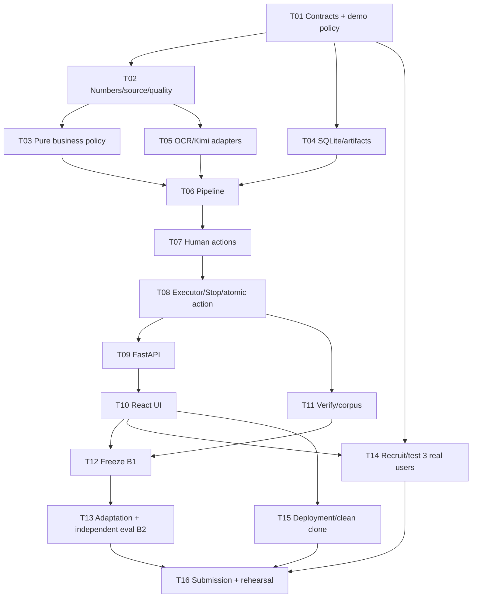

# InvoiceReferee B1 → B2 Implementation Plan

> **For agentic workers:** REQUIRED SUB-SKILL: Use superpowers:subagent-driven-development (recommended) or superpowers:executing-plans to implement this plan task-by-task. Steps use checkbox (`- [ ]`) syntax for tracking.

**Goal:** Xây MVP hoàn ứng có quyết định và payment request có căn cứ, nghiệm thu B1 làm baseline mới, rồi hoàn thiện adaptation, independent evaluation và bằng chứng chung kết.

**Architecture:** React gọi FastAPI; application service dùng evaluators thuần, SQLite và artifacts trên filesystem. Một executor trong một process giữ snapshot và xử lý Stop; UI và Verify dùng chung service. Không có bank transfer hoặc hạ tầng nhiều người dùng.

**Tech Stack:** Python >=3.12,<3.15, Pydantic 2, FastAPI, sqlite3/Decimal/threading từ stdlib; React/TypeScript/Vite; pytest, Vitest và Testing Library. Mistral OCR và Kimi qua adapters riêng; SDK, model và dependency versions được xác minh, khóa ở T01/T05/T10.

**Spec:** [Product](../../specs/B1_PRODUCT_SPEC.md), [Rulebook](../../specs/B1_RULEBOOK.md), [System](../../specs/B1_SYSTEM_SPEC.md), [Evaluation](../../specs/B1_EVALUATION_SPEC.md), [Competition](../../COMPETITION_REQUIREMENTS.md), [Roadmap](../../ROADMAP_V2.md).

## Global Constraints

- Chỉ viết plan trong lượt 04/10 này. Mọi task dưới đây là **PLANNED**, checkbox chưa được thực hiện.
- Người phát triển đã đồng ý lập plan từ các spec hiện tại. `demo-expense-v0.1-proposed`, 2.000.000đ/5.000.000đ, vẫn là policy mô phỏng; triển khai explicit activation có record ở T01/T09. Không suy ra quyền của một công ty thật.
- B0 là main `196e266541526123844a60820737f400e09b3a36`; B1 là rebuild được nghiệm thu; B2 so với B1 đã freeze. Không dùng lỗi B0 làm gold answer.
- Một app, một người thao tác, một active run. Chế độ EMPLOYEE/REVIEWER/APPROVER/POLICY_OWNER là demo, không phải enterprise identity.
- Không bank transfer, tenancy/auth doanh nghiệp, broker, microservices, shared cache hoặc crash-resume engine. Polling đủ cho progress.
- VND claim/payment là integer dương strict; Decimal cho document amount/quantity/price. Precision 50 explicit; money <=15 integer digits; quantity/price <=12 integer +6 fractional digits; <=200 items/document.
- Auto <=2.000.000 inclusive; standard policy <=5.000.000 inclusive. Không cắt số tiền xuống hạn mức. Exception và amount approval là hai authorization riêng.
- 12 files/case, 15 MiB/file, 50 MiB/case; PDF/JPG/JPEG/PNG/WEBP. Empty/missing/uncertain/bad coverage không auto-pass.
- Quality threshold đầu 0.85; line/total tolerance 1 VND, normalized unit-price tolerance 0; date gap bill/receipt <=7 ngày theo demo rulebook.
- Model không quyết định action cuối; một JSON/contract repair mỗi invocation, tối đa một cross-source coverage repair invocation bổ sung. Output lỗi không thành vi phạm của employee.
- Sau Stop acknowledgement không có late business action. Một current payment request/case; CREATED khác PAID. Override không miễn evidence/quality/arithmetic hard gates.
- Source/tests thắng docs về implementation; brief gốc thắng mapping về cuộc thi. Dùng IMPLEMENTED/VERIFIED/INCONCLUSIVE/PLANNED đúng mức bằng chứng.
- Shell qua `rtk`; graph discovery trước source search khi index/tools tồn tại. Hiện CodeGraph chưa initialized; không tự index. Không auto-stage/commit/push/merge hoặc publish. Bảo toàn deletion `docs/BUILD_LOG.md` của người dùng.
- Các snippets trong plan là public contracts và implementation anchors, không phải code đã chạy. Worker hoàn thiện module theo spec và tests, không thay logic bằng kết quả hardcode từ snippets.

---

## 1. Các work package và thứ tự

| Package | Tasks | Deliverable nghiệm thu riêng |
| --- | --- | --- |
| [01 — Core](2026-10-04-invoice-referee-01-core.md) | T01–T05 | Data contracts, nguồn/số/quality, policy, persistence và provider boundaries có tests |
| [02 — Workflow](2026-10-04-invoice-referee-02-workflow.md) | T06–T10 | Pipeline thật, human closure, Stop/Override, API và UI đi hết một hồ sơ |
| [03 — Evidence/release](2026-10-04-invoice-referee-03-evidence-release.md) | T11–T16 | Verify, freeze B1, B2 adaptation/holdout, user study, deploy và gói bài nộp |

Các cạnh là gate nghiệm thu. Chuẩn bị corpus/gold/recruitment/deploy sớm; không phải đợi code xong mới tìm người thử. UI có thể dựng theo OpenAPI/mock contract sau T01, nhưng chỉ nghiệm thu sau T09. T03/T04/T05 có thể giao agents song song theo write scopes; sửa contracts chung do lead duy nhất. T11 không viết evaluator thứ hai.

**Đường bắt đầu:** T01 → T02 → đồng thời T03/T04/T05 → một vertical slice T06: TRAVEL 1,2 triệu, thiếu primary, amount >2 triệu. Sau khi slice đúng mới hoàn thiện tất cả profiles và human controls. Không lấy slice ba case thay nghiệm thu >=15 cases.

## 2. File map trước khi dispatch

| File/scope tạo mới | Trách nhiệm | Writer |
| --- | --- | --- |
| `pyproject.toml`, `requirements.lock`, `.env.example`, `.gitignore` | Python env, lock, config an toàn, ignore runtime | T01 |
| `src/invoice_referee/domain/models.py`, `config.py` | Records/enums/limits/policy identity | T01 |
| `src/invoice_referee/policy/numeric.py`, `quality.py` | Parsing/normalization và derived usability | T02 |
| `src/invoice_referee/policy/expenses.py`, `inventory.py`, `decision.py` | Eligibility/arithmetic/consistency/authority và reducer | T03 |
| `src/invoice_referee/storage/schema.sql`, `repository.py`, `artifacts.py` | SQLite transactions/history và backend-owned paths | T04 |
| `src/invoice_referee/extraction/providers.py`, `validation.py`, `prompts/` | OCR/Kimi transport, payload/schema/coverage repair | T05 |
| `src/invoice_referee/application/pipeline.py` | Preflight → providers → pure evaluators | T06 |
| `src/invoice_referee/application/human.py` | Scoped confirmations/approvals/invalidation/Override | T07 |
| `src/invoice_referee/application/service.py`, `executor.py` | Snapshot, one-run slot, Stop, atomic result/action | T08 |
| `src/invoice_referee/api/app.py` | Composition root, routes, DTO/error mapping | T09; T11/T13 route additions sequential |
| `frontend/package.json`, `package-lock.json`, `src/api.ts`, `src/types.ts`, `src/App.tsx` | App wiring và API contracts | T10 |
| `frontend/src/{CaseForm,CaseDetail,HumanActions,VerifyPanel}.tsx`, `styles.css` | Product surfaces, accessible controls, evidence links | T10; T11 VerifyPanel integration sequential |
| `src/invoice_referee/verify/{manifest,runner,metrics,__main__}.py` | Evaluation boundary; expected labels chỉ ở đây | T11 |
| `src/invoice_referee/adaptation/{feedback,tune,__main__}.py` | Versioned numeric review threshold từ calibration | T13 |
| `tests/builders.py`, `tests/__init__.py` | Gold-independent contract builders, owner T01 | T01 |
| `tests/{unit,integration}/test_*.py`, `frontend/src/*.test.tsx` | Tests trong từng task, không nhiều writer cùng file | T01–T13 |
| `tests/fixtures/{development,calibration,holdout}/`, `scripts/make_synthetic_evidence.py` | Safe inputs/gold/manifest hashes, riêng với runtime data | T11 |
| `docs/evidence/`, `docs/user-study/`, `docs/submission/`, `docs/RUNBOOK_V2.md`, `docs/BUILD_LOG_V2.md` | Kết quả thật/feedback/release, không phục hồi build log đã bị xóa | T12–T16 |
| `AGENTS.md`, `README.md`, `docs/{PRODUCT,ARCHITECTURE,TESTING}.md` | Hướng dẫn cho rebuild và current-state docs cập nhật theo phần thực sự đã có | T01 tạo startup; T06/T08 cập nhật runtime; T15 cập nhật runbook |
| `Dockerfile`, `compose.yaml`, `.dockerignore` | Một backend phục vụ frontend static, mounted local store | T15 |

Không tạo ORM, generic rule registry, event-sourcing hoặc SDK wrapper framework. `__init__.py` chỉ để import package. Runtime evidence lưu `data/`, Git ignored; report public chỉ chứa dữ liệu synthetic/redacted có quyền sử dụng.

## 3. Contract ledger dùng chung — khóa ở T01

Worker không tự rename các record/signature dưới đây. Thay contract phải sửa spec/plan/tests và các caller, lead review trước khi task phụ thuộc tiếp tục. Enum values theo System §3/§5–§8; không đổi business action thành testcase verdict.

### 3.1 Records: Pydantic strict, extra=forbid, immutable snapshot

`JsonValue` là kiểu của Pydantic; document numeric normalized values là **canonical strings**, không float. `StrictInt` của Pydantic chặn bool. Các ID là opaque string, backend tạo; datetime UTC aware, ISO8601 khi JSON. Default collections rỗng bằng factory. Optional là `None`, không số 0 thay missing.

| Type | Fields/types công khai |
| --- | --- |
| `Claim` | `employee_id: str`, `profile: Profile`, `purpose_type: PurposeType`, `purpose: str`, `trip: str`, `attendees: list[str]`, `requested_amount_vnd: StrictInt\|None`, `payer_type: PayerType`, `received_full: bool\|None` |
| `Profile` / `PurposeType` / `PayerType` | Literal TRAVEL/CLIENT_MEAL/WORK_PURCHASE/OTHER; BUSINESS/PERSONAL/UNKNOWN; PERSONAL/COMPANY/ADVANCE/VENDOR/UNKNOWN |
| `DemoMode` | EMPLOYEE/REVIEWER/APPROVER/POLICY_OWNER |
| `PolicyActor` | Literal POLICY_OWNER/SYSTEM; SYSTEM chỉ được cập nhật threshold theo T13, không là human amount approver |
| `PolicyConfig` | `version, origin, activation_id: str\|None`, `active: bool`, `currency: str`, `auto_approval_max, standard_policy_max, inventory_date_gap_days: int`, `comparison_money_tolerance, normalized_unit_price_tolerance, word_review_threshold: str`, `threshold_version: str` |
| `Evidence` | `id, case_id, role, original_name, stored_path, sha256, mime: str`, `size: int`; role PRIMARY_BILL/GOODS_RECEIPT/CONTEXT |
| `SourceRef` | `evidence_id: str`, `page_index: int`, `block_id: str`, `locator: str`, `raw_value: str`; zero-based page; locator thuộc registry |
| `SourceWord` | `id, text: str`, `score: str\|None`; score decimal 0..1 |
| `SourceBlock` | `evidence_id: str`, `page_index: int`, `block_id, text: str`, `words: list[SourceWord]`, `locators: dict[str, list[str]]`; locator→word IDs |
| `SourceRegistry` | `evidence_id: str`, `blocks: list[SourceBlock]`, `unassigned_words: list[SourceWord]`, `uncovered_item_regions: list[str]`; reject duplicate block/word IDs |
| `QualityObservation` | `field: str`, `reading: READABLE/UNREADABLE/UNKNOWN`, `requires_verification: bool`, `refs: list[SourceRef]` |
| `FieldFact` | `field, raw_value: str`, `normalized_value: JsonValue`, `refs: list[SourceRef]`, `source_kind: DOCUMENT/EMPLOYEE_DECLARATION/HUMAN_CONFIRMATION`, `observations: list[QualityObservation]`, `usability: USABLE/MISSING/UNCERTAIN/UNUSABLE/NOT_APPLICABLE`, `normalization_trace: list[str]` |
| `ItemFacts` | `id: str`, `name, quantity, unit, unit_price, line_amount: FieldFact` |
| `DocumentFacts` | `evidence_id: str`, `kind: BILL/GOODS_RECEIPT/CREDIT_NOTE/UNKNOWN`, `template: TOTAL_ONLY/SIMPLE_ITEMIZED/ITEMIZED_WITH_ADJUSTMENTS/UNKNOWN`, `fields: dict[str, FieldFact]`, `items: list[ItemFacts]`, `covered_item_regions: list[str]` |
| `MappingProposal` | `pairs: list[tuple[str,str]]` (primary item ID, receipt item ID), `refs: list[SourceRef]`, `conflicts: list[str]`; document-owned IDs resolve via bundle |
| `CheckResult` | `rule_id: str`, `status: PASS/FAIL/UNKNOWN/NOT_APPLICABLE`, `dependencies: list[str]`, `refs: list[SourceRef]`, `reason: str`, `issue_ids: list[str]` |
| `Issue` | `id, stable_key: str`, `issue_class: FACTUAL_UNKNOWN/OUTSIDE_POLICY/BEYOND_AUTHORITY`, `owner_mode: DemoMode`, `question: str`, `refs: list[SourceRef]`, `blockers: list[str]`, `status: OPEN/RESOLVED/DENIED` |
| `Authorization` | `action_id: str`, `kind: POLICY_EXCEPTION/AMOUNT_APPROVAL`, `case_version: int`, `policy_version: str`, `profile: Profile`, `purpose: str`, `amount_vnd: int`, `mode: DemoMode`, `reason: str` |
| `CaseSnapshot` | `case_id: str`, `case_version: int`, `claim: Claim`, `evidence: list[Evidence]`, `policy: PolicyConfig`, `authorizations: list[Authorization]`, `confirmations: list[HumanAction]`, `active_action_ids: list[str]`, `input_hash: str`; active IDs pin mọi scoped action có hiệu lực, kể cả DENY/OVERRIDE |
| `EvidenceBundle` | `documents: list[DocumentFacts]`, `registries: dict[str,SourceRegistry]`, `mapping: MappingProposal\|None` |
| `Decision` | `action: CREATE_PAYMENT_REQUEST/REQUEST_INFO/ESCALATE/REJECT/NONE`, `completion_basis: ROUTINE_AUTO/HUMAN_AUTHORIZED\|None`, `accepted_amount_vnd: int\|None`, `checks: list[CheckResult]`, `issues: list[Issue]`, `reasons: list[str]`, `technical_code: str\|None` |
| `PipelineResult` | `decision: Decision`, `bundle: EvidenceBundle`, `artifacts: list[str]`, `identities: list[StageIdentity]`, `stage_durations_ms: dict[str,int]`, `provider_calls, repair_calls: int` |
| `StageIdentity` | `stage, request_hash, prompt_version, model_id, schema_version, provider: str`; threshold/registry/role/hints nằm trong hashed request |
| `RunRecord` | `id, case_id, input_hash: str`, `case_version: int`, `status: ExecutionStatus`, `stop_requested: bool`, `stage: str`, `started_at, finished_at: datetime\|None`, `policy_version, threshold_version: str`, `identities: list[StageIdentity]`, `result: PipelineResult\|None` |
| `CaseRecord` | `id: str`, `case_version: int`, `claim: Claim`, `current_run_id: str\|None`, `workflow_state: WorkflowState`, `evidence: list[Evidence]` |
| `PaymentRequest` | `id, case_id, run_id, payee: str`, `amount_vnd: int`, `currency: Literal['VND']`, `completion_basis: ROUTINE_AUTO/HUMAN_AUTHORIZED`, `status: CREATED/SUPERSEDED/REVOKED`, `policy_version: str` |
| `HumanAction` | `id, case_id: str`, `case_version: int`, `issue_id: str\|None`, `mode: DemoMode`, `kind: HumanActionKind`, `payload: dict[str,JsonValue]`, `reason: str`, `created_at: datetime`; action-specific payload validation ở T07 |
| `Upload` | `original_name, mime: str`, `content: bytes`, `role: PRIMARY_BILL/GOODS_RECEIPT/CONTEXT`; nội bộ API, không nhận stored_path |
| `AnalysisRequest` | `evidence: Evidence`, `registry: SourceRegistry`, `required_fields: list[str]`, `threshold_version: str`; không claim prose/expected label |
| `RawOcr` | `provider, model_id: str`, `payload: dict[str,JsonValue]`, `received_at: datetime` |
| `AuditEvent` | `id: str`, `case_id, run_id: str\|None`, `case_version: int\|None`, `timestamp: datetime`, `kind, stage, reason: str`, `refs: list[SourceRef]`, `payload: dict[str,JsonValue]`; policy-global event có case/run/version=None |

`ExecutionStatus`, `WorkflowState`, `HumanActionKind` dùng đúng toàn bộ values trong System §6–§7. Stop route trả `StopReply(status: STOP_REQUESTED/STOPPED/ALREADY_COMPLETED, run_id: str)`. Config activation không phải human case action; record activation riêng trong events với mode POLICY_OWNER, reason, config hash.

### 3.2 Public functions và service methods

| Owner | Interface |
| --- | --- |
| T01 | `load_policy(path: Path) -> PolicyConfig`; `activate_demo_policy(policy: PolicyConfig, reason: str) -> PolicyConfig`; `snapshot_hash(snapshot: CaseSnapshot) -> str` (exclude chính input_hash) |
| T02 | `parse_candidates(raw: str, kind: Literal['MONEY','QUANTITY','PRICE'], locale: Literal['VI','US','CANONICAL']\|None) -> tuple[Decimal,...]`; `normalize_quantity(value: Decimal, unit: str) -> tuple[Decimal,str]`; `derive_fact(fact: FieldFact, registry: SourceRegistry, numeric: bool, threshold: Decimal, confirmation: HumanAction\|None) -> FieldFact` |
| T03 | `evaluate(snapshot: CaseSnapshot, bundle: EvidenceBundle) -> Decision`; `document_checks(doc: DocumentFacts, registry: SourceRegistry, policy: PolicyConfig) -> list[CheckResult]`; `inventory_checks(bundle: EvidenceBundle, policy: PolicyConfig) -> list[CheckResult]` |
| T04 | `Repository(db_path: Path, artifact_root: Path)`; methods `create_case(claim: Claim, uploads: list[Upload]) -> CaseRecord`, `get_case(case_id: str) -> CaseRecord`, `list_cases() -> list[CaseRecord]`, `snapshot(case_id: str, policy: PolicyConfig) -> CaseSnapshot`, `create_run(snapshot: CaseSnapshot) -> RunRecord`, `get_run(run_id: str) -> RunRecord`, `request_stop(run_id: str) -> StopReply`, `assert_run_current(run_id: str) -> None`, `finalize_run(run_id: str, result: PipelineResult) -> RunRecord`, `get_payment_request(case_id: str) -> PaymentRequest\|None`, `apply_human_action(action: HumanAction) -> CaseRecord`, `history(case_id: str) -> list[AuditEvent]`, `mark_interrupted_runs() -> int` |
| T04 | `put_artifact(root: Path, case_id: str, run_id: str, name: str, content: bytes) -> Path`; `Repository.record_stage(run_id: str, stage: str, identity: StageIdentity\|None, reason: str) -> None`; `Repository.record_policy_change(policy: PolicyConfig, actor_mode: PolicyActor, reason: str) -> None`; `Repository.get_active_policy() -> PolicyConfig\|None` |
| T05 | `Providers.ocr(evidence: Evidence) -> RawOcr`; `Providers.analyze(request: AnalysisRequest) -> DocumentFacts`; `Providers.cross_source(bundle: EvidenceBundle) -> MappingProposal`; `Providers.identities: list[StageIdentity]` ghi identity của mỗi invocation/repair; `registry_from_ocr(evidence: Evidence, raw: RawOcr) -> SourceRegistry`; `validate_document(doc: DocumentFacts, request: AnalysisRequest) -> DocumentFacts` |
| T06 | `process(snapshot: CaseSnapshot, providers: Providers, checkpoint: Callable[[str],None], artifact_writer: Callable[[str,bytes],Path]) -> PipelineResult`; `preflight(snapshot: CaseSnapshot) -> Decision\|None` |
| T07 | `validate_human_action(action: HumanAction, snapshot: CaseSnapshot, decision: Decision) -> HumanAction`; validated action là input duy nhất cho Repository.apply_human_action từ service |
| T08 | `CaseService(repo: Repository, providers: Providers, policy: PolicyConfig)`; `submit(claim: Claim, uploads: list[Upload]) -> CaseRecord`; `start_run(case_id: str, *, owner_id: str\|None = None) -> RunRecord`; `get_run(run_id: str) -> RunRecord`; `act(action: HumanAction) -> CaseRecord`; `stop(run_id: str) -> StopReply`; `wait(run_id: str, timeout_seconds: float) -> RunRecord`; `set_policy(policy: PolicyConfig, *, actor_mode: PolicyActor, reason: str) -> None`; `close() -> None` |
| T09 | `create_app(service: CaseService) -> FastAPI`; composition root supplies real/fake mode explicitly, không tự fallback live→fake |
| T11 | `VerifyRunner(service: CaseService, result_root: Path).run(manifest: VerifyManifest) -> VerifyReport`; CLI và Verify routes gọi cùng runner; thêm `CaseService.reserve(owner_id: str) -> None`, `release_reservation(owner_id: str) -> None` bảo vệ cả suite, start_run nhận matching owner_id |
| T13 | `adapt(feedback: list[FeedbackRecord], baseline: PolicyConfig) -> AdaptationReport`; update active threshold atomic giữa runs, service.set_policy với actor_mode=SYSTEM và feedback/report reason |

Errors dùng `DomainError(code: str, message: str)`; codes INVALID_INPUT, CONFIG_NOT_ACTIVE, INVALID_ANALYSIS, PROVIDER_FAILED, NOT_FOUND, RUN_BUSY, STALE_VERSION, STOPPED, INVALID_ACTION, OUT_OF_DOMAIN. Business unknown không throw DomainError. `StoppedRun` kế thừa DomainError, code STOPPED; repository/executor xử lý thành STOPPED, không FAILED.

### 3.3 Builders cho tests, tất cả do T01 tạo

`tests/builders.py` tạo **independent synthetic data**, không gọi production evaluate để dựng gold. Exact helper signatures:

| Helper signature | Kết quả |
| --- | --- |
| `demo_policy(*, active: bool = True) -> PolicyConfig` | Policy test, origin proposed_test_fixture |
| `routine_snapshot(amount: int = 1_200_000, profile: str = 'TRAVEL') -> CaseSnapshot` | Declared input và required Evidence IDs đúng profile |
| `document_facts(amount: str = '1200000', *, evidence_id: str = 'e-primary', template: str = 'TOTAL_ONLY', score: str\|None = '0.99') -> DocumentFacts` | Fields và source references độc lập với evaluator |
| `text_registry(*, evidence_id: str = 'e-primary', score: str\|None = '0.99', amount: str = '1200000') -> SourceRegistry` | Registry thật cho các facts của builder; raw total text theo amount |
| `resolved_bundle(amount: str = '1200000', *, profile: str = 'TRAVEL') -> EvidenceBundle` | Usable documents và registry, không gọi evaluate |
| `human_action(snapshot: CaseSnapshot, *, kind: str, mode: str, payload: dict, issue_id: str\|None = None, reason: str = 'Đã xem chứng từ gốc') -> HumanAction` | Scoped action có ID/time/version, chưa tự hợp lệ về quyền |

Registry có merchant/date/currency/total và locator+word scores tương ứng; `document_facts` resolve đúng refs. WORK_PURCHASE có primary/receipt riêng, item `i-primary-1`/`i-receipt-1`, 1 kg với đơn giá bằng amount VND/kg và 1000 g với đơn giá amount/1000 VND/g; line/total bằng amount. Example amount=900000: 900000/kg tương đương 900/g. Mapping đủ hai ID, date 2026-10-01/02, merchant giống nhau. Claim BUSINESS/PERSONAL payer, purpose/chuyến đi có nội dung; CLIENT_MEAL thêm attendees; WORK_PURCHASE received_full=True. Runtime không dùng fixture activation.

`resolved_bundle(amount)` và seed_case phải truyền cùng amount vào facts và registry text; thay amount trong fact mà giữ registry 1,2m sẽ là invalid source, không phải boundary test hợp lệ. Helpers tạo matching numeric word locators cho từng dòng khi profile có items.

T04 bổ sung `tests/integration/support.py`: `seed_case(repo: Repository, amount: int = 1_200_000, profile: str = 'TRAVEL') -> tuple[CaseRecord,EvidenceBundle]`; tạo uploads, rồi remap document/registry/ref evidence IDs về IDs Repository thực cấp. Helpers phục vụ tests không đặt trong production.

## 4. Review gates, scheduling và evidence

- [ ] Mỗi task: đọc spec/contract, viết test RED, implementation, GREEN; reviewer kiểm tra spec coverage rồi chất lượng code. Evidence là command + timestamp + mode + summary trong `docs/evidence/task-TNN.md`; không tự sửa verdict để mở gate.
- [ ] Contracts chung và schema changes chỉ một writer. Agents chỉ sửa files trong packet; lead làm integration, kiểm tra entrypoints/UI/Verify/transactions thực tế. Không cần các agents phụ để tự-review plan này.
- [ ] T12 chỉ ghi B1 baseline sau gates core/flow/Verify; trước đó trạng thái B1 là candidate. T13 không tune khi baseline chưa khóa.
- [ ] Provider feasibility phải giải ở T05 sớm: nếu actual OCR API không có word/locator scores cho required numeric facts, không thể claim live routine auto theo B1 quality contract. Kiểm official schema/options và một synthetic live sample khi đã được phép; không tự dựng score hay bỏ quality gate để demo chạy. Alternative signal/provider cần evidence và cập nhật spec trước khi tích hợp. T15 phải chứng minh ít nhất một routine request từ live evidence, không chỉ fake flow.
- [ ] Đề xuất checkpoint theo lịch, không cam kết năng suất: 04–06/10 contracts/core+corpus, 07–09/10 flow/UI/live smoke, 10/10 B1 candidate benchmark, 11–13/10 B2/users/holdout, 14/10 clean-clone/rehearsal, 15/10 freeze submission, 16–17/10 diễn tập bản đã khóa. Nếu trượt, ghi gap và ưu tiên core correctness; không bỏ ngầm requirement cuộc thi.
- [ ] Recruitment T14 khởi động ngay khi execution bắt đầu. Việc publish, gửi lời mời hoặc dùng tài khoản ngoài chỉ làm khi người dùng đã cho phép cụ thể. Chuẩn bị nội dung và bản chạy reviewable trước bước đó.

## 5. Requirement → task → bằng chứng

| Requirement | Tasks | Evidence phải có |
| --- | --- | --- |
| A01 | T01,T03 | Versioned rulebook/config, boundary tests |
| A02 | T03,T06,T08,T10 | Routine tạo request đúng amount, không duyệt từng case |
| A03 | T11 | >=15 inputs/evidence/gold, actual results |
| A04 | T03,T07,T11 | 3 issue classes, đúng owner/closure |
| A05 | T03,T07,T10 | Questions có số/refs/điều kiện cần trả lời |
| A06 | T02,T03,T05,T08,T11 | Safety/regression suite zero unintended requests |
| A07 | T11 | Escalation 5: 3 routine+2 human qua production path |
| S01 | T13 | Feedback tự cập nhật threshold, before/after/version/rollback |
| S02 | T11,T12,T13 | Frozen independent holdout, missed/unnecessary + denominators |
| S03 | T14 | 3 nhân sự thực, consent/feedback/change evidence |
| C01 | T15 | Public no-signup URL được thử từ browser mới |
| C02 | T11,T10 | Core 4 tuần tự/one-click, expected/actual/verdict/timestamp |
| C03 | T05,T09,T10,T15,T16 | Hồ sơ mới không lấy đáp án theo ID/file |
| C04 | T15 | Clean-clone commands được chạy, không phụ thuộc máy dev |
| C05 | T04,T06,T07,T08,T10 | Audit nguồn/input/version/reason/action/time |
| C06 | T07,T08,T10,T11 | Stop delayed-provider; Override giữ original |
| C07 | T16 | Public repo/history, chỉ Git actions đã được yêu cầu |
| C08 | T16 | Đúng 5 slides, video <3 phút, build log 1 trang |
| C09 | T13,T14,T16 | Đo lợi ích/burden thực, không dựng số tiết kiệm |
| C10 | T01,T11,T14,T15 | Synthetic/real provenance, permissions/redaction |
| SYS-01 | T06,T09,T11 | Same CaseService/evaluate integration test |
| SYS-02/03/04 | T02,T03,T05,T11 | Coverage/contradiction/IDs/unit/arithmetic/N/A tests |
| SYS-05/06/07 | T04,T07,T08,T11 | Atomic request/invalidation/human/control tests |
| SYS-08/09/10 | T01,T06,T10,T12,T13 | Demo labels, technical separation, reproducible comparison |

## 6. Handoff

Ưu tiên **subagent-driven-development**: worker theo task, reviewer spec rồi reviewer code, lead kiểm integration. Có thể thực thi trực tiếp trong chat với `executing-plans` nếu không cần agents. Viết plan không dispatch implementation; bước code đầu tiên là T01, cùng lúc chuẩn bị corpus và tiếp cận người thử.

Plan không xác nhận đã có live providers, deployment, benchmark hay 3 users. Các gate bên ngoài vẫn cần bằng chứng thực; coding agents chỉ có thể chuẩn bị và triển khai phần kỹ thuật.
