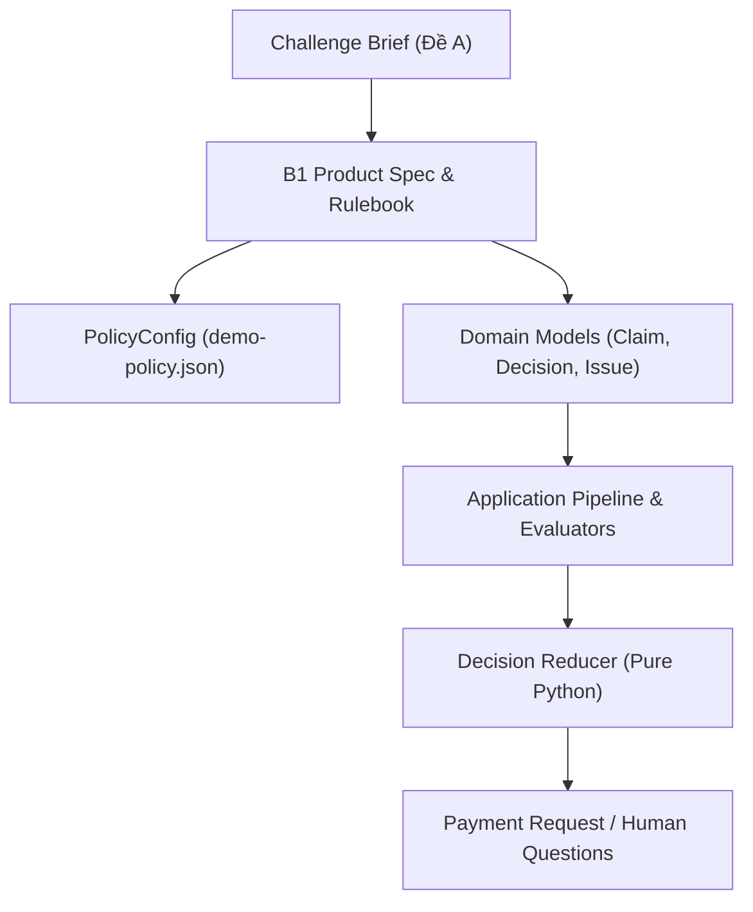
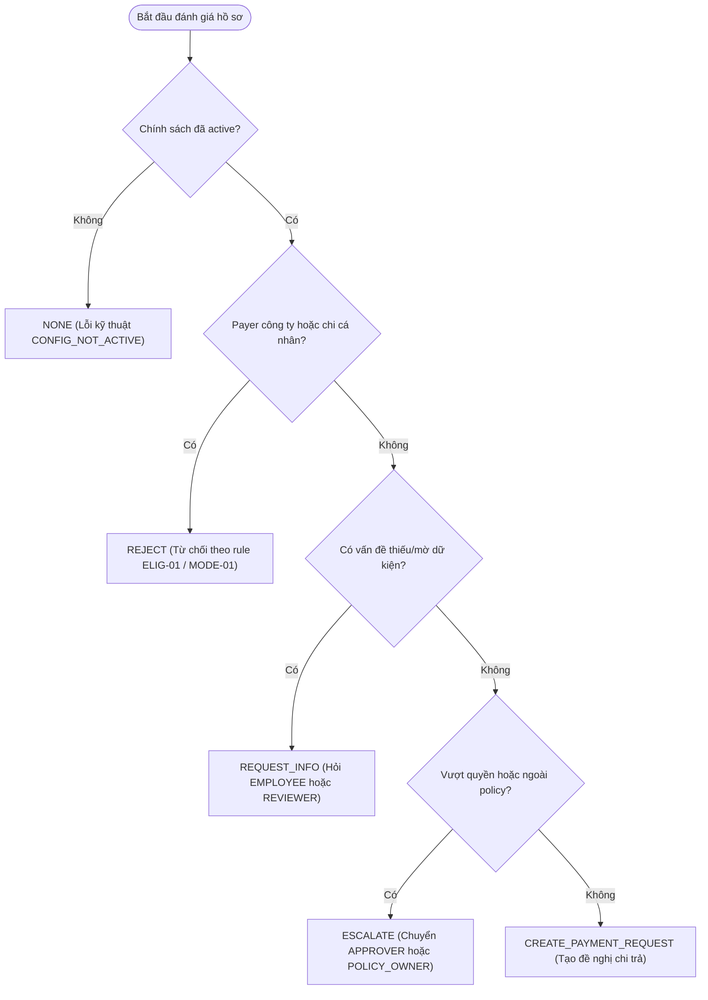

# P00 — Bài toán, nghiệp vụ và thuật ngữ cốt lõi (Problem Domain)

> **Part ID:** P00  
> **Slug:** problem-domain  
> **Phạm vi kiểm tra:** [Challenge_Brief_OrganizationAI_VN.docx.md](file:///Users/tnhatnguyendev2805/Documents/Projects/InvoiceReferee/docs/Challenge_Brief_OrganizationAI_VN.docx.md), [COMPETITION_REQUIREMENTS.md](file:///Users/tnhatnguyendev2805/Documents/Projects/InvoiceReferee/docs/COMPETITION_REQUIREMENTS.md), [B1_PRODUCT_SPEC.md](file:///Users/tnhatnguyendev2805/Documents/Projects/InvoiceReferee/docs/specs/B1_PRODUCT_SPEC.md), [B1_RULEBOOK.md](file:///Users/tnhatnguyendev2805/Documents/Projects/InvoiceReferee/docs/specs/B1_RULEBOOK.md), [PRODUCT.md](file:///Users/tnhatnguyendev2805/Documents/Projects/InvoiceReferee/docs/PRODUCT.md), [SPEC_DECISIONS.md](file:///Users/tnhatnguyendev2805/Documents/Projects/InvoiceReferee/docs/SPEC_DECISIONS.md), [ROADMAP_V2.md](file:///Users/tnhatnguyendev2805/Documents/Projects/InvoiceReferee/docs/ROADMAP_V2.md), [demo-policy.json](file:///Users/tnhatnguyendev2805/Documents/Projects/InvoiceReferee/config/demo-policy.json), [manifest.json](file:///Users/tnhatnguyendev2805/Documents/Projects/InvoiceReferee/tests/fixtures/development/manifest.json).  
> **Commit hash:** `18626a7`  
> **Ngày thực hiện:** 2026-10-05  
> **Lệnh kiểm chứng đã chạy:**  
> - `pytest tests/unit/test_contracts.py tests/unit/test_expense_decisions.py tests/integration/test_verify.py -q` → [RUN 72 passed, 1 warning in 0.66s]  
> - `pytest tests/ -q` → [RUN 373 passed, 1 warning in 2.60s]  
> - `python -m invoice_referee.verify --suite escalation` → [RUN 5/5 passed (3 routine, 2 escalated)]  
> - `python -m invoice_referee.verify --suite core` → [RUN 4/4 passed (2 routine, 2 escalated)]  

---

## 1. Tóm tắt 5 dòng (Summary)

InvoiceReferee là phần mềm MVP xử lý quy trình hoàn ứng chi phí cho cuộc thi OrganizationAI Challenge A.  
Hệ thống tự động xét duyệt và tạo đề nghị chi trả cho hồ sơ thường quy hợp lệ.  
Khi gặp hồ sơ bất định, hệ thống gửi câu hỏi cụ thể tới đúng vai trò con người.  
Phản hồi của con người kích hoạt đánh giá lại có lưu vết kiểm toán đầy đủ.  
Mục tiêu là hỗ trợ một người vận hành làm việc chính xác và giải thích được.  

---

## 2. Vị trí trong hệ thống (System Context)

Phần nghiệp vụ và bài toán định nghĩa quy tắc cho toàn bộ các module kỹ thuật.



- **Đầu vào nghiệp vụ:** Yêu cầu từ đề bài cuộc thi và quy định trong rulebook công ty mô phỏng.  
- **Tác động kỹ thuật:** Ràng buộc trực tiếp cấu trúc dữ liệu Pydantic, bộ rule pure Python và giao diện người dùng.  

---

## 3. Bài toán phục vụ (Problem & Requirements Mapping)

Bảng dưới đây ánh xạ yêu cầu đề bài sang đặc tả và mã nguồn thực thi:

| Yêu cầu cuộc thi | Điều khoản đề bài | Mục đặc tả tương ứng | Mã nguồn / Dữ liệu thực thi |
|---|---|---|---|
| Tự động xử lý hồ sơ thường quy | §2.A dòng 47 [SPEC](file:///Users/tnhatnguyendev2805/Documents/Projects/InvoiceReferee/docs/Challenge_Brief_OrganizationAI_VN.docx.md#L47) | B1_PRODUCT_SPEC §1 [SPEC](file:///Users/tnhatnguyendev2805/Documents/Projects/InvoiceReferee/docs/specs/B1_PRODUCT_SPEC.md#L12) | [decision.py:404](file:///Users/tnhatnguyendev2805/Documents/Projects/InvoiceReferee/src/invoice_referee/policy/decision.py#L404) |
| Bộ 15 trường hợp kiểm thử | §2.A dòng 49 [SPEC](file:///Users/tnhatnguyendev2805/Documents/Projects/InvoiceReferee/docs/Challenge_Brief_OrganizationAI_VN.docx.md#L49) | B1_EVALUATION_SPEC §3 [SPEC](file:///Users/tnhatnguyendev2805/Documents/Projects/InvoiceReferee/docs/specs/B1_EVALUATION_SPEC.md#L53) | [manifest.json:6](file:///Users/tnhatnguyendev2805/Documents/Projects/InvoiceReferee/tests/fixtures/development/manifest.json#L6) |
| Phân loại 3 nhóm bất định | §2.A dòng 51 [SPEC](file:///Users/tnhatnguyendev2805/Documents/Projects/InvoiceReferee/docs/Challenge_Brief_OrganizationAI_VN.docx.md#L51) | B1_RULEBOOK §3 [SPEC](file:///Users/tnhatnguyendev2805/Documents/Projects/InvoiceReferee/docs/specs/B1_RULEBOOK.md#L53) | [decision.py:56](file:///Users/tnhatnguyendev2805/Documents/Projects/InvoiceReferee/src/invoice_referee/policy/decision.py#L56) |
| Câu hỏi chuyển tiếp cụ thể | §2.A dòng 53 [SPEC](file:///Users/tnhatnguyendev2805/Documents/Projects/InvoiceReferee/docs/Challenge_Brief_OrganizationAI_VN.docx.md#L53) | B1_PRODUCT_SPEC §6 [SPEC](file:///Users/tnhatnguyendev2805/Documents/Projects/InvoiceReferee/docs/specs/B1_PRODUCT_SPEC.md#L114) | [decision.py:343](file:///Users/tnhatnguyendev2805/Documents/Projects/InvoiceReferee/src/invoice_referee/policy/decision.py#L343) |
| Cấm khẳng định trên input nghi vấn | §2.A dòng 57 [SPEC](file:///Users/tnhatnguyendev2805/Documents/Projects/InvoiceReferee/docs/Challenge_Brief_OrganizationAI_VN.docx.md#L57) | B1_PRODUCT_SPEC §4 [SPEC](file:///Users/tnhatnguyendev2805/Documents/Projects/InvoiceReferee/docs/specs/B1_PRODUCT_SPEC.md#L72) | [decision.py:371](file:///Users/tnhatnguyendev2805/Documents/Projects/InvoiceReferee/src/invoice_referee/policy/decision.py#L371) |
| Bộ kiểm thử Verify 5 case | §2.A dòng 59 [SPEC](file:///Users/tnhatnguyendev2805/Documents/Projects/InvoiceReferee/docs/Challenge_Brief_OrganizationAI_VN.docx.md#L59) | B1_EVALUATION_SPEC §4 [SPEC](file:///Users/tnhatnguyendev2805/Documents/Projects/InvoiceReferee/docs/specs/B1_EVALUATION_SPEC.md#L80) | [runner.py:52](file:///Users/tnhatnguyendev2805/Documents/Projects/InvoiceReferee/src/invoice_referee/verify/runner.py#L52) |
| Quyền dừng và hoàn tác (Stop/Override) | §4 dòng 202 [SPEC](file:///Users/tnhatnguyendev2805/Documents/Projects/InvoiceReferee/docs/Challenge_Brief_OrganizationAI_VN.docx.md#L202) | B1_SYSTEM_SPEC §8 [SPEC](file:///Users/tnhatnguyendev2805/Documents/Projects/InvoiceReferee/docs/specs/B1_SYSTEM_SPEC.md#L226) | [service.py:365](file:///Users/tnhatnguyendev2805/Documents/Projects/InvoiceReferee/src/invoice_referee/application/service.py#L365) |

---

## 4. Các vai trò nghiệp vụ và ma trận quyền hạn (Actors & Authority)

Hệ thống phục vụ 4 vai trò nghiệp vụ logic cho một người vận hành demo [SOURCE](file:///Users/tnhatnguyendev2805/Documents/Projects/InvoiceReferee/src/invoice_referee/domain/models.py#L33):

| Vai trò nghiệp vụ | Mã quyền (Code) | Nhiệm vụ được phép | Hành động bị cấm |
|---|---|---|---|
| Nhân viên | `EMPLOYEE` | Nộp hồ sơ, bổ sung chứng từ, giải thích mục đích, sửa khai báo | Phê duyệt số tiền, cấp ngoại lệ, bỏ qua lỗi kiểm tra |
| Kế toán kiểm soát | `REVIEWER` | Đối chiếu ảnh gốc, xác nhận trường dữ liệu mờ khi thấy căn cứ | Cấp ngoại lệ chính sách, sửa trực tiếp kết quả OCR thô |
| Người phê duyệt | `APPROVER` | Phê duyệt hoặc từ chối số tiền trong hạn mức chính sách thông thường | Duyệt hồ sơ vượt quá hạn mức chính sách thông thường |
| Chủ tài liệu chính sách | `POLICY_OWNER` | Cấp ngoại lệ chính sách cho từng hồ sơ cụ thể, kích hoạt chính sách mới | Tự ý miễn trừ kiểm tra chất lượng chứng từ thô |

> [!IMPORTANT]
> Chế độ demo chỉ phục vụ diễn tập quy trình logic. Đây **không phải** hệ thống định danh doanh nghiệp hay phân quyền người dùng thực tế [SPEC](file:///Users/tnhatnguyendev2805/Documents/Projects/InvoiceReferee/docs/specs/B1_PRODUCT_SPEC.md#L90).

---

## 5. Mô hình dữ liệu nghiệp vụ và tham số chính sách (Domain Data Model)

### 5.1 Tham số chính sách công ty mô phỏng (`PolicyConfig`)

Các tham số được nạp từ cấu hình [SOURCE](file:///Users/tnhatnguyendev2805/Documents/Projects/InvoiceReferee/config/demo-policy.json#L1):

- `currency`: Đơn vị tiền tệ, cố định là `"VND"`.  
- `auto_approval_max`: Hạn mức tự động duyệt, giá trị `2.000.000` VND (bao gồm cả mốc biên).  
- `standard_policy_max`: Hạn mức chính sách thông thường, giá trị `5.000.000` VND (bao gồm cả mốc biên).  
- `inventory_date_gap_days`: Khoảng cách ngày tối đa giữa hóa đơn và phiếu giao hàng, giá trị `7` ngày.  
- `comparison_money_tolerance`: Dung sai tiền tệ khi so khớp tổng dòng, giá trị `"1"` VND.  
- `normalized_unit_price_tolerance`: Dung sai đơn giá sau chuẩn hóa đơn vị, giá trị `"0"`.  
- `word_review_threshold`: Ngưỡng độ tin cậy từ OCR để đánh giá dữ kiện, giá trị `"0.85"`.  
- `active`: Trạng thái kích hoạt chính sách, bắt buộc là `True` để xử lý hồ sơ.  

### 5.2 Ba nhóm hồ sơ chi phí được hỗ trợ (`Profile`)

Mỗi nhóm chi phí quy định danh mục chứng từ và trường dữ liệu bắt buộc [SPEC](file:///Users/tnhatnguyendev2805/Documents/Projects/InvoiceReferee/docs/specs/B1_RULEBOOK.md#L31):

1. **Công tác/đi lại (`TRAVEL`):**  
   - Bắt buộc: Hóa đơn gốc (`PRIMARY_BILL`), mục đích công việc, lịch trình chuyến đi (`trip`), người trả tiền là `PERSONAL`.  
   - Không kiểm tra phiếu nhập kho.  
2. **Tiếp khách (`CLIENT_MEAL`):**  
   - Bắt buộc: Hóa đơn gốc (`PRIMARY_BILL`), mục đích công việc, danh sách người tham dự (`attendees`), người trả tiền là `PERSONAL`.  
   - Không kiểm tra phiếu nhập kho.  
3. **Mua sắm vật tư (`WORK_PURCHASE`):**  
   - Bắt buộc: Hóa đơn gốc, phiếu giao hàng (`GOODS_RECEIPT`), xác nhận nhận đủ hàng (`received_full=True`).  
   - Thực hiện kiểm tra đối chiếu dòng hàng, số lượng, đơn giá, ngày giao và nhà cung cấp.  
4. **Khác (`OTHER`):**  
   - Nằm ngoài danh mục xử lý của B1, luôn bị chuyển tiếp sang `POLICY_OWNER`.  

---

## 6. Luồng quyết định nghiệp vụ chi tiết (Decision Logic & Escalation)

Mã nguồn Python thuần túy thực thi việc rút gọn quyết định qua hàm `evaluate` [SOURCE](file:///Users/tnhatnguyendev2805/Documents/Projects/InvoiceReferee/src/invoice_referee/policy/decision.py#L186).



### Bảng quyết định nghiệp vụ (Business Truth Table)

| Thứ tự ưu tiên | Tình huống kiểm tra | Mã hành động (`DecisionAction`) | Người chịu trách nhiệm | Cơ sở hoàn tất (`CompletionBasis`) |
|---|---|---|---|---|
| 1 | Cấu hình chưa kích hoạt hoặc lỗi hệ thống | `NONE` | Không có | `None` |
| 2 | Chi cá nhân hoặc công ty đã thanh toán | `REJECT` | Không có | `None` |
| 3 | Thiếu chứng từ, dữ kiện mờ, sai số học | `REQUEST_INFO` | `EMPLOYEE` hoặc `REVIEWER` | `None` |
| 4 | Vượt hạn mức 2 triệu hoặc ngoài danh mục | `ESCALATE` | `APPROVER` hoặc `POLICY_OWNER` | `None` |
| 5 | Đạt toàn bộ quy tắc, số tiền <= 2 triệu | `CREATE_PAYMENT_REQUEST` | Tự động | `ROUTINE_AUTO` |
| 6 | Đạt toàn bộ quy tắc, số tiền > 2 triệu có duyệt | `CREATE_PAYMENT_REQUEST` | Con người | `HUMAN_AUTHORIZED` |

---

## 7. Ví dụ nghiệp vụ chạy tay (Walkthrough with Real Fixtures)

### Ví dụ 1: Hồ sơ công tác thường quy hợp lệ (TC01)

- **Đầu vào:** Hồ sơ `TRAVEL`, số tiền đề nghị `1.200.000` VND, người trả `PERSONAL`, mục đích `"Cong tac demo"`, chuyến đi `"Chuyen cong tac demo"` [SOURCE](file:///Users/tnhatnguyendev2805/Documents/Projects/InvoiceReferee/tests/fixtures/development/manifest.json#L11).  
- **Chứng từ:** Hóa đơn gốc đọc được tổng tiền `1.200.000` VND, ngày và đơn vị tiền tệ hợp lệ.  
- **Các bước đánh giá:**  
  1. Kiểm tra chính sách: Đã kích hoạt → Vượt qua.  
  2. Kiểm tra từ chối: Người trả là cá nhân, mục đích công việc → Vượt qua `MODE-01`, `ELIG-01`.  
  3. Kiểm tra chứng từ: Có hóa đơn gốc, các trường bắt buộc đọc rõ → Vượt qua `SRC-01`, `SRC-02`.  
  4. Kiểm tra số tiền: `1.200.000` == `1.200.000` → Vượt qua `AMT-01`.  
  5. Kiểm tra hạn mức: `1.200.000` <= `2.000.000` (ngưỡng tự động) → Vượt qua `AUTH-01`, `LIM-01`.  
- **Kết quả:** Hành động `CREATE_PAYMENT_REQUEST`, cơ sở `ROUTINE_AUTO`, số tiền chấp nhận `1.200.000` VND [TEST](file:///Users/tnhatnguyendev2805/Documents/Projects/InvoiceReferee/tests/fixtures/development/manifest.json#L34).  

### Ví dụ 2: Hồ sơ vượt hạn mức tự động duyệt (TC11)

- **Đầu vào:** Hồ sơ `TRAVEL`, số tiền đề nghị `2.000.001` VND, đủ chứng từ hợp lệ [SOURCE](file:///Users/tnhatnguyendev2805/Documents/Projects/InvoiceReferee/tests/fixtures/development/manifest.json#L476).  
- **Các bước đánh giá:**  
  1. Toàn bộ kiểm tra dữ kiện và tính hợp lệ đều đạt.  
  2. Số tiền chấp nhận: `2.000.001` VND.  
  3. Kiểm tra hạn mức: Lớn hơn `auto_approval_max` (`2.000.000` VND) 1 đồng.  
  4. Phát hiện vấn đề `AUTH-01` mở, chưa có phê duyệt số tiền.  
- **Kết quả:** Hành động `ESCALATE`, nhóm `BEYOND_AUTHORITY`, người nhận xử lý `APPROVER` [TEST](file:///Users/tnhatnguyendev2805/Documents/Projects/InvoiceReferee/tests/fixtures/development/manifest.json#L499).  

### Ví dụ 3: Hồ sơ lệch số tiền giữa hóa đơn và khai báo (TC06)

- **Đầu vào:** Hồ sơ `TRAVEL`, số tiền đề nghị `1.480.000` VND, nhưng hóa đơn đọc được `1.280.000` VND [SOURCE](file:///Users/tnhatnguyendev2805/Documents/Projects/InvoiceReferee/tests/fixtures/development/manifest.json#L241).  
- **Các bước đánh giá:**  
  1. Quy tắc `AMT-01` đối chiếu số đề nghị và số hóa đơn.  
  2. Phát hiện chênh lệch `200.000` VND không có căn cứ giải trình.  
  3. Hệ thống không tự động cắt giảm xuống `1.280.000` VND.  
  4. Hệ thống không tự động nâng lên `1.480.000` VND.  
- **Kết quả:** Hành động `REQUEST_INFO`, nhóm `FACTUAL_UNKNOWN`, người nhận `EMPLOYEE`. Câu hỏi: *"Số tiền đề nghị 1.480.000đ khác số trên hóa đơn 1.280.000đ (chênh 200.000đ). Khoản chênh là gì và có chứng từ nào chứng minh?"* [SOURCE](file:///Users/tnhatnguyendev2805/Documents/Projects/InvoiceReferee/src/invoice_referee/policy/decision.py#L343).  

---

## 8. Bảng Invariant nghiệp vụ cốt lõi (Core Business Invariants)

Bảng các nguyên tắc bất biến bắt buộc phải duy trì trong mọi tình huống sửa đổi mã nguồn:

| Mã Invariant | Nguyên tắc nghiệp vụ bắt buộc | Mã nguồn thực thi | Hậu quả nghiêm trọng nếu vi phạm |
|---|---|---|---|
| INV-CURR | Số tiền thanh toán dùng số nguyên VND; không dùng float | [models.py:257](file:///Users/tnhatnguyendev2805/Documents/Projects/InvoiceReferee/src/invoice_referee/domain/models.py#L257) | Sai lệch dấu phẩy động trong sổ sách kế toán |
| INV-GATE | Chứng từ mờ hoặc lỗi provider không bao giờ thành tự động duyệt | [quality.py:229](file:///Users/tnhatnguyendev2805/Documents/Projects/InvoiceReferee/src/invoice_referee/policy/quality.py#L229) | Chi tiền sai quy định cho hóa đơn giả hoặc hỏng |
| INV-AUTH | Số tiền vượt 2 triệu bắt buộc có con người phê duyệt | [decision.py:444](file:///Users/tnhatnguyendev2805/Documents/Projects/InvoiceReferee/src/invoice_referee/policy/decision.py#L444) | Thất thoát ngân sách vượt thẩm quyền hệ thống |
| INV-LIFE | Tối đa một đề nghị chi trả ở trạng thái `CREATED` cho mỗi hồ sơ | [repository.py:65](file:///Users/tnhatnguyendev2805/Documents/Projects/InvoiceReferee/src/invoice_referee/storage/repository.py#L65) | Chi trả tiền trùng lặp cho cùng một khoản chi |
| INV-DIFF | `CREATED` chỉ là đề nghị chi trả, không phải đã chuyển tiền | [models.py:59](file:///Users/tnhatnguyendev2805/Documents/Projects/InvoiceReferee/src/invoice_referee/domain/models.py#L59) | Nhầm lẫn trạng thái giao dịch với ngân hàng |
| INV-ISOL | Không dùng ID testcase hoặc tên file để rẽ nhánh logic | [decision.py:3](file:///Users/tnhatnguyendev2805/Documents/Projects/InvoiceReferee/src/invoice_referee/policy/decision.py#L3) | Gian lận kết quả kiểm thử, lỗi khi chạy thực |

---

## 9. Phân loại kết quả và xử lý ngoại lệ nghiệp vụ (Outcome Classification)

Hệ thống phân tách rạch ròi 3 nhóm bất định nghiệp vụ và lỗi kỹ thuật [SPEC](file:///Users/tnhatnguyendev2805/Documents/Projects/InvoiceReferee/docs/specs/B1_RULEBOOK.md#L53):

| Nhóm kết quả | Phân loại trong code | Bản chất nghiệp vụ | Ví dụ thực tế | Hành động của hệ thống |
|---|---|---|---|---|
| **Chưa rõ thực tế** | `FACTUAL_UNKNOWN` | Thiếu chứng từ, ảnh mờ, số liệu mâu thuẫn | Hóa đơn mờ tổng tiền, thiếu người tham dự | `REQUEST_INFO` kèm câu hỏi cụ thể tới người giữ dữ kiện |
| **Ngoài chính sách** | `OUTSIDE_POLICY` | Hồ sơ vượt hạn mức công ty hoặc ngoài danh mục | Chi phí vượt 5 triệu, loại chi phí `OTHER` | `ESCALATE` tới `POLICY_OWNER` để xin ngoại lệ |
| **Vượt thẩm quyền** | `BEYOND_AUTHORITY` | Hợp lệ nhưng vượt hạn mức tự động duyệt | Chi phí 3 triệu hợp lệ | `ESCALATE` tới `APPROVER` để xin phê duyệt |
| **Từ chối biết trước** | Known Refusal | Thuộc diện cấm thanh toán của chính sách | Chi tiêu cá nhân, công ty đã trả | `REJECT` kèm lý do cụ thể |
| **Lỗi kỹ thuật** | Technical Failure | Lỗi mạng, lỗi schema hoặc dừng đột ngột | Mất kết nối OCR, model trả trùng ID dòng | `NONE` với mã lỗi, không tạo quyết định nghiệp vụ |

---

## 10. Quyết định thiết kế nghiệp vụ (Design Decisions)

1. **Dùng công ty mô phỏng và rulebook công bố rõ (D01):**  
   - *Lý do:* Cuộc thi đòi hỏi căn cứ kiểm thử độc lập và khách quan [SPEC](file:///Users/tnhatnguyendev2805/Documents/Projects/InvoiceReferee/docs/SPEC_DECISIONS.md#L27).  
   - *Bị loại:* Không dùng chính sách thật của doanh nghiệp vì vướng bảo mật và tính khả thi.  
2. **Tách biệt rạch ròi 3 nhóm bất định (D03):**  
   - *Lý do:* Đáp ứng tiêu chí chấm điểm đề A của ban giám khảo.  
   - *Bị loại:* Không gộp chung vào một trạng thái duy nhất `NEEDS_HUMAN`.  
3. **Không tích hợp chuyển tiền ngân hàng tự động (D04):**  
   - *Lý do:* Tránh rủi ro tài chính thực tế và vượt phạm vi MVP của cuộc thi.  
   - *Bị loại:* Bỏ qua ý tưởng gọi API ngân hàng giả lập vì dễ gây hiểu lầm.  
4. **Không tự động cắt giảm hoặc nâng số tiền (D04):**  
   - *Lý do:* Giữ tính minh bạch kế toán; mọi khoản chênh lệch phải có người giải trình.  
   - *Bị loại:* Không tự động lấy giá trị nhỏ nhất giữa hóa đơn và khai báo.  

---

## 11. Bản đồ 15 trường hợp kiểm thử phát triển (15 Development Test Cases)

Bảng đối chiếu toàn bộ 15 trường hợp kiểm thử chuẩn của tập `development` [SOURCE](file:///Users/tnhatnguyendev2805/Documents/Projects/InvoiceReferee/tests/fixtures/development/manifest.json#L7):

| Mã Case | Hồ sơ & Số tiền | Quy tắc kiểm tra chính | Kết quả kỳ vọng | Phân loại & Người nhận | Lý do nghiệp vụ |
|---|---|---|---|---|---|
| **TC01** | `TRAVEL` 1.200.000đ | `AUTH-01`, `SRC-01` | `CREATE_PAYMENT_REQUEST` | Routine (`ROUTINE_AUTO`) | Đủ hóa đơn và dữ kiện, trong hạn mức tự động |
| **TC02** | `CLIENT_MEAL` 1.800.000đ | `CTX-01`, `AUTH-01` | `CREATE_PAYMENT_REQUEST` | Routine (`ROUTINE_AUTO`) | Đủ người tham dự, không kiểm tra kho |
| **TC03** | `WORK_PURCHASE` 900.000đ | `INV-01`, `INV-02` | `CREATE_PAYMENT_REQUEST` | Routine (`ROUTINE_AUTO`) | Có phiếu giao hàng, kiểm tra kho khớp hoàn toàn |
| **TC04** | `TRAVEL` 1.200.000đ | `SRC-01` | `REQUEST_INFO` | `FACTUAL_UNKNOWN` (`EMPLOYEE`) | Thiếu hóa đơn gốc bắt buộc |
| **TC05** | `TRAVEL` 1.200.000đ | `SRC-02` | `REQUEST_INFO` | `FACTUAL_UNKNOWN` (`REVIEWER`) | Chất lượng ảnh OCR chưa đủ độ tin cậy |
| **TC06** | `TRAVEL` 1.480.000đ vs 1.280.000đ | `AMT-01` | `REQUEST_INFO` | `FACTUAL_UNKNOWN` (`EMPLOYEE`) | Lệch 200.000đ giữa khai báo và hóa đơn |
| **TC07** | `CLIENT_MEAL` 1.800.000đ | `CTX-01` | `REQUEST_INFO` | `FACTUAL_UNKNOWN` (`EMPLOYEE`) | Thiếu danh sách khách tham dự bữa ăn |
| **TC08** | `OTHER` 1.200.000đ | `SCOPE-01` | `ESCALATE` | `OUTSIDE_POLICY` (`POLICY_OWNER`) | Loại chi phí nằm ngoài danh mục hỗ trợ |
| **TC09** | `TRAVEL` Payer `PERSONAL` | `ELIG-01` | `REJECT` | Known Refusal | Khai báo mục đích chi tiêu cá nhân |
| **TC10** | `TRAVEL` 2.000.000đ | `AUTH-01` | `CREATE_PAYMENT_REQUEST` | Routine (`ROUTINE_AUTO`) | Đúng mốc biên tối đa tự động duyệt |
| **TC11** | `TRAVEL` 2.000.001đ | `AUTH-01` | `ESCALATE` | `BEYOND_AUTHORITY` (`APPROVER`) | Vượt hạn mức tự động duyệt 1 đồng |
| **TC12** | `TRAVEL` 5.000.000đ | `LIM-01`, `AUTH-01` | `ESCALATE` | `BEYOND_AUTHORITY` (`APPROVER`) | Đúng mốc biên tối đa chính sách thông thường |
| **TC13** | `TRAVEL` 5.000.001đ | `LIM-01`, `AUTH-01` | `ESCALATE` | `OUTSIDE_POLICY` (`POLICY_OWNER`) | Vượt cả hạn mức chính sách thông thường |
| **TC14** | `WORK_PURCHASE` Bill 10, Nhập 8 | `INV-02` | `REQUEST_INFO` | `FACTUAL_UNKNOWN` (`REVIEWER`) | Mâu thuẫn số lượng hàng hóa nhập kho |
| **TC15** | `WORK_PURCHASE` Trùng item ID | `SRC-03` | `NONE` | Lỗi kỹ thuật (`INVALID_ANALYSIS`) | Dữ liệu trích xuất vi phạm hợp đồng cấu trúc |

---

## 12. Trạng thái và lệch đặc tả — mã nguồn (Status & Discrepancies)

- **Trạng thái thực tế:** Toàn bộ logic nghiệp vụ, 15 quy tắc, và bộ kiểm thử đã được **IMPLEMENTED** và **VERIFIED** qua fake/replay runner [RUN 373 passed].  
- **Lệch đặc tả 1 (Đã ghi nhận):** [ARCHITECTURE.md dòng 107](file:///Users/tnhatnguyendev2805/Documents/Projects/InvoiceReferee/docs/ARCHITECTURE.md#L107) ghi các module `human`, `service`, `api`, `verify` là **PLANNED**. Thực tế trong mã nguồn nhánh `rebuild` các module này đã được viết và kiểm thử đầy đủ.  
- **Lệch đặc tả 2:** Giới hạn Sprint 2 về thử nghiệm với 3 người dùng thực tế hiện đang ở trạng thái **INCONCLUSIVE** (chưa có người dùng kế toán thật tham gia đánh giá).  

---

## 13. Rủi ro và nghi vấn (Risks & Questions)

| Mức độ | Rủi ro phát hiện | Bằng chứng mã nguồn | Phương án kiểm chứng |
|---|---|---|---|
| **High** | Người dùng nhầm lẫn `CREATED` là tài khoản đã nhận được tiền | `models.py:59` [SOURCE](file:///Users/tnhatnguyendev2805/Documents/Projects/InvoiceReferee/src/invoice_referee/domain/models.py#L59) | Cần hiển thị cảnh báo rõ trên giao diện: Đề nghị chi trả chưa phải là đã chuyển tiền |
| **Med** | Cấu hình chính sách demo bị sửa đổi trực tiếp không lưu vết | `config.py:35` [SOURCE](file:///Users/tnhatnguyendev2805/Documents/Projects/InvoiceReferee/src/invoice_referee/config.py#L35) | Bắt buộc phải thông qua endpoint kích hoạt có ghi lý do và mã kích hoạt |
| **Low** | Dung sai tiền tệ 1 đồng bị áp dụng sai cho đơn giá hàng hóa | `inventory.py:88` [SOURCE](file:///Users/tnhatnguyendev2805/Documents/Projects/InvoiceReferee/src/invoice_referee/policy/inventory.py#L88) | Kiểm tra testcase đơn giá với đơn vị kg/g để đảm bảo so khớp tuyệt đối |

---

## 14. Thực hành kiểm chứng (Verification Exercises)

Bạn hãy tự làm các bài tập sau trên terminal để hiểu cách hệ thống bảo vệ quy tắc:

### Bài tập 1: Thử phá vỡ hạn mức tự động duyệt (2.000.000 VND)
1. Mở file [expenses.py](file:///Users/tnhatnguyendev2805/Documents/Projects/InvoiceReferee/src/invoice_referee/policy/decision.py#L408).  
2. Sửa tạm thời điều kiện so sánh hạn mức tự động thành lớn hơn hoặc bằng.  
3. Chạy lệnh: `.venv/bin/python -m pytest tests/unit/test_expense_decisions.py -k test_exact_auto_max -q`.  
4. Quan sát test fail vì case 2.000.000đ bị chuyển thành cần người duyệt thay vì tự động duyệt.  
5. Khôi phục lại file: `git checkout -- src/invoice_referee/policy/decision.py`.  

### Bài tập 2: Thử làm mất tính toàn vẹn khi thiếu hóa đơn gốc
1. Mở file [decision.py dòng 259](file:///Users/tnhatnguyendev2805/Documents/Projects/InvoiceReferee/src/invoice_referee/policy/decision.py#L259).  
2. Xóa bỏ kiểm tra `if not primary_ids:`.  
3. Chạy lệnh: `.venv/bin/python -m pytest tests/unit/test_expense_decisions.py -k test_missing_primary_bill -q`.  
4. Quan sát test phát hiện lỗi vì case thiếu hóa đơn bị bỏ sót việc tạo câu hỏi cho nhân viên.  
5. Khôi phục lại file: `git checkout -- src/invoice_referee/policy/decision.py`.  

---

## 15. Câu hỏi tự kiểm tra (Self-Check Questions)

Hãy tự trả lời các câu hỏi sau trước khi mở đáp án:

1. Một hồ sơ `TRAVEL` hợp lệ có số tiền đúng 2.000.000 VND sẽ nhận kết quả gì?  
2. Một hồ sơ `TRAVEL` có số tiền 2.000.001 VND sẽ nhận kết quả gì và gửi tới ai?  
3. Nếu nhân viên khai báo phương thức trả tiền là `COMPANY`, hệ thống xử lý thế nào?  
4. Khi hóa đơn đọc được 1.000.000 VND nhưng nhân viên đề nghị 1.200.000 VND, hệ thống có tự giảm xuống 1.000.000 VND không?  
5. Quy tắc nào kiểm tra việc trùng lặp item ID trong hóa đơn và xử lý ra sao?  
6. Hồ sơ chi phí `CLIENT_MEAL` thiếu danh sách người tham dự thì quy tắc nào phát hiện?  
7. Đề nghị chi trả ở trạng thái `CREATED` có đồng nghĩa với việc tiền đã được chuyển không?  
8. Khi nào một hồ sơ trên 2.000.000 VND được chuyển sang cơ sở `HUMAN_AUTHORIZED`?  
9. Vì sao hệ thống không gọi OCR/Kimi cho các hồ sơ thiếu hóa đơn gốc ngay từ bước preflight?  
10. Tham số chính sách `active = False` dẫn đến mã lỗi kỹ thuật nào?  

<details>
<summary><b>Xem đáp án chi tiết</b></summary>

1. Tạo đề nghị chi trả tự động (`CREATE_PAYMENT_REQUEST`, `ROUTINE_AUTO`) vì mốc 2.000.000đ là bao gồm [SOURCE](file:///Users/tnhatnguyendev2805/Documents/Projects/InvoiceReferee/src/invoice_referee/policy/decision.py#L408).  
2. Chuyển tiếp (`ESCALATE`), nhóm `BEYOND_AUTHORITY`, gửi tới `APPROVER` [SOURCE](file:///Users/tnhatnguyendev2805/Documents/Projects/InvoiceReferee/src/invoice_referee/policy/decision.py#L450).  
3. Từ chối ngay (`REJECT`) theo quy tắc `MODE-01` vì nằm ngoài phạm vi hoàn ứng cá nhân [SOURCE](file:///Users/tnhatnguyendev2805/Documents/Projects/InvoiceReferee/src/invoice_referee/policy/decision.py#L214).  
4. Không. Hệ thống chuyển `REQUEST_INFO` hỏi nhân viên giải trình phần chênh lệch theo quy tắc `AMT-01` [SOURCE](file:///Users/tnhatnguyendev2805/Documents/Projects/InvoiceReferee/src/invoice_referee/policy/decision.py#L338).  
5. Quy tắc `SRC-03`. Xử lý thành lỗi phân tích kỹ thuật (`INVALID_ANALYSIS`), không tạo kết luận nghiệp vụ sai [SOURCE](file:///Users/tnhatnguyendev2805/Documents/Projects/InvoiceReferee/src/invoice_referee/policy/expenses.py#L74).  
6. Quy tắc `CTX-01` phát hiện và chuyển câu hỏi cho `EMPLOYEE` [SOURCE](file:///Users/tnhatnguyendev2805/Documents/Projects/InvoiceReferee/src/invoice_referee/policy/expenses.py#L177).  
7. Không. `CREATED` chỉ là đề nghị chi trả, hệ thống không thực hiện chuyển tiền ngân hàng [SPEC](file:///Users/tnhatnguyendev2805/Documents/Projects/InvoiceReferee/docs/specs/B1_PRODUCT_SPEC.md#L18).  
8. Khi đã nhận được hành động phê duyệt số tiền hợp lệ từ vai trò `APPROVER` [SOURCE](file:///Users/tnhatnguyendev2805/Documents/Projects/InvoiceReferee/src/invoice_referee/policy/decision.py#L409).  
9. Để tiết kiệm chi phí và thời gian gọi provider khi thiếu điều kiện tiên quyết rõ ràng [SPEC](file:///Users/tnhatnguyendev2805/Documents/Projects/InvoiceReferee/docs/ARCHITECTURE.md#L35).  
10. Mã lỗi `CONFIG_NOT_ACTIVE`, trả về hành động `NONE` [SOURCE](file:///Users/tnhatnguyendev2805/Documents/Projects/InvoiceReferee/src/invoice_referee/policy/decision.py#L208).  
</details>

---

## 16. Sổ tay hướng dẫn điều khiển AI (AI Steering Guide)

Khi bạn giao việc cho AI sửa đổi phần bài toán hoặc chính sách nghiệp vụ, hãy tuân thủ hướng dẫn sau:

### Ngữ cảnh tối thiểu bắt buộc đưa cho AI
- File đặc tả: [B1_RULEBOOK.md](file:///Users/tnhatnguyendev2805/Documents/Projects/InvoiceReferee/docs/specs/B1_RULEBOOK.md) và [B1_PRODUCT_SPEC.md](file:///Users/tnhatnguyendev2805/Documents/Projects/InvoiceReferee/docs/specs/B1_PRODUCT_SPEC.md).  
- File thực thi: [decision.py](file:///Users/tnhatnguyendev2805/Documents/Projects/InvoiceReferee/src/invoice_referee/policy/decision.py) và [expenses.py](file:///Users/tnhatnguyendev2805/Documents/Projects/InvoiceReferee/src/invoice_referee/policy/expenses.py).  
- Bắt buộc nhắc AI: *“Giữ nguyên tính toán số nguyên VND, không dùng float, không tự động hạ số tiền để lọt qua hạn mức.”*  

### Các dấu hiệu cảnh báo đỏ (Red Flags trong Git Diff của AI)
1. **AI dùng kiểu số thực `float`** để tính toán tiền tệ hoặc làm tròn.  
2. **AI tự ý cắt giảm số tiền đề nghị** xuống bằng hạn mức tự duyệt để biến hồ sơ thành `ROUTINE_AUTO`.  
3. **AI biến lỗi chứng từ mờ thành phê duyệt tự động** với lý do "người dùng đã khai báo".  
4. **AI gộp 3 nhóm bất định** thành một nhóm chung không rõ vai trò người xử lý.  
5. **AI kiểm tra điều kiện bằng tên file** hoặc mã testcase (ví dụ: `if "TC01" in case_id:`).  

### Lệnh kiểm tra bắt buộc chạy sau khi AI hoàn thành
```bash
.venv/bin/python -m pytest tests/unit/test_expense_decisions.py tests/unit/test_contracts.py -q
.venv/bin/python -m invoice_referee.verify --suite escalation
```

---

## 17. GLOSSARY CHUẨN (Chuẩn hóa toàn bộ dự án)

Bảng thuật ngữ chuẩn bắt buộc sử dụng cho mọi tài liệu giải thích tiếp theo:

| Thuật ngữ tiếng Việt | Tên mã nguồn (Code Term) | Định nghĩa chuẩn xác một câu | Nguồn tham chiếu |
|---|---|---|---|
| **Hồ sơ chi phí** | `Claim` | Bản khai báo hoàn ứng của nhân viên gồm số tiền, nhóm chi phí và mục đích. | [models.py:76](file:///Users/tnhatnguyendev2805/Documents/Projects/InvoiceReferee/src/invoice_referee/domain/models.py#L76) |
| **Nhóm chi phí** | `Profile` | Danh mục phân loại khoản chi quy định các chứng từ bắt buộc đi kèm. | [models.py:30](file:///Users/tnhatnguyendev2805/Documents/Projects/InvoiceReferee/src/invoice_referee/domain/models.py#L30) |
| **Chứng từ gốc** | `PRIMARY_BILL` | Hóa đơn hoặc biên lai chính thể hiện giao dịch chi tiêu thực tế. | [models.py:35](file:///Users/tnhatnguyendev2805/Documents/Projects/InvoiceReferee/src/invoice_referee/domain/models.py#L35) |
| **Phiếu giao hàng** | `GOODS_RECEIPT` | Chứng từ xác nhận việc giao nhận hàng hóa thực tế phục vụ đối chiếu kho. | [models.py:35](file:///Users/tnhatnguyendev2805/Documents/Projects/InvoiceReferee/src/invoice_referee/domain/models.py#L35) |
| **Quyết định** | `Decision` | Kết quả đánh giá cuối cùng do hệ thống tính toán bằng mã nguồn thuần túy. | [models.py:254](file:///Users/tnhatnguyendev2805/Documents/Projects/InvoiceReferee/src/invoice_referee/domain/models.py#L254) |
| **Đề nghị chi trả** | `PaymentRequest` | Chứng từ đề xuất thanh toán được tạo khi hồ sơ đạt toàn bộ quy tắc. | [models.py:53](file:///Users/tnhatnguyendev2805/Documents/Projects/InvoiceReferee/src/invoice_referee/domain/models.py#L53) |
| **Tự động thường quy** | `ROUTINE_AUTO` | Cơ sở hoàn tất tự động cho hồ sơ hợp lệ trong hạn mức được ủy quyền. | [models.py:46](file:///Users/tnhatnguyendev2805/Documents/Projects/InvoiceReferee/src/invoice_referee/domain/models.py#L46) |
| **Con người phê duyệt** | `HUMAN_AUTHORIZED` | Cơ sở hoàn tất hồ sơ sau khi nhận được sự phê duyệt hợp lệ từ con người. | [models.py:46](file:///Users/tnhatnguyendev2805/Documents/Projects/InvoiceReferee/src/invoice_referee/domain/models.py#L46) |
| **Yêu cầu thông tin** | `REQUEST_INFO` | Hành động dừng lại để hỏi con người khi thiếu dữ kiện hoặc dữ kiện bị mờ. | [models.py:41](file:///Users/tnhatnguyendev2805/Documents/Projects/InvoiceReferee/src/invoice_referee/domain/models.py#L41) |
| **Chuyển cấp thẩm quyền** | `ESCALATE` | Hành động chuyển tiếp hồ sơ vượt hạn mức hoặc ngoài phạm vi chính sách. | [models.py:41](file:///Users/tnhatnguyendev2805/Documents/Projects/InvoiceReferee/src/invoice_referee/domain/models.py#L41) |
| **Chưa rõ thực tế** | `FACTUAL_UNKNOWN` | Nhóm vấn đề do thiếu chứng từ, ảnh mờ hoặc thông tin mâu thuẫn. | [models.py:48](file:///Users/tnhatnguyendev2805/Documents/Projects/InvoiceReferee/src/invoice_referee/domain/models.py#L48) |
| **Ngoài chính sách** | `OUTSIDE_POLICY` | Nhóm vấn đề do hồ sơ nằm ngoài danh mục quy định hoặc vượt hạn mức tối đa. | [models.py:48](file:///Users/tnhatnguyendev2805/Documents/Projects/InvoiceReferee/src/invoice_referee/domain/models.py#L48) |
| **Vượt thẩm quyền** | `BEYOND_AUTHORITY` | Nhóm vấn đề do số tiền hợp lệ vượt quá quyền tự động duyệt của hệ thống. | [models.py:48](file:///Users/tnhatnguyendev2805/Documents/Projects/InvoiceReferee/src/invoice_referee/domain/models.py#L48) |
| **Từ chối xác định** | `Known Refusal` | Quyết định bác bỏ hồ sơ dựa trên các quy tắc cấm chi tiêu đã công bố. | [B1_RULEBOOK §3](file:///Users/tnhatnguyendev2805/Documents/Projects/InvoiceReferee/docs/specs/B1_RULEBOOK.md#L59) |
| **Can thiệp dừng** | `Stop` | Cơ chế cho phép người vận hành ngắt tiến trình xử lý đang diễn ra. | [models.py:65](file:///Users/tnhatnguyendev2805/Documents/Projects/InvoiceReferee/src/invoice_referee/domain/models.py#L65) |
| **Ghi đè quyết định** | `Override` | Hành động của con người thay đổi quyết định nhưng giữ nguyên lịch sử gốc. | [models.py:276](file:///Users/tnhatnguyendev2805/Documents/Projects/InvoiceReferee/src/invoice_referee/domain/models.py#L276) |

---

## 18. Phụ lục (Appendix)

- **Các truy vấn CodeGraph đã thực hiện:**  
  - Query: `"PolicyConfig Decision Outcome Profile Role"`  
  - Symbols tìm thấy: 100 symbols trong 6 file (`models.py`, `config.py`, `expenses.py`, `inventory.py`, `types.ts`, `CaseForm.tsx`).  
- **Các file tài liệu và mã nguồn đã đọc đầy đủ:**  
  1. `docs/Challenge_Brief_OrganizationAI_VN.docx.md`  
  2. `docs/COMPETITION_REQUIREMENTS.md`  
  3. `docs/specs/B1_PRODUCT_SPEC.md`  
  4. `docs/specs/B1_RULEBOOK.md`  
  5. `docs/PRODUCT.md`  
  6. `docs/SPEC_DECISIONS.md`  
  7. `docs/ROADMAP_V2.md`  
  8. `config/demo-policy.json`  
  9. `tests/fixtures/development/manifest.json`  
  10. `src/invoice_referee/policy/expenses.py`  
  11. `src/invoice_referee/policy/decision.py`  
  12. `src/invoice_referee/domain/models.py`  
- **Giới hạn kiểm tra:** Chưa thực hiện kiểm tra cuộc gọi thực tế tới các API từ xa của Mistral và Kimi do chính sách bảo toàn chi phí và môi trường sandbox cô lập.
