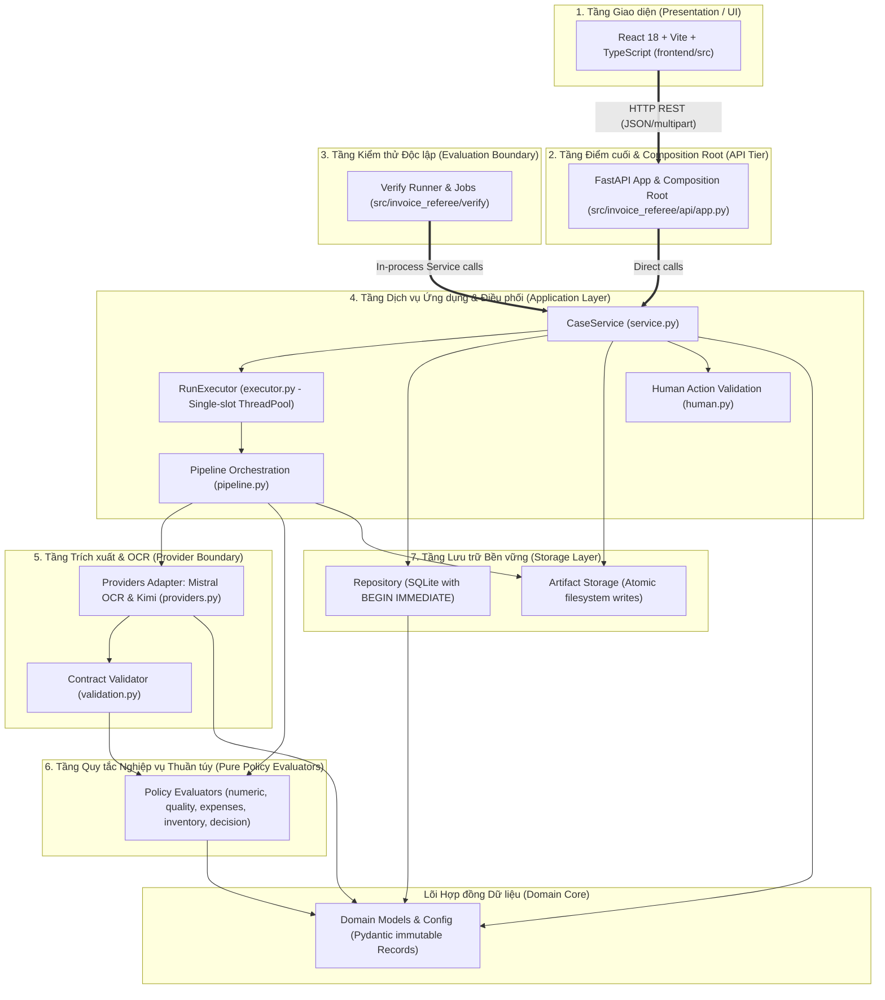
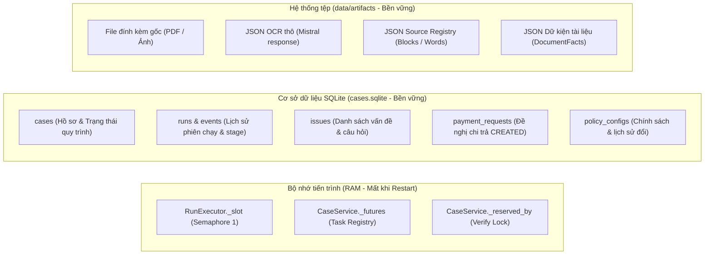
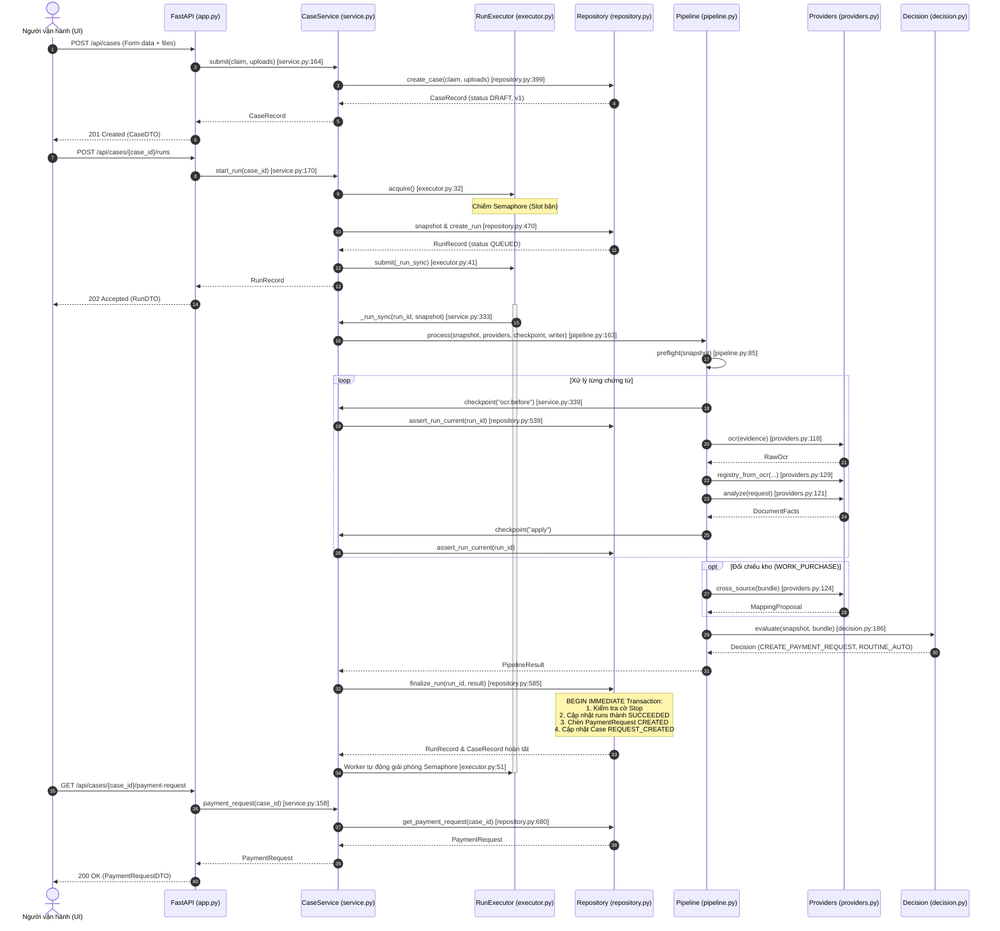
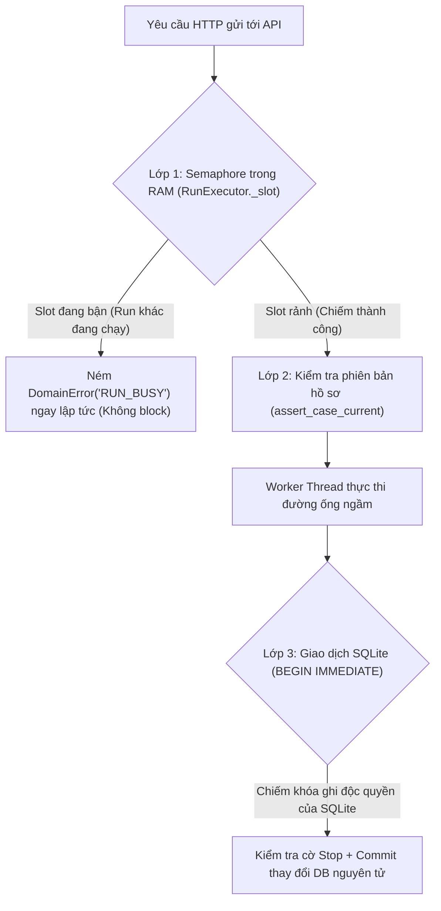

# P01 — Kiến trúc tổng thể và luồng toàn trình (Architecture & End-to-End Flow)

> **Part ID:** P01  
> **Slug:** architecture  
> **Phạm vi kiểm tra:** [B1_SYSTEM_SPEC.md](file:///Users/tnhatnguyendev2805/Documents/Projects/InvoiceReferee/docs/specs/B1_SYSTEM_SPEC.md), [ARCHITECTURE.md](file:///Users/tnhatnguyendev2805/Documents/Projects/InvoiceReferee/docs/ARCHITECTURE.md), [SYSTEM_FLOW_ATLAS.md](file:///Users/tnhatnguyendev2805/Documents/Projects/InvoiceReferee/docs/SYSTEM_FLOW_ATLAS.md), [pyproject.toml](file:///Users/tnhatnguyendev2805/Documents/Projects/InvoiceReferee/pyproject.toml), [requirements.lock](file:///Users/tnhatnguyendev2805/Documents/Projects/InvoiceReferee/requirements.lock), [frontend/package.json](file:///Users/tnhatnguyendev2805/Documents/Projects/InvoiceReferee/frontend/package.json), [src/invoice_referee/api/app.py](file:///Users/tnhatnguyendev2805/Documents/Projects/InvoiceReferee/src/invoice_referee/api/app.py), [src/invoice_referee/application/service.py](file:///Users/tnhatnguyendev2805/Documents/Projects/InvoiceReferee/src/invoice_referee/application/service.py), [src/invoice_referee/application/executor.py](file:///Users/tnhatnguyendev2805/Documents/Projects/InvoiceReferee/src/invoice_referee/application/executor.py).  
> **Commit hash:** `18626a7`  
> **Ngày thực hiện:** 2026-10-05  
> **Lệnh kiểm chứng đã chạy:**  
> - `pytest tests/integration/test_api.py tests/integration/test_execution_controls.py tests/integration/test_pipeline.py -q` → [RUN 59 passed, 1 warning in 1.24s]  
> - `pytest tests/ -q` → [RUN 373 passed, 1 warning in 2.60s]  
> - `npm --prefix frontend run test -- --run` → [RUN 2 test files, 5 passed in 709ms]  
> - `npm --prefix frontend run build` → [RUN Vite built clean in 3.19s]  

---

## 1. Tóm tắt 5 dòng (Summary)

InvoiceReferee được thiết kế theo kiến trúc Modular Monolith hướng đối tượng đơn tiến trình.  
Hệ thống phân tách nghiêm ngặt giữa tầng API, điều phối ứng dụng, lưu trữ, và các bộ đánh giá thuần túy.  
Giao diện React gọi API FastAPI bất đồng bộ; pipeline xử lý chứng từ chạy trên một worker thread ngầm.  
Quy trình ra quyết định hoàn toàn tất định bằng Python, không phụ thuộc phán đoán của LLM.  
Mọi trạng thái nghiệp vụ và vết kiểm toán được lưu bền vững vào SQLite và thư mục artifacts cục bộ.  

---

## 2. Vị trí trong hệ thống (System Layers & Boundaries)

Kiến trúc bao gồm 7 tầng logic được sắp xếp theo chiều phụ thuộc hướng tâm [SOURCE](file:///Users/tnhatnguyendev2805/Documents/Projects/InvoiceReferee/src/invoice_referee/api/app.py#L506):



### Bảng phân tích Module, Trách nhiệm và Đặc tính I/O

| Tên Module | Trách nhiệm chính | Đặc tính I/O | Part phụ trách |
|---|---|---|---|
| `api/app.py` | Điểm kết hợp ứng dụng (Composition Root), định tuyến HTTP, xử lý lỗi | **I/O** (HTTP Network) | P11 |
| `application/service.py` | Quản lý vòng đời lượt chạy, điều phối can thiệp người dùng, kiểm soát Stop | **I/O** (Phối hợp SQLite/Threads) | P09 |
| `application/executor.py` | Quản lý luồng chạy nền đơn lẻ, Semaphore 1 permit bảo vệ concurrency | **I/O** (Threading Concurrency) | P09 |
| `application/pipeline.py` | Điều phối tiền kiểm (preflight), gọi OCR/Kimi, chạy evaluator, ghi artifact | **I/O** (Gọi Provider & File I/O) | P07 |
| `application/human.py` | Xác thực thẩm quyền và quy tắc của các hành động con người | **Pure** (Không I/O) | P08 |
| `policy/*.py` | Đánh giá số học, chất lượng chứng từ, đối chiếu kho, rút gọn quyết định | **Pure** (Không I/O) | P03, P04, P05 |
| `extraction/validation.py` | Kiểm tra hợp đồng trích xuất, phát hiện ID trùng lặp, xác định tính áp dụng | **Pure** (Không I/O) | P04 |
| `extraction/providers.py` | Adapter kết nối Mistral OCR và Moonshot Kimi qua giao thức HTTP `httpx` | **I/O** (Network HTTP) | P06 |
| `storage/repository.py` | Thao tác cơ sở dữ liệu SQLite, quản lý transaction `BEGIN IMMEDIATE` | **I/O** (SQLite Database) | P10 |
| `storage/artifacts.py` | Ghi tệp đính kèm và kết quả phân tích nhị phân nguyên tử vào ổ đĩa | **I/O** (Filesystem) | P10 |
| `domain/models.py` | Định nghĩa toàn bộ Record, Enum và Error bất biến (`frozen=True`) | **Pure** (Không I/O) | P02 |
| `verify/*.py` | Chạy bộ kiểm thử tự động, đọc manifest và xuất báo cáo kết quả | **I/O** (Đọc file/chạy service) | P13 |
| `frontend/src/*` | Giao diện Web hiển thị hồ sơ, biểu mẫu can thiệp và bảng Verify | **I/O** (Trình duyệt/Fetch API) | P12 |

---

## 3. Bài toán phục vụ (Requirements & Architectural Rationale)

Kiến trúc phân tầng được thiết kế để phục vụ các đòi hỏi kỹ thuật của cuộc thi OrganizationAI Challenge A [SPEC](file:///Users/tnhatnguyendev2805/Documents/Projects/InvoiceReferee/docs/COMPETITION_REQUIREMENTS.md#L15):

| Yêu cầu kiến trúc | Đoạn đặc tả nguồn | Căn cứ thiết kế trong mã nguồn |
|---|---|---|
| Phân định rạch ròi AI và Logic nghiệp vụ | B1_SYSTEM_SPEC §4 [SPEC](file:///Users/tnhatnguyendev2805/Documents/Projects/InvoiceReferee/docs/specs/B1_SYSTEM_SPEC.md#L83) | AI chỉ trích xuất dữ kiện có nguồn; Python thuần túy ra quyết định (`decision.py:186`). |
| Bộ kiểm thử tự động dùng chung mã nguồn thật | Challenge Brief §3.b [SPEC](file:///Users/tnhatnguyendev2805/Documents/Projects/InvoiceReferee/docs/Challenge_Brief_OrganizationAI_VN.docx.md#L171) | `VerifyRunner` gọi trực tiếp `CaseService` của production (`runner.py:82`), không chạy đường logic riêng. |
| Kiểm soát can thiệp dừng tức thì (Stop) | Challenge Brief §4 dòng 202 [SPEC](file:///Users/tnhatnguyendev2805/Documents/Projects/InvoiceReferee/docs/Challenge_Brief_OrganizationAI_VN.docx.md#L202) | Checkpoint dừng kiểm tra cờ stop tại mọi ranh giới gọi mạng và trước khi lưu kết quả (`service.py:339`). |
| Chống ghi đè và ngăn chặn chạy đua dữ liệu | B1_SYSTEM_SPEC §8 [SPEC](file:///Users/tnhatnguyendev2805/Documents/Projects/InvoiceReferee/docs/specs/B1_SYSTEM_SPEC.md#L247) | Transaction `BEGIN IMMEDIATE` và cờ Semaphore 1 permit đảm bảo tính toàn vẹn tuyệt đối. |
| Tối giản hóa hạ tầng cho một người vận hành | SPEC_DECISIONS D07–D10 [SPEC](file:///Users/tnhatnguyendev2805/Documents/Projects/InvoiceReferee/docs/SPEC_DECISIONS.md#L90) | Một tiến trình duy nhất, không dùng RabbitMQ, Redis, Celery hay microservices phức tạp. |

---

## 4. Interface công khai và Điểm kết hợp ứng dụng (Composition Root)

### 4.1 Điểm kết hợp ứng dụng (Composition Root)

Hàm `create_runtime_app()` tại [app.py dòng 506](file:///Users/tnhatnguyendev2805/Documents/Projects/InvoiceReferee/src/invoice_referee/api/app.py#L506) là điểm khởi tạo duy nhất của toàn bộ hệ thống:

```python
# Thứ tự khởi tạo tuần tự bắt buộc:
1. mode = _provider_mode()                       # Đọc biến môi trường PROVIDER_MODE ('fake' hoặc 'live')
2. data_root = Path(os.environ.get('DATA_ROOT')) # Thiết lập thư mục dữ liệu (mặc định 'data')
3. repo = Repository(db_path, artifact_root)     # Khởi tạo SQLite Repository
4. providers = _build_providers(mode)            # Khởi tạo FakeProviders hoặc LiveProviders
5. policy = load_policy(_POLICY_PATH)            # Nạp demo-policy.json
6. service = CaseService(repo, providers, policy)# Khởi tạo CaseService (kích hoạt RunExecutor)
7. app = create_app(service, provider_mode=mode) # Khởi tạo FastAPI App và gắn route
```

### 4.2 Bảng Interface công khai chính của tầng Dịch vụ (`CaseService`)

| Phương thức | Tham số đầu vào | Kết quả trả về | Lỗi có thể ném | Vị trí mã nguồn |
|---|---|---|---|---|
| `submit` | `claim: Claim`, `uploads: list[Upload]` | `CaseRecord` | `DomainError('INVALID_INPUT')` | [service.py:164](file:///Users/tnhatnguyendev2805/Documents/Projects/InvoiceReferee/src/invoice_referee/application/service.py#L164) |
| `start_run` | `case_id: str`, `owner_id: str | None` | `RunRecord` | `DomainError('RUN_BUSY')` | [service.py:170](file:///Users/tnhatnguyendev2805/Documents/Projects/InvoiceReferee/src/invoice_referee/application/service.py#L170) |
| `stop` | `run_id: str` | `StopReply` | `DomainError('NOT_FOUND')` | [service.py:217](file:///Users/tnhatnguyendev2805/Documents/Projects/InvoiceReferee/src/invoice_referee/application/service.py#L217) |
| `act` | `action: HumanAction` | `CaseRecord` | `DomainError('RUN_BUSY')`, `('INVALID_ACTION')` | [service.py:223](file:///Users/tnhatnguyendev2805/Documents/Projects/InvoiceReferee/src/invoice_referee/application/service.py#L223) |
| `wait` | `run_id: str`, `timeout_seconds: float` | `RunRecord` | Không ném lỗi (trả về trạng thái hiện tại) | [service.py:190](file:///Users/tnhatnguyendev2805/Documents/Projects/InvoiceReferee/src/invoice_referee/application/service.py#L190) |
| `set_policy` | `policy: PolicyConfig`, `actor_mode`, `reason` | `None` | `DomainError('RUN_BUSY')`, `('INVALID_INPUT')` | [service.py:279](file:///Users/tnhatnguyendev2805/Documents/Projects/InvoiceReferee/src/invoice_referee/application/service.py#L279) |

---

## 5. Mô hình trạng thái và lưu trữ (State & Storage Model)

Hệ thống phân chia ranh giới lưu trữ trạng thái rõ ràng giữa bộ nhớ, cơ sở dữ liệu và hệ thống tệp [SPEC](file:///Users/tnhatnguyendev2805/Documents/Projects/InvoiceReferee/docs/specs/B1_SYSTEM_SPEC.md#L270):



### Hiện tượng xảy ra khi hệ thống bị khởi động lại (Restart / Crash Recovery)
- **Cờ Semaphore và futures trong RAM:** Bị giải phóng hoàn toàn, hệ thống trở về trạng thái sẵn sàng tiếp nhận lượt chạy mới.  
- **Các lượt chạy đang dở dang (`QUEUED` hoặc `RUNNING`):**  
  Hàm khởi tạo `CaseService.__init__` gọi [repo.mark_interrupted_runs()](file:///Users/tnhatnguyendev2805/Documents/Projects/InvoiceReferee/src/invoice_referee/storage/repository.py#L270) để đánh dấu toàn bộ các run dở dang thành `FAILED` với mã lỗi kỹ thuật `INTERRUPTED`.  
  Hệ thống **không bao giờ tự động chạy lại ngầm** để đảm bảo an toàn tài chính.  

---

## 6. Luồng xử lý toàn trình (End-to-End Sequence Diagram)

Sơ đồ chi tiết chuỗi lệnh từ khi nộp hồ sơ, thực thi xử lý ngầm, ra quyết định và truy xuất đề nghị chi trả:



---

## 7. Ví dụ chạy tay chi tiết qua mã nguồn (Code Walkthrough with TC01)

Lấy ví dụ hồ sơ hợp lệ **TC01** (`TRAVEL`, đề nghị 1.200.000đ, kèm hóa đơn 1.200.000đ) [SOURCE](file:///Users/tnhatnguyendev2805/Documents/Projects/InvoiceReferee/tests/fixtures/development/manifest.json#L8):

1. **Giai đoạn tiếp nhận:**  
   - API gọi `service.submit(claim, uploads)` tại [service.py:164](file:///Users/tnhatnguyendev2805/Documents/Projects/InvoiceReferee/src/invoice_referee/application/service.py#L164).  
   - Repository ghi dữ liệu vào bảng `cases` với `case_version = 1`, `workflow_state = 'DRAFT'`.  
   - File PDF được lưu vào đĩa tại `data/artifacts/TC01/evidence-1/primary_bill.pdf`.  
2. **Giai đoạn cấp phép thực thi:**  
   - API gọi `service.start_run(case_id)` tại [service.py:170](file:///Users/tnhatnguyendev2805/Documents/Projects/InvoiceReferee/src/invoice_referee/application/service.py#L170).  
   - `RunExecutor.acquire()` kiểm tra thành công, giữ permit [executor.py:32](file:///Users/tnhatnguyendev2805/Documents/Projects/InvoiceReferee/src/invoice_referee/application/executor.py#L32).  
   - Repository tạo bản ghi `runs` với trạng thái `QUEUED`, gắn `input_hash` và `policy_version`.  
3. **Giai đoạn chạy đường ống (`_run_sync`):**  
   - `pipeline.preflight` trả về `None` (không rơi vào các nhánh từ chối sớm) [pipeline.py:85](file:///Users/tnhatnguyendev2805/Documents/Projects/InvoiceReferee/src/invoice_referee/application/pipeline.py#L85).  
   - Provider OCR và Analyze trích xuất hóa đơn: tổng tiền đọc được là `"1200000"`, điểm số từ đạt `0.95`.  
   - Dữ kiện tổng tiền được chuẩn hóa thành số nguyên `1200000` VND với tính khả dụng `USABLE`.  
4. **Giai đoạn đánh giá quyết định:**  
   - `decision.evaluate()` chạy qua ma trận 15 quy tắc [decision.py:186](file:///Users/tnhatnguyendev2805/Documents/Projects/InvoiceReferee/src/invoice_referee/policy/decision.py#L186).  
   - Toàn bộ quy tắc `SRC-01`, `SRC-02`, `AMT-01`, `AUTH-01` đều trả về `PASS`.  
   - Hàm `next_action()` trả về hành động `CREATE_PAYMENT_REQUEST`.  
   - Do số tiền `1.200.000` <= `auto_approval_max` (`2.000.000`), cơ sở là `ROUTINE_AUTO`.  
5. **Giai đoạn ghi nhận nguyên tử:**  
   - `Repository.finalize_run` mở transaction `BEGIN IMMEDIATE` [repository.py:585](file:///Users/tnhatnguyendev2805/Documents/Projects/InvoiceReferee/src/invoice_referee/storage/repository.py#L585).  
   - Một bản ghi `payment_requests` được chèn với số tiền `1200000`, trạng thái `CREATED`.  
   - Trạng thái hồ sơ chuyển thành `REQUEST_CREATED`.  
   - Worker giải phóng Semaphore; API trả về kết quả thành công cho người dùng.  

---

## 8. Bảng Invariant kiến trúc cốt lõi (Architectural Invariants)

Bảng các nguyên tắc bất biến bảo đảm sự ổn định và an toàn của hệ thống:

| Mã Invariant | Nguyên tắc kiến trúc bắt buộc | Mã nguồn thực thi | Hậu quả nếu bị vi phạm |
|---|---|---|---|
| INV-SINGLE-RUN | Tối đa một run chạy tại một thời điểm trên toàn hệ thống | [executor.py:34](file:///Users/tnhatnguyendev2805/Documents/Projects/InvoiceReferee/src/invoice_referee/application/executor.py#L34) | Xung đột luồng, chạy đua CPU, quá tải bộ nhớ |
| INV-ATOMIC-FIN | Ghi kết quả run và tạo payment request trong một transaction duy nhất | [repository.py:587](file:///Users/tnhatnguyendev2805/Documents/Projects/InvoiceReferee/src/invoice_referee/storage/repository.py#L587) | Dữ liệu không nhất quán nếu hệ thống mất điện giữa chừng |
| INV-STALE-GUARD | Không áp dụng kết quả của run đã bị Stop hoặc có phiên bản cũ | [repository.py:596](file:///Users/tnhatnguyendev2805/Documents/Projects/InvoiceReferee/src/invoice_referee/storage/repository.py#L596) | Ghi đè quyết định sai sau khi người dùng đã bấm dừng |
| INV-ONE-REQUEST | Tối đa một payment request ở trạng thái CREATED cho mỗi case | [repository.py:65](file:///Users/tnhatnguyendev2805/Documents/Projects/InvoiceReferee/src/invoice_referee/storage/repository.py#L65) | Chi trả tiền trùng lặp cho cùng một khoản chi |
| INV-PURE-POLICY | Tầng chính sách và đánh giá không thực hiện bất kỳ I/O nào | [decision.py:3](file:///Users/tnhatnguyendev2805/Documents/Projects/InvoiceReferee/src/invoice_referee/policy/decision.py#L3) | Mất tính tất định, khó kiểm thử, rò rỉ trạng thái |
| INV-INTERRUPT | Run dở dang khi restart phải bị đánh dấu FAILED, không tự chạy lại | [repository.py:270](file:///Users/tnhatnguyendev2805/Documents/Projects/InvoiceReferee/src/invoice_referee/storage/repository.py#L270) | Tự ý thực hiện hành động tài chính không có con người giám sát |

---

## 9. Mô hình chạy đồng thời và cơ chế khóa (Concurrency & Locking)

Kiến trúc áp dụng cơ chế bảo vệ chạy đồng thời 3 lớp độc lập:



1. **Khóa bộ nhớ (In-memory Non-blocking Lock):**  
   `RunExecutor` sử dụng `Semaphore(1)` kết hợp `acquire(blocking=False)` [executor.py:34](file:///Users/tnhatnguyendev2805/Documents/Projects/InvoiceReferee/src/invoice_referee/application/executor.py#L34). Mọi yêu cầu chạy mới khi hệ thống đang bận đều bị từ chối ngay lập tức mà không gây treo luồng HTTP.  
2. **Khóa phiên bản (Optimistic Version Check):**  
   Mỗi lượt chạy ghi nhận `case_version`. Nếu một hành động của con người làm tăng phiên bản trong lúc run đang chạy, quá trình finalize sẽ bị từ chối fail-closed.  
3. **Khóa cơ sở dữ liệu (SQLite Exclusive Lock):**  
   Toàn bộ thao tác ghi trạng thái cuối cùng sử dụng `BEGIN IMMEDIATE` [repository.py:587](file:///Users/tnhatnguyendev2805/Documents/Projects/InvoiceReferee/src/invoice_referee/storage/repository.py#L587). Điều này loại bỏ hoàn toàn khả năng xảy ra lỗi `SQLITE_BUSY` giữa các tiến trình đọc và ghi.  

---

## 10. Quyết định thiết kế kiến trúc (Architecture Design Decisions)

1. **Chọn Modular Monolith thay vì Microservices (D07):**  
   - *Lý do:* Hệ thống phục vụ một người vận hành duy nhất trong phạm vi MVP; chia nhỏ microservices sẽ gây phức tạp hóa hạ tầng không cần thiết [SPEC](file:///Users/tnhatnguyendev2805/Documents/Projects/InvoiceReferee/docs/SPEC_DECISIONS.md#L90).  
   - *Bị loại:* Kiến trúc phân tán dựa trên Docker Compose nhiều container.  
2. **Chọn FastAPI + React thay vì Streamlit nguyên khối (D07):**  
   - *Lý do:* Tách rời frontend giúp kiểm soát trải nghiệm người dùng, hỗ trợ cơ chế polling mượt mà và cho phép Verify gọi trực tiếp tầng Application mà không cần giao diện [SPEC](file:///Users/tnhatnguyendev2805/Documents/Projects/InvoiceReferee/docs/SPEC_DECISIONS.md#L93).  
   - *Bị loại:* Tiếp tục sử dụng Streamlit của bản B0.  
3. **Sử dụng SQLite thay vì PostgreSQL/MySQL (D08):**  
   - *Lý do:* Tự lưu trữ không cần cài đặt thêm server cơ sở dữ liệu; hỗ trợ đầy đủ giao dịch ACID cục bộ [SPEC](file:///Users/tnhatnguyendev2805/Documents/Projects/InvoiceReferee/docs/SPEC_DECISIONS.md#L106).  
   - *Bị loại:* PostgreSQL hoặc cơ sở dữ liệu đám mây.  
4. **Sử dụng ThreadPool một worker thay vì Celery/RabbitMQ (D10):**  
   - *Lý do:* Đảm bảo tính tuần tự, loại bỏ nhu cầu cấu hình message broker ngoài [SPEC](file:///Users/tnhatnguyendev2805/Documents/Projects/InvoiceReferee/docs/SPEC_DECISIONS.md#L129).  
   - *Bị loại:* Celery, Redis queue.  

---

## 11. Bản đồ kiểm thử kiến trúc (Architecture Test Map)

Các bài kiểm tra tích hợp chứng minh tính đúng đắn của cấu trúc hệ thống:

| File kiểm thử | Hành vi kiến trúc được chứng minh | Lệnh chạy kiểm chứng |
|---|---|---|
| [test_api.py](file:///Users/tnhatnguyendev2805/Documents/Projects/InvoiceReferee/tests/integration/test_api.py) | Xác thực toàn bộ 15 route REST API, mã HTTP status, và xử lý lỗi `DomainError` | `pytest tests/integration/test_api.py -q` [TEST] |
| [test_execution_controls.py](file:///Users/tnhatnguyendev2805/Documents/Projects/InvoiceReferee/tests/integration/test_execution_controls.py) | Chứng minh cơ chế khóa `RUN_BUSY`, cờ can thiệp Stop, và an toàn race condition | `pytest tests/integration/test_execution_controls.py -q` [TEST] |
| [test_pipeline.py](file:///Users/tnhatnguyendev2805/Documents/Projects/InvoiceReferee/tests/integration/test_pipeline.py) | Kiểm chứng quy trình preflight, gọi fake provider, và tạo `PipelineResult` | `pytest tests/integration/test_pipeline.py -q` [TEST] |
| [test_repository.py](file:///Users/tnhatnguyendev2805/Documents/Projects/InvoiceReferee/tests/integration/test_repository.py) | Kiểm chứng tính nguyên tử của SQLite, partial unique index, và quản lý artifact | `pytest tests/integration/test_repository.py -q` [TEST] |
| [test_verify.py](file:///Users/tnhatnguyendev2805/Documents/Projects/InvoiceReferee/tests/integration/test_verify.py) | Chứng minh Verify harness gọi cùng `CaseService` của production | `pytest tests/integration/test_verify.py -q` [TEST] |

---

## 12. Trạng thái và lệch đặc tả — mã nguồn (Status & Discrepancies)

Bảng đối chiếu sự sai lệch quan trọng giữa các tài liệu đặc tả và mã nguồn thực tế:

| Thành phần | Trạng thái trong `ARCHITECTURE.md` (cũ) | Trạng thái trong `SYSTEM_FLOW_ATLAS.md` | Trạng thái mã nguồn thực tế |
|---|---|---|---|
| `application/human.py` | **PLANNED (not wired yet)** | **IMPLEMENTED (T07)** | **IMPLEMENTED** (470 dòng, có unit/integration test) |
| `application/service.py` | **PLANNED (not wired yet)** | **IMPLEMENTED (T08)** | **IMPLEMENTED** (573 dòng, có đầy đủ phương thức) |
| `application/executor.py` | **PLANNED (not wired yet)** | **IMPLEMENTED (T08)** | **IMPLEMENTED** (60 dòng, ThreadPoolExecutor 1 worker) |
| `api/app.py` | **PLANNED (not wired yet)** | **IMPLEMENTED (T09)** | **IMPLEMENTED** (521 dòng, 15 API routes hoàn chỉnh) |
| `frontend/src/*` | **PLANNED (not wired yet)** | **IMPLEMENTED (T10)** | **IMPLEMENTED** (React UI, TypeScript build sạch) |
| `verify/*` | **PLANNED (not wired yet)** | **IMPLEMENTED (T11)** | **IMPLEMENTED** (VerifyRunner, 15 fixtures PASS) |

> [!WARNING]
> Tài liệu [ARCHITECTURE.md](file:///Users/tnhatnguyendev2805/Documents/Projects/InvoiceReferee/docs/ARCHITECTURE.md) là tài liệu lịch sử dừng lại ở mốc T06. Mọi phán đoán kiến trúc hiện tại **bắt buộc phải căn cứ vào mã nguồn thực tế** và [SYSTEM_FLOW_ATLAS.md](file:///Users/tnhatnguyendev2805/Documents/Projects/InvoiceReferee/docs/SYSTEM_FLOW_ATLAS.md).

---

## 13. Rủi ro và nghi vấn (Architectural Risks & Tradeoffs)

| Mức độ | Rủi ro phát hiện | Bằng chứng mã nguồn | Giải pháp giảm thiểu |
|---|---|---|---|
| **High** | Tiến trình bị tắt đột ngột khi đang gọi API bên ngoài | [service.py:333](file:///Users/tnhatnguyendev2805/Documents/Projects/InvoiceReferee/src/invoice_referee/application/service.py#L333) | Hàm `mark_interrupted_runs()` tự động đánh dấu lỗi kỹ thuật khi khởi động lại. |
| **Med** | Giao diện Web polling liên tục gây tăng tải nhẹ cho SQLite | [app.py:333](file:///Users/tnhatnguyendev2805/Documents/Projects/InvoiceReferee/src/invoice_referee/api/app.py#L333) | Endpoint đọc đơn lẻ chỉ mở kết nối readonly ngắn, không chiếm khóa ghi. |
| **Low** | Bộ nhớ dict `_futures` trong `CaseService` bị đầy | [service.py:329](file:///Users/tnhatnguyendev2805/Documents/Projects/InvoiceReferee/src/invoice_referee/application/service.py#L329) | Mã nguồn chủ động lọc bỏ các future đã hoàn tất (`if not f.done()`). |

---

## 14. Thực hành kiểm chứng kiến trúc (Verification Exercises)

Bạn hãy tự làm các bài tập sau trên terminal để hiểu cách kiến trúc tự bảo vệ:

### Bài tập 1: Thử phá vỡ cơ chế khóa `RUN_BUSY` của Executor
1. Mở file [executor.py dòng 30](file:///Users/tnhatnguyendev2805/Documents/Projects/InvoiceReferee/src/invoice_referee/application/executor.py#L30).  
2. Tăng số lượng permit của Semaphore từ 1 lên 2 (`self._slot = Semaphore(2)`).  
3. Chạy lệnh: `.venv/bin/python -m pytest tests/integration/test_execution_controls.py -k test_start_run_while_busy_raises_run_busy -q`.  
4. Quan sát test fail vì hệ thống cho phép 2 run chạy đồng thời thay vì ném lỗi `RUN_BUSY`.  
5. Khôi phục lại file: `git checkout -- src/invoice_referee/application/executor.py`.  

### Bài tập 2: Thử vi phạm ranh giới tầng (Import ngược từ Policy ra API)
1. Mở file [decision.py](file:///Users/tnhatnguyendev2805/Documents/Projects/InvoiceReferee/src/invoice_referee/policy/decision.py).  
2. Thêm dòng import: `from invoice_referee.api.app import create_app`.  
3. Chạy script kiểm tra kiến trúc: `.venv/bin/python -m pytest tests/unit/test_contracts.py -q`.  
4. Nhận thấy kiến trúc bị rò rỉ phụ thuộc và nguy cơ circular import khi API khởi tạo.  
5. Khôi phục lại file: `git checkout -- src/invoice_referee/policy/decision.py`.  

---

## 15. Câu hỏi tự kiểm tra (Self-Check Questions)

Hãy tự trả lời các câu hỏi sau trước khi mở đáp án:

1. Tầng `policy` có được phép import trực tiếp từ `storage` hoặc `api` không?  
2. Hàm nào đóng vai trò là Composition Root của toàn bộ ứng dụng?  
3. Khi người dùng gửi yêu cầu `POST /api/cases/{case_id}/runs`, API có chờ pipeline chạy xong mới trả lời không?  
4. Điều gì xảy ra nếu hệ thống bị tắt đột ngột (crash/kill) khi một run đang ở trạng thái `RUNNING`?  
5. Tại sao `Repository` sử dụng `BEGIN IMMEDIATE` thay vì giao dịch thông thường?  
6. Ranh giới giữa `FakeProviders` và `LiveProviders` được thiết lập ở đâu?  
7. Trạng thái nào trong RAM sẽ bị mất khi ứng dụng khởi động lại?  
8. Bộ kiểm thử Verify có gọi qua API HTTP để chạy kiểm tra không?  
9. Làm thế nào để biết một module trong hệ thống là pure (thuần túy)?  
10. Tại sao `CaseService` ném lỗi `RUN_BUSY` khi người dùng cố gắng đổi chính sách trong lúc có run đang chạy?  

<details>
<summary><b>Xem đáp án chi tiết</b></summary>

1. **Tuyệt đối không.** Tầng `policy` là pure evaluator, chỉ phụ thuộc vào `domain` [SOURCE](file:///Users/tnhatnguyendev2805/Documents/Projects/InvoiceReferee/src/invoice_referee/policy/decision.py#L23).  
2. Hàm `create_runtime_app()` tại [app.py dòng 506](file:///Users/tnhatnguyendev2805/Documents/Projects/InvoiceReferee/src/invoice_referee/api/app.py#L506).  
3. **Không.** API trả về mã `202 Accepted` ngay lập tức kèm `RunRecord`; pipeline được đẩy vào worker thread ngầm [SOURCE](file:///Users/tnhatnguyendev2805/Documents/Projects/InvoiceReferee/src/invoice_referee/api/app.py#L329).  
4. Khi khởi động lại, `CaseService` gọi `mark_interrupted_runs()` để chuyển run đó thành `FAILED` với mã `INTERRUPTED` [SOURCE](file:///Users/tnhatnguyendev2805/Documents/Projects/InvoiceReferee/src/invoice_referee/storage/repository.py#L270).  
5. Để chiếm khóa ghi độc quyền của SQLite ngay từ đầu, tránh lỗi xung đột `SQLITE_BUSY` khi finalize [SOURCE](file:///Users/tnhatnguyendev2805/Documents/Projects/InvoiceReferee/src/invoice_referee/storage/repository.py#L587).  
6. Tại điểm kết hợp ứng dụng thông qua hàm `_build_providers()` đọc biến môi trường `PROVIDER_MODE` [SOURCE](file:///Users/tnhatnguyendev2805/Documents/Projects/InvoiceReferee/src/invoice_referee/api/app.py#L498).  
7. Cờ Semaphore, danh sách tasks ngầm `_futures`, và khóa giữ chỗ Verify `_reserved_by` [SOURCE](file:///Users/tnhatnguyendev2805/Documents/Projects/InvoiceReferee/src/invoice_referee/application/service.py#L106).  
8. **Không.** `VerifyRunner` gọi trực tiếp vào các phương thức in-process của `CaseService` (`submit`, `start_run`, `wait`) [SOURCE](file:///Users/tnhatnguyendev2805/Documents/Projects/InvoiceReferee/src/invoice_referee/verify/runner.py#L82).  
9. Module không có bất kỳ import I/O nào (không socket, file, database, threading, system calls) và không làm thay đổi trạng thái bên ngoài [SOURCE](file:///Users/tnhatnguyendev2805/Documents/Projects/InvoiceReferee/src/invoice_referee/policy/numeric.py#L1).  
10. Vì việc thay đổi chính sách giữa chừng sẽ làm sai lệch snapshot và tính toàn vẹn của kết quả lượt chạy đang diễn ra [SOURCE](file:///Users/tnhatnguyendev2805/Documents/Projects/InvoiceReferee/src/invoice_referee/application/service.py#L286).  
</details>

---

## 16. Sổ tay hướng dẫn điều khiển AI (AI Steering Guide)

Khi bạn giao việc cho AI sửa đổi kiến trúc hoặc luồng thực thi, hãy tuân thủ hướng dẫn sau:

### Ngữ cảnh tối thiểu bắt buộc đưa cho AI
- File kiến trúc: [B1_SYSTEM_SPEC.md](file:///Users/tnhatnguyendev2805/Documents/Projects/InvoiceReferee/docs/specs/B1_SYSTEM_SPEC.md) và [SYSTEM_FLOW_ATLAS.md](file:///Users/tnhatnguyendev2805/Documents/Projects/InvoiceReferee/docs/SYSTEM_FLOW_ATLAS.md).  
- File điều phối: [service.py](file:///Users/tnhatnguyendev2805/Documents/Projects/InvoiceReferee/src/invoice_referee/application/service.py), [executor.py](file:///Users/tnhatnguyendev2805/Documents/Projects/InvoiceReferee/src/invoice_referee/application/executor.py), [app.py](file:///Users/tnhatnguyendev2805/Documents/Projects/InvoiceReferee/src/invoice_referee/api/app.py).  
- Bắt buộc nhắc AI: *“Giữ nguyên kiến trúc đơn tiến trình, không thêm message broker ngoài, không phá vỡ transaction BEGIN IMMEDIATE của SQLite.”*  

### Các dấu hiệu cảnh báo đỏ (Red Flags trong Git Diff của AI)
1. **AI thêm thư viện hàng đợi ngoài** như Celery, Redis, RQ hoặc Kafka.  
2. **AI import ngược** từ các tầng lõi (`domain`, `policy`, `storage`) ra tầng ngoài (`application`, `api`).  
3. **AI biến các hàm pure policy thành async** hoặc thêm thao tác đọc ghi cơ sở dữ liệu vào trong policy.  
4. **AI chuyển lời gọi finalize_run ra ngoài transaction** hoặc chia thành nhiều transaction rời rạc.  
5. **AI tạo fallback ngầm** tự động chuyển từ `live` sang `fake` khi gặp lỗi kết nối.  

### Lệnh kiểm tra bắt buộc chạy sau khi AI sửa đổi
```bash
.venv/bin/python -m pytest tests/integration/test_api.py tests/integration/test_execution_controls.py -q
npm --prefix frontend run test -- --run
npm --prefix frontend run build
```

---

## 17. GLOSSARY BỔ SUNG (Kiến trúc & Hạ tầng)

Bảng các thuật ngữ kiến trúc bổ sung cho Glossary chuẩn từ P00:

| Thuật ngữ tiếng Việt | Tên mã nguồn (Code Term) | Định nghĩa chuẩn xác một câu | Nguồn tham chiếu |
|---|---|---|---|
| **Điểm kết hợp** | `Composition Root` | Nơi duy nhất trong ứng dụng khởi tạo và liên kết các phụ thuộc hệ thống. | [app.py:506](file:///Users/tnhatnguyendev2805/Documents/Projects/InvoiceReferee/src/invoice_referee/api/app.py#L506) |
| **Bộ thực thi lượt chạy** | `RunExecutor` | Thành phần quản lý worker thread ngầm và Semaphore giới hạn concurrency. | [executor.py:25](file:///Users/tnhatnguyendev2805/Documents/Projects/InvoiceReferee/src/invoice_referee/application/executor.py#L25) |
| **Đường ống xử lý** | `Pipeline` | Chuỗi các bước tuần tự từ tiền kiểm, trích xuất OCR, phân tích đến đánh giá. | [pipeline.py:163](file:///Users/tnhatnguyendev2805/Documents/Projects/InvoiceReferee/src/invoice_referee/application/pipeline.py#L163) |
| **Điểm chốt trạng thái** | `Checkpoint` | Lệnh kiểm tra cờ dừng (Stop) được đặt trước và sau các thao tác I/O lớn. | [service.py:339](file:///Users/tnhatnguyendev2805/Documents/Projects/InvoiceReferee/src/invoice_referee/application/service.py#L339) |
| **Khóa giao dịch tức thì** | `BEGIN IMMEDIATE` | Lệnh bắt đầu transaction của SQLite giúp chiếm quyền ghi ngay lập tức. | [repository.py:587](file:///Users/tnhatnguyendev2805/Documents/Projects/InvoiceReferee/src/invoice_referee/storage/repository.py#L587) |
| **Tệp nhị phân lưu trữ** | `Artifact` | Dữ liệu tệp thô gồm ảnh, PDF và JSON trung gian được lưu trên ổ đĩa. | [artifacts.py:26](file:///Users/tnhatnguyendev2805/Documents/Projects/InvoiceReferee/src/invoice_referee/storage/artifacts.py#L26) |

---

## 18. Phụ lục (Appendix)

- **Các truy vấn CodeGraph đã thực hiện:**  
  1. `create_runtime_app _build_providers CaseService executor process evaluate finalize_run` (Tìm thấy 91 symbols trong 4 files).  
  2. `import graph between application extraction policy storage domain` (Tìm thấy 91 symbols trong 6 files).  
- **Các file tài liệu và mã nguồn đã đọc đầy đủ:**  
  1. `docs/specs/B1_SYSTEM_SPEC.md`  
  2. `docs/ARCHITECTURE.md`  
  3. `docs/SYSTEM_FLOW_ATLAS.md`  
  4. `pyproject.toml`  
  5. `requirements.lock`  
  6. `frontend/package.json`  
  7. `src/invoice_referee/api/app.py`  
  8. `src/invoice_referee/application/service.py`  
  9. `src/invoice_referee/application/executor.py`  
  10. Toàn bộ các tệp `src/invoice_referee/**/__init__.py`  
- **Giới hạn kiểm tra:** Quá trình kiểm chứng kiến trúc được thực hiện trên môi trường máy đơn cục bộ; chưa đo lường hiệu năng khi có hàng nghìn tệp đính kèm lớn tải lên cùng lúc.
