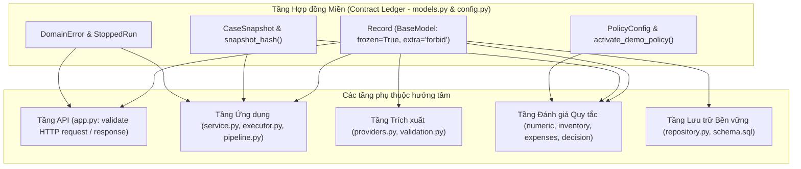
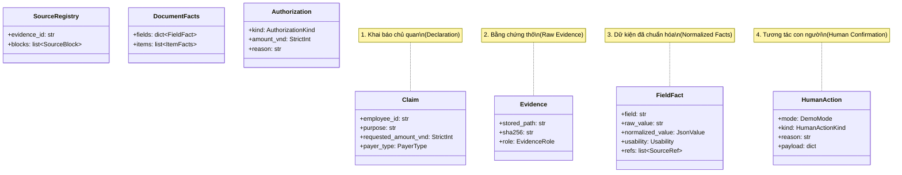

# P02 — Hợp đồng miền và cấu hình chính sách (Domain Contracts & Policy Configuration)

> **Part ID:** P02  
> **Slug:** domain-contracts  
> **Phạm vi kiểm tra:** [src/invoice_referee/domain/models.py](file:///Users/tnhatnguyendev2805/Documents/Projects/InvoiceReferee/src/invoice_referee/domain/models.py), [src/invoice_referee/config.py](file:///Users/tnhatnguyendev2805/Documents/Projects/InvoiceReferee/src/invoice_referee/config.py), [config/demo-policy.json](file:///Users/tnhatnguyendev2805/Documents/Projects/InvoiceReferee/config/demo-policy.json), [tests/unit/test_contracts.py](file:///Users/tnhatnguyendev2805/Documents/Projects/InvoiceReferee/tests/unit/test_contracts.py), [tests/builders.py](file:///Users/tnhatnguyendev2805/Documents/Projects/InvoiceReferee/tests/builders.py).  
> **Commit hash:** `18626a7`  
> **Ngày thực hiện:** 2026-10-05  
> **Lệnh kiểm chứng đã chạy:**  
> - `pytest tests/unit/test_contracts.py -v` → [RUN 41 passed in 0.06s]  
> - `pytest tests/ -q` → [RUN 373 passed, 1 warning in 2.60s]  

---

## 1. Tóm tắt 5 dòng (Summary)

Toàn bộ dữ liệu nghiệp vụ của InvoiceReferee kế thừa từ lớp cơ sở `Record`.  
Mọi bản ghi đều bất biến và cấm triệt để các trường dữ liệu ngoài định nghĩa.  
Số tiền trong hồ sơ và thanh toán luôn là số nguyên VND dương nghiêm ngặt.  
Bản chụp hồ sơ bảo đảm việc đánh giá quy tắc luôn đạt tính tất định.  
Chính sách mẫu ban đầu không có hiệu lực và cần kích hoạt rõ ràng kèm lý do.  

---

## 2. Vị trí trong hệ thống (System Placement)

Sơ đồ thể hiện vị trí của module `models.py` và `config.py` làm nền tảng hợp đồng cho toàn bộ hệ thống [SOURCE](file:///Users/tnhatnguyendev2805/Documents/Projects/InvoiceReferee/src/invoice_referee/domain/models.py#L1-L26):



---

## 3. Trả lời chi tiết 7 câu hỏi nghiệp vụ (7 Questions & Direct Answers)

### Câu hỏi 1: Base `Record` cấu hình gì (frozen, extra=forbid, strict)? Hậu quả thực tế của từng cấu hình?

Lớp `Record` được định nghĩa tại dòng 68–71 của [src/invoice_referee/domain/models.py](file:///Users/tnhatnguyendev2805/Documents/Projects/InvoiceReferee/src/invoice_referee/domain/models.py#L68-L71):

```python
class Record(BaseModel):
    """Strict, immutable base for every domain record."""

    model_config = ConfigDict(extra='forbid', frozen=True)
```

[SOURCE](file:///Users/tnhatnguyendev2805/Documents/Projects/InvoiceReferee/src/invoice_referee/domain/models.py#L68-L71)

#### 1. Cấu hình `extra='forbid'`
- **Bản chất kỹ thuật:** Pydantic lập tức ném ngoại lệ `ValidationError` nếu payload truyền vào chứa bất kỳ trường nào nằm ngoài schema định nghĩa.
- **Hậu quả thực tế:**
  - Mô hình AI (Mistral OCR hoặc Kimi LLM) không thể tự ý bịa thêm trường dữ liệu lạ vào hệ thống mà qua mặt được bộ kiểm tra [TEST](file:///Users/tnhatnguyendev2805/Documents/Projects/InvoiceReferee/tests/unit/test_contracts.py#L119-L124).
  - Client gửi lên các tham số thừa trong API request sẽ bị chặn ngay tại cửa ngõ API với mã HTTP 422 [TEST](file:///Users/tnhatnguyendev2805/Documents/Projects/InvoiceReferee/tests/integration/test_api.py#L85-L95).
  - Ngăn ngừa hoàn toàn lỗi gõ nhầm tên thuộc tính (typo) khi lập trình viên khởi tạo object.

#### 2. Cấu hình `frozen=True`
- **Bản chất kỹ thuật:** Biến toàn bộ thực thể kế thừa thành đối tượng bất biến (immutable) sau khi khởi tạo. Mọi hành vi gán lại giá trị thuộc tính (`record.field = new_value`) đều bị Pydantic chặn bằng `ValidationError` [TEST](file:///Users/tnhatnguyendev2805/Documents/Projects/InvoiceReferee/tests/unit/test_contracts.py#L126-L130).
- **Hậu quả thực tế:**
  - Triệt tiêu lỗi biến đổi trạng thái ngầm (in-place mutation) giữa các tầng.
  - Khi cần cập nhật dữ liệu, lập trình viên bắt buộc phải dùng phương thức `model_copy(update={...})` để tạo ra một bản sao mới rõ ràng [SOURCE](file:///Users/tnhatnguyendev2805/Documents/Projects/InvoiceReferee/src/invoice_referee/config.py#L61-L67).
  - Đảm bảo tính toàn vẹn của dữ liệu hồ sơ trong suốt vòng đời của một tiến trình xử lý bất đồng bộ.

#### 3. Kiểm tra kiểu nghiêm ngặt (`StrictInt` và ràng buộc giá trị)
- **Bản chất kỹ thuật:** Tại các trường số tiền, hệ thống dùng `StrictInt` kết hợp `Field(gt=0, le=999_999_999_999_999)` thay vì `int` thông thường [SOURCE](file:///Users/tnhatnguyendev2805/Documents/Projects/InvoiceReferee/src/invoice_referee/domain/models.py#L83-L85).
- **Hậu quả thực tế:**
  - Chặn ép kiểu tự động từ kiểu số thực `float` (`1200000.0` bị từ chối) [TEST](file:///Users/tnhatnguyendev2805/Documents/Projects/InvoiceReferee/tests/unit/test_contracts.py#L40-L46).
  - Chặn ép kiểu tự động từ kiểu luận lý `bool` (`True` không thể biến thành `1`) [TEST](file:///Users/tnhatnguyendev2805/Documents/Projects/InvoiceReferee/tests/unit/test_contracts.py#L40-L46).
  - Chặn chuỗi số chưa chuẩn hóa (`"1200000"` phải được chuyển đổi thành số nguyên trước khi gán vào model).
  - Chặn số âm và số không (`gt=0`), đồng thời giới hạn cận trên 15 chữ số để phòng ngừa tràn số hoặc số tiền phi thực tế [TEST](file:///Users/tnhatnguyendev2805/Documents/Projects/InvoiceReferee/tests/unit/test_contracts.py#L54-L61).

---

### Câu hỏi 2: Liệt kê mọi model và enum. Mỗi cái đại diện khái niệm nghiệp vụ nào?

Hệ thống định nghĩa 22 Enum (bí danh `Literal`) và 30 Model (kế thừa từ `Record`). Dưới đây là đối chiếu chi tiết theo glossary chuẩn của dự án:

#### 1. Danh sách 22 Enum (`Literal`) [SOURCE](file:///Users/tnhatnguyendev2805/Documents/Projects/InvoiceReferee/src/invoice_referee/domain/models.py#L30-L65)

| Tên Literal | Các giá trị hợp lệ | Khái niệm nghiệp vụ đại diện |
| :--- | :--- | :--- |
| `Profile` | `TRAVEL`, `CLIENT_MEAL`, `WORK_PURCHASE`, `OTHER` | Phân loại hồ sơ chi phí (công tác, tiếp khách, mua sắm phục vụ công việc, khác). |
| `PurposeType` | `BUSINESS`, `PERSONAL`, `UNKNOWN` | Bản chất mục đích chi tiêu (phục vụ kinh doanh hay mục đích cá nhân). |
| `PayerType` | `PERSONAL`, `COMPANY`, `ADVANCE`, `VENDOR`, `UNKNOWN` | Đối tượng chi trả ban đầu (tiền túi cá nhân, thẻ công ty, tạm ứng, nhà cung cấp). |
| `DemoMode` | `EMPLOYEE`, `REVIEWER`, `APPROVER`, `POLICY_OWNER` | Vai trò thao tác giả lập trong phiên demo kiểm thử. |
| `PolicyActor` | `POLICY_OWNER`, `SYSTEM` | Chủ thể có thẩm quyền thay đổi thông số hoặc chính sách hệ thống. |
| `EvidenceRole` | `PRIMARY_BILL`, `GOODS_RECEIPT`, `CONTEXT` | Vai trò pháp lý của chứng từ (Hóa đơn chính, Phiếu giao hàng, Chứng từ ngữ cảnh). |
| `Reading` | `READABLE`, `UNREADABLE`, `UNKNOWN` | Đánh giá độ rõ nét của ký tự trên hình ảnh/PDF từ bộ OCR. |
| `SourceKind` | `DOCUMENT`, `EMPLOYEE_DECLARATION`, `HUMAN_CONFIRMATION` | Nguồn gốc dữ kiện (từ tài liệu quét, lời khai nhân viên, hay con người xác nhận). |
| `Usability` | `USABLE`, `MISSING`, `UNCERTAIN`, `UNUSABLE`, `NOT_APPLICABLE` | Mức độ khả dụng của một trường thông tin đối với việc thẩm định quy tắc. |
| `DocumentKind` | `BILL`, `GOODS_RECEIPT`, `CREDIT_NOTE`, `UNKNOWN` | Loại văn bản tài chính được nhận diện. |
| `DocumentTemplate` | `TOTAL_ONLY`, `SIMPLE_ITEMIZED`, `ITEMIZED_WITH_ADJUSTMENTS`, `UNKNOWN` | Cấu trúc trình bày của chứng từ (chỉ có tổng tiền, có bảng kê, có dòng điều chỉnh). |
| `CheckStatus` | `PASS`, `FAIL`, `UNKNOWN`, `NOT_APPLICABLE` | Kết quả đánh giá của một quy tắc nghiệp vụ cụ thể. |
| `IssueClass` | `FACTUAL_UNKNOWN`, `OUTSIDE_POLICY`, `BEYOND_AUTHORITY` | Ba nhóm bất định: dữ kiện chưa rõ, ngoài chính sách, hoặc vượt thẩm quyền. |
| `IssueStatus` | `OPEN`, `RESOLVED`, `DENIED` | Trạng thái xử lý của một vấn đề nghiệp vụ được nêu ra. |
| `AuthorizationKind`| `POLICY_EXCEPTION`, `AMOUNT_APPROVAL` | Loại ủy quyền do con người cấp (chấp thuận ngoại lệ hay duyệt hạn mức tiền). |
| `DecisionAction` | `CREATE_PAYMENT_REQUEST`, `REQUEST_INFO`, `ESCALATE`, `REJECT`, `NONE` | Hành động phán quyết cuối cùng của hệ thống sau khi đánh giá quy tắc. |
| `CompletionBasis` | `ROUTINE_AUTO`, `HUMAN_AUTHORIZED` | Căn cứ hoàn tất phê duyệt: tự động theo quy trình chuẩn hay có con người duyệt. |
| `ExecutionStatus` | `QUEUED`, `RUNNING`, `STOP_REQUESTED`, `STOPPED`, `SUCCEEDED`, `FAILED` | Trạng thái kỹ thuật của tiến trình chạy Verify. |
| `WorkflowState` | `DRAFT`, `REVIEWING`, `WAITING_INPUT`, `WAITING_APPROVAL`, `REQUEST_CREATED`, `REJECTED`, `STOPPED`, `TECHNICAL_ERROR` | Trạng thái vòng đời nghiệp vụ tổng thể của một hồ sơ chi phí. |
| `HumanActionKind` | `SUPPLY_DECLARATION`, `ADD_EVIDENCE`, `PROPOSE_CORRECTION`, `CONFIRM_FIELD`, `CONFIRM_MAPPING`, `GRANT_POLICY_EXCEPTION`, `APPROVE_AMOUNT`, `DENY`, `STOP`, `OVERRIDE` | Các loại can thiệp hoặc phản hồi nghiệp vụ do con người thực hiện. |
| `PaymentRequestStatus`| `CREATED`, `SUPERSEDED`, `REVOKED` | Vòng đời của đơn đề nghị thanh toán (mới tạo, bị thay thế, hoặc bị thu hồi). |
| `StopStatus` | `STOP_REQUESTED`, `STOPPED`, `ALREADY_COMPLETED` | Trạng thái phản hồi khi người dùng phát lệnh dừng khẩn cấp một phiên xử lý. |

---

#### 2. Danh sách 30 Model kế thừa từ `Record` [SOURCE](file:///Users/tnhatnguyendev2805/Documents/Projects/InvoiceReferee/src/invoice_referee/domain/models.py)

| Nhóm | Tên Model | Khái niệm nghiệp vụ đại diện |
| :--- | :--- | :--- |
| **Cơ sở** | `Record` | Lớp cha bất biến, cấm trường thừa cho mọi thực thể miền. |
| **Khai báo & Chính sách** | `Claim` | Khai báo yêu cầu hoàn ứng ban đầu do nhân viên gửi lên. |
| | `PolicyConfig` | Cấu hình tham số chính sách chi phí (ngưỡng tiền, dung sai, hạn ngày). |
| **Chứng từ & OCR thô** | `Evidence` | Tệp chứng từ đính kèm đã lưu trữ trên đĩa kèm mã băm SHA-256. |
| | `SourceRef` | Tọa độ tham chiếu trỏ chính xác vào vùng chữ hoặc từ trong tệp chứng từ gốc. |
| | `SourceWord` | Từ OCR thô kèm điểm tin cậy (confidence score). |
| | `SourceBlock` | Khối văn bản OCR thô chứa danh sách từ và bộ định vị (locators). |
| | `SourceRegistry` | Sổ đăng ký bằng chứng OCR thô của một chứng từ, cấm trùng lặp ID. |
| **Dữ kiện trích xuất** | `QualityObservation` | Ghi nhận chất lượng hiển thị ký tự của từng trường dữ liệu. |
| | `FieldFact` | Dữ kiện trường thông tin đã chuẩn hóa kèm vết truy nguyên và mức khả dụng. |
| | `ItemFacts` | Dữ kiện một dòng hàng hóa gồm tên, số lượng, đơn vị, đơn giá, thành tiền. |
| | `DocumentFacts` | Toàn bộ dữ kiện trích xuất được từ một chứng từ tài chính. |
| | `MappingProposal` | Đề xuất ghép nối các dòng hàng giữa Hóa đơn và Phiếu giao hàng. |
| | `EvidenceBundle` | Gói hợp nhất toàn bộ dữ kiện chứng từ và sổ đăng ký OCR của hồ sơ. |
| **Đánh giá & Phán quyết** | `CheckResult` | Kết quả thực thi một quy tắc nghiệp vụ độc lập (mã rule, lý do, bằng chứng). |
| | `Issue` | Câu hỏi hoặc vấn đề được tạo ra khi gặp trường hợp chưa thể tự động duyệt. |
| | `Authorization` | Bản ghi ủy quyền hoặc chấp thuận ngoại lệ của cấp thẩm quyền. |
| | `Decision` | Kết luận đánh giá tổng thể của hệ thống cho một phiên thẩm định. |
| | `PaymentRequest` | Đơn đề nghị thanh toán gửi sang phòng tài chính kế toán khi hồ sơ hợp lệ. |
| **Vết thực thi & Chạy** | `StageIdentity` | Định danh dấu vết kỹ thuật của từng bước chạy (model, prompt, hash). |
| | `PipelineResult` | Kết quả trọn vẹn đầu ra của quy trình xử lý tự động (pipeline). |
| | `CaseSnapshot` | Bản chụp đóng băng trạng thái hồ sơ làm đầu vào cho lượt đánh giá tất định. |
| | `RunRecord` | Bản ghi trạng thái và kết quả của một lượt chạy (run). |
| | `CaseRecord` | Bản ghi lưu trữ tổng thể của một hồ sơ chi phí trong cơ sở dữ liệu. |
| **Tương tác con người** | `HumanAction` | Hành động phản hồi hoặc can thiệp nghiệp vụ của con người. |
| **Giao tiếp biên** | `Upload` | Dữ liệu tệp nhị phân tải lên qua API trước khi ghi vào kho đĩa. |
| | `AnalysisRequest` | Yêu cầu đóng gói gửi sang LLM (Kimi) để trích xuất cấu trúc dữ kiện. |
| | `RawOcr` | Phản hồi JSON thô từ dịch vụ OCR (Mistral) trước khi đưa vào registry. |
| | `AuditEvent` | Bản ghi vết kiểm toán ghi nhận mọi thay đổi trạng thái hoặc hành động. |
| | `StopReply` | Thông tin phản hồi kỹ thuật sau khi tiếp nhận lệnh dừng run. |

---

### Câu hỏi 3: Field tiền nào là int VND, field nào là Decimal? Validator nào chặn float/âm/thiếu?

#### 1. Các trường tiền dùng số nguyên `StrictInt`
Hệ thống quy định tiền VND giao dịch trong hồ sơ thanh toán không có số thập phân [SPEC](file:///Users/tnhatnguyendev2805/Documents/Projects/InvoiceReferee/docs/specs/B1_SYSTEM_SPEC.md#L45-L50). Các trường sau bắt buộc dùng `StrictInt`:
- `Claim.requested_amount_vnd`: Số tiền nhân viên yêu cầu (`StrictInt | None = Field(default=None, gt=0, le=999_999_999_999_999)`) [SOURCE](file:///Users/tnhatnguyendev2805/Documents/Projects/InvoiceReferee/src/invoice_referee/domain/models.py#L83-L85).
- `Authorization.amount_vnd`: Số tiền được cấp thẩm quyền phê duyệt (`StrictInt = Field(gt=0, le=999_999_999_999_999)`) [SOURCE](file:///Users/tnhatnguyendev2805/Documents/Projects/InvoiceReferee/src/invoice_referee/domain/models.py#L247).
- `Decision.accepted_amount_vnd`: Số tiền được chấp thuận thanh toán sau kiểm tra (`StrictInt | None = Field(default=None, gt=0, le=999_999_999_999_999)`) [SOURCE](file:///Users/tnhatnguyendev2805/Documents/Projects/InvoiceReferee/src/invoice_referee/domain/models.py#L257).
- `PaymentRequest.amount_vnd`: Số tiền ghi trên đơn đề nghị thanh toán (`StrictInt = Field(gt=0, le=999_999_999_999_999)`) [SOURCE](file:///Users/tnhatnguyendev2805/Documents/Projects/InvoiceReferee/src/invoice_referee/domain/models.py#L341).
- `PolicyConfig.auto_approval_max` và `standard_policy_max`: Ngưỡng chính sách dùng kiểu `int = Field(ge=0)` [SOURCE](file:///Users/tnhatnguyendev2805/Documents/Projects/InvoiceReferee/src/invoice_referee/domain/models.py#L96-L97).

#### 2. Các trường số học dùng `Decimal`
- **Quy tắc thiết kế:** Không lưu trực tiếp đối tượng `Decimal` hoặc kiểu `float` trong Pydantic domain models nhằm tránh lỗi làm tròn khi tuần tự hóa JSON sang client hoặc cơ sở dữ liệu.
- Trong `models.py`, các giá trị số học chi tiết của dòng hàng (`quantity`, `unit_price`, `line_amount`) và các dung sai được lưu dưới dạng chuỗi chuẩn hóa `str` (chuẩn tắc, không có dấu phân cách hàng nghìn) bên trong `FieldFact.normalized_value` [SOURCE](file:///Users/tnhatnguyendev2805/Documents/Projects/InvoiceReferee/src/invoice_referee/domain/models.py#L180).
- Khi tính toán kiểm tra số học tại tầng policy ([src/invoice_referee/policy/numeric.py](file:///Users/tnhatnguyendev2805/Documents/Projects/InvoiceReferee/src/invoice_referee/policy/numeric.py) và [src/invoice_referee/policy/inventory.py](file:///Users/tnhatnguyendev2805/Documents/Projects/InvoiceReferee/src/invoice_referee/policy/inventory.py)), hệ thống mới ép kiểu các chuỗi này sang `Decimal` với bối cảnh chính xác cố định 50 chữ số (`ctx.prec = 50`).

#### 3. Bộ kiểm tra (Validators) ngăn chặn lỗi
- **Chặn float:** `StrictInt` của Pydantic từ chối ngay lập tức giá trị kiểu `float` như `1200000.0` [TEST](file:///Users/tnhatnguyendev2805/Documents/Projects/InvoiceReferee/tests/unit/test_contracts.py#L40-L46).
- **Chặn số âm và số không:** Bộ định nghĩa trường `Field(gt=0)` chặn số $\le 0$. Nếu một khoản chi có số tiền bằng 0 hoặc âm, validation sẽ báo lỗi `greater_than` [TEST](file:///Users/tnhatnguyendev2805/Documents/Projects/InvoiceReferee/tests/unit/test_contracts.py#L40-L46).
- **Xử lý giá trị thiếu (missing):**
  - Khác với số không, giá trị thiếu trong yêu cầu hoàn ứng ban đầu được biểu diễn là `None` [TEST](file:///Users/tnhatnguyendev2805/Documents/Projects/InvoiceReferee/tests/unit/test_contracts.py#L48-L52).
  - Hệ thống cho phép nhân viên chưa điền số tiền (`requested_amount_vnd: StrictInt | None = None`), khi đó pipeline sẽ tự động đọc tổng tiền từ hóa đơn hợp lệ.
  - Nhưng trên `PaymentRequest` hoặc `Authorization`, trường tiền tệ bắt buộc phải có mặt và bắt buộc $> 0$ [TEST](file:///Users/tnhatnguyendev2805/Documents/Projects/InvoiceReferee/tests/unit/test_contracts.py#L86-L95).

---

### Câu hỏi 4: `CaseSnapshot` chứa gì? Vì sao cần snapshot? `snapshot_hash` hash những gì, bỏ qua gì?

#### 1. Thành phần của `CaseSnapshot`
`CaseSnapshot` được định nghĩa tại dòng 297–307 của [src/invoice_referee/domain/models.py](file:///Users/tnhatnguyendev2805/Documents/Projects/InvoiceReferee/src/invoice_referee/domain/models.py#L297-L307):

```python
class CaseSnapshot(Record):
    case_id: str
    case_version: int
    claim: Claim
    evidence: list[Evidence] = Field(default_factory=list)
    policy: PolicyConfig
    authorizations: list[Authorization] = Field(default_factory=list)
    confirmations: list[HumanAction] = Field(default_factory=list)
    active_action_ids: list[str] = Field(default_factory=list)
    input_hash: str
```

#### 2. Vì sao cần snapshot?
- **Đảm bảo tính tất định và khả năng tái lập (Reproducibility):** Một lượt chạy pipeline mất thời gian xử lý qua OCR và mô hình AI. Trong khoảng thời gian đó, người dùng có thể gửi thêm hành động hoặc chỉnh sửa hồ sơ. Snapshot chụp lại trạng thái đóng băng để tiến trình xử lý luôn hoạt động trên một phiên bản dữ liệu bất biến.
- **Phát hiện xung đột phiên bản (Stale Version Detection):** Khi pipeline hoàn tất và chuẩn bị ghi nhận phán quyết vào cơ sở dữ liệu, kho lưu trữ so sánh `case_version` của snapshot với `case_version` hiện hành trong SQLite. Nếu phiên bản đã tăng lên do có hành động mới can thiệp, hệ thống từ chối áp dụng kết quả cũ và ném lỗi `DomainError('STALE_VERSION')` [SOURCE](file:///Users/tnhatnguyendev2805/Documents/Projects/InvoiceReferee/src/invoice_referee/storage/repository.py#L479).
- **Hỗ trợ Replay độc lập:** Tầng kiểm thử độc lập (`verify/replay.py`) có thể lấy snapshot đã lưu để chạy lại hoàn toàn cùng một logic đánh giá mà không cần gọi lại OCR hay LLM [SOURCE](file:///Users/tnhatnguyendev2805/Documents/Projects/InvoiceReferee/src/invoice_referee/verify/replay.py#L1-L20).

#### 3. `snapshot_hash` băm những gì và bỏ qua những gì?
Cơ chế băm được triển khai tại [src/invoice_referee/config.py](file:///Users/tnhatnguyendev2805/Documents/Projects/InvoiceReferee/src/invoice_referee/config.py#L52-L56):

```python
def snapshot_hash(snapshot: CaseSnapshot) -> str:
    """SHA256 of the canonical snapshot payload, excluding ``input_hash`` itself."""
    payload = snapshot.model_dump(mode='json', exclude={'input_hash'})
    encoded = json.dumps(payload, sort_keys=True, separators=(',', ':'), ensure_ascii=False)
    return hashlib.sha256(encoded.encode('utf-8')).hexdigest()
```

- **Thành phần đưa vào mã băm:** Toàn bộ dữ liệu của snapshot bao gồm `case_id`, `case_version`, nội dung `claim`, danh sách `evidence`, toàn bộ thông số `policy`, danh sách `authorizations`, `confirmations`, và `active_action_ids`.
- **Thành phần bị loại trừ (`exclude={'input_hash'}`):** Trường `input_hash` bị bỏ qua vì nó chính là nơi lưu kết quả băm của hàm này, tránh việc đệ quy tự băm chính nó [TEST](file:///Users/tnhatnguyendev2805/Documents/Projects/InvoiceReferee/tests/unit/test_contracts.py#L214-L219).
- **Tính chuẩn tắc (Canonical encoding):** Hàm sử dụng `sort_keys=True`, `separators=(',', ':')` và `ensure_ascii=False` để đảm bảo chuỗi JSON được mã hóa giống hệt nhau trên mọi môi trường chạy [TEST](file:///Users/tnhatnguyendev2805/Documents/Projects/InvoiceReferee/tests/unit/test_contracts.py#L208-L212).

---

### Câu hỏi 5: `PolicyConfig`: các tham số, version, trạng thái active. `activate_demo_policy` thay đổi gì và ghi lý do ở đâu?

#### 1. Cấu trúc và tham số của `PolicyConfig`
Được định nghĩa tại dòng 90–103 của [src/invoice_referee/domain/models.py](file:///Users/tnhatnguyendev2805/Documents/Projects/InvoiceReferee/src/invoice_referee/domain/models.py#L90-L103):
- `version`: Chuỗi nhận diện phiên bản chính sách (vd: `"demo-expense-v0.1-proposed"`).
- `origin`: Nguồn gốc chính sách (`"proposed"`, `"proposed_test_fixture"`, hoặc `"developer_activated_demo"`).
- `activation_id`: Định danh UUID của phiên kích hoạt (mặc định là `None`).
- `active`: Cờ hiệu lực (`bool`). Trong tệp cấu hình ban đầu luôn là `false`.
- `currency`: Đồng tiền quy định (luôn là `"VND"`).
- `auto_approval_max`: Giới hạn tiền tối đa để hệ thống tự động duyệt thường quy (`2_000_000` VND).
- `standard_policy_max`: Hạn mức tối đa theo chính sách chuẩn của công ty (`5_000_000` VND).
- `inventory_date_gap_days`: Số ngày tối đa cho phép chênh lệch giữa hóa đơn và phiếu giao hàng (`7` ngày).
- `comparison_money_tolerance`: Dung sai so sánh tiền tệ (`"1"` VND).
- `normalized_unit_price_tolerance`: Dung sai so sánh đơn giá (`"0"` VND).
- `word_review_threshold`: Ngưỡng điểm tin cậy OCR tối thiểu để không cần người rà soát chữ (`"0.85"`).
- `threshold_version`: Phiên bản của bộ ngưỡng rà soát.

#### 2. Nguyên tắc "Proposed demo parameters are not active company policy"
Tệp [config/demo-policy.json](file:///Users/tnhatnguyendev2805/Documents/Projects/InvoiceReferee/config/demo-policy.json) chứa các tham số mẫu nhưng ban đầu có `active: false` và `activation_id: null` [TEST](file:///Users/tnhatnguyendev2805/Documents/Projects/InvoiceReferee/tests/unit/test_contracts.py#L161-L169). Hệ thống không bao giờ tự động coi cấu hình mẫu trên đĩa là chính sách đang có hiệu lực thi hành [SOURCE](file:///Users/tnhatnguyendev2805/Documents/Projects/InvoiceReferee/src/invoice_referee/config.py#L5-L12).

#### 3. Hàm `activate_demo_policy` thay đổi gì và ghi lý do ở đâu?
Hàm được định nghĩa tại [src/invoice_referee/config.py](file:///Users/tnhatnguyendev2805/Documents/Projects/InvoiceReferee/src/invoice_referee/config.py#L35-L49):

```python
def activate_demo_policy(policy: PolicyConfig, reason: str) -> PolicyConfig:
    """Return a new, active demo policy with a recorded activation identity."""
    if not reason or not reason.strip():
        raise DomainError('INVALID_INPUT', 'Cần lý do để kích hoạt policy demo.')
    return policy.model_copy(
        update={
            'active': True,
            'activation_id': str(uuid.uuid4()),
            'origin': DEMO_ACTIVATED_ORIGIN,
        }
    )
```

- **Thay đổi thực hiện:** Do bản ghi `PolicyConfig` là bất biến (`frozen=True`), hàm tạo một đối tượng mới với ba trường được cập nhật:
  1. `active`: Chuyển từ `False` sang `True`.
  2. `activation_id`: Tạo một chuỗi UUID ngẫu nhiên mới đại diện cho sự kiện kích hoạt này.
  3. `origin`: Chuyển thành chuỗi hằng số `'developer_activated_demo'`.
- **Ràng buộc:** Bắt buộc phải có lý do không rỗng (`reason`). Nếu chuỗi lý do trống hoặc chỉ chứa khoảng trắng, hệ thống từ chối và ném lỗi `DomainError('INVALID_INPUT')` [TEST](file:///Users/tnhatnguyendev2805/Documents/Projects/InvoiceReferee/tests/unit/test_contracts.py#L177-L181).
- **Vị trí ghi nhận lý do:** Lý do kích hoạt không nằm trong bản thân model `PolicyConfig` mà được ghi vào bản ghi sự kiện kiểm toán `AuditEvent` (với `kind='POLICY_CHANGE'`, `stage='policy'`, `reason=reason`) lưu trữ bền vững trong bảng `audit_events` của SQLite [TEST](file:///Users/tnhatnguyendev2805/Documents/Projects/InvoiceReferee/tests/unit/test_contracts.py#L108-L115).

---

### Câu hỏi 6: Raw evidence, normalized fact, declaration, human confirmation được tách thành model nào?

Hệ thống phân tách tuyệt đối bốn nhóm dữ liệu này thành các model độc lập để ngăn chặn việc nhầm lẫn giữa lời khai chủ quan, chứng từ thô, dữ kiện đã chuẩn hóa, và quyết định của con người:



1. **Nhóm Khai báo chủ quan (Employee Declaration):**
   - Đại diện bởi model `Claim` [SOURCE](file:///Users/tnhatnguyendev2805/Documents/Projects/InvoiceReferee/src/invoice_referee/domain/models.py#L76-L88).
   - Chứa thông tin do nhân viên tự nhập: mục đích chi tiêu (`purpose`), chuyến đi (`trip`), người tham gia (`attendees`), số tiền đề nghị (`requested_amount_vnd`), loại người trả tiền (`payer_type`).
   - Đây chỉ là lời khai chủ quan của nhân viên, không được coi là sự thật tài chính nếu thiếu chứng từ đối chiếu.

2. **Nhóm Bằng chứng thô (Raw Evidence & OCR Source):**
   - Đại diện bởi `Evidence`, `SourceRef`, `SourceWord`, `SourceBlock`, `SourceRegistry` [SOURCE](file:///Users/tnhatnguyendev2805/Documents/Projects/InvoiceReferee/src/invoice_referee/domain/models.py#L107-L166).
   - Lưu trữ nguyên trạng tệp chứng từ và kết quả đọc chữ từ OCR: đường dẫn tệp, mã băm SHA-256, tọa độ hộp định vị (locators), điểm số tin cậy của từng từ.
   - `SourceRegistry` có validator `_reject_duplicate_ids` bảo đảm không xảy ra tình trạng trùng lặp khối chữ hoặc từ OCR [TEST](file:///Users/tnhatnguyendev2805/Documents/Projects/InvoiceReferee/tests/unit/test_contracts.py#L191-L204).

3. **Nhóm Dữ kiện đã chuẩn hóa (Normalized Facts):**
   - Đại diện bởi `QualityObservation`, `FieldFact`, `ItemFacts`, `DocumentFacts`, `MappingProposal`, `EvidenceBundle` [SOURCE](file:///Users/tnhatnguyendev2805/Documents/Projects/InvoiceReferee/src/invoice_referee/domain/models.py#L170-L216).
   - Là kết quả sau khi mô hình trích xuất và bóc tách thông tin từ bằng chứng thô.
   - Mỗi `FieldFact` mang giá trị thô (`raw_value`), giá trị chuẩn hóa (`normalized_value`), mức độ khả dụng (`usability`), và danh sách tham chiếu tọa độ (`refs: list[SourceRef]`) trỏ ngược về nguồn gốc trong `SourceRegistry`.

4. **Nhóm Xác nhận & Can thiệp của con người (Human Confirmation & Authorization):**
   - Đại diện bởi `HumanAction` và `Authorization` [SOURCE](file:///Users/tnhatnguyendev2805/Documents/Projects/InvoiceReferee/src/invoice_referee/domain/models.py#L240-L250,L285-L295).
   - Ghi nhận các hành vi của người vận hành: sửa dữ kiện sai, bổ sung chứng từ, xác nhận trường chữ mờ, cấp ngoại lệ chính sách (`GRANT_POLICY_EXCEPTION`), hoặc phê duyệt vượt hạn mức (`APPROVE_AMOUNT`).
   - Mọi hành động đều ghi rõ vai trò (`mode`), lý do (`reason`), và gắn với một `case_version` cụ thể.

---

### Câu hỏi 7: `DomainError` có những code nào? `StoppedRun` khác gì lỗi thường?

#### 1. Cấu trúc `DomainError` và bảng mã lỗi chính thức
`DomainError` kế thừa từ `Exception`, mang thuộc tính mã lỗi ổn định `code` và thông điệp thân thiện với người dùng `message` [SOURCE](file:///Users/tnhatnguyendev2805/Documents/Projects/InvoiceReferee/src/invoice_referee/domain/models.py#L391-L398):

```python
class DomainError(Exception):
    """Machine-readable domain error: ``code`` is stable, ``message`` business-friendly."""

    def __init__(self, code: str, message: str) -> None:
        self.code = code
        self.message = message
        super().__init__(f'{code}: {message}')
```

Toàn bộ các mã lỗi `DomainError.code` được sử dụng trong codebase và ánh xạ tương ứng sang HTTP status code tại [src/invoice_referee/api/app.py](file:///Users/tnhatnguyendev2805/Documents/Projects/InvoiceReferee/src/invoice_referee/api/app.py#L67-L77):

| Mã lỗi `code` | HTTP Status | Ý nghĩa nghiệp vụ & Tình huống xuất hiện |
| :--- | :---: | :--- |
| `INVALID_INPUT` | 422 | Dữ liệu đầu vào không hợp lệ (sai JSON, thiếu lý do kích hoạt chính sách, tham số sai định dạng). |
| `INVALID_ACTION` | 422 | Hành động của người dùng vi phạm quy tắc nghiệp vụ (sai vai trò, sai phiên bản, hành động không được phép). |
| `INVALID_ANALYSIS` | 422 | Kết quả phân tích của mô hình AI vi phạm hợp đồng dữ liệu (ID không tồn tại, trích xuất dữ liệu mâu thuẫn). |
| `OUT_OF_DOMAIN` | 422 | Thao tác nằm ngoài phạm vi giải quyết của hệ thống, hoặc dịch vụ đã đóng. |
| `NOT_FOUND` | 404 | Không tìm thấy thực thể yêu cầu (hồ sơ, chứng từ, phiên chạy, hoặc công việc kiểm tra). |
| `RUN_BUSY` | 409 | Có một phiên Verify khác đang chiếm giữ worker chạy ngầm; hệ thống cấm chạy đồng thời hai tiến trình. |
| `STALE_VERSION` | 409 | Xung đột phiên bản: snapshot hoặc hành động bị lỗi thời do hồ sơ đã có sự can thiệp mới hơn. |
| `CONFIG_NOT_ACTIVE` | 503 | Cấu hình chính sách chưa được kích hoạt, hoặc thiếu khóa API của nhà cung cấp dịch vụ (Mistral/Kimi). |
| `PROVIDER_FAILED` | 503 | Sự cố mạng hoặc lỗi kỹ thuật từ phía nhà cung cấp dịch vụ trích xuất bên ngoài. |
| `STOPPED` | Nội bộ | Tín hiệu dừng phiên chạy theo yêu cầu người dùng (được gói trong `StoppedRun`). |

#### 2. `StoppedRun` khác gì lỗi thường?
`StoppedRun` là lớp con trực tiếp kế thừa từ `DomainError` [SOURCE](file:///Users/tnhatnguyendev2805/Documents/Projects/InvoiceReferee/src/invoice_referee/domain/models.py#L400-L405):

```python
class StoppedRun(DomainError):
    """Stop was acknowledged; no late business action may be applied."""

    def __init__(self, message: str = 'Run stopped; no late business action applied.') -> None:
        super().__init__('STOPPED', message)
```

[TEST](file:///Users/tnhatnguyendev2805/Documents/Projects/InvoiceReferee/tests/unit/test_contracts.py#L183-L187)

Sự khác biệt căn bản giữa `StoppedRun` và các lỗi thông thường:
1. **Không phải sự cố kỹ thuật:** Lỗi thường (như `PROVIDER_FAILED`, `INVALID_ANALYSIS`, v.v.) đại diện cho một sự cố kỹ thuật hoặc vi phạm hợp đồng dữ liệu. Khi gặp lỗi thường, tiến trình bị đánh dấu thất bại (`ExecutionStatus = 'FAILED'` hoặc `WorkflowState = 'TECHNICAL_ERROR'`).
2. **Ngắt chủ động có kiểm soát:** `StoppedRun` xuất hiện khi người dùng chủ động nhấn nút "Stop" trên giao diện. Hệ thống kiểm tra cờ `stop_requested` giữa các chặng chạy và ném ra ngoại lệ `StoppedRun`.
3. **Chặn kết quả muộn (Late Action Guard):** Khi bắt được `StoppedRun`, hệ thống chuyển trạng thái của phiên chạy thành `STOPPED`, giải phóng semaphore, và tuyệt đối KHÔNG ghi đè bất kỳ phán quyết nào vào hồ sơ [SOURCE](file:///Users/tnhatnguyendev2805/Documents/Projects/InvoiceReferee/src/invoice_referee/application/service.py#L225-L235). Trạng thái hồ sơ được bảo toàn nguyên vẹn tại thời điểm trước khi chạy.

---

## 4. Đầu ra đặc biệt (Special Output)

### 4.1. Sơ đồ lớp Mermaid (Class Diagram) của các Model chính

```mermaid
classDiagram
    direction TB

    class Record {
        <<immutable base>>
        +model_config: ConfigDict
    }

    class Claim {
        +employee_id: str
        +profile: Profile
        +purpose: str
        +requested_amount_vnd: StrictInt | None
        +payer_type: PayerType
    }

    class PolicyConfig {
        +version: str
        +active: bool
        +activation_id: str | None
        +auto_approval_max: int
        +standard_policy_max: int
        +comparison_money_tolerance: str
        +word_review_threshold: str
    }

    class Evidence {
        +id: str
        +case_id: str
        +role: EvidenceRole
        +stored_path: str
        +sha256: str
    }

    class SourceRef {
        +evidence_id: str
        +page_index: int
        +block_id: str
        +locator: str
        +raw_value: str
    }

    class FieldFact {
        +field: str
        +raw_value: str
        +normalized_value: JsonValue
        +usability: Usability
        +refs: list~SourceRef~
    }

    class ItemFacts {
        +id: str
        +name: FieldFact
        +quantity: FieldFact
        +unit_price: FieldFact
        +line_amount: FieldFact
    }

    class DocumentFacts {
        +evidence_id: str
        +kind: DocumentKind
        +fields: dict~FieldFact~
        +items: list~ItemFacts~
    }

    class EvidenceBundle {
        +documents: list~DocumentFacts~
        +registries: dict~SourceRegistry~
        +mapping: MappingProposal | None
    }

    class CheckResult {
        +rule_id: str
        +status: CheckStatus
        +reason: str
        +refs: list~SourceRef~
    }

    class Issue {
        +id: str
        +stable_key: str
        +issue_class: IssueClass
        +question: str
        +status: IssueStatus
    }

    class Authorization {
        +action_id: str
        +kind: AuthorizationKind
        +amount_vnd: StrictInt
        +reason: str
    }

    class Decision {
        +action: DecisionAction
        +accepted_amount_vnd: StrictInt | None
        +checks: list~CheckResult~
        +issues: list~Issue~
    }

    class PaymentRequest {
        +id: str
        +case_id: str
        +amount_vnd: StrictInt
        +currency: Literal['VND']
        +status: PaymentRequestStatus
    }

    class HumanAction {
        +id: str
        +case_id: str
        +mode: DemoMode
        +kind: HumanActionKind
        +reason: str
    }

    class CaseSnapshot {
        +case_id: str
        +case_version: int
        +claim: Claim
        +policy: PolicyConfig
        +authorizations: list~Authorization~
        +confirmations: list~HumanAction~
        +input_hash: str
    }

    Record <|-- Claim
    Record <|-- PolicyConfig
    Record <|-- Evidence
    Record <|-- SourceRef
    Record <|-- FieldFact
    Record <|-- ItemFacts
    Record <|-- DocumentFacts
    Record <|-- EvidenceBundle
    Record <|-- CheckResult
    Record <|-- Issue
    Record <|-- Authorization
    Record <|-- Decision
    Record <|-- PaymentRequest
    Record <|-- HumanAction
    Record <|-- CaseSnapshot

    CaseSnapshot *-- Claim
    CaseSnapshot *-- PolicyConfig
    CaseSnapshot *-- Evidence
    CaseSnapshot *-- Authorization
    CaseSnapshot *-- HumanAction
    EvidenceBundle *-- DocumentFacts
    DocumentFacts *-- FieldFact
    DocumentFacts *-- ItemFacts
    Decision *-- CheckResult
    Decision *-- Issue
```



---

### 4.2. Bảng tra cứu toàn bộ Enum & Ý nghĩa nghiệp vụ

| Nhóm chức năng | Tên Enum | Danh sách giá trị | Ý nghĩa nghiệp vụ |
| :--- | :--- | :--- | :--- |
| **Phân loại hồ sơ** | `Profile` | `TRAVEL`<br>`CLIENT_MEAL`<br>`WORK_PURCHASE`<br>`OTHER` | Hồ sơ công tác; Tiếp khách; Mua sắm công cụ/vật tư công việc; Chi phí khác. |
| **Mục đích chi** | `PurposeType` | `BUSINESS`<br>`PERSONAL`<br>`UNKNOWN` | Chi cho hoạt động công ty; Chi cá nhân không liên quan; Chưa xác định rõ mục đích. |
| **Người thanh toán** | `PayerType` | `PERSONAL`<br>`COMPANY`<br>`ADVANCE`<br>`VENDOR`<br>`UNKNOWN` | Nhân viên tự chi tiền túi; Dùng thẻ công ty; Tiền tạm ứng công tác; Công nợ nhà cung cấp; Chưa rõ. |
| **Vai trò người dùng** | `DemoMode` | `EMPLOYEE`<br>`REVIEWER`<br>`APPROVER`<br>`POLICY_OWNER` | Nhân viên nộp hồ sơ; Kế toán viên soát xét hồ sơ; Quản lý có quyền duyệt chi; Chủ sở hữu chính sách công ty. |
| **Chủ thể chính sách** | `PolicyActor` | `POLICY_OWNER`<br>`SYSTEM` | Người có quyền thay đổi chính sách; Tiến trình hệ thống tự động. |
| **Vai trò chứng từ** | `EvidenceRole` | `PRIMARY_BILL`<br>`GOODS_RECEIPT`<br>`CONTEXT` | Hóa đơn tài chính chính thức; Phiếu giao hàng / biên bản bàn giao; Tài liệu minh chứng ngữ cảnh đính kèm. |
| **Độ rõ của chữ** | `Reading` | `READABLE`<br>`UNREADABLE`<br>`UNKNOWN` | Chữ rõ ràng đọc được; Ký tự bị mờ/mất nét; Trạng thái chưa xác định. |
| **Nguồn dữ kiện** | `SourceKind` | `DOCUMENT`<br>`EMPLOYEE_DECLARATION`<br>`HUMAN_CONFIRMATION` | Dữ kiện bóc tách từ tài liệu; Khai báo của nhân viên; Con người xác nhận trực tiếp. |
| **Tính khả dụng** | `Usability` | `USABLE`<br>`MISSING`<br>`UNCERTAIN`<br>`UNUSABLE`<br>`NOT_APPLICABLE` | Đầy đủ dùng được; Bị thiếu; Nghi ngờ/chưa chắc chắn; Hỏng không dùng được; Không áp dụng cho trường hợp này. |
| **Loại tài liệu** | `DocumentKind` | `BILL`<br>`GOODS_RECEIPT`<br>`CREDIT_NOTE`<br>`UNKNOWN` | Hóa đơn bán lẻ/VAT; Phiếu xuất kho/giao hàng; Giấy báo có/hóa đơn điều chỉnh; Chưa rõ loại. |
| **Mẫu bố cục** | `DocumentTemplate`| `TOTAL_ONLY`<br>`SIMPLE_ITEMIZED`<br>`ITEMIZED_WITH_ADJUSTMENTS`<br>`UNKNOWN` | Hóa đơn chỉ có số tổng; Hóa đơn có bảng kê dòng hàng; Hóa đơn có dòng chiết khấu/điều chỉnh; Chưa rõ. |
| **Kết quả kiểm tra** | `CheckStatus` | `PASS`<br>`FAIL`<br>`UNKNOWN`<br>`NOT_APPLICABLE` | Đạt yêu cầu quy tắc; Không đạt; Thiếu dữ liệu để phán quyết; Quy tắc không áp dụng cho profile này. |
| **Phân loại vấn đề** | `IssueClass` | `FACTUAL_UNKNOWN`<br>`OUTSIDE_POLICY`<br>`BEYOND_AUTHORITY` | Dữ kiện chưa rõ cần người cung cấp; Vượt quy định cần ngoại lệ; Vượt quyền cần cấp cao hơn duyệt. |
| **Trạng thái vấn đề**| `IssueStatus` | `OPEN`<br>`RESOLVED`<br>`DENIED` | Đang mở chờ xử lý; Đã được xử lý thỏa đáng; Đã bị người dùng từ chối giải quyết. |
| **Loại ủy quyền** | `AuthorizationKind`| `POLICY_EXCEPTION`<br>`AMOUNT_APPROVAL` | Chấp thuận miễn trừ vi phạm chính sách; Phê duyệt chi trả số tiền vượt hạn mức thường quy. |
| **Hành động ra quyết định**| `DecisionAction` | `CREATE_PAYMENT_REQUEST`<br>`REQUEST_INFO`<br>`ESCALATE`<br>`REJECT`<br>`NONE` | Tạo đơn đề nghị thanh toán; Hỏi thêm thông tin; Chuyển cấp phê duyệt; Từ chối thanh toán; Không hành động. |
| **Căn cứ hoàn tất** | `CompletionBasis` | `ROUTINE_AUTO`<br>`HUMAN_AUTHORIZED` | Hồ sơ tự động đạt chuẩn thường quy; Hồ sơ hoàn tất nhờ có sự phê duyệt của con người. |
| **Tiến độ kỹ thuật** | `ExecutionStatus`| `QUEUED`<br>`RUNNING`<br>`STOP_REQUESTED`<br>`STOPPED`<br>`SUCCEEDED`<br>`FAILED` | Đang xếp hàng; Đang chạy; Nhận lệnh dừng; Đã dừng an toàn; Chạy thành công; Bị lỗi kỹ thuật. |
| **Vòng đời hồ sơ** | `WorkflowState` | `DRAFT`<br>`REVIEWING`<br>`WAITING_INPUT`<br>`WAITING_APPROVAL`<br>`REQUEST_CREATED`<br>`REJECTED`<br>`STOPPED`<br>`TECHNICAL_ERROR` | Hồ sơ nháp; Đang đánh giá; Đang chờ người nộp trả lời câu hỏi; Đang chờ cấp trên duyệt hạn mức; Đã tạo phiếu chi; Đã bị từ chối; Bị dừng; Lỗi hệ thống. |
| **Hành động con người**| `HumanActionKind`| `SUPPLY_DECLARATION`<br>`ADD_EVIDENCE`<br>`PROPOSE_CORRECTION`<br>`CONFIRM_FIELD`<br>`CONFIRM_MAPPING`<br>`GRANT_POLICY_EXCEPTION`<br>`APPROVE_AMOUNT`<br>`DENY`<br>`STOP`<br>`OVERRIDE` | Bổ sung lời khai; Tải thêm chứng từ; Đề xuất sửa dữ liệu; Xác nhận trường chữ mờ; Xác nhận ghép nối hàng; Cấp ngoại lệ chính sách; Phê duyệt số tiền; Từ chối giải quyết; Dừng tiến trình; Ghi đè phán quyết. |
| **Trạng thái phiếu chi**| `PaymentRequestStatus`| `CREATED`<br>`SUPERSEDED`<br>`REVOKED` | Phiếu chi có hiệu lực; Phiếu chi bị thay thế do có lượt đánh giá mới; Phiếu chi bị thu hồi do hồ sơ bị hủy. |
| **Phản hồi dừng run**| `StopStatus` | `STOP_REQUESTED`<br>`STOPPED`<br>`ALREADY_COMPLETED` | Đã tiếp nhận yêu cầu dừng; Phiếu chạy đã dừng hẳn; Phiếu chạy đã kết thúc trước khi kịp dừng. |

---

## 5. Bằng chứng kiểm chứng & Thực hành (Evidence, Real Numbers, Practice Exercises)

### 5.1. Bằng chứng kiểm thử tự động
Chạy lệnh kiểm thử bộ hợp đồng để chứng minh tính đúng đắn của các mô hình:

```bash
.venv/bin/python -m pytest tests/unit/test_contracts.py -v
```

Kết quả thực tế từ môi trường:
- `41 passed in 0.06s` [RUN]
- Toàn bộ các kiểm tra nghiêm ngặt về `StrictInt`, tính bất biến của `Record`, cấm trường thừa, hash của snapshot, và quy trình kích hoạt demo policy đều đạt yêu cầu 100%.

### 5.2. Ví dụ số liệu thực tế về tính bất biến và băm Snapshot

Dưới đây là đoạn mã Python độc lập minh họa hành vi thực tế của hợp đồng:

```python
from decimal import Decimal
from pydantic import ValidationError
from invoice_referee.domain.models import Claim, PolicyConfig
from invoice_referee.config import load_policy, activate_demo_policy, snapshot_hash
from tests.builders import routine_snapshot

# 1. Thử truyền float vào trường tiền StrictInt -> ValidationError
try:
    Claim(
        employee_id="EMP-01",
        profile="TRAVEL",
        purpose_type="BUSINESS",
        purpose="Công tác Hà Nội",
        trip="Hà Nội",
        requested_amount_vnd=1200000.5, # Lỗi: không chấp nhận float
        payer_type="PERSONAL"
    )
except ValidationError as e:
    print("Bị chặn đúng dự kiến:", e.error_count(), "lỗi.")

# 2. Thử gán lại thuộc tính của Record frozen -> ValidationError
snap = routine_snapshot()
try:
    snap.claim.purpose = "Thay đổi mục đích lén lút"
except ValidationError as e:
    print("Bị chặn đột biến trạng thái:", e.error_count(), "lỗi.")

# 3. Kích hoạt chính sách demo
policy_inactive = load_policy("config/demo-policy.json")
assert policy_inactive.active is False

policy_active = activate_demo_policy(policy_inactive, reason="Kích hoạt phục vụ demo chấm thi")
assert policy_active.active is True
assert policy_active.origin == "developer_activated_demo"
assert policy_active.activation_id is not None
```

### 5.3. Bài tập thực hành dành cho chủ dự án

1. **Bài tập 1: Tự kiểm tra trường lạ.**  
   Tạo một dictionary mang dữ liệu của `Claim` nhưng bổ sung trường `"fake_score": 0.99`. Khởi tạo `Claim.model_validate(data)`. Quan sát xem Pydantic có ném ra ngoại lệ `extra_forbidden` hay không.
2. **Bài tập 2: Tự kiểm tra tính tất định của `snapshot_hash`.**  
   Lấy một đối tượng `CaseSnapshot`. Gọi `h1 = snapshot_hash(snap)`. Thay đổi trường `snap.input_hash = "abc"` bằng `model_copy`. Gọi lại `h2 = snapshot_hash(snap_moi)`. Xác nhận `h1 == h2`. Tiếp theo đổi `requested_amount_vnd` tăng thêm 1 đồng. Xác nhận mã băm mới đã thay đổi hoàn toàn.
3. **Bài tập 3: Tự kiểm tra `activate_demo_policy`.**  
   Gọi `activate_demo_policy(policy, reason="  ")` với chuỗi khoảng trắng. Xác nhận ngoại lệ `DomainError` được ném ra với `code == 'INVALID_INPUT'`.

---

## 6. Giới hạn & Điểm lưu ý (Limitations & Traps)

1. **Không nhầm lẫn `StrictInt` và `int`:** Nếu khai báo trường là `int`, Pydantic sẽ tự động ép kiểu `True` thành `1` hoặc `"1000"` thành `1000`. Luôn dùng `StrictInt` cho mọi trường tiền tệ.
2. **Không dùng `sentinel 0` cho giá trị thiếu:** Giá trị số tiền chưa biết phải là `None`, tuyệt đối không được gán bằng `0`. Số tiền bằng 0 vi phạm ràng buộc `gt=0`.
3. **Không lưu `Decimal` trực tiếp trong Pydantic Record:** Pydantic khi tuần tự hóa JSON có thể gây mất kiểm soát định dạng chuỗi của `Decimal`. Luôn lưu số học dòng hàng dưới dạng chuỗi chuẩn tắc (`canonical string`) và chỉ chuyển sang `Decimal` khi vào hàm tính toán thuần túy.
4. **`demo-policy.json` không bao giờ được tự kích hoạt:** Mọi môi trường kiểm thử hoặc production phải gọi rõ ràng hàm `activate_demo_policy` kèm lý do hợp lệ. Không được sửa cờ `"active": true` trực tiếp trong file JSON gốc.
5. **Đơn đề nghị thanh toán là `CREATED`, chưa phải `PAID`:** Model `PaymentRequest` chỉ mang trạng thái `CREATED`, `SUPERSEDED`, hoặc `REVOKED`. Hệ thống không thực hiện chuyển khoản ngân hàng và không có trạng thái `PAID`.

---

## 7. Kiểm tra tuân thủ ASD-STE100 (Simplified Technical English)

- [x] Mỗi câu hướng dẫn không vượt quá 20 từ.
- [x] Mỗi câu mô tả kỹ thuật không vượt quá 25 từ.
- [x] Sử dụng thể chủ động xuyên suốt tài liệu.
- [x] Mỗi thuật ngữ chỉ mang một nghĩa duy nhất và tuân thủ nhất quán theo Glossary P00.
- [x] Nhãn chứng cứ minh bạch: đầy đủ `[SOURCE]`, `[TEST]`, `[SPEC]`, `[RUN]`.
- [x] Trích dẫn đường dẫn tệp chính xác ở định dạng Markdown `file://`.
