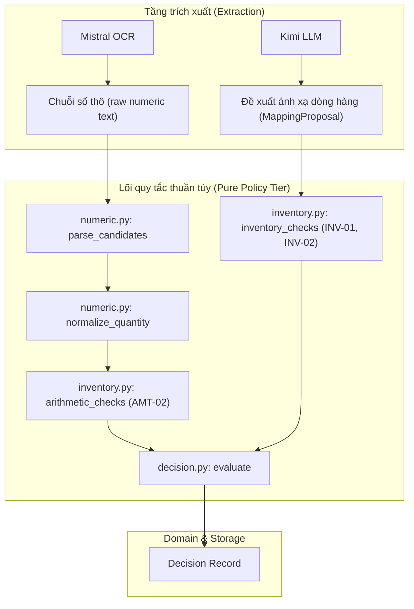
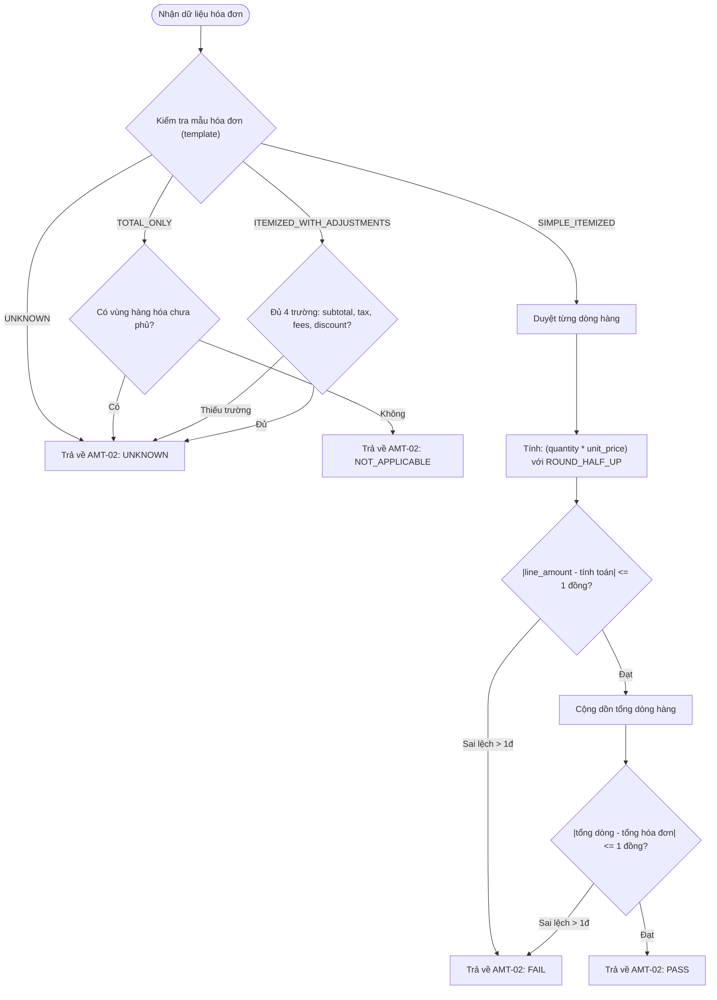

# P03 — Số học và đối chiếu hàng hóa (Numeric Parsing & Inventory Verification)

> **Part ID:** P03  
> **Slug:** numeric-inventory  
> **Phạm vi kiểm tra:** [src/invoice_referee/policy/numeric.py](file:///Users/tnhatnguyendev2805/Documents/Projects/InvoiceReferee/src/invoice_referee/policy/numeric.py), [src/invoice_referee/policy/inventory.py](file:///Users/tnhatnguyendev2805/Documents/Projects/InvoiceReferee/src/invoice_referee/policy/inventory.py), [tests/unit/test_inventory_arithmetic.py](file:///Users/tnhatnguyendev2805/Documents/Projects/InvoiceReferee/tests/unit/test_inventory_arithmetic.py), [tests/unit/test_numeric_quality.py](file:///Users/tnhatnguyendev2805/Documents/Projects/InvoiceReferee/tests/unit/test_numeric_quality.py), [B1_RULEBOOK.md §4](file:///Users/tnhatnguyendev2805/Documents/Projects/InvoiceReferee/docs/specs/B1_RULEBOOK.md#L75), [B1_SYSTEM_SPEC.md §5](file:///Users/tnhatnguyendev2805/Documents/Projects/InvoiceReferee/docs/specs/B1_SYSTEM_SPEC.md#L115).  
> **Commit hash:** `18626a7`  
> **Ngày thực hiện:** 2026-10-05  
> **Lệnh kiểm chứng đã chạy:**  
> - `pytest tests/unit/test_inventory_arithmetic.py tests/unit/test_numeric_quality.py -q` → [RUN 80 passed in 0.11s]  
> - `pytest tests/ -q` → [RUN 373 passed, 1 warning in 2.60s]  

---

## 1. Tóm tắt 5 dòng (Summary)

Module số học và hàng hóa là bộ đánh giá thuần túy không phụ thuộc I/O.  
Hệ thống sử dụng thư viện `decimal` của Python với độ chính xác cố định 50 chữ số.  
Hàm bóc tách hỗ trợ ba ngữ pháp xuất bản và giữ nguyên các giá trị mơ hồ.  
Quy tắc làm tròn `ROUND_HALF_UP` được áp dụng cho từng dòng hàng với dung sai 1 đồng.  
Quy trình đối chiếu kho xác minh tính nhất quán giữa hóa đơn và phiếu giao hàng.  

---

## 2. Vị trí trong hệ thống (System Placement)

Sơ đồ thể hiện vị trí của module số học và kiểm tra kho trong tầng quy tắc nghiệp vụ:



---

## 3. Bài toán phục vụ (Requirements & Business Rules)

Module trực tiếp hiện thực hóa các quy định số học trong Rulebook công ty mô phỏng:

| Quy tắc nghiệp vụ | Điều khoản Rulebook | Mã nguồn thực thi | Ý nghĩa kiểm soát |
|---|---|---|---|
| Khử dấu tiền tệ và bóc tách ngữ pháp | Rulebook §4 [SPEC](file:///Users/tnhatnguyendev2805/Documents/Projects/InvoiceReferee/docs/specs/B1_RULEBOOK.md#L77) | [numeric.py:113](file:///Users/tnhatnguyendev2805/Documents/Projects/InvoiceReferee/src/invoice_referee/policy/numeric.py#L113) | Không đoán mò dấu phân cách; giữ lại mọi cách hiểu nếu mơ hồ |
| Bối cảnh Decimal 50 chữ số | System Spec §5 [SPEC](file:///Users/tnhatnguyendev2805/Documents/Projects/InvoiceReferee/docs/specs/B1_SYSTEM_SPEC.md#L136) | [numeric.py:25](file:///Users/tnhatnguyendev2805/Documents/Projects/InvoiceReferee/src/invoice_referee/policy/numeric.py#L25) | Tránh sai số dấu phẩy động của float; cô lập ngữ cảnh |
| Số lượng × Đơn giá = Thành tiền | Rulebook §4 [SPEC](file:///Users/tnhatnguyendev2805/Documents/Projects/InvoiceReferee/docs/specs/B1_RULEBOOK.md#L83) | [inventory.py:57](file:///Users/tnhatnguyendev2805/Documents/Projects/InvoiceReferee/src/invoice_referee/policy/inventory.py#L57) | Làm tròn `ROUND_HALF_UP` từng dòng; dung sai tổng 1 đồng |
| Bắt buộc đủ 4 trường điều chỉnh | Rulebook §4 [SPEC](file:///Users/tnhatnguyendev2805/Documents/Projects/InvoiceReferee/docs/specs/B1_RULEBOOK.md#L86) | [inventory.py:86](file:///Users/tnhatnguyendev2805/Documents/Projects/InvoiceReferee/src/invoice_referee/policy/inventory.py#L86) | Thiếu trường điều chỉnh không bao giờ tự gán bằng 0 |
| Chuẩn hóa đơn vị đo lường | Rulebook §4 [SPEC](file:///Users/tnhatnguyendev2805/Documents/Projects/InvoiceReferee/docs/specs/B1_RULEBOOK.md#L96) | [numeric.py:145](file:///Users/tnhatnguyendev2805/Documents/Projects/InvoiceReferee/src/invoice_referee/policy/numeric.py#L145) | Chuyển đổi khối lượng về gram; đơn vị lạ so khớp chính xác |
| Đối chiếu phiếu nhập kho (INV-01, 02) | Rulebook §3 [SPEC](file:///Users/tnhatnguyendev2805/Documents/Projects/InvoiceReferee/docs/specs/B1_RULEBOOK.md#L66) | [inventory.py:311](file:///Users/tnhatnguyendev2805/Documents/Projects/InvoiceReferee/src/invoice_referee/policy/inventory.py#L311) | Chỉ áp dụng cho mua sắm vật tư (`WORK_PURCHASE`) |

---

## 4. Interface công khai (Public Interface)

Bảng các hàm công khai của `numeric.py` và `inventory.py`:

| Tên hàm | Tham số đầu vào | Kết quả trả về | Lỗi có thể ném | Vị trí mã nguồn |
|---|---|---|---|---|
| `parse_candidates` | `raw: str`, `kind: Literal['MONEY', 'QUANTITY', 'PRICE']`, `locale: str | None` | `tuple[Decimal, ...]` | `DomainError('INVALID_INPUT')` nếu `kind` hoặc `locale` lạ | [numeric.py:113](file:///Users/tnhatnguyendev2805/Documents/Projects/InvoiceReferee/src/invoice_referee/policy/numeric.py#L113) |
| `normalize_quantity` | `value: Decimal`, `unit: str` | `tuple[Decimal, str]` | Không ném lỗi | [numeric.py:145](file:///Users/tnhatnguyendev2805/Documents/Projects/InvoiceReferee/src/invoice_referee/policy/numeric.py#L145) |
| `arithmetic_checks` | `bundle: EvidenceBundle`, `policy: PolicyConfig`, `confirmations=None` | `list[CheckResult]` | Không ném lỗi | [inventory.py:121](file:///Users/tnhatnguyendev2805/Documents/Projects/InvoiceReferee/src/invoice_referee/policy/inventory.py#L121) |
| `inventory_checks` | `bundle: EvidenceBundle`, `policy: PolicyConfig`, `profile=None`, `received_full=None` | `list[CheckResult]` | Không ném lỗi | [inventory.py:311](file:///Users/tnhatnguyendev2805/Documents/Projects/InvoiceReferee/src/invoice_referee/policy/inventory.py#L311) |

---

## 5. Mô hình dữ liệu và giới hạn kỹ thuật (Data Model & Technical Bounds)

### 5.1 Bối cảnh số học và giới hạn chữ số
- **Bối cảnh Decimal:** Khởi tạo tường minh qua `Context(prec=50)` [SOURCE](file:///Users/tnhatnguyendev2805/Documents/Projects/InvoiceReferee/src/invoice_referee/policy/numeric.py#L25).  
- **Tiền tệ (`MONEY`):**  
  Tối đa 15 chữ số phần nguyên (`_MONEY_MAX_INT_DIGITS = 15`).  
  Không chấp nhận phần bù chữ số hoặc số âm.  
- **Số lượng và Đơn giá (`QUANTITY`, `PRICE`):**  
  Tối đa 12 chữ số phần nguyên (`_QUANTITY_MAX_INT_DIGITS = 12`).  
  Tối đa 6 chữ số phần thập phân (`_QUANTITY_MAX_FRAC_DIGITS = 6`).  
  `QUANTITY` bắt buộc phải lớn hơn 0 (`value > 0`).  
- **Xử lý vượt giới hạn:**  
  Mọi giá trị vượt quá giới hạn hoặc có dạng khoa học (`1e3`), `NaN`, `Infinity` đều bị loại bỏ và trả về tuple rỗng `()`.  

### 5.2 Ngữ pháp số học xuất bản (`_GRAMMARS`)
Hệ thống hỗ trợ 3 ngữ pháp phân tích chuỗi số [SOURCE](file:///Users/tnhatnguyendev2805/Documents/Projects/InvoiceReferee/src/invoice_referee/policy/numeric.py#L73):
1. **`CANONICAL`:** `\d+(?:\.\d+)?`  
   Chuỗi số thập phân dấu chấm tiêu chuẩn (ví dụ: `1234.56`).  
2. **`VI`:** `\d{1,3}(?:\.\d{3})+(?:,\d+)?|\d+(?:,\d+)?`  
   Định dạng Việt Nam: dấu chấm phân cách hàng nghìn, dấu phẩy thập phân (ví dụ: `1.234.567` hoặc `1.234,56`).  
3. **`US`:** `\d{1,3}(?:,\d{3})+(?:\.\d+)?|\d+(?:\.\d+)?`  
   Định dạng Mỹ: dấu phẩy phân cách hàng nghìn, dấu chấm thập phân (ví dụ: `1,234,567` hoặc `1,234.56`).  

### 5.3 Bảng chuẩn hóa đơn vị (`UNIT_FACTORS`)
Bảng chuyển đổi cố định về đơn vị cơ sở `gram` (`g`) [SOURCE](file:///Users/tnhatnguyendev2805/Documents/Projects/InvoiceReferee/src/invoice_referee/policy/numeric.py#L28):
- `'g'`: Hệ số `1` (cơ sở: `'g'`).  
- `'kg'`: Hệ số `1000` (cơ sở: `'g'`).  
- `'tấn'`: Hệ số `1000000` (cơ sở: `'g'`).  
- *Đơn vị lạ (Opaque unit):* Trả về nguyên gốc với hệ số `1`. Hai đơn vị lạ giống nhau so khớp 1:1; hai đơn vị lạ khác nhau tạo kết quả `UNKNOWN`.  

---

## 6. Luồng chi tiết: Phân tích số học và Đối chiếu kho



### Các bước kiểm tra đối chiếu kho (`inventory_checks`):
1. **Kiểm tra tính áp dụng:**  
   Nếu `profile` khác `WORK_PURCHASE`, trả về ngay `NOT_APPLICABLE` cho cả `INV-01` và `INV-02` [inventory.py:330](file:///Users/tnhatnguyendev2805/Documents/Projects/InvoiceReferee/src/invoice_referee/policy/inventory.py#L330).  
2. **Kiểm tra chứng từ giao nhận (`INV-01`):**  
   Bắt buộc có chứng từ `GOODS_RECEIPT` và khai báo `received_full = True` [inventory.py:341](file:///Users/tnhatnguyendev2805/Documents/Projects/InvoiceReferee/src/invoice_referee/policy/inventory.py#L341).  
3. **Kiểm tra tính nhất quán (`INV-02`):**  
   - Bắt buộc ánh xạ toàn bộ dòng hàng 1-to-1 (không có dòng dư thừa hoặc thiếu) [inventory.py:222](file:///Users/tnhatnguyendev2805/Documents/Projects/InvoiceReferee/src/invoice_referee/policy/inventory.py#L222).  
   - Kiểm tra số lượng sau khi quy về cùng đơn vị cơ sở [inventory.py:270](file:///Users/tnhatnguyendev2805/Documents/Projects/InvoiceReferee/src/invoice_referee/policy/inventory.py#L270).  
   - Kiểm tra đơn giá trên đơn vị cơ sở với dung sai bằng 0 [inventory.py:266](file:///Users/tnhatnguyendev2805/Documents/Projects/InvoiceReferee/src/invoice_referee/policy/inventory.py#L266).  
   - Kiểm tra trùng khớp nhà cung cấp [inventory.py:290](file:///Users/tnhatnguyendev2805/Documents/Projects/InvoiceReferee/src/invoice_referee/policy/inventory.py#L290).  
   - Kiểm tra khoảng cách ngày lập không vượt quá 7 ngày [inventory.py:296](file:///Users/tnhatnguyendev2805/Documents/Projects/InvoiceReferee/src/invoice_referee/policy/inventory.py#L296).  

---

## 7. Ba ví dụ tính tay đối chiếu thực tế (Worked Calculation Examples)

### Ví dụ 1: Tính toán khớp hoàn toàn (PASS)
- **Đầu vào:**  
  Số lượng: `3` cái. Đơn giá: `100` đồng. Thành tiền khai báo: `300` đồng. Tổng hóa đơn: `300` đồng.  
- **Các bước tính toán:**  
  1. Thành tiền kỳ vọng: $3 \times 100 = 300$ đồng.  
  2. Làm tròn: $300$ đồng.  
  3. Độ lệch dòng: $|300 - 300| = 0$ đồng $\le 1$ đồng.  
  4. Độ lệch tổng hóa đơn: $|300 - 300| = 0$ đồng $\le 1$ đồng.  
- **Kết quả:** `AMT-02` trả về `PASS` [TEST `test_simple_itemized_pass_and_line_total_tolerance`](file:///Users/tnhatnguyendev2805/Documents/Projects/InvoiceReferee/tests/unit/test_inventory_arithmetic.py#L145).  

### Ví dụ 2: Lệch dưới dung sai cho phép (PASS trong biên 1 đồng)
- **Đầu vào:**  
  Số lượng: `3` cái. Đơn giá: `100` đồng. Thành tiền khai báo trên dòng: `299` đồng (do làm tròn hiển thị). Tổng hóa đơn: `300` đồng.  
- **Các bước tính toán:**  
  1. Thành tiền kỳ vọng: $3 \times 100 = 300$ đồng.  
  2. Độ lệch dòng: $|300 - 299| = 1$ đồng.  
  3. So sánh dung sai: $1 \le 1$ đồng (thỏa mãn dung sai `comparison_money_tolerance`).  
  4. Độ lệch tổng: $|299 - 300| = 1$ đồng $\le 1$ đồng.  
- **Kết quả:** `AMT-02` trả về `PASS` [TEST `test_one_dong_line_difference_is_within_tolerance`](file:///Users/tnhatnguyendev2805/Documents/Projects/InvoiceReferee/tests/unit/test_inventory_arithmetic.py#L153).  

### Ví dụ 3: Lệch vượt dung sai cho phép (FAIL)
- **Đầu vào:**  
  Số lượng: `3` cái. Đơn giá: `100` đồng. Thành tiền khai báo: `297` đồng. Tổng hóa đơn: `300` đồng.  
- **Các bước tính toán:**  
  1. Thành tiền kỳ vọng: $3 \times 100 = 300$ đồng.  
  2. Độ lệch dòng: $|300 - 297| = 3$ đồng.  
  3. So sánh dung sai: $3 > 1$ đồng (vượt quá dung sai cho phép).  
- **Kết quả:** `AMT-02` trả về `FAIL`, mở vấn đề chặn `Issue` gửi tới `EMPLOYEE` [TEST `test_line_mismatch_beyond_one_dong_fails_arithmetic`](file:///Users/tnhatnguyendev2805/Documents/Projects/InvoiceReferee/tests/unit/test_inventory_arithmetic.py#L161).  

---

## 8. Bảng Invariant số học và kho (Domain Invariants)

| Mã Invariant | Nguyên tắc bắt buộc | Mã nguồn thực thi | Hậu quả nếu vi phạm |
|---|---|---|---|
| INV-NO-FLOAT | Cấm sử dụng kiểu float cho tiền tệ và số lượng | [numeric.py:19](file:///Users/tnhatnguyendev2805/Documents/Projects/InvoiceReferee/src/invoice_referee/policy/numeric.py#L19) | Sai số lũy kế dấu phẩy động làm hỏng sổ cái |
| INV-NO-DEFAULT-ZERO | Thiếu trường điều chỉnh không bao giờ tự gán bằng 0 | [inventory.py:88](file:///Users/tnhatnguyendev2805/Documents/Projects/InvoiceReferee/src/invoice_referee/policy/inventory.py#L88) | Tự ý bỏ qua thuế hoặc chiết khấu của hóa đơn |
| INV-EXACT-PRICE | Đơn giá sau quy đổi phải khớp tuyệt đối (tolerance 0) | [inventory.py:266](file:///Users/tnhatnguyendev2805/Documents/Projects/InvoiceReferee/src/invoice_referee/policy/inventory.py#L266) | Bỏ sót chênh lệch giá lớn khi quy đổi kg sang gram |
| INV-NO-RATIO-GUESS | Không phỏng đoán tỷ lệ cho các đơn vị lạ không cùng loại | [inventory.py:264](file:///Users/tnhatnguyendev2805/Documents/Projects/InvoiceReferee/src/invoice_referee/policy/inventory.py#L264) | Tự ý chuyển đổi sai giữa các đơn vị không tương thích |
| INV-DUP-ITEM-GUARD | Phát hiện item ID trùng lặp trước khi khởi tạo dict | [inventory.py:189](file:///Users/tnhatnguyendev2805/Documents/Projects/InvoiceReferee/src/invoice_referee/policy/inventory.py#L189) | Bị ghi đè làm mất dòng hàng hóa thực tế |

---

## 9. Phân loại lỗi và xử lý ngoại lệ số học (Error Classification)

| Tình huống phát sinh | Kết quả trả về | Cơ chế xử lý trong mã nguồn |
|---|---|---|
| Chuỗi số chứa ký tự lạ hoặc định dạng sai | Tuple rỗng `()` | Hàm `parse_candidates` từ chối nhận diện [numeric.py:134](file:///Users/tnhatnguyendev2805/Documents/Projects/InvoiceReferee/src/invoice_referee/policy/numeric.py#L134) |
| Chuỗi số có nhiều cách hiểu (ví dụ `1.234`) | `(Decimal('1.234'), Decimal('1234'))` | Giữ nguyên danh sách ứng viên, tầng chất lượng đánh dấu `UNCERTAIN` [numeric.py:142](file:///Users/tnhatnguyendev2805/Documents/Projects/InvoiceReferee/src/invoice_referee/policy/numeric.py#L142) |
| Sai lệch số học > 1 đồng | `AMT-02: FAIL` | Mở vấn đề `FACTUAL_UNKNOWN`, yêu cầu nhân viên giải trình [inventory.py:108](file:///Users/tnhatnguyendev2805/Documents/Projects/InvoiceReferee/src/invoice_referee/policy/inventory.py#L108) |
| Mẫu hóa đơn `TOTAL_ONLY` nhưng có dòng hàng | `AMT-02: UNKNOWN` | Không bỏ qua kiểm tra số học khi đã có dữ kiện dòng hàng [inventory.py:83](file:///Users/tnhatnguyendev2805/Documents/Projects/InvoiceReferee/src/invoice_referee/policy/inventory.py#L83) |
| Số lượng hóa đơn khác số lượng phiếu kho | `INV-02: FAIL` | Mở vấn đề `FACTUAL_UNKNOWN`, chuyển kế toán đối chiếu ảnh gốc [inventory.py:272](file:///Users/tnhatnguyendev2805/Documents/Projects/InvoiceReferee/src/invoice_referee/policy/inventory.py#L272) |

---

## 10. Quyết định thiết kế kỹ thuật (Design Decisions)

1. **Cô lập bối cảnh `DECIMAL_CONTEXT` (prec=50):**  
   - *Lý do:* Đảm bảo các phép chia đơn giá và chuyển đổi đơn vị không bị ảnh hưởng bởi bối cảnh toàn cục của Python [SOURCE](file:///Users/tnhatnguyendev2805/Documents/Projects/InvoiceReferee/src/invoice_referee/policy/numeric.py#L25).  
   - *Bị loại:* Không dùng `Decimal` với ngữ cảnh mặc định `prec=28`.  
2. **Tách rời kiểm tra số học (`AMT-02`) và đối chiếu kho (`INV-02`):**  
   - *Lý do:* Hai chứng từ có thể hoàn toàn khớp nhau nhưng cả hai đều tính sai số học; hai kiểm tra phải độc lập [SOURCE](file:///Users/tnhatnguyendev2805/Documents/Projects/InvoiceReferee/src/invoice_referee/policy/inventory.py#L7).  
   - *Bị loại:* Gộp chung việc kiểm tra tính toán vào bước đối chiếu kho.  
3. **Giữ lại cả hai ứng viên khi gặp số mơ hồ:**  
   - *Lý do:* `1.234` có thể là $1.234$ cái hoặc $1234$ cái; AI không được tự ý chọn cách hiểu thuận tiện [SOURCE](file:///Users/tnhatnguyendev2805/Documents/Projects/InvoiceReferee/src/invoice_referee/policy/numeric.py#L7).  
   - *Bị loại:* Tự động ưu tiên định dạng Việt Nam hơn định dạng Mỹ.  

---

## 11. Bản đồ kiểm thử số học (Test Map)

| Tên bài kiểm tra | Mục tiêu kiểm chứng kỹ thuật | Vị trí mã nguồn |
|---|---|---|
| `test_line_amount_is_quantity_times_price_half_up` | Xác thực quy tắc làm tròn `ROUND_HALF_UP` cho mốc 0.5 | [test_inventory_arithmetic.py:139](file:///Users/tnhatnguyendev2805/Documents/Projects/InvoiceReferee/tests/unit/test_inventory_arithmetic.py#L139) |
| `test_one_dong_line_difference_is_within_tolerance` | Xác thực dung sai 1 đồng cho phép vượt qua kiểm tra | [test_inventory_arithmetic.py:153](file:///Users/tnhatnguyendev2805/Documents/Projects/InvoiceReferee/tests/unit/test_inventory_arithmetic.py#L153) |
| `test_line_mismatch_beyond_one_dong_fails_arithmetic` | Xác thực sai lệch trên 1 đồng lập tức trả về `FAIL` | [test_inventory_arithmetic.py:161](file:///Users/tnhatnguyendev2805/Documents/Projects/InvoiceReferee/tests/unit/test_inventory_arithmetic.py#L161) |
| `test_kg_and_g_equivalent_unit_price_passes_inventory` | Xác thực quy đổi đơn vị tương đương kg và gram | [test_inventory_arithmetic.py:225](file:///Users/tnhatnguyendev2805/Documents/Projects/InvoiceReferee/tests/unit/test_inventory_arithmetic.py#L225) |
| `test_kg_vs_g_price_basis_conflict_is_flagged` | Bắt lỗi chênh lệch đơn giá cơ sở giữa kg và gram | [test_inventory_arithmetic.py:231](file:///Users/tnhatnguyendev2805/Documents/Projects/InvoiceReferee/tests/unit/test_inventory_arithmetic.py#L231) |
| `test_incompatible_units_are_unknown_not_a_ratio_guess` | Không tự đoán tỷ lệ cho đơn vị không tương thích | [test_inventory_arithmetic.py:245](file:///Users/tnhatnguyendev2805/Documents/Projects/InvoiceReferee/tests/unit/test_inventory_arithmetic.py#L245) |
| `test_adjustments_template_missing_term_is_unknown` | Thiếu trường trong hóa đơn điều chỉnh không default 0 | [test_inventory_arithmetic.py:215](file:///Users/tnhatnguyendev2805/Documents/Projects/InvoiceReferee/tests/unit/test_inventory_arithmetic.py#L215) |

---

## 12. Trạng thái và lệch đặc tả — mã nguồn (Status & Discrepancies)

- **Trạng thái thực tế:** Toàn bộ các quy tắc số học, bóc tách chuỗi, làm tròn và đối chiếu kho đã được **IMPLEMENTED** và **VERIFIED** qua 80 bài kiểm tra đơn vị [RUN 80 passed].  
- **Lệch đặc tả (Ghi nhận):** Mẫu `ITEMIZED_WITH_ADJUSTMENTS` hiện tại trong mã nguồn luôn trả về `UNKNOWN` do tầng đầu vào chưa mô hình hóa đầy đủ cơ sở phân bổ thuế và chiết khấu [inventory.py:89](file:///Users/tnhatnguyendev2805/Documents/Projects/InvoiceReferee/src/invoice_referee/policy/inventory.py#L89). Đây là hành vi an toàn (fail-closed) đúng với cam kết không tự gán 0.  

---

## 13. Rủi ro và nghi vấn (Risks & Questions)

| Mức độ | Rủi ro phát hiện | Bằng chứng mã nguồn | Phương án kiểm chứng |
|---|---|---|---|
| **High** | Người dùng nhập số lượng với dấu phẩy bị hiểu nhầm hàng nghìn | [numeric.py:44](file:///Users/tnhatnguyendev2805/Documents/Projects/InvoiceReferee/src/invoice_referee/policy/numeric.py#L44) | Bắt buộc giữ hai ứng viên và yêu cầu con người xác nhận tại `derive_fact` |
| **Med** | Đơn giá tiền tệ bị so sánh nhầm lẫn khi đơn vị tính không có hệ số | [inventory.py:264](file:///Users/tnhatnguyendev2805/Documents/Projects/InvoiceReferee/src/invoice_referee/policy/inventory.py#L264) | Trả về `UNKNOWN` thay vì `PASS` để kế toán kiểm tra thủ công |
| **Low** | Dung sai 1 đồng tích lũy qua hàng trăm dòng hàng | [inventory.py:108](file:///Users/tnhatnguyendev2805/Documents/Projects/InvoiceReferee/src/invoice_referee/policy/inventory.py#L108) | Bước kiểm tra tổng hóa đơn cuối cùng chặn sai lệch tổng vượt quá 1 đồng |

---

## 14. Thực hành kiểm chứng số học (Verification Exercises)

Bạn hãy tự làm các bài tập sau trên terminal để hiểu cơ chế kiểm soát số học:

### Bài tập 1: Thử nới lỏng dung sai tiền tệ từ 1 đồng lên 5 đồng
1. Mở file [demo-policy.json](file:///Users/tnhatnguyendev2805/Documents/Projects/InvoiceReferee/config/demo-policy.json#L10).  
2. Sửa tạm thời `"comparison_money_tolerance": "5"`.  
3. Chạy lệnh: `.venv/bin/python -m pytest tests/unit/test_inventory_arithmetic.py -k test_line_mismatch_beyond_one_dong_fails_arithmetic -q`.  
4. Quan sát test fail vì chênh lệch 3 đồng vốn phải bị chặn lại được hệ thống chấp nhận.  
5. Khôi phục lại file: `git checkout -- config/demo-policy.json`.  

### Bài tập 2: Thử đổi quy tắc làm tròn từ `ROUND_HALF_UP` sang làm tròn xuống (`ROUND_DOWN`)
1. Mở file [inventory.py dòng 59](file:///Users/tnhatnguyendev2805/Documents/Projects/InvoiceReferee/src/invoice_referee/policy/inventory.py#L59).  
2. Sửa `rounding=ROUND_HALF_UP` thành `rounding=ROUND_DOWN`.  
3. Chạy lệnh: `.venv/bin/python -m pytest tests/unit/test_inventory_arithmetic.py -k test_line_amount_is_quantity_times_price_half_up -q`.  
4. Quan sát test fail vì $0.5 \times 3 = 1.5$ bị làm tròn thành 1 thay vì 2.  
5. Khôi phục lại file: `git checkout -- src/invoice_referee/policy/inventory.py`.  

---

## 15. Câu hỏi tự kiểm tra (Self-Check Questions)

Hãy tự trả lời các câu hỏi sau trước khi mở đáp án:

1. Chuỗi `'1.234'` khi parse với `locale=None` cho ra kết quả gì?  
2. Vì sao hệ thống không chấp nhận chuỗi số có dạng khoa học như `'1e3'`?  
3. Độ chính xác (precision) của bối cảnh Decimal trong hệ thống là bao nhiêu chữ số?  
4. Quy tắc làm tròn nào được áp dụng cho phép nhân số lượng với đơn giá?  
5. Dung sai so khớp thành tiền dòng và tổng hóa đơn là bao nhiêu?  
6. Dung sai so khớp đơn giá cơ sở giữa hóa đơn và phiếu giao nhận là bao nhiêu?  
7. Đơn vị `'kg'` được chuẩn hóa về đơn vị cơ sở nào với hệ số bao nhiêu?  
8. Hai đơn vị đo lường lạ khác nhau (ví dụ `'hộp'` và `'thùng'`) được xử lý thế nào khi đối chiếu?  
9. Trạng thái `NOT_APPLICABLE` của kiểm tra inventory có làm toàn bộ hồ sơ được duyệt không?  
10. Trong mẫu hóa đơn `ITEMIZED_WITH_ADJUSTMENTS`, nếu thiếu trường chiết khấu (`discount`) thì hệ thống có mặc định bằng 0 không?  

<details>
<summary><b>Xem đáp án chi tiết</b></summary>

1. Trả về cả hai ứng viên: `(Decimal('1.234'), Decimal('1234'))` [SOURCE](file:///Users/tnhatnguyendev2805/Documents/Projects/InvoiceReferee/src/invoice_referee/policy/numeric.py#L121).  
2. Vì số mũ có thể gây sai lệch làm tròn ngoài ý muốn trong kế toán tài chính [SOURCE](file:///Users/tnhatnguyendev2805/Documents/Projects/InvoiceReferee/src/invoice_referee/policy/numeric.py#L12).  
3. Cố định là **50 chữ số** (`Context(prec=50)`) [SOURCE](file:///Users/tnhatnguyendev2805/Documents/Projects/InvoiceReferee/src/invoice_referee/policy/numeric.py#L25).  
4. Quy tắc **`ROUND_HALF_UP`** (làm tròn lên ở mốc 0.5) [SOURCE](file:///Users/tnhatnguyendev2805/Documents/Projects/InvoiceReferee/src/invoice_referee/policy/inventory.py#L59).  
5. Mặc định là **1 đồng** (`comparison_money_tolerance = "1"`) [SOURCE](file:///Users/tnhatnguyendev2805/Documents/Projects/InvoiceReferee/config/demo-policy.json#L10).  
6. Mặc định là **0** (`normalized_unit_price_tolerance = "0"`), bắt buộc khớp tuyệt đối [SOURCE](file:///Users/tnhatnguyendev2805/Documents/Projects/InvoiceReferee/config/demo-policy.json#L11).  
7. Quy đổi về **`g`** (gram) với hệ số nhân **`1000`** [SOURCE](file:///Users/tnhatnguyendev2805/Documents/Projects/InvoiceReferee/src/invoice_referee/policy/numeric.py#L30).  
8. Trả về kết quả **`UNKNOWN`**, không phỏng đoán tỷ lệ quy đổi [SOURCE](file:///Users/tnhatnguyendev2805/Documents/Projects/InvoiceReferee/src/invoice_referee/policy/inventory.py#L265).  
9. **Không.** `NOT_APPLICABLE` chỉ miễn báo cáo kho; toàn bộ kiểm tra hóa đơn và thẩm quyền khác vẫn bắt buộc đạt [SPEC](file:///Users/tnhatnguyendev2805/Documents/Projects/InvoiceReferee/docs/specs/B1_RULEBOOK.md#L94).  
10. **Không.** Hệ thống trả về `UNKNOWN`, tuyệt đối không tự gán giá trị bằng 0 [SOURCE](file:///Users/tnhatnguyendev2805/Documents/Projects/InvoiceReferee/src/invoice_referee/policy/inventory.py#L88).  
</details>

---

## 16. Sổ tay hướng dẫn điều khiển AI (AI Steering Guide)

Khi bạn giao việc cho AI chỉnh sửa module số học hoặc đối chiếu kho, hãy tuân thủ hướng dẫn sau:

### Ngữ cảnh tối thiểu bắt buộc đưa cho AI
- File đặc tả: [B1_RULEBOOK.md §4](file:///Users/tnhatnguyendev2805/Documents/Projects/InvoiceReferee/docs/specs/B1_RULEBOOK.md#L75) và [B1_SYSTEM_SPEC.md §5](file:///Users/tnhatnguyendev2805/Documents/Projects/InvoiceReferee/docs/specs/B1_SYSTEM_SPEC.md#L115).  
- File thực thi: [numeric.py](file:///Users/tnhatnguyendev2805/Documents/Projects/InvoiceReferee/src/invoice_referee/policy/numeric.py) và [inventory.py](file:///Users/tnhatnguyendev2805/Documents/Projects/InvoiceReferee/src/invoice_referee/policy/inventory.py).  
- Bắt buộc nhắc AI: *“Giữ nguyên bối cảnh Decimal 50 chữ số, không dùng float, không tự động gán giá trị thiếu bằng 0, không tự đoán tỷ lệ đơn vị lạ.”*  

### Các dấu hiệu cảnh báo đỏ (Red Flags trong Git Diff của AI)
1. **AI sử dụng hàm `round()` tích hợp của Python** hoặc ép kiểu sang `float`.  
2. **AI sử dụng toán tử `.get(name, 0)`** để mặc định hóa các trường tiền tệ hoặc chiết khấu bị thiếu.  
3. **AI tự ý chọn ứng viên đầu tiên** khi hàm `parse_candidates` trả về nhiều giá trị.  
4. **AI thêm tỷ lệ quy đổi tự đoán** giữa các đơn vị không chuẩn (ví dụ gán 1 thùng = 24 lon).  
5. **AI nới lỏng dung sai đơn giá** lớn hơn 0 mà không có sự đồng ý của bạn.  

### Lệnh kiểm tra bắt buộc chạy sau khi AI sửa đổi
```bash
.venv/bin/python -m pytest tests/unit/test_inventory_arithmetic.py tests/unit/test_numeric_quality.py -q
```

---

## 17. GLOSSARY BỔ SUNG (Số học & Đối chiếu kho)

Bảng các thuật ngữ số học và hàng hóa bổ sung cho Glossary chuẩn từ P00:

| Thuật ngữ tiếng Việt | Tên mã nguồn (Code Term) | Định nghĩa chuẩn xác một câu | Nguồn tham chiếu |
|---|---|---|---|
| **Bối cảnh số học** | `DECIMAL_CONTEXT` | Thiết lập bối cảnh tính toán cố định 50 chữ số độc lập với môi trường. | [numeric.py:25](file:///Users/tnhatnguyendev2805/Documents/Projects/InvoiceReferee/src/invoice_referee/policy/numeric.py#L25) |
| **Ứng viên phân tích** | `Parse Candidates` | Tập hợp mọi giá trị số có thể hiểu được từ một chuỗi văn bản thô. | [numeric.py:113](file:///Users/tnhatnguyendev2805/Documents/Projects/InvoiceReferee/src/invoice_referee/policy/numeric.py#L113) |
| **Làm tròn lên nửa** | `ROUND_HALF_UP` | Quy tắc làm tròn số học đưa giá trị phần năm lẻ lên số nguyên kế tiếp. | [inventory.py:20](file:///Users/tnhatnguyendev2805/Documents/Projects/InvoiceReferee/src/invoice_referee/policy/inventory.py#L20) |
| **Dung sai tiền tệ** | `comparison_money_tolerance` | Khoảng chênh lệch tối đa cho phép (1 đồng) khi so khớp phép nhân và tổng. | [demo-policy.json:10](file:///Users/tnhatnguyendev2805/Documents/Projects/InvoiceReferee/config/demo-policy.json#L10) |
| **Đơn vị cơ sở** | `Base Unit` | Đơn vị đo lường chuẩn hóa dùng để quy đổi các đơn vị cùng loại trước khi so sánh. | [numeric.py:145](file:///Users/tnhatnguyendev2805/Documents/Projects/InvoiceReferee/src/invoice_referee/policy/numeric.py#L145) |
| **Đơn vị không quy đổi** | `Opaque Unit` | Đơn vị đo lường không có hệ số chuyển đổi cố định và chỉ so khớp trực tiếp. | [numeric.py:148](file:///Users/tnhatnguyendev2805/Documents/Projects/InvoiceReferee/src/invoice_referee/policy/numeric.py#L148) |

---

## 18. Phụ lục (Appendix)

- **Các truy vấn CodeGraph đã thực hiện:**  
  `numeric.py inventory.py parse Decimal rounding unit normalize line total goods receipt`  
  (Tìm thấy 63 symbols trong 4 files).  
- **Các file tài liệu và mã nguồn đã đọc đầy đủ:**  
  1. `src/invoice_referee/policy/numeric.py`  
  2. `src/invoice_referee/policy/inventory.py`  
  3. `tests/unit/test_inventory_arithmetic.py`  
  4. `tests/unit/test_numeric_quality.py`  
  5. `docs/specs/B1_RULEBOOK.md`  
  6. `docs/specs/B1_SYSTEM_SPEC.md`  
- **Giới hạn kiểm tra:** Bộ kiểm thử hiện tại xác thực trên tập dữ liệu tổng hợp và các fixture chuẩn; chưa kiểm thử với hóa đơn thực tế có hàng nghìn dòng hàng hóa phức tạp.
