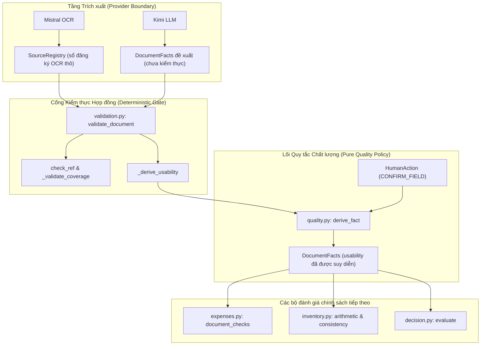
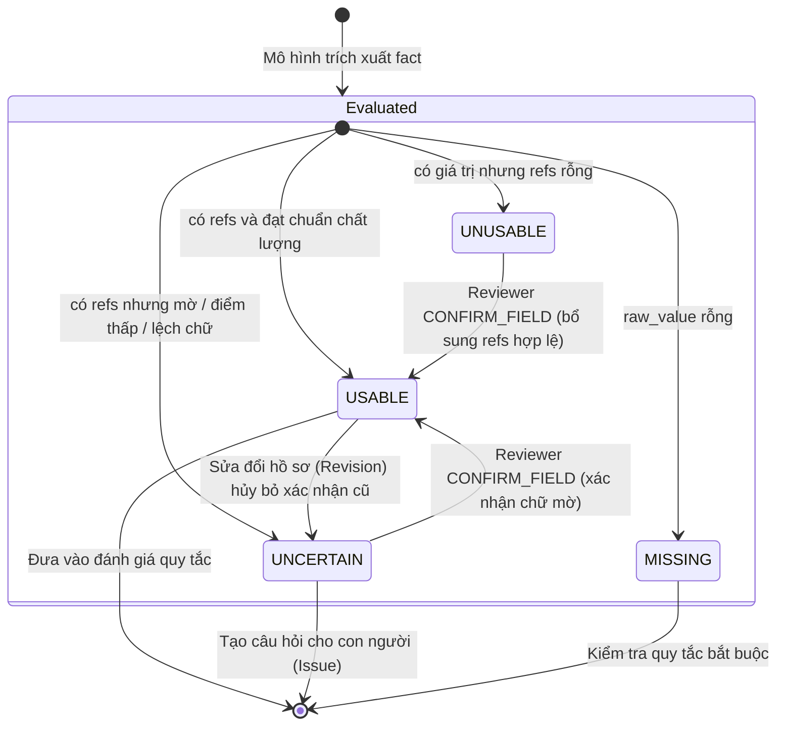
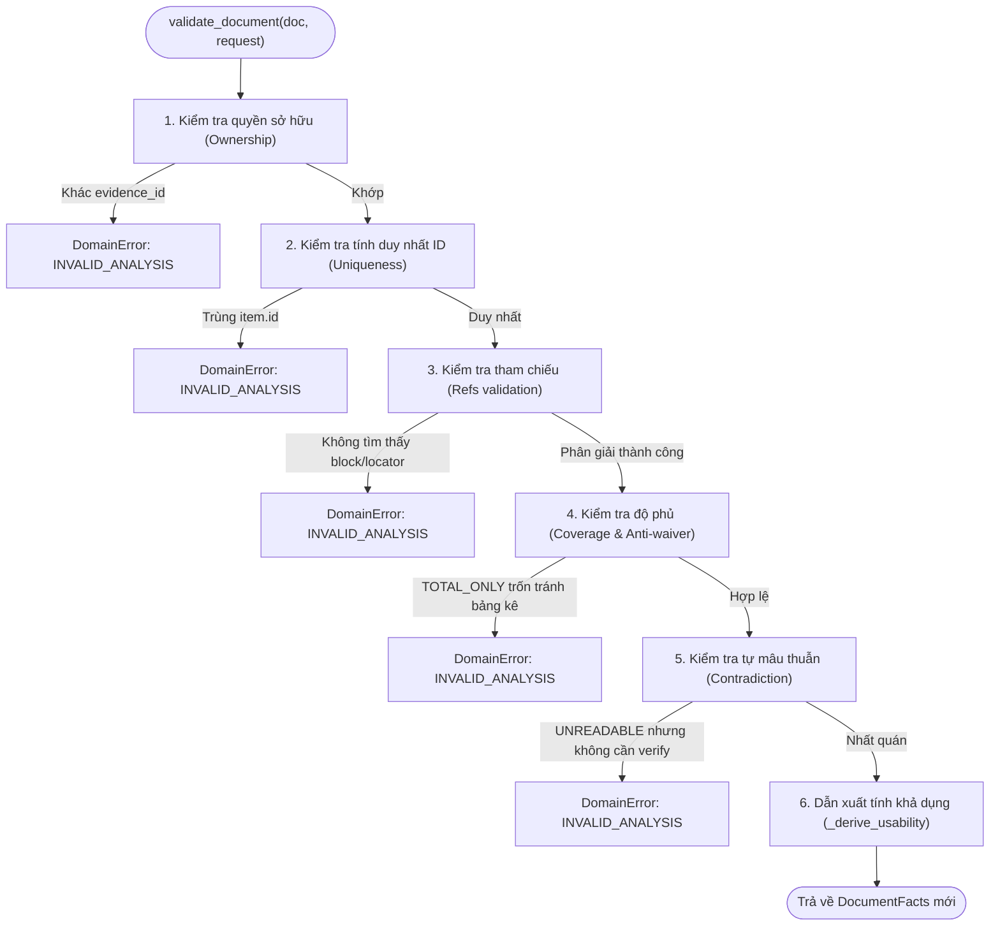
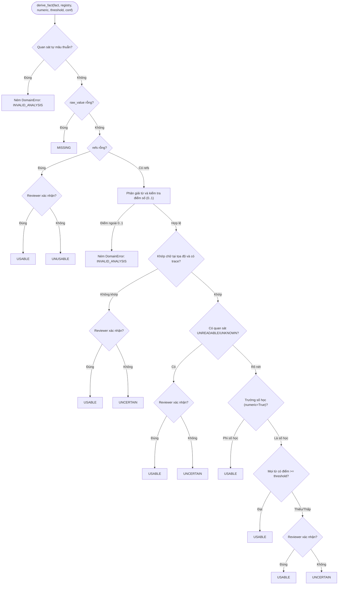

# P04 — Nguồn gốc và chất lượng dữ kiện (Source Registry & Fact Quality)

> **Part ID:** P04  
> **Slug:** source-quality  
> **Phạm vi kiểm tra:** [src/invoice_referee/policy/quality.py](file:///Users/tnhatnguyendev2805/Documents/Projects/InvoiceReferee/src/invoice_referee/policy/quality.py), [src/invoice_referee/extraction/validation.py](file:///Users/tnhatnguyendev2805/Documents/Projects/InvoiceReferee/src/invoice_referee/extraction/validation.py), [tests/unit/test_numeric_quality.py](file:///Users/tnhatnguyendev2805/Documents/Projects/InvoiceReferee/tests/unit/test_numeric_quality.py), [tests/unit/test_provider_contracts.py](file:///Users/tnhatnguyendev2805/Documents/Projects/InvoiceReferee/tests/unit/test_provider_contracts.py), [B1_SYSTEM_SPEC.md §3–4](file:///Users/tnhatnguyendev2805/Documents/Projects/InvoiceReferee/docs/specs/B1_SYSTEM_SPEC.md#L50-L114).  
> **Commit hash:** `7edac6d` (gốc nhánh `rebuild`: `18626a7`)  
> **Ngày thực hiện:** 2026-10-05  
> **Lệnh kiểm chứng đã chạy:**  
> - `.venv/bin/python -m pytest tests/unit/test_numeric_quality.py tests/unit/test_provider_contracts.py -v` → [RUN 108 passed in 0.20s]  
> - `.venv/bin/python -m pytest tests/unit/test_contracts.py -q` → [RUN 41 passed in 0.05s]  
> - `.venv/bin/python -m pytest tests/ -q` → [RUN 381 passed, 1 failed do bug nạp .env tại commit 15014a9]  

---

## 1. Tóm tắt 5 dòng (Summary)

Module đảm bảo mọi dữ kiện trích xuất đều có nguồn gốc đối chiếu thực tế.  
Hệ thống không tin tưởng phán đoán chất lượng hoặc độ rõ từ mô hình AI.  
Tính khả dụng của trường dữ liệu được suy diễn tất định từ điểm số OCR.  
Bộ kiểm tra chặn đứng hành vi trốn tránh kiểm tra bảng chi tiết của mô hình.  
Xác nhận của con người có thể cứu dữ kiện mờ nhưng không sửa đổi OCR thô.  

---

## 2. Vị trí trong hệ thống (System Placement)

Sơ đồ thể hiện luồng dữ liệu và vị trí của các module chất lượng và kiểm thực [SOURCE](file:///Users/tnhatnguyendev2805/Documents/Projects/InvoiceReferee/src/invoice_referee/extraction/validation.py#L1-L20):



---

## 3. Bài toán phục vụ (Business Rules & Requirements)

| Quy tắc / Yêu cầu nghiệp vụ | Đoạn đặc tả liên quan | Mã nguồn thực thi |
| :--- | :--- | :--- |
| **Yêu cầu có nguồn (Source traceability):** Mọi giá trị trích xuất phải gắn với tọa độ văn bản thật. | [B1_SYSTEM_SPEC.md §3](file:///Users/tnhatnguyendev2805/Documents/Projects/InvoiceReferee/docs/specs/B1_SYSTEM_SPEC.md#L53-L56) | [quality.py: check_ref](file:///Users/tnhatnguyendev2805/Documents/Projects/InvoiceReferee/src/invoice_referee/policy/quality.py#L56-L76) |
| **Cổng chất lượng số (Numeric score gate):** Chữ số phải đạt điểm tin cậy $\ge 0.85$ mới tự động sử dụng. | [B1_SYSTEM_SPEC.md §3](file:///Users/tnhatnguyendev2805/Documents/Projects/InvoiceReferee/docs/specs/B1_SYSTEM_SPEC.md#L56-L62) | [quality.py: _coverage_passes](file:///Users/tnhatnguyendev2805/Documents/Projects/InvoiceReferee/src/invoice_referee/policy/quality.py#L100-L108) |
| **Chống trốn tránh (Anti-waiver):** Cấm mô hình tự chọn `TOTAL_ONLY` khi chứng từ có bảng kê. | [B1_SYSTEM_SPEC.md §4](file:///Users/tnhatnguyendev2805/Documents/Projects/InvoiceReferee/docs/specs/B1_SYSTEM_SPEC.md#L102-L107) | [validation.py: _validate_coverage](file:///Users/tnhatnguyendev2805/Documents/Projects/InvoiceReferee/src/invoice_referee/extraction/validation.py#L165-L191) |
| **Chống tự mâu thuẫn (Contradiction rejection):** Chữ mờ nhưng dám khẳng định không cần xác minh sẽ bị từ chối. | [B1_SYSTEM_SPEC.md §3](file:///Users/tnhatnguyendev2805/Documents/Projects/InvoiceReferee/docs/specs/B1_SYSTEM_SPEC.md#L67-L72) | [validation.py: is_contradiction](file:///Users/tnhatnguyendev2805/Documents/Projects/InvoiceReferee/src/invoice_referee/extraction/validation.py#L109-L116) |
| **Ngân sách sửa chữa (Repair budget):** Tối đa 1 lần yêu cầu mô hình sửa phản hồi lỗi. | [B1_SYSTEM_SPEC.md §4](file:///Users/tnhatnguyendev2805/Documents/Projects/InvoiceReferee/docs/specs/B1_SYSTEM_SPEC.md#L97-L101) | [validation.py: shared_repair_allowed](file:///Users/tnhatnguyendev2805/Documents/Projects/InvoiceReferee/src/invoice_referee/extraction/validation.py#L62-L70) |
| **Xác nhận người dùng (Human confirmation):** Kế toán viên có quyền xác nhận trường mờ kèm tọa độ gốc. | [B1_SYSTEM_SPEC.md §3](file:///Users/tnhatnguyendev2805/Documents/Projects/InvoiceReferee/docs/specs/B1_SYSTEM_SPEC.md#L63-L66) | [quality.py: _confirmation_matches](file:///Users/tnhatnguyendev2805/Documents/Projects/InvoiceReferee/src/invoice_referee/policy/quality.py#L193-L227) |

---

## 4. Interface công khai (Public API)

| Ký hiệu (Symbol) | Đầu vào (Input) | Đầu ra (Output) | Ngoại lệ có thể ném | Vị trí mã nguồn |
| :--- | :--- | :--- | :--- | :--- |
| `validate_document` | `doc: DocumentFacts`, `request: AnalysisRequest` | `DocumentFacts` | `DomainError('INVALID_ANALYSIS')` | [validation.py:195](file:///Users/tnhatnguyendev2805/Documents/Projects/InvoiceReferee/src/invoice_referee/extraction/validation.py#L195) |
| `check_ref` | `ref: SourceRef`, `registry: SourceRegistry` | `None` | `DomainError('INVALID_ANALYSIS')` | [validation.py:139](file:///Users/tnhatnguyendev2805/Documents/Projects/InvoiceReferee/src/invoice_referee/extraction/validation.py#L139) |
| `is_applicable` | `doc: DocumentFacts`, `check: str`, `registry: SourceRegistry` | `bool` | `DomainError('INVALID_INPUT')` | [validation.py:74](file:///Users/tnhatnguyendev2805/Documents/Projects/InvoiceReferee/src/invoice_referee/extraction/validation.py#L74) |
| `is_contradiction` | `doc: DocumentFacts` | `bool` | Không ném ngoại lệ | [validation.py:109](file:///Users/tnhatnguyendev2805/Documents/Projects/InvoiceReferee/src/invoice_referee/extraction/validation.py#L109) |
| `shared_repair_allowed` | `repair_count: int` | `bool` | Không ném ngoại lệ | [validation.py:62](file:///Users/tnhatnguyendev2805/Documents/Projects/InvoiceReferee/src/invoice_referee/extraction/validation.py#L62) |
| `derive_fact` | `fact: FieldFact`, `registry: SourceRegistry`, `numeric: bool`, `threshold: Decimal`, `confirmation: HumanAction \| None` | `FieldFact` | `DomainError('INVALID_ANALYSIS')` | [quality.py:229](file:///Users/tnhatnguyendev2805/Documents/Projects/InvoiceReferee/src/invoice_referee/policy/quality.py#L229) |
| `confirmation_index` | `confirmations: Sequence[HumanAction] \| None` | `dict[str, HumanAction]` | Không ném ngoại lệ | [quality.py:154](file:///Users/tnhatnguyendev2805/Documents/Projects/InvoiceReferee/src/invoice_referee/policy/quality.py#L154) |

---

## 5. Mô hình dữ liệu & Ràng buộc (Data Models & Constraints)

### 5.1. Cấu trúc `SourceRegistry` và `SourceRef`
- **`SourceRegistry`** [SOURCE](file:///Users/tnhatnguyendev2805/Documents/Projects/InvoiceReferee/src/invoice_referee/domain/models.py#L143-L166):
  - Chứa `evidence_id: str`: Định danh chứng từ gốc sở hữu sổ đăng ký.
  - Chứa `blocks: list[SourceBlock]`: Danh sách các khối văn bản được OCR phân tích.
  - Chứa `uncovered_item_regions: list[str]`: Danh sách các vùng bảng dòng hàng OCR phát hiện nhưng chưa được gán.
  - Ràng buộc: `_reject_duplicate_ids` cấm tuyệt đối trùng lặp `block_id` hoặc `word.id` [TEST](file:///Users/tnhatnguyendev2805/Documents/Projects/InvoiceReferee/tests/unit/test_numeric_quality.py#L296-L306).
- **`SourceRef`** [SOURCE](file:///Users/tnhatnguyendev2805/Documents/Projects/InvoiceReferee/src/invoice_referee/domain/models.py#L120-L126):
  - Con trỏ tham chiếu gồm `evidence_id`, `page_index`, `block_id`, `locator`, và chuỗi gốc `raw_value`.

### 5.2. Các trạng thái tính khả dụng (`Usability`)
Một trường dữ liệu mang một trong 5 giá trị `Usability` [SOURCE](file:///Users/tnhatnguyendev2805/Documents/Projects/InvoiceReferee/src/invoice_referee/domain/models.py#L39):
1. **`USABLE`:** Dữ kiện hoàn toàn hợp lệ, đủ nguồn gốc, đạt ngưỡng điểm tin cậy số học, hoặc được con người xác nhận hợp lệ.
2. **`MISSING`:** Dữ kiện không có giá trị thô (`raw_value` rỗng).
3. **`UNUSABLE`:** Dữ kiện có giá trị nhưng hoàn toàn thiếu tham chiếu nguồn gốc (`refs` rỗng).
4. **`UNCERTAIN`:** Dữ kiện có giá trị và có nguồn, nhưng điểm tin cậy thấp, chữ bị mờ, hoặc chuỗi văn bản không khớp tọa độ.
5. **`NOT_APPLICABLE`:** Trường dữ liệu không áp dụng cho mẫu chứng từ hoặc loại hồ sơ này.

### 5.3. Đầu ra đặc biệt: Biểu đồ trạng thái Usability & Bảng tình huống chất lượng

#### Biểu đồ trạng thái (State Diagram) của Usability một Fact:



#### Bảng tra cứu: Tình huống chất lượng → Kết quả Usability:

| STT | Loại trường | Giá trị thô (`raw_value`) | Tham chiếu (`refs`) | Độ nét (`reading`) | Điểm số OCR (`score`) | Xác nhận Reviewer (`confirmation`) | Kết quả Usability |
| :---: | :--- | :--- | :--- | :--- | :--- | :--- | :---: |
| 1 | Bất kỳ | Rỗng `""` | Bất kỳ | Bất kỳ | Bất kỳ | Không | `MISSING` |
| 2 | Bất kỳ | Có giá trị | Rỗng `[]` | Bất kỳ | Bất kỳ | Không | `UNUSABLE` |
| 3 | Bất kỳ | Có giá trị | Rỗng `[]` | Bất kỳ | Bất kỳ | Hợp lệ (kèm refs) | `USABLE` |
| 4 | Bất kỳ | Khác chữ tại locus | Hợp lệ | Bất kỳ | Bất kỳ | Không | `UNCERTAIN` |
| 5 | Bất kỳ | Khác chữ tại locus | Hợp lệ | Bất kỳ | Bất kỳ | Hợp lệ | `USABLE` |
| 6 | Bất kỳ | Thiếu vết chuẩn hóa | Hợp lệ | Bất kỳ | Bất kỳ | Không | `UNCERTAIN` |
| 7 | Bất kỳ | Khớp chữ tại locus | Hợp lệ | `UNREADABLE` (flag=True) | Bất kỳ | Không | `UNCERTAIN` |
| 8 | Bất kỳ | Khớp chữ tại locus | Hợp lệ | `UNREADABLE` (flag=True) | Bất kỳ | Hợp lệ | `USABLE` |
| 9 | Bất kỳ | Khớp chữ tại locus | Hợp lệ | `UNREADABLE` (flag=False) | Bất kỳ | Bất kỳ | `INVALID_ANALYSIS` (Lỗi) |
| 10 | Phi số học | Khớp chữ tại locus | Hợp lệ | `READABLE` | Bất kỳ (kể cả None) | Không | `USABLE` |
| 11 | Số học | Khớp chữ tại locus | Hợp lệ | `READABLE` | `None` (thiếu điểm) | Không | `UNCERTAIN` |
| 12 | Số học | Khớp chữ tại locus | Hợp lệ | `READABLE` | $< 0.85$ (điểm thấp) | Không | `UNCERTAIN` |
| 13 | Số học | Khớp chữ tại locus | Hợp lệ | `READABLE` | $< 0.85$ (điểm thấp) | Hợp lệ | `USABLE` |
| 14 | Số học | Khớp chữ tại locus | Hợp lệ | `READABLE` | $\ge 0.85$ (đạt chuẩn) | Không | `USABLE` |
| 15 | Số học | Khớp chữ tại locus | Hợp lệ | Bất kỳ | Ngoài đoạn $[0, 1]$ | Bất kỳ | `INVALID_ANALYSIS` (Lỗi) |

---

## 6. Luồng chi tiết (Detailed Flows)

### 6.1. Luồng kiểm thực tài liệu (`validate_document`)



1. **Bước 1: Quyền sở hữu (Ownership):** So sánh `doc.evidence_id` và `request.registry.evidence_id` với `request.evidence.id`. Lệch mã ném `INVALID_ANALYSIS` [SOURCE](file:///Users/tnhatnguyendev2805/Documents/Projects/InvoiceReferee/src/invoice_referee/extraction/validation.py#L204-L213).
2. **Bước 2: Tính duy nhất (Uniqueness):** Quét qua `doc.items`. Phát hiện `item.id` trùng lặp lập tức ném `INVALID_ANALYSIS` [SOURCE](file:///Users/tnhatnguyendev2805/Documents/Projects/InvoiceReferee/src/invoice_referee/extraction/validation.py#L225-L230).
3. **Bước 3: Tham chiếu (Refs):** Gọi `check_ref` cho từng trường. Ref trỏ sang chứng từ khác hoặc locator không tồn tại bị ném `INVALID_ANALYSIS` [SOURCE](file:///Users/tnhatnguyendev2805/Documents/Projects/InvoiceReferee/src/invoice_referee/extraction/validation.py#L139-L163).
4. **Bước 4: Độ phủ (Coverage):** Ngăn chặn mô hình khai báo `TOTAL_ONLY` khi OCR đã phát hiện vùng bảng hàng hóa (`uncovered_item_regions`). Vi phạm ném `INVALID_ANALYSIS` [SOURCE](file:///Users/tnhatnguyendev2805/Documents/Projects/InvoiceReferee/src/invoice_referee/extraction/validation.py#L165-L191).
5. **Bước 5: Chống mâu thuẫn (Contradiction):** Quét qua các quan sát chất lượng. Nếu quan sát là `UNREADABLE` hoặc `UNKNOWN` mà lại gắn `requires_verification=False`, hệ thống ném `INVALID_ANALYSIS` [SOURCE](file:///Users/tnhatnguyendev2805/Documents/Projects/InvoiceReferee/src/invoice_referee/extraction/validation.py#L109-L116).
6. **Bước 6: Dẫn xuất tính khả dụng (_derive_usability):** Gọi `derive_fact` cho từng trường với ngưỡng kiểm soát `B1_WORD_REVIEW_THRESHOLD` (`0.85`) [SOURCE](file:///Users/tnhatnguyendev2805/Documents/Projects/InvoiceReferee/src/invoice_referee/extraction/validation.py#L233-L250).

---

### 6.2. Luồng suy diễn tính khả dụng của một trường (`derive_fact`)



---

## 7. Ví dụ chạy tay (Concrete Walkthrough)

Lấy ví dụ kiểm tra trường tổng tiền `total` có giá trị `"1200000"` nhưng chữ số bị mờ với điểm tin cậy OCR là `0.50` [TEST](file:///Users/tnhatnguyendev2805/Documents/Projects/InvoiceReferee/tests/unit/test_numeric_quality.py#L245-L250):

### Dữ liệu đầu vào:
1. `registry`: `evidence_id = 'e-primary'`, `block_id = 'b-1'`, `locator = 'total'`.  
   Từ OCR: `SourceWord(id='w-total', text='1200000', score='0.50')`.
2. `fact`: `field = 'total'`, `raw_value = '1200000'`, `refs = [SourceRef(locator='total', raw_value='1200000')]`.  
   Quan sát: `QualityObservation(reading='READABLE', requires_verification=False)`.
3. Tham số: `numeric = True`, `threshold = Decimal('0.85')`, `confirmation = None`.

### Các bước thực thi trong `derive_fact`:
1. `_contradicts_quality`: `reading` là `'READABLE'`, không có mâu thuẫn hợp đồng. Tiếp tục.
2. `not fact.raw_value`: Có giá trị (`'1200000'`). Không phải `MISSING`.
3. `not fact.refs`: Có 1 ref. Không phải `UNUSABLE`.
4. `_resolve_words`: Tìm thấy block `'b-1'`, tìm thấy locator `'total'`, tìm thấy từ `'w-total'`.
5. `_validate_scores`: Điểm `'0.50'` nằm trong đoạn $[0, 1]$. Hợp lệ.
6. `_raw_matches_locus`: Chữ ghép lại là `'1200000'`, khớp chính xác với `raw_value`.
7. `_has_unreadable_observation`: Không có quan sát mờ. Tiếp tục.
8. `if not numeric`: Là trường tiền tệ (`numeric = True`). Tiếp tục kiểm tra điểm số.
9. `_coverage_passes`: Lấy điểm từ `'w-total'` là `Decimal('0.50')`. So sánh: `Decimal('0.50') >= Decimal('0.85')` $\rightarrow$ **Sai (False)**.
10. `_confirmation_matches`: `confirmation` là `None`. Không được cứu.
11. Kết quả: Hàm trả về `fact.model_copy(update={'usability': 'UNCERTAIN'})`.

---

## 8. Bảng Invariant bắt buộc

| Invariant | Mã nguồn thực thi | Test chứng minh | Hậu quả nếu bị phá vỡ |
| :--- | :--- | :--- | :--- |
| **Bảo toàn nguồn gốc:** Mọi fact phải có ref trỏ về block và locator có thật. | [quality.py: _resolve_words](file:///Users/tnhatnguyendev2805/Documents/Projects/InvoiceReferee/src/invoice_referee/policy/quality.py#L56-L76) | [test_numeric_quality.py: test_unknown_locator_is_invalid_analysis](file:///Users/tnhatnguyendev2805/Documents/Projects/InvoiceReferee/tests/unit/test_numeric_quality.py#L235) | Mô hình AI có thể bịa đặt tọa độ giả để hợp thức hóa dữ liệu rác. |
| **Khóa chặt chất lượng số:** `READABLE` không bao giờ được miễn trừ điểm tin cậy số học. | [quality.py: derive_fact](file:///Users/tnhatnguyendev2805/Documents/Projects/InvoiceReferee/src/invoice_referee/policy/quality.py#L284-L291) | [test_numeric_quality.py: test_readable_observation_does_not_waive_missing_score](file:///Users/tnhatnguyendev2805/Documents/Projects/InvoiceReferee/tests/unit/test_numeric_quality.py#L165) | Chữ số bị mờ có thể tự động được duyệt thanh toán gây thất thoát tiền. |
| **Cấm trốn tránh bảng kê:** Không được dùng `TOTAL_ONLY` khi OCR thấy bảng hàng hóa. | [validation.py: _validate_coverage](file:///Users/tnhatnguyendev2805/Documents/Projects/InvoiceReferee/src/invoice_referee/extraction/validation.py#L165-L186) | [test_provider_contracts.py: test_total_only_rejected_when_registry_has_uncovered_regions](file:///Users/tnhatnguyendev2805/Documents/Projects/InvoiceReferee/tests/unit/test_provider_contracts.py#L171) | Bỏ sót việc đối chiếu kho và số học chi tiết của các hóa đơn mua sắm. |
| **Cấm lặp vô tận (Budget limit):** Tối đa 1 lần repair dùng chung cho mỗi lượt gọi mô hình. | [validation.py: shared_repair_allowed](file:///Users/tnhatnguyendev2805/Documents/Projects/InvoiceReferee/src/invoice_referee/extraction/validation.py#L62-L70) | [test_provider_contracts.py: test_analyze_stops_after_one_shared_repair](file:///Users/tnhatnguyendev2805/Documents/Projects/InvoiceReferee/tests/unit/test_provider_contracts.py#L318) | Tiêu tốn chi phí API và làm treo tiến trình khi mô hình liên tục trả về JSON lỗi. |
| **Hủy bỏ xác nhận cũ khi sửa đổi:** Sửa đổi hồ sơ làm vô hiệu toàn bộ xác nhận trước đó. | [repository.py: _effective_actions](file:///Users/tnhatnguyendev2805/Documents/Projects/InvoiceReferee/src/invoice_referee/storage/repository.py#L455-L466) | [test_execution_controls.py: test_revision_invalidates_authorizations](file:///Users/tnhatnguyendev2805/Documents/Projects/InvoiceReferee/tests/integration/test_execution_controls.py#L150) | Quyết định của phiên bản cũ bị áp dụng nhầm vào dữ liệu mới sửa đổi. |

---

## 9. Lỗi và phân loại (Error Handling Matrix)

| Tình huống phát sinh | Phân loại kết quả | Mã lỗi / Trạng thái | Hướng xử lý của hệ thống |
| :--- | :--- | :---: | :--- |
| Tham chiếu trỏ sang chứng từ lạ hoặc locator không tồn tại | Vi phạm hợp đồng trích xuất | `INVALID_ANALYSIS` | Kích hoạt repair một lần; nếu tái phạm dừng lượt chạy. |
| Mô hình trả về `TOTAL_ONLY` khi OCR thấy vùng bảng dòng hàng | Vi phạm quy tắc độ phủ | `INVALID_ANALYSIS` | Từ chối trích xuất, yêu cầu mô hình bóc tách chi tiết dòng hàng. |
| Quan sát là `UNREADABLE` nhưng mô hình khẳng định không cần duyệt | Tự mâu thuẫn nội tại | `INVALID_ANALYSIS` | Từ chối ngay lập tức, không cho phép coi là `USABLE`. |
| Chữ số có điểm tin cậy $< 0.85$ hoặc thiếu điểm tin cậy | Khoảng trống chất lượng | `UNCERTAIN` | Ghi nhận chất lượng không đạt; chuyển thành câu hỏi cho Reviewer. |
| Có giá trị nhưng hoàn toàn không có tham chiếu nguồn gốc | Dữ kiện không có căn cứ | `UNUSABLE` | Không cho phép sử dụng vào bất kỳ phép tính nào. |
| Hết ngân sách sửa chữa mà mô hình vẫn trả về sai schema | Thất bại kỹ thuật | `INVALID_ANALYSIS` | Dừng tiến trình, chuyển trạng thái lượt chạy thành `FAILED`. |
| Mất kết nối mạng tới Mistral OCR hoặc Kimi API | Sự cố hạ tầng bên ngoài | `PROVIDER_FAILED` | Báo lỗi dịch vụ, không cố gắng bóc tách tiếp. |

---

## 10. Quyết định thiết kế (Design Decisions)

1. **Tách riêng bước bóc tách từng chứng từ và đối chiếu chéo:**  
   - *Quyết định:* Gọi Kimi `analyze` độc lập cho từng chứng từ, sau đó mới gọi `cross_source` để đối chiếu dòng hàng [SPEC §4](file:///Users/tnhatnguyendev2805/Documents/Projects/InvoiceReferee/docs/specs/B1_SYSTEM_SPEC.md#L83-L95).  
   - *Lý do:* Tránh việc văn bản lời khai của nhân viên làm méo mó việc bóc tách số liệu trên hóa đơn.  
   - *Phương án bị loại:* Đưa toàn bộ chứng từ và lời khai vào một prompt khổng lồ duy nhất (dễ gây ảo giác thông tin chéo).
2. **Suy diễn tính khả dụng tất định bằng mã nguồn thay vì hỏi mô hình:**  
   - *Quyết định:* Mã nguồn Python trong `derive_fact` tự tính toán `usability` dựa trên điểm số OCR thực tế [SOURCE](file:///Users/tnhatnguyendev2805/Documents/Projects/InvoiceReferee/src/invoice_referee/policy/quality.py#L229).  
   - *Lý do:* Mô hình ngôn ngữ lớn luôn có xu hướng tự nhận định dữ liệu là rõ ràng để hoàn thành nhiệm vụ.  
   - *Phương án bị loại:* Tin tưởng trường `usability: "USABLE"` do mô hình trả về trong JSON.
3. **Tái suy diễn (`_rederive`) với ngưỡng chính sách đang kích hoạt:**  
   - *Quyết định:* Tầng trích xuất dùng ngưỡng cố định `0.85`, nhưng pipeline tính lại bằng `policy.word_review_threshold` [SOURCE](file:///Users/tnhatnguyendev2805/Documents/Projects/InvoiceReferee/src/invoice_referee/application/pipeline.py#L289-L311).  
   - *Lý do:* Cho phép điều chỉnh ngưỡng rà soát trong tương lai (B2) mà không phải can thiệp sửa mã nguồn của tầng trích xuất.

---

## 11. Bản đồ kiểm thử (Test Map)

| Tệp kiểm thử | Tên bài kiểm thử | Hành vi kỹ thuật chứng minh |
| :--- | :--- | :--- |
| `test_numeric_quality.py` | `test_missing_numeric_scores_cannot_auto_pass` | Chữ số thiếu điểm tin cậy bị chuyển thành `UNCERTAIN` [TEST](file:///Users/tnhatnguyendev2805/Documents/Projects/InvoiceReferee/tests/unit/test_numeric_quality.py#L95). |
| `test_numeric_quality.py` | `test_readable_observation_does_not_waive_missing_score` | Quan sát `READABLE` không thể cứu chữ số thiếu điểm [TEST](file:///Users/tnhatnguyendev2805/Documents/Projects/InvoiceReferee/tests/unit/test_numeric_quality.py#L165). |
| `test_numeric_quality.py` | `test_verification_reading_without_flag_is_invalid_analysis` | `UNREADABLE` nhưng `requires_verification=False` ném lỗi [TEST](file:///Users/tnhatnguyendev2805/Documents/Projects/InvoiceReferee/tests/unit/test_numeric_quality.py#L180). |
| `test_numeric_quality.py` | `test_reviewer_confirmation_makes_low_score_fact_usable` | Xác nhận của Reviewer cứu được dữ kiện điểm thấp [TEST](file:///Users/tnhatnguyendev2805/Documents/Projects/InvoiceReferee/tests/unit/test_numeric_quality.py#L378). |
| `test_numeric_quality.py` | `test_employee_confirmation_is_not_usable` | Xác nhận của nhân viên không có quyền cứu chữ mờ [TEST](file:///Users/tnhatnguyendev2805/Documents/Projects/InvoiceReferee/tests/unit/test_numeric_quality.py#L405). |
| `test_provider_contracts.py` | `test_total_only_rejected_when_registry_has_uncovered_regions` | Chặn `TOTAL_ONLY` khi OCR thấy bảng chi tiết dòng hàng [TEST](file:///Users/tnhatnguyendev2805/Documents/Projects/InvoiceReferee/tests/unit/test_provider_contracts.py#L171). |
| `test_provider_contracts.py` | `test_shared_repair_budget_is_one` | Ngân sách sửa chữa dùng chung đúng bằng 1 [TEST](file:///Users/tnhatnguyendev2805/Documents/Projects/InvoiceReferee/tests/unit/test_provider_contracts.py#L312). |
| `test_provider_contracts.py` | `test_analyze_stops_after_one_shared_repair` | Tiến trình dừng lại ngay sau 1 lần repair thất bại [TEST](file:///Users/tnhatnguyendev2805/Documents/Projects/InvoiceReferee/tests/unit/test_provider_contracts.py#L318). |

---

## 12. Trạng thái và lệch giữa Spec và Code

- **Trạng thái thực thi:** **`VERIFIED`** (toàn bộ 108 bài kiểm thử liên quan đến P04 đều chạy thành công trên HEAD `7edac6d`).
- **Lệch spec–code đã xác nhận:**
  1. *Cách đặt tên trường xác nhận:* Trong `B1_SYSTEM_SPEC.md §3` chỉ mô tả xác nhận theo tên trường thô (vd: `'total'`), nhưng mã nguồn thực tế hỗ trợ thêm đường dẫn chuẩn tắc (`'<evidence_id>.fields.total'` hoặc `'<evidence_id>.items.<id>.<subfield>'`). Đây là quyết định có chủ đích tại T08 để hỗ trợ xác nhận chính xác từng dòng hàng mà không gây nhầm lẫn [TEST](file:///Users/tnhatnguyendev2805/Documents/Projects/InvoiceReferee/tests/unit/test_numeric_quality.py#L420-L434).
  2. *Lưu ý về kiểm thử tích hợp ngoài scope P04:* Commit `15014a9` bổ sung lệnh `load_repo_env()` vào `create_runtime_app()` (`app.py:515`). Khi tồn tại tệp `.env` trên đĩa có biến `PROVIDER_MODE`, lệnh này tự nạp lại biến môi trường, làm bài test tích hợp `test_api.py::test_runtime_app_requires_explicit_provider_mode` không ném `RuntimeError` khi bị monkeypatch delenv. Đây là bug ngoại vi của tầng app startup, không ảnh hưởng đến logic bóc tách và chất lượng dữ kiện của P04.

---

## 13. Rủi ro và nghi vấn (Risks & Questions)

1. **Rủi ro OCR bỏ sót vùng bảng (`uncovered_item_regions` rỗng):**  
   - *Mức độ:* Trung bình (Medium).  
   - *Nguy cơ:* Nếu Mistral OCR không nhận diện được bảng kẻ ô trên hình ảnh, `uncovered_item_regions` sẽ rỗng. Khi đó, mô hình Kimi có thể tự ý chọn `TOTAL_ONLY` mà không bị cổng kiểm thực chặn.  
   - *Cách khắc phục:* Cần bổ sung luật kiểm tra phụ dựa trên số lượng dòng chữ trong khối văn bản.
2. **Rủi ro OCR chia nhỏ số tiền thành nhiều từ:**  
   - *Mức độ:* Thấp (Low).  
   - *Nguy cơ:* Nếu chuỗi `"1 200 000"` bị tách thành 3 từ riêng biệt, hệ thống đòi hỏi toàn bộ 3 từ phải có điểm $\ge 0.85$. Nếu 1 từ bị mờ nhẹ (0.84), toàn bộ số tiền sẽ bị coi là `UNCERTAIN`. Đây là hành vi fail-closed an toàn nhưng có thể tăng số lượng câu hỏi cần con người can thiệp.

---

## 14. Bài tập thực hành (Practice Exercises)

*(Lưu ý: Các bài tập dưới đây dành cho bạn đọc tự thực hành trên môi trường cá nhân. Bạn hãy tự đổi code, chạy lệnh kiểm tra lỗi, rồi hoàn tác bằng lệnh git).*

1. **Bài tập 1: Phá vỡ cổng chất lượng số.**  
   - Mở tệp [src/invoice_referee/policy/quality.py](file:///Users/tnhatnguyendev2805/Documents/Projects/InvoiceReferee/src/invoice_referee/policy/quality.py#L284).  
   - Sửa dòng 284 thành: `if not numeric or True:` (luôn bỏ qua kiểm tra điểm số).  
   - Chạy lệnh: `.venv/bin/python -m pytest tests/unit/test_numeric_quality.py -k "score" -q`  
   - Quan sát các bài test fail chứng minh hành vi chặn chữ số mờ.  
   - Hoàn tác: `git checkout -- src/invoice_referee/policy/quality.py`
2. **Bài tập 2: Thử mở rộng ngân sách repair.**  
   - Mở tệp [src/invoice_referee/extraction/validation.py](file:///Users/tnhatnguyendev2805/Documents/Projects/InvoiceReferee/src/invoice_referee/extraction/validation.py#L39).  
   - Sửa dòng 39 thành: `REPAIR_BUDGET = 2`.  
   - Chạy lệnh: `.venv/bin/python -m pytest tests/unit/test_provider_contracts.py -k "repair" -q`  
   - Quan sát bài kiểm tra `test_shared_repair_budget_is_one` bị fail.  
   - Hoàn tác: `git checkout -- src/invoice_referee/extraction/validation.py`
3. **Bài tập 3: Cho phép nhân viên tự xác nhận chữ mờ.**  
   - Mở tệp [src/invoice_referee/policy/quality.py](file:///Users/tnhatnguyendev2805/Documents/Projects/InvoiceReferee/src/invoice_referee/policy/quality.py#L199).  
   - Xóa điều kiện `confirmation.mode != 'REVIEWER'`.  
   - Chạy lệnh: `.venv/bin/python -m pytest tests/unit/test_numeric_quality.py -k "employee" -q`  
   - Quan sát bài test `test_employee_confirmation_is_not_usable` bị fail.  
   - Hoàn tác: `git checkout -- src/invoice_referee/policy/quality.py`

---

## 15. Câu hỏi tự kiểm (Self-Check Questions)

1. *Dự đoán kết quả:* Một trường tiền tệ có `reading = 'READABLE'`, `raw_value = '1000'`, ref trỏ tới từ OCR có `score = None`. Hàm `derive_fact` trả về `usability` nào?
2. *Dự đoán kết quả:* Mô hình Kimi trả về tài liệu mẫu `TOTAL_ONLY`, nhưng trong `registry.uncovered_item_regions` có danh sách `['table_1']`. Hàm `validate_document` sẽ làm gì?
3. *Dự đoán kết quả:* Kế toán viên gửi `CONFIRM_FIELD` cho trường `total` nhưng truyền giá trị `value = '999'` (khác với `raw_value = '1000'`). `usability` của trường sẽ là gì?
4. *Dự đoán kết quả:* Nhân viên nộp hồ sơ (`EMPLOYEE`) gửi hành động `CONFIRM_FIELD` cho trường chữ mờ kèm tọa độ hợp lệ. Hàm `derive_fact` có chấp nhận không?
5. *Sửa ở đâu:* Muốn thêm trường `'shipping_fee'` vào danh sách bắt buộc phải kiểm tra điểm tin cậy chữ số thì sửa ở tệp nào, biến nào?
6. *Sửa ở đâu:* Muốn thay đổi ngưỡng rà soát chữ số OCR trong phiên bản kiểm thử B1 thì sửa ở đâu?
7. *Sửa ở đâu:* Bộ phận nào chịu trách nhiệm loại bỏ các xác nhận con người của phiên bản cũ khi hồ sơ bị chỉnh sửa?
8. *Vì sao:* Vì sao hàm `derive_fact` không trực tiếp tin tưởng trường `usability: 'USABLE'` do mô hình Kimi gửi về trong JSON?
9. *Vì sao:* Vì sao ngân sách repair lại bị giới hạn cứng ở mức 1 lần duy nhất cho lượt gọi trích xuất?
10. *Vì sao:* Vì sao pipeline phải gọi `_rederive` trước khi đánh giá quy tắc mà không giữ nguyên kết quả từ `validate_document`?

<details>
<summary>👉 Xem đáp án chi tiết</summary>

1. **Đáp án:** `UNCERTAIN`. Điểm tin cậy bị thiếu không bao giờ được tự động thông qua đối với trường số học [SOURCE](file:///Users/tnhatnguyendev2805/Documents/Projects/InvoiceReferee/src/invoice_referee/policy/quality.py#L287-L291).
2. **Đáp án:** Ném ngoại lệ `DomainError('INVALID_ANALYSIS')` do vi phạm quy tắc chống trốn tránh bảng kê dòng hàng [SOURCE](file:///Users/tnhatnguyendev2805/Documents/Projects/InvoiceReferee/src/invoice_referee/extraction/validation.py#L182-L186).
3. **Đáp án:** `UNCERTAIN`. Xác nhận sai giá trị thô sẽ bị từ chối [SOURCE](file:///Users/tnhatnguyendev2805/Documents/Projects/InvoiceReferee/src/invoice_referee/policy/quality.py#L214-L215).
4. **Đáp án:** Không chấp nhận. Chỉ có vai trò `REVIEWER` mới có quyền xác nhận trường chữ mờ [SOURCE](file:///Users/tnhatnguyendev2805/Documents/Projects/InvoiceReferee/src/invoice_referee/policy/quality.py#L199-L200).
5. **Đáp án:** Sửa tập hợp hằng số `NUMERIC_FIELDS` tại [src/invoice_referee/extraction/validation.py:50](file:///Users/tnhatnguyendev2805/Documents/Projects/InvoiceReferee/src/invoice_referee/extraction/validation.py#L50).
6. **Đáp án:** Sửa hằng số `B1_WORD_REVIEW_THRESHOLD` tại [src/invoice_referee/extraction/validation.py:45](file:///Users/tnhatnguyendev2805/Documents/Projects/InvoiceReferee/src/invoice_referee/extraction/validation.py#L45).
7. **Đáp án:** Phương thức `Repository._effective_actions` tại [src/invoice_referee/storage/repository.py:455](file:///Users/tnhatnguyendev2805/Documents/Projects/InvoiceReferee/src/invoice_referee/storage/repository.py#L455).
8. **Đáp án:** Vì mô hình ngôn ngữ lớn có xu hướng hallucination và tự coi dữ liệu là hợp lệ; mã nguồn phải kiểm thực độc lập để bảo vệ tính toàn vẹn tài chính [SPEC §3](file:///Users/tnhatnguyendev2805/Documents/Projects/InvoiceReferee/docs/specs/B1_SYSTEM_SPEC.md#L57-L62).
9. **Đáp án:** Để tránh vòng lặp tốn kém chi phí token và ngăn ngừa việc mô hình đoán mò kết quả sau nhiều lần thử lại [SPEC §4](file:///Users/tnhatnguyendev2805/Documents/Projects/InvoiceReferee/docs/specs/B1_SYSTEM_SPEC.md#L97-L101).
10. **Đáp án:** Vì chính sách đang kích hoạt (`PolicyConfig.word_review_threshold`) có thể mang giá trị khác giá trị mặc định `0.85` của B1; `_rederive` giúp áp dụng đúng ngưỡng cấu hình thực tế [SOURCE](file:///Users/tnhatnguyendev2805/Documents/Projects/InvoiceReferee/src/invoice_referee/application/pipeline.py#L290-L296).
</details>

---

## 16. Hướng dẫn điều khiển AI (Directing AI)

### a. Ngữ cảnh tối thiểu phải cung cấp cho AI:
- File hợp đồng: `src/invoice_referee/domain/models.py` (các class `SourceRegistry`, `SourceRef`, `FieldFact`).
- File kiểm thực: `src/invoice_referee/extraction/validation.py` và `src/invoice_referee/policy/quality.py`.
- Đặc tả kỹ thuật: `docs/specs/B1_SYSTEM_SPEC.md §3–4`.

### b. Các Invariant bắt buộc nhắc AI duy trì:
1. "Tuyệt đối không cho phép reading `READABLE` bỏ qua việc kiểm tra điểm tin cậy số học."
2. "Không được tự ý tăng hằng số `REPAIR_BUDGET` vượt quá 1."
3. "Không được xóa bỏ hàm kiểm tra `_validate_coverage` đối với `TOTAL_ONLY`."
4. "Mọi ngoại lệ vi phạm hợp đồng trích xuất phải dùng đúng mã `INVALID_ANALYSIS`."

### c. 6 Dấu hiệu nguy hiểm (Red Flags) trong diff của AI:
1. Thêm cờ bỏ qua kiểm tra điểm số cho các trường trong `NUMERIC_FIELDS`.
2. Chuyển đổi trạng thái `UNCERTAIN` thành `USABLE` khi thiếu điểm tin cậy.
3. Cho phép vai trò `EMPLOYEE` xác nhận giá trị trường thay cho `REVIEWER`.
4. Thay đổi điều kiện `is_applicable` để cho phép mô hình tự quyết định tính áp dụng.
5. Xóa bỏ kiểm tra `ref.evidence_id != registry.evidence_id`.
6. Sử dụng vòng lặp `while True` không có biến đếm ngân sách repair khi gọi Kimi API.

### d. Lệnh kiểm tra sau khi AI chỉnh sửa:
```bash
.venv/bin/python -m pytest tests/unit/test_numeric_quality.py tests/unit/test_provider_contracts.py -v
```

---

## 17. Glossary bổ sung

| Thuật ngữ | Định nghĩa kỹ thuật trong ngữ cảnh module |
| :--- | :--- |
| **Source Registry** | Sổ đăng ký bằng chứng văn bản thô bóc tách từ OCR cho một tệp chứng từ, gồm các block, word và locator. |
| **Locator** | Khóa định danh vị trí văn bản trong một khối OCR, ánh xạ tới danh sách các mã từ (`word_id`). |
| **Locus** | Vị trí tọa độ cụ thể của một từ hoặc cụm từ được chỉ định trên bề mặt tài liệu quét. |
| **Anti-waiver** | Cơ chế chống trốn tránh: quy tắc mã nguồn cấm mô hình bỏ qua các bước kiểm tra bắt buộc. |
| **Repair Budget** | Ngân sách giới hạn số lần cho phép mô hình sửa lại phản hồi vi phạm hợp đồng dữ liệu. |
| **Re-derivation** | Quá trình tính toán lại tính khả dụng của dữ kiện dựa trên ngưỡng chính sách đang kích hoạt. |

---

## 18. Phụ lục (Appendix)

- **CodeGraph query đã chạy:**  
  `derive_fact confirmation_index _confirmation_matches validate_document check_ref _validate_coverage is_applicable is_contradiction shared_repair_allowed SourceRegistry SourceRef`
- **Các tệp mã nguồn đã đọc đầy đủ:**
  - `src/invoice_referee/policy/quality.py` (toàn bộ 292 dòng).
  - `src/invoice_referee/extraction/validation.py` (toàn bộ 267 dòng).
  - `src/invoice_referee/extraction/providers.py` (phần repair và mapping).
  - `src/invoice_referee/storage/repository.py` (phần snapshot và effective actions).
  - `src/invoice_referee/application/pipeline.py` (phần re-derive).
  - `tests/unit/test_numeric_quality.py` (phần chất lượng dữ kiện).
  - `tests/unit/test_provider_contracts.py` (phần kiểm thực hợp đồng).
  - `docs/specs/B1_SYSTEM_SPEC.md` (§3–4).
- **Giới hạn kiểm tra:**
  - Không thực hiện gọi API mạng thật tới Mistral OCR hay Kimi LLM (sử dụng fake providers theo thỏa thuận).
  - Môi trường kiểm thử chạy trực tiếp qua `.venv/bin/python` do tiện ích `rtk` bị sandbox hệ thống chặn quyền thực thi.
