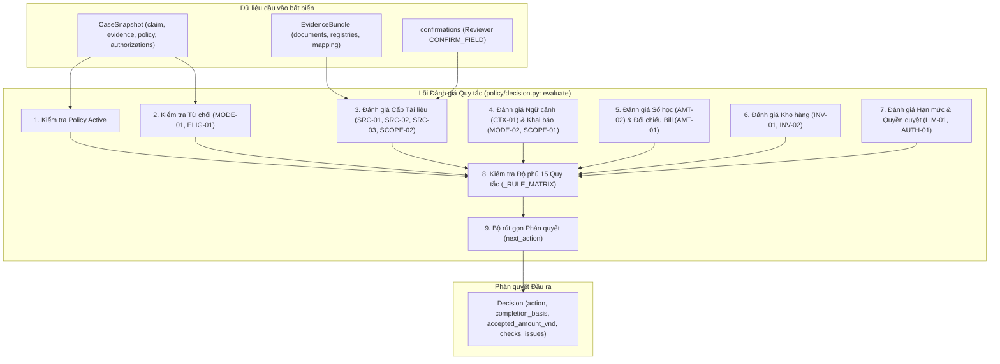
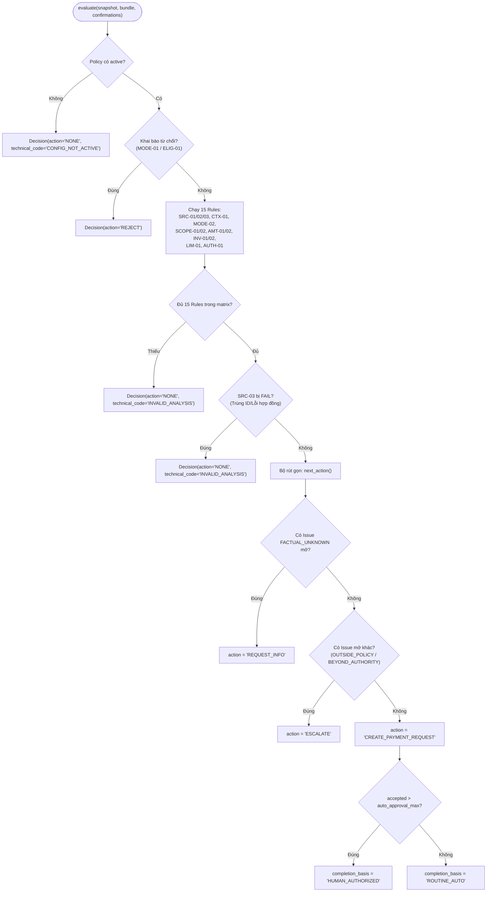

# P05 — Đánh giá chi phí và bộ rút gọn quyết định (Expense Decisions & Decision Reducer)

> **Part ID:** P05  
> **Slug:** expense-decision  
> **Phạm vi kiểm tra:** [src/invoice_referee/policy/expenses.py](file:///Users/tnhatnguyendev2805/Documents/Projects/InvoiceReferee/src/invoice_referee/policy/expenses.py), [src/invoice_referee/policy/decision.py](file:///Users/tnhatnguyendev2805/Documents/Projects/InvoiceReferee/src/invoice_referee/policy/decision.py), [tests/unit/test_expense_decisions.py](file:///Users/tnhatnguyendev2805/Documents/Projects/InvoiceReferee/tests/unit/test_expense_decisions.py), [B1_RULEBOOK.md §3, §5, §6](file:///Users/tnhatnguyendev2805/Documents/Projects/InvoiceReferee/docs/specs/B1_RULEBOOK.md#L51-L142).  
> **Commit hash:** `7edac6d` (gốc nhánh `rebuild`: `18626a7`)  
> **Ngày thực hiện:** 2026-10-05  
> **Lệnh kiểm chứng đã chạy:**  
> - `.venv/bin/python -m pytest tests/unit/test_expense_decisions.py -v` → [RUN 27 passed in 0.07s]  
> - `.venv/bin/python -m pytest tests/unit/test_inventory_arithmetic.py -q` → [RUN 37 passed in 0.06s]  
> - `.venv/bin/python -m pytest tests/unit/test_contracts.py -q` → [RUN 41 passed in 0.05s]  

---

## 1. Tóm tắt 5 dòng (Summary)

Hàm `evaluate` là cổng phán quyết duy nhất thực thi hoàn toàn bằng Python tất định.  
Hệ thống báo cáo đầy đủ 15 quy tắc nghiệp vụ theo ma trận chuẩn của Rulebook.  
Bộ rút gọn ưu tiên lỗi kỹ thuật, từ chối dứt khoát, rồi mới đến hỏi thông tin.  
Số tiền được chấp thuận không bao giờ bị cắt ngầm về hạn mức để tự động duyệt.  
Khoản chi trên năm triệu đồng bắt buộc phải có cả ngoại lệ và phê duyệt số tiền.  

---

## 2. Vị trí trong hệ thống (System Placement)

Sơ đồ thể hiện luồng tập hợp kết quả từ các bộ đánh giá con vào bộ rút gọn phán quyết [SOURCE](file:///Users/tnhatnguyendev2805/Documents/Projects/InvoiceReferee/src/invoice_referee/policy/decision.py#L186-L202):



---

## 3. Bài toán phục vụ (Business Rules & Requirements)

| Quy tắc / Yêu cầu nghiệp vụ | Đoạn đặc tả liên quan | Mã nguồn thực thi |
| :--- | :--- | :--- |
| **Ma trận 15 quy tắc bắt buộc:** Mọi quy tắc phải được báo cáo đúng một lần. | [B1_RULEBOOK.md §3](file:///Users/tnhatnguyendev2805/Documents/Projects/InvoiceReferee/docs/specs/B1_RULEBOOK.md#L51-L70) | [decision.py: _RULE_MATRIX](file:///Users/tnhatnguyendev2805/Documents/Projects/InvoiceReferee/src/invoice_referee/policy/decision.py#L37-L41) |
| **Từ chối chi trả cá nhân:** Khai báo mục đích cá nhân bị từ chối dứt khoát. | [B1_RULEBOOK.md §3](file:///Users/tnhatnguyendev2805/Documents/Projects/InvoiceReferee/docs/specs/B1_RULEBOOK.md#L63) | [decision.py: evaluate (ELIG-01)](file:///Users/tnhatnguyendev2805/Documents/Projects/InvoiceReferee/src/invoice_referee/policy/decision.py#L224-L239) |
| **Không cắt gọt số tiền:** Cấm tự cắt số tiền vượt hạn mức để biến thành tự động duyệt. | [B1_RULEBOOK.md §5](file:///Users/tnhatnguyendev2805/Documents/Projects/InvoiceReferee/docs/specs/B1_RULEBOOK.md#L103-L107) | [decision.py: evaluate (AMT-01)](file:///Users/tnhatnguyendev2805/Documents/Projects/InvoiceReferee/src/invoice_referee/policy/decision.py#L328-L351) |
| **Phân quyền hai lớp trên 5 triệu:** Cần cả ngoại lệ chính sách và phê duyệt số tiền. | [B1_RULEBOOK.md §5](file:///Users/tnhatnguyendev2805/Documents/Projects/InvoiceReferee/docs/specs/B1_RULEBOOK.md#L115-L119) | [decision.py: _policy_authority_checks](file:///Users/tnhatnguyendev2805/Documents/Projects/InvoiceReferee/src/invoice_referee/policy/decision.py#L417-L464) |
| **Ưu tiên bộ rút gọn:** Câu hỏi dữ kiện chưa rõ luôn ưu tiên trước leo thang thẩm quyền. | [B1_RULEBOOK.md §6](file:///Users/tnhatnguyendev2805/Documents/Projects/InvoiceReferee/docs/specs/B1_RULEBOOK.md#L128-L137) | [decision.py: next_action](file:///Users/tnhatnguyendev2805/Documents/Projects/InvoiceReferee/src/invoice_referee/policy/decision.py#L50-L61) |

---

## 4. Interface công khai (Public API)

| Ký hiệu (Symbol) | Đầu vào (Input) | Đầu ra (Output) | Ngoại lệ có thể ném | Vị trí mã nguồn |
| :--- | :--- | :--- | :--- | :--- |
| `evaluate` | `snapshot: CaseSnapshot`, `bundle: EvidenceBundle`, `confirmations=None` | `Decision` | Không ném ngoại lệ (bắt mọi lỗi thành technical code) | [decision.py:186](file:///Users/tnhatnguyendev2805/Documents/Projects/InvoiceReferee/src/invoice_referee/policy/decision.py#L186) |
| `next_action` | `technical: bool`, `refusal: bool`, `issues: list[Issue]` | `str` (DecisionAction) | Không ném ngoại lệ | [decision.py:50](file:///Users/tnhatnguyendev2805/Documents/Projects/InvoiceReferee/src/invoice_referee/policy/decision.py#L50) |
| `document_checks` | `doc: DocumentFacts`, `registry: SourceRegistry`, `policy: PolicyConfig`, `confirmations=None` | `list[CheckResult]` | Không ném ngoại lệ | [expenses.py:131](file:///Users/tnhatnguyendev2805/Documents/Projects/InvoiceReferee/src/invoice_referee/policy/expenses.py#L131) |
| `context_check` | `snapshot_claim: Claim`, `policy: PolicyConfig` | `CheckResult` | Không ném ngoại lệ | [expenses.py:169](file:///Users/tnhatnguyendev2805/Documents/Projects/InvoiceReferee/src/invoice_referee/policy/expenses.py#L169) |

---

## 5. Mô hình dữ liệu & Ràng buộc (Data Models & Constraints)

### 5.1. Mô hình Phán quyết (`Decision`)
Được định nghĩa tại [models.py:254-263](file:///Users/tnhatnguyendev2805/Documents/Projects/InvoiceReferee/src/invoice_referee/domain/models.py#L254-L263):
- `action: DecisionAction`: Một trong 5 hành động:
  - `CREATE_PAYMENT_REQUEST`: Mọi quy tắc đạt, tạo đơn đề nghị thanh toán.
  - `REQUEST_INFO`: Còn câu hỏi dữ kiện chưa rõ (`FACTUAL_UNKNOWN`), cần con người cung cấp.
  - `ESCALATE`: Dữ kiện đã đủ nhưng vượt thẩm quyền hoặc vượt chính sách, chuyển cấp duyệt.
  - `REJECT`: Từ chối dứt khoát theo quy định hỗ trợ (chi cá nhân, công nợ công ty).
  - `NONE`: Lỗi kỹ thuật hoặc chính sách chưa được kích hoạt.
- `completion_basis: CompletionBasis | None`: Căn cứ hoàn tất:
  - `ROUTINE_AUTO`: Khoản chi $\le 2.000.000đ$ đạt chuẩn tự động hoàn toàn.
  - `HUMAN_AUTHORIZED`: Khoản chi $> 2.000.000đ$ được người có thẩm quyền phê duyệt.
- `accepted_amount_vnd: StrictInt | None`: Số tiền nguyên dương được chấp thuận chi trả.

### 5.2. Mô hình Vấn đề Nghiệp vụ (`Issue`)
Được định nghĩa tại [models.py:229-238](file:///Users/tnhatnguyendev2805/Documents/Projects/InvoiceReferee/src/invoice_referee/domain/models.py#L229-L238):
- `issue_class`: `FACTUAL_UNKNOWN`, `OUTSIDE_POLICY`, hoặc `BEYOND_AUTHORITY`.
- `owner_mode`: Vai trò chịu trách nhiệm trả lời (`EMPLOYEE`, `REVIEWER`, `APPROVER`, `POLICY_OWNER`).
- `question`: Chuỗi văn bản mô tả câu hỏi cụ thể gửi tới người dùng.
- `refs`: Tọa độ tham chiếu chứng từ liên quan.
- `blockers`: Danh sách mã quy tắc bị chặn (ví dụ: `['AMT-01']`).

---

## 6. Luồng chi tiết (Detailed Flows)

### 6.1. Flowchart quyết định toàn trình của `evaluate`



---

## 7. Ví dụ chạy tay (Concrete Walkthrough)

Lấy ví dụ một hồ sơ công tác với hóa đơn thực tế là 2.500.000đ nhưng chưa có phê duyệt số tiền [TEST](file:///Users/tnhatnguyendev2805/Documents/Projects/InvoiceReferee/tests/unit/test_expense_decisions.py#L58-L72):

### 1. Dữ liệu đầu vào:
- `claim`: `profile = 'TRAVEL'`, `requested_amount_vnd = 2500000`, `purpose_type = 'BUSINESS'`, `trip = 'Đà Nẵng'`, `payer_type = 'PERSONAL'`.
- `policy`: `auto_approval_max = 2000000`, `standard_policy_max = 5000000`, `active = True`.
- `bundle`: Hóa đơn chính hợp lệ, trường `total` có `usability = 'USABLE'` với giá trị `2500000`.

### 2. Các bước xử lý trong `evaluate`:
1. **Khởi tạo & Readiness:** `policy.active == True`. Tiếp tục.
2. **Refusals:** `payer_type == 'PERSONAL'` $\rightarrow$ `MODE-01` PASS. `purpose_type == 'BUSINESS'` $\rightarrow$ `ELIG-01` PASS.
3. **Scope & Bill:** `profile != 'OTHER'` $\rightarrow$ `SCOPE-01` PASS. Có hóa đơn chính $\rightarrow$ `SRC-01` PASS.
4. **Document checks:** Các trường bắt buộc đủ $\rightarrow$ `SRC-02` PASS. ID duy nhất $\rightarrow$ `SRC-03` PASS. Tiền VND $\rightarrow$ `SCOPE-02` PASS.
5. **Context:** Có `trip` $\rightarrow$ `CTX-01` PASS. `payer_type` rõ $\rightarrow$ `MODE-02` PASS.
6. **Arithmetic & Amount:** `AMT-02` PASS. `requested == verified_total == 2500000` $\rightarrow$ `accepted = 2500000`, `AMT-01` PASS.
7. **Inventory:** Profile là `TRAVEL` $\rightarrow$ `INV-01`, `INV-02` nhận trạng thái `NOT_APPLICABLE`.
8. **Hạn mức & Thẩm quyền (`_policy_authority_checks`):**
   - So sánh với `standard_policy_max` (5.000.000đ): $2.500.000 \le 5.000.000 \rightarrow$ `LIM-01` **PASS**.
   - So sánh với `auto_approval_max` (2.000.000đ): $2.500.000 > 2.000.000 \rightarrow$ `AUTH-01` **FAIL**.
   - Tạo issue: `AUTH-01:case`, `issue_class = 'BEYOND_AUTHORITY'`, `owner_mode = 'APPROVER'`, câu hỏi: *"Khoản 2.500.000đ vượt quyền tự động; cần approval đúng số tiền."*
9. **Rút gọn quyết định (`next_action`):**
   - `technical = False`, `refusal = False`.
   - Kiểm tra `FACTUAL_UNKNOWN`: Không có issue nào.
   - Kiểm tra issue mở: Có 1 issue mở thuộc nhóm `BEYOND_AUTHORITY`.
   - Kết quả: `action = 'ESCALATE'`.

---

## 8. Bảng Invariant bắt buộc

| Invariant | Mã nguồn thực thi | Test chứng minh | Hậu quả nếu bị phá vỡ |
| :--- | :--- | :--- | :--- |
| **Không bao giờ cắt gọt số tiền (No clipping):** Số tiền accepted phải giữ nguyên số tiền có căn cứ. | [decision.py: evaluate](file:///Users/tnhatnguyendev2805/Documents/Projects/InvoiceReferee/src/invoice_referee/policy/decision.py#L330-L334) | [test_expense_decisions.py: test_above_standard_policy_carries_both_issues](file:///Users/tnhatnguyendev2805/Documents/Projects/InvoiceReferee/tests/unit/test_expense_decisions.py#L98) | Khoản chi vượt hạn mức bị âm thầm hạ thấp để tự duyệt, gây sai lệch sổ sách. |
| **Bảo toàn ma trận 15 quy tắc:** Mọi lần đánh giá đều phải có kết quả cho đủ 15 quy tắc. | [decision.py: evaluate](file:///Users/tnhatnguyendev2805/Documents/Projects/InvoiceReferee/src/invoice_referee/policy/decision.py#L380-L388) | [test_expense_decisions.py: test_every_rule_in_the_matrix_is_reported](file:///Users/tnhatnguyendev2805/Documents/Projects/InvoiceReferee/tests/unit/test_expense_decisions.py#L184) | Mất tính minh bạch và dấu vết kiểm toán cho các trường hợp đặc thù. |
| **Ngoại lệ không thay thế phê duyệt số tiền:** Cấp exception chỉ đóng LIM-01, không đóng AUTH-01. | [decision.py: _policy_authority_checks](file:///Users/tnhatnguyendev2805/Documents/Projects/InvoiceReferee/src/invoice_referee/policy/decision.py#L424-L459) | [test_expense_decisions.py: test_policy_exception_alone_does_not_close_authority](file:///Users/tnhatnguyendev2805/Documents/Projects/InvoiceReferee/tests/unit/test_expense_decisions.py#L117) | Quản lý có thể vô tình duyệt chi tiền mà không có hành động xác nhận số tiền cụ thể. |
| **Từ chối trước khi gọi AI:** Chi cá nhân hoặc công nợ công ty bị từ chối ngay từ lời khai. | [decision.py: evaluate](file:///Users/tnhatnguyendev2805/Documents/Projects/InvoiceReferee/src/invoice_referee/policy/decision.py#L214-L239) | [test_expense_decisions.py: test_known_company_payer_is_refused_before_providers](file:///Users/tnhatnguyendev2805/Documents/Projects/InvoiceReferee/tests/unit/test_expense_decisions.py#L152) | Lãng phí tài nguyên gọi OCR và LLM cho các hồ sơ chắc chắn không hợp lệ. |

---

## 9. Lỗi và phân loại (Error Handling Matrix)

| Tình huống phát sinh | Phân loại kết quả | Hành động (`action`) | Hướng xử lý của hệ thống |
| :--- | :--- | :---: | :--- |
| File cấu hình chính sách chưa kích hoạt (`active = False`) | Sự cố cấu hình | `NONE` | Gán `technical_code = 'CONFIG_NOT_ACTIVE'`, dừng xử lý. |
| Hồ sơ khai báo `payer_type` là `COMPANY`, `ADVANCE`, hoặc `VENDOR` | Ngoài luồng hoàn tiền B1 | `REJECT` | Từ chối hoàn ứng vì công ty đã thanh toán hoặc là công nợ. |
| Hồ sơ khai báo mục đích cá nhân (`purpose_type = 'PERSONAL'`) | Vi phạm tính hợp lệ | `REJECT` | Từ chối dứt khoát theo quy định `ELIG-01`. |
| Thiếu hóa đơn chính hoặc hóa đơn có chữ bị mờ | Dữ kiện chưa rõ | `REQUEST_INFO` | Đặt câu hỏi cho nhân viên bổ sung hoặc kế toán viên soát xét. |
| Số tiền đề nghị không khớp số tiền trên hóa đơn | Bất đồng dữ kiện tiền | `REQUEST_INFO` | Hỏi nhân viên giải trình phần tiền chênh lệch. |
| Hồ sơ thuộc profile `OTHER` chưa có trong danh mục | Ngoài phạm vi chính sách | `ESCALATE` | Chuyển `POLICY_OWNER` phân loại lại danh mục. |
| Khoản chi vượt hạn mức tự động 2 triệu nhưng $\le 5$ triệu | Vượt quyền tự động | `ESCALATE` | Chuyển `APPROVER` thực hiện phê duyệt số tiền. |
| Khoản chi vượt hạn mức chính sách chuẩn 5 triệu đồng | Vượt thẩm quyền chính sách | `ESCALATE` | Chuyển `POLICY_OWNER` cấp ngoại lệ và phê duyệt số tiền. |

---

## 10. Quyết định thiết kế (Design Decisions)

1. **Tách biệt hoàn toàn `POLICY_EXCEPTION` và `AMOUNT_APPROVAL`:**  
   - *Quyết định:* Phân định rõ 2 hành vi: chấp thuận miễn trừ chính sách (`LIM-01`) và phê duyệt hạn mức chi trả (`AUTH-01`) [SPEC §5](file:///Users/tnhatnguyendev2805/Documents/Projects/InvoiceReferee/docs/specs/B1_RULEBOOK.md#L115-L119).  
   - *Lý do:* Đảm bảo kiểm soát tài chính nghiêm ngặt, ngăn ngừa lỗ hổng "cho phép vi phạm đồng nghĩa với việc cho rút tiền tùy ý".  
   - *Phương án bị loại:* Gộp chung thành một nút duyệt duy nhất cho các khoản chi lớn.
2. **Ưu tiên giải quyết dữ kiện trước khi xin phê duyệt thẩm quyền:**  
   - *Quyết định:* Khi hồ sơ vừa có câu hỏi dữ kiện (`FACTUAL_UNKNOWN`) vừa vượt thẩm quyền (`BEYOND_AUTHORITY`), bộ rút gọn trả về `REQUEST_INFO` thay vì `ESCALATE` [SOURCE](file:///Users/tnhatnguyendev2805/Documents/Projects/InvoiceReferee/src/invoice_referee/policy/decision.py#L56-L59).  
   - *Lý do:* Người quản lý không thể ký duyệt một con số chưa chắc chắn hoặc hóa đơn còn nghi vấn.  
   - *Phương án bị loại:* Gửi đồng thời hai thông báo hoặc gửi thẳng lên cấp trên khi chưa rõ số tiền.
3. **Các ngưỡng chính sách mang tính bao gồm (Inclusive boundaries):**  
   - *Quyết định:* Đúng 2.000.000đ vẫn là tự động duyệt (`ROUTINE_AUTO`), đúng 5.000.000đ vẫn nằm trong thẩm quyền của Approver [SOURCE](file:///Users/tnhatnguyendev2805/Documents/Projects/InvoiceReferee/src/invoice_referee/policy/decision.py#L424,L444).  
   - *Lý do:* Tuân thủ chính xác ngôn ngữ nghiệp vụ: "khoản chi đến 2 triệu đồng được tự động duyệt".

---

## 11. Bản đồ kiểm thử (Test Map)

| Tệp kiểm thử | Tên bài kiểm thử | Hành vi kỹ thuật chứng minh |
| :--- | :--- | :--- |
| `test_expense_decisions.py` | `test_authority_boundaries` | Đúng 2 triệu tự động duyệt; trên 2 triệu leo thang Approver [TEST](file:///Users/tnhatnguyendev2805/Documents/Projects/InvoiceReferee/tests/unit/test_expense_decisions.py#L63). |
| `test_expense_decisions.py` | `test_standard_policy_max_is_inclusive_at_five_million` | Đúng 5 triệu không bị issue `OUTSIDE_POLICY` [TEST](file:///Users/tnhatnguyendev2805/Documents/Projects/InvoiceReferee/tests/unit/test_expense_decisions.py#L92). |
| `test_expense_decisions.py` | `test_above_standard_policy_carries_both_issues` | Khoản chi trên 5 triệu mang cả hai vấn đề LIM-01 và AUTH-01 [TEST](file:///Users/tnhatnguyendev2805/Documents/Projects/InvoiceReferee/tests/unit/test_expense_decisions.py#L98). |
| `test_expense_decisions.py` | `test_policy_exception_alone_does_not_close_authority` | Có exception nhưng thiếu amount approval vẫn bị ESCALATE [TEST](file:///Users/tnhatnguyendev2805/Documents/Projects/InvoiceReferee/tests/unit/test_expense_decisions.py#L117). |
| `test_expense_decisions.py` | `test_amount_approval_exact_enables_human_authorized_request` | Có amount approval chính xác cho phép tạo phiếu chi `HUMAN_AUTHORIZED` [TEST](file:///Users/tnhatnguyendev2805/Documents/Projects/InvoiceReferee/tests/unit/test_expense_decisions.py#L126). |
| `test_expense_decisions.py` | `test_known_personal_purpose_is_refused` | Khai báo mục đích cá nhân bị từ chối ngay lập tức [TEST](file:///Users/tnhatnguyendev2805/Documents/Projects/InvoiceReferee/tests/unit/test_expense_decisions.py#L145). |
| `test_expense_decisions.py` | `test_next_action_priority_order` | Kiểm tra thứ tự ưu tiên tuyệt đối của bộ rút gọn [TEST](file:///Users/tnhatnguyendev2805/Documents/Projects/InvoiceReferee/tests/unit/test_expense_decisions.py#L297). |

---

## 12. Đầu ra đặc biệt: Bảng chân trị (Truth Table) của Reducer

Bảng mô tả chính xác logic lựa chọn hành động phán quyết cuối cùng trong hàm `next_action`:

| Technical Failure? | Supported Refusal? | Có Issue `FACTUAL_UNKNOWN` mở? | Có Issue `OUTSIDE_POLICY` hoặc `BEYOND_AUTHORITY` mở? | Phán quyết cuối cùng (`DecisionAction`) | Căn cứ hoàn tất (`completion_basis`) |
| :---: | :---: | :---: | :---: | :---: | :---: |
| **ĐÚNG** | Bất kỳ | Bất kỳ | Bất kỳ | **`NONE`** | `None` |
| **SAI** | **ĐÚNG** | Bất kỳ | Bất kỳ | **`REJECT`** | `None` |
| **SAI** | **SAI** | **ĐÚNG** | Bất kỳ (kể cả có) | **`REQUEST_INFO`** | `None` |
| **SAI** | **SAI** | **SAI** | **ĐÚNG** | **`ESCALATE`** | `None` |
| **SAI** | **SAI** | **SAI** | **SAI** (hồ sơ sạch) | **`CREATE_PAYMENT_REQUEST`** | `ROUTINE_AUTO` ($\le 2tr$) hoặc `HUMAN_AUTHORIZED` ($> 2tr$) |

---

## 13. Trạng thái và lệch giữa Spec và Code

- **Trạng thái thực thi:** **`VERIFIED`** (toàn bộ 27 bài kiểm thử của `test_expense_decisions.py` chạy thành công trên HEAD `7edac6d`).
- **Lệch spec–code:** Không có độ lệch logic nghiệp vụ nào. Cả Rulebook §3 và mã nguồn `decision.py` hoàn toàn đồng nhất về 15 quy tắc, các ngưỡng bao gồm, và thứ tự ưu tiên của bộ rút gọn.

---

## 14. Rủi ro và nghi vấn (Risks & Questions)

1. **Rủi ro người dùng nhập số tiền không khớp do làm tròn:**  
   - *Mức độ:* Thấp (Low).  
   - *Nguy cơ:* Nhân viên nhập số tiền chẵn nhưng hóa đơn có số lẻ một vài đồng. Hệ thống sẽ kích hoạt `AMT-01` FAIL và hỏi lý do chênh lệch thay vì tự động làm tròn.  
   - *Đánh giá:* Đây là hành vi đúng theo tôn chỉ cấm đoán mò của hệ thống tài chính.

---

## 15. Bài tập thực hành (Practice Exercises)

*(Lưu ý: Các bài tập dành cho người đọc tự thực hành trên máy cá nhân).*

1. **Bài tập 1: Thử tự động cắt gọt số tiền (Clipping Bug).**  
   - Mở tệp [src/invoice_referee/policy/decision.py](file:///Users/tnhatnguyendev2805/Documents/Projects/InvoiceReferee/src/invoice_referee/policy/decision.py#L330).  
   - Sửa dòng gán `accepted`: `accepted = min(requested, policy.auto_approval_max)`.  
   - Chạy lệnh: `.venv/bin/python -m pytest tests/unit/test_expense_decisions.py -k "above_standard" -q`  
   - Quan sát bài kiểm tra fail vì số tiền bị cắt ngầm.  
   - Hoàn tác: `git checkout -- src/invoice_referee/policy/decision.py`
2. **Bài tập 2: Thử đảo lộn thứ tự ưu tiên của Reducer.**  
   - Mở tệp [src/invoice_referee/policy/decision.py](file:///Users/tnhatnguyendev2805/Documents/Projects/InvoiceReferee/src/invoice_referee/policy/decision.py#L56).  
   - Đổi chỗ hai câu lệnh `if`: kiểm tra `any(i.status == 'OPEN' for i in issues)` trước khi kiểm tra `FACTUAL_UNKNOWN`.  
   - Chạy lệnh: `.venv/bin/python -m pytest tests/unit/test_expense_decisions.py -k "priority" -q`  
   - Quan sát bài test `test_next_action_priority_order` bị fail.  
   - Hoàn tác: `git checkout -- src/invoice_referee/policy/decision.py`

---

## 16. Câu hỏi tự kiểm (Self-Check Questions)

1. *Dự đoán output:* Khoản chi 4.000.000đ hợp lệ nhưng chưa có ai duyệt. `Decision.action` là gì và câu hỏi gửi cho ai?
2. *Dự đoán output:* Khoản chi 6.000.000đ chỉ có `POLICY_EXCEPTION` từ `POLICY_OWNER`. `Decision.action` là gì?
3. *Dự đoán output:* Một hồ sơ vừa bị mờ chữ số tiền (`FACTUAL_UNKNOWN`), vừa có số tiền yêu cầu là 7.000.000đ. `next_action` trả về gì?
4. *Dự đoán output:* Nhân viên nộp khoản chi với `purpose_type = 'PERSONAL'`. Hệ thống có gọi OCR và trích xuất dòng hàng không?
5. *Sửa ở đâu:* Muốn nâng hạn mức tự động duyệt từ 2 triệu lên 3 triệu đồng thì sửa ở tệp nào?
6. *Sửa ở đâu:* Muốn bổ sung một quy tắc kiểm tra mới vào ma trận bắt buộc thì phải khai báo ở biến nào?
7. *Sửa ở đâu:* Câu hỏi cảnh báo chênh lệch số tiền giữa hóa đơn và khai báo được định dạng ở hàm nào?
8. *Vì sao:* Vì sao cấp ngoại lệ `POLICY_EXCEPTION` không thể tự động đóng quy tắc `AUTH-01`?
9. *Vì sao:* Vì sao khi `requested_amount_vnd` khác với tổng tiền trên hóa đơn, hệ thống không tự chọn số nhỏ hơn để duyệt?
10. *Vì sao:* Vì sao các khoản chi ngoài VND (`SCOPE-02`) không thể được giải quyết bằng một nút bấm override tự do?

<details>
<summary>👉 Xem đáp án chi tiết</summary>

1. **Đáp án:** `ESCALATE`, câu hỏi gửi cho `APPROVER` [SOURCE](file:///Users/tnhatnguyendev2805/Documents/Projects/InvoiceReferee/src/invoice_referee/policy/decision.py#L451-L458).
2. **Đáp án:** `ESCALATE`. Thiếu `AMOUNT_APPROVAL` nên quy tắc `AUTH-01` vẫn mở [SOURCE](file:///Users/tnhatnguyendev2805/Documents/Projects/InvoiceReferee/src/invoice_referee/policy/decision.py#L444-L458).
3. **Đáp án:** `REQUEST_INFO`. Dữ kiện chưa rõ luôn được ưu tiên giải quyết trước thẩm quyền [SOURCE](file:///Users/tnhatnguyendev2805/Documents/Projects/InvoiceReferee/src/invoice_referee/policy/decision.py#L56-L57).
4. **Đáp án:** Không. Hệ thống nhận diện từ chối dứt khoát tại bước `Refusals` trước khi gọi provider [SOURCE](file:///Users/tnhatnguyendev2805/Documents/Projects/InvoiceReferee/src/invoice_referee/policy/decision.py#L224-L239).
5. **Đáp án:** Sửa trường `auto_approval_max` trong tệp cấu hình chính sách [config/demo-policy.json](file:///Users/tnhatnguyendev2805/Documents/Projects/InvoiceReferee/config/demo-policy.json#L7).
6. **Đáp án:** Bổ sung vào bộ `_RULE_MATRIX` tại [src/invoice_referee/policy/decision.py:37](file:///Users/tnhatnguyendev2805/Documents/Projects/InvoiceReferee/src/invoice_referee/policy/decision.py#L37).
7. **Đáp án:** Hàm `_amount_conflict_question` tại [src/invoice_referee/policy/decision.py:497](file:///Users/tnhatnguyendev2805/Documents/Projects/InvoiceReferee/src/invoice_referee/policy/decision.py#L497).
8. **Đáp án:** Vì ngoại lệ chính sách chỉ xác nhận cho phép vượt giới hạn quy định, không thay thế quyết định giải ngân số tiền cụ thể [SPEC §5](file:///Users/tnhatnguyendev2805/Documents/Projects/InvoiceReferee/docs/specs/B1_RULEBOOK.md#L115-L119).
9. **Đáp án:** Vì hệ thống tài chính không được phép đoán mò; phần chênh lệch có thể là tiền tip cá nhân hoặc tiền mua ngoài không hợp lệ [SPEC §5](file:///Users/tnhatnguyendev2805/Documents/Projects/InvoiceReferee/docs/specs/B1_RULEBOOK.md#L103-L107).
10. **Đáp án:** Vì hệ thống B1 chưa có module quy đổi tỷ giá ngoại hối FX; không thể phê duyệt một năng lực kỹ thuật mà hệ thống chưa có [SPEC §3](file:///Users/tnhatnguyendev2805/Documents/Projects/InvoiceReferee/docs/specs/B1_RULEBOOK.md#L62).
</details>

---

## 17. Hướng dẫn điều khiển AI (Directing AI)

### a. Ngữ cảnh tối thiểu phải cung cấp cho AI:
- File phán quyết: `src/invoice_referee/policy/decision.py`.
- File chính sách chi phí: `src/invoice_referee/policy/expenses.py`.
- Đặc tả quy tắc: `docs/specs/B1_RULEBOOK.md §3, §5, §6`.

### b. Các Invariant bắt buộc nhắc AI duy trì:
1. "Không bao giờ được cắt số tiền về hạn mức để biến hồ sơ thành routine auto."
2. "Giữ nguyên thứ tự ưu tiên của hàm `next_action`: technical > refusal > factual unknown > escalate > create payment request."
3. "Đảm bảo mọi quy tắc trong `_RULE_MATRIX` luôn được báo cáo đầy đủ trong danh sách checks."
4. "Khoản chi trên 5 triệu đồng bắt buộc phải yêu cầu cả 2 phê duyệt riêng biệt: exception và amount approval."

### c. 6 Dấu hiệu nguy hiểm (Red Flags) trong diff của AI:
1. Thêm hàm `min()` để gán số tiền `accepted_amount_vnd`.
2. Thay đổi thứ tự các khối `if` trong hàm `next_action`.
3. Tự động chuyển `completion_basis = 'ROUTINE_AUTO'` cho các khoản chi trên 2 triệu đồng.
4. Bỏ qua việc kiểm tra `_closed_by_amount_approval` khi đã có `_closed_by_exception`.
5. Đổi mã lỗi hoặc không báo cáo các rule khi tài liệu thiếu registry.
6. Xóa bỏ kiểm tra `refusal` ở đầu hàm `evaluate`.

### d. Lệnh kiểm tra sau khi AI chỉnh sửa:
```bash
.venv/bin/python -m pytest tests/unit/test_expense_decisions.py -v
```

---

## 18. Glossary bổ sung

| Thuật ngữ | Định nghĩa kỹ thuật trong ngữ cảnh module |
| :--- | :--- |
| **Decision Reducer** | Bộ rút gọn phán quyết: hàm logic tổng hợp các issue và kết quả kiểm tra để đưa ra hành động duy nhất. |
| **Routine Auto** | Căn cứ hoàn tất tự động thường quy dành cho các hồ sơ hợp lệ dưới hạn mức tự duyệt. |
| **Human Authorized** | Căn cứ hoàn tất có sự phê duyệt của con người dành cho các hồ sơ vượt quyền tự động. |
| **No Clipping** | Nguyên tắc cấm cắt gọt số tiền đề nghị xuống mức trần để trốn tránh quy trình phê duyệt. |
| **Rule Matrix** | Ma trận 15 quy tắc nghiệp vụ cố định phải được báo cáo đầy đủ trong mọi lượt đánh giá. |

---

## 19. Phụ lục (Appendix)

- **CodeGraph query đã chạy:**  
  `evaluate decision.py expenses.py accepted amount authority reduce outcome question owner`
- **Các tệp mã nguồn đã đọc đầy đủ:**
  - `src/invoice_referee/policy/decision.py` (toàn bộ 503 dòng).
  - `src/invoice_referee/policy/expenses.py` (toàn bộ 191 dòng).
  - `tests/unit/test_expense_decisions.py` (toàn bộ 311 dòng).
  - `docs/specs/B1_RULEBOOK.md` (§3, §5, §6).
- **Giới hạn kiểm tra:**
  - Đánh giá chính sách là module thuần túy (pure Python), không thực hiện I/O mạng hay cơ sở dữ liệu.
