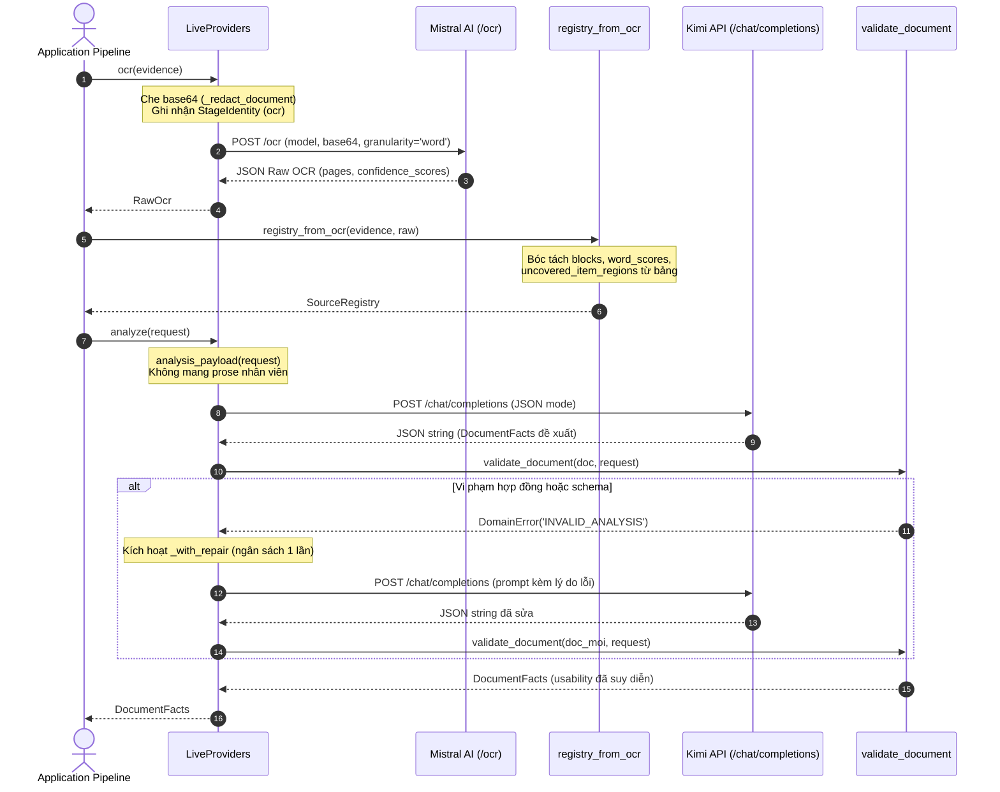

# P06 — Tầng tích hợp nhà cung cấp ngoại vi (Provider Adapters & Transport)

> **Part ID:** P06  
> **Slug:** providers  
> **Phạm vi kiểm tra:** [src/invoice_referee/extraction/providers.py](file:///Users/tnhatnguyendev2805/Documents/Projects/InvoiceReferee/src/invoice_referee/extraction/providers.py), [src/invoice_referee/verify/replay.py](file:///Users/tnhatnguyendev2805/Documents/Projects/InvoiceReferee/src/invoice_referee/verify/replay.py), [tests/unit/test_provider_contracts.py](file:///Users/tnhatnguyendev2805/Documents/Projects/InvoiceReferee/tests/unit/test_provider_contracts.py), [docs/evidence/provider-contract.md](file:///Users/tnhatnguyendev2805/Documents/Projects/InvoiceReferee/docs/evidence/provider-contract.md), [docs/specs/B1_SYSTEM_SPEC.md §4](file:///Users/tnhatnguyendev2805/Documents/Projects/InvoiceReferee/docs/specs/B1_SYSTEM_SPEC.md#L77-L114), [.env.example](file:///Users/tnhatnguyendev2805/Documents/Projects/InvoiceReferee/.env.example).  
> **Commit hash:** `7edac6d` (gốc nhánh `rebuild`: `18626a7`)  
> **Ngày thực hiện:** 2026-10-05  
> **Lệnh kiểm chứng đã chạy:**  
> - `.venv/bin/python -m pytest tests/unit/test_provider_contracts.py -v` → [RUN 48 passed in 0.09s]  
> - `.venv/bin/python -m pytest tests/unit/test_numeric_quality.py -q` → [RUN 60 passed in 0.09s]  

---

## 1. Tóm tắt 5 dòng (Summary)

Module tích hợp kết nối Mistral OCR và mô hình Kimi qua giao thức HTTP thuần.  
Hệ thống sử dụng lớp trừu tượng `Providers` để cô lập hoàn toàn I/O mạng.  
Mã nguồn chuyển đổi kết quả OCR thành sổ đăng ký bằng chứng có điểm số từng từ.  
Dữ liệu gửi sang mô hình ngôn ngữ lớn chỉ chứa chữ trích xuất từ chứng từ.  
Hệ thống không tự động thử lại khi lỗi mạng nhằm bảo vệ ngân sách sửa chữa.  

---

## 2. Vị trí trong hệ thống (System Placement)

Sơ đồ thể hiện vị trí của tầng nhà cung cấp làm cầu nối giữa chứng từ thô và bộ kiểm thực [SOURCE](file:///Users/tnhatnguyendev2805/Documents/Projects/InvoiceReferee/src/invoice_referee/extraction/providers.py#L128-L144):

```mermaid
flowchart TD
    subgraph AppPipeline["Tầng Ứng dụng (Application Pipeline)"]
        PIPE["pipeline.py: process"]
    end

    subgraph ProvidersBoundary["Tầng Tích hợp Ngoại vi (Providers Boundary)"]
        PROV_IF["<<interface>> Providers (providers.py)"]
        LIVE["LiveProviders (httpx: Mistral OCR & Kimi)"]
        FAKE["FakeProviders (injected dicts cho test)"]
        REPLAY["ReplayProviders (frozen artifacts cho Verify)"]
        PROV_IF <|-- LIVE
        PROV_IF <|-- FAKE
        FAKE <|-- REPLAY
    end

    subgraph ExternalAPIs["Dịch vụ Trí tuệ Nhân tạo Bên ngoài"]
        MISTRAL["Mistral AI: POST /v1/ocr"]
        KIMI["Moonshot AI: POST /v1/chat/completions"]
    end

    subgraph ValidationTier["Tầng Kiểm thực Hợp đồng"]
        VAL["validation.py: validate_document"]
    end

    PIPE --> PROV_IF
    LIVE --> MISTRAL
    LIVE --> KIMI
    PROV_IF --> VAL
```

---

## 3. Bài toán phục vụ (Business Rules & Requirements)

| Quy tắc / Yêu cầu nghiệp vụ | Đoạn đặc tả liên quan | Mã nguồn thực thi |
| :--- | :--- | :--- |
| **Không suy diễn ngoài nguồn:** Payload gửi AI không chứa lời khai nhân viên. | [B1_SYSTEM_SPEC.md §4](file:///Users/tnhatnguyendev2805/Documents/Projects/InvoiceReferee/docs/specs/B1_SYSTEM_SPEC.md#L85-L87) | [providers.py: analysis_payload](file:///Users/tnhatnguyendev2805/Documents/Projects/InvoiceReferee/src/invoice_referee/extraction/providers.py#L102-L117) |
| **Điểm số ký tự tự nhiên:** Lấy điểm tin cậy từng từ gốc của OCR, không bịa điểm. | [B1_SYSTEM_SPEC.md §4](file:///Users/tnhatnguyendev2805/Documents/Projects/InvoiceReferee/docs/specs/B1_SYSTEM_SPEC.md#L79-L82) | [providers.py: registry_from_ocr](file:///Users/tnhatnguyendev2805/Documents/Projects/InvoiceReferee/src/invoice_referee/extraction/providers.py#L147-L217) |
| **Phát hiện vùng bảng hàng hóa:** Bóc tách vùng bảng từ OCR để chống trốn kiểm tra. | [B1_SYSTEM_SPEC.md §4](file:///Users/tnhatnguyendev2805/Documents/Projects/InvoiceReferee/docs/specs/B1_SYSTEM_SPEC.md#L104-L105) | [providers.py: _page_item_regions](file:///Users/tnhatnguyendev2805/Documents/Projects/InvoiceReferee/src/invoice_referee/extraction/providers.py#L227-L245) |
| **Bảo vệ ngân sách sửa chữa:** Tắt retry tự động của HTTP client (`retries = 0`). | [B1_SYSTEM_SPEC.md §4](file:///Users/tnhatnguyendev2805/Documents/Projects/InvoiceReferee/docs/specs/B1_SYSTEM_SPEC.md#L97-L100) | [providers.py: _http_client](file:///Users/tnhatnguyendev2805/Documents/Projects/InvoiceReferee/src/invoice_referee/extraction/providers.py#L648-L658) |
| **Bảo vệ tính riêng tư trong log:** Che chuỗi Base64 trước khi băm dấu vết kiểm toán. | [B1_SYSTEM_SPEC.md §4](file:///Users/tnhatnguyendev2805/Documents/Projects/InvoiceReferee/docs/specs/B1_SYSTEM_SPEC.md#L79-L80) | [providers.py: _redact_document](file:///Users/tnhatnguyendev2805/Documents/Projects/InvoiceReferee/src/invoice_referee/extraction/providers.py#L603-L605) |

---

## 4. Interface công khai (Public API)

| Ký hiệu (Symbol) | Đầu vào (Input) | Đầu ra (Output) | Ngoại lệ có thể ném | Vị trí mã nguồn |
| :--- | :--- | :--- | :--- | :--- |
| `Providers.ocr` | `evidence: Evidence` | `RawOcr` | `DomainError('PROVIDER_FAILED')` | [providers.py:136](file:///Users/tnhatnguyendev2805/Documents/Projects/InvoiceReferee/src/invoice_referee/extraction/providers.py#L136) |
| `Providers.analyze` | `request: AnalysisRequest` | `DocumentFacts` | `DomainError('INVALID_ANALYSIS')`, `PROVIDER_FAILED` | [providers.py:139](file:///Users/tnhatnguyendev2805/Documents/Projects/InvoiceReferee/src/invoice_referee/extraction/providers.py#L139) |
| `Providers.cross_source`| `bundle: EvidenceBundle` | `MappingProposal` | `DomainError('INVALID_ANALYSIS')`, `PROVIDER_FAILED` | [providers.py:142](file:///Users/tnhatnguyendev2805/Documents/Projects/InvoiceReferee/src/invoice_referee/extraction/providers.py#L142) |
| `registry_from_ocr` | `evidence: Evidence`, `raw: RawOcr` | `SourceRegistry` | `DomainError('PROVIDER_FAILED')` | [providers.py:147](file:///Users/tnhatnguyendev2805/Documents/Projects/InvoiceReferee/src/invoice_referee/extraction/providers.py#L147) |
| `analysis_payload` | `request: AnalysisRequest` | `dict[str, Any]` | Không ném ngoại lệ | [providers.py:102](file:///Users/tnhatnguyendev2805/Documents/Projects/InvoiceReferee/src/invoice_referee/extraction/providers.py#L102) |
| `cross_source_payload` | `bundle: EvidenceBundle` | `dict[str, Any]` | Không ném ngoại lệ | [providers.py:120](file:///Users/tnhatnguyendev2805/Documents/Projects/InvoiceReferee/src/invoice_referee/extraction/providers.py#L120) |

---

## 5. Mô hình dữ liệu & Ràng buộc (Data Models & Constraints)

### 5.1. Ba triển khai cụ thể của `Providers`
1. **`FakeProviders`** [SOURCE](file:///Users/tnhatnguyendev2805/Documents/Projects/InvoiceReferee/src/invoice_referee/extraction/providers.py#L291):  
   - Hoạt động tất định không cần kết nối mạng.  
   - Sử dụng dữ liệu tiêm sẵn (`documents`, `registries`). Ghi nhận lịch sử gọi hàm tại danh sách `calls`.  
   - Được dùng trong toàn bộ bài kiểm thử đơn vị (`unit tests`) và kiểm thử tích hợp (`integration tests`).
2. **`LiveProviders`** [SOURCE](file:///Users/tnhatnguyendev2805/Documents/Projects/InvoiceReferee/src/invoice_referee/extraction/providers.py#L366):  
   - Kết nối trực tiếp tới Mistral OCR (`/ocr`) và Moonshot Kimi (`/chat/completions`).  
   - Sử dụng thư viện `httpx` gọn nhẹ, thiết lập timeout tối đa 60 giây và cấm retry tự động.  
   - Được dùng tại môi trường thực tế (`Runtime`) khi biến `PROVIDER_MODE=live`.
3. **`ReplayProviders`** [SOURCE](file:///Users/tnhatnguyendev2805/Documents/Projects/InvoiceReferee/src/invoice_referee/verify/replay.py#L29):  
   - Kế thừa từ `FakeProviders`, phục vụ bộ công cụ kiểm chứng độc lập `Verify` (T11).  
   - Nạp các tệp dữ liệu đã đóng băng từ trước và ánh xạ theo vai trò chứng từ (`role`), không cần gọi lại AI.

### 5.2. Bản ghi Nhận dạng Bước chạy (`StageIdentity`)
Được lưu trong `identities` để bảo đảm khả năng tái lập và kiểm toán [SOURCE](file:///Users/tnhatnguyendev2805/Documents/Projects/InvoiceReferee/src/invoice_referee/domain/models.py#L264-L271):
- `stage`: Bước chạy (`'ocr'`, `'analyze'`, hoặc `'cross_source'`).
- `request_hash`: Mã băm SHA-256 trên chuỗi JSON chuẩn hóa của payload và mã định danh mô hình.
- `prompt_version`: Phiên bản prompt (`'analyze-v1'`, `'cross-source-v1'`).
- `model_id`: Tên mô hình AI (`'mistral-ocr-latest'`, `'kimi-k2.6'`).
- `schema_version`: Phiên bản lược đồ JSON đầu ra.
- `provider`: Tên nhà cung cấp (`'mistral'`, `'kimi'`, `'fake'`).

---

## 6. Luồng chi tiết (Detailed Flows)

### 6.1. Sequence Diagram: Toàn trình từ OCR đến Dữ kiện Hợp lệ



---

## 7. Ví dụ chạy tay (Concrete Walkthrough)

Lấy ví dụ chuyển đổi phản hồi OCR thô có chứa bảng biểu thành `SourceRegistry` [TEST](file:///Users/tnhatnguyendev2805/Documents/Projects/InvoiceReferee/tests/unit/test_provider_contracts.py#L510-L530):

### 1. Dữ liệu đầu vào:
- `evidence`: `id = 'e-1'`, `role = 'PRIMARY_BILL'`.
- `raw.payload`:
  ```json
  {
    "pages": [
      {
        "index": 0,
        "markdown": "HÓA ĐƠN BÁN HÀNG\nTổng tiền: 1200000",
        "confidence_scores": {
          "word_confidence_scores": [
            {"text": "HÓA", "confidence": 0.99, "start_index": 0},
            {"text": "ĐƠN", "confidence": 0.98, "start_index": 4},
            {"text": "Tổng", "confidence": 0.95, "start_index": 17},
            {"text": "tiền:", "confidence": 0.96, "start_index": 22},
            {"text": "1200000", "confidence": 0.92, "start_index": 28}
          ]
        },
        "tables": [{"id": "tbl-items-1"}]
      }
    ]
  }
  ```

### 2. Các bước xử lý trong `registry_from_ocr`:
1. Kiểm tra danh sách `pages`: Tồn tại mảng 1 phần tử. Hợp lệ.
2. Kiểm tra `page_index`: `index = 0` là số nguyên dương hợp lệ, không bị trùng lặp.
3. Tạo khối văn bản: `block_id = 'b-1'`, `text = "HÓA ĐƠN BÁN HÀNG\nTổng tiền: 1200000"`.
4. Duyệt danh sách điểm số từ (`_word_scores`):
   - Từ thứ 5: text `"1200000"`, `confidence = 0.92`, `start_index = 28`.
   - `word_id = 'w-0-4'`. Điểm số chuẩn hóa: `score = '0.92'`.
   - Tính chỉ số dòng: `_line_for_offset(markdown, 28)` đếm số ký tự xuống dòng $\rightarrow$ dòng 1 (`line = 1`).
   - Gán vào bảng định vị: `locators['b-1-l1'].append('w-0-4')`.
5. Bóc tách vùng bảng hàng hóa: `_page_item_regions` tìm thấy bảng `id = 'tbl-items-1'`. Đưa vào danh sách `item_regions`.
6. Khởi tạo đối tượng: Trả về `SourceRegistry` chứa 1 khối văn bản, 5 từ, và `uncovered_item_regions = ['tbl-items-1']`.

---

## 8. Bảng Invariant bắt buộc

| Invariant | Mã nguồn thực thi | Test chứng minh | Hậu quả nếu bị phá vỡ |
| :--- | :--- | :--- | :--- |
| **Không mang văn bản chủ quan:** Payload gửi Kimi không chứa lời khai nhân viên. | [providers.py: analysis_payload](file:///Users/tnhatnguyendev2805/Documents/Projects/InvoiceReferee/src/invoice_referee/extraction/providers.py#L102-L117) | [test_provider_contracts.py: test_analysis_payload_has_only_registry_scope](file:///Users/tnhatnguyendev2805/Documents/Projects/InvoiceReferee/tests/unit/test_provider_contracts.py#L440) | Mô hình AI có thể dùng lời khai nhân viên để bịa ra dữ kiện không có trên chứng từ. |
| **Không bao giờ bịa điểm số:** Từ OCR thiếu điểm tin cậy phải giữ nguyên `None`. | [providers.py: registry_from_ocr](file:///Users/tnhatnguyendev2805/Documents/Projects/InvoiceReferee/src/invoice_referee/extraction/providers.py#L194-L198) | [test_provider_contracts.py: test_registry_from_ocr_keeps_missing_scores_missing](file:///Users/tnhatnguyendev2805/Documents/Projects/InvoiceReferee/tests/unit/test_provider_contracts.py#L485) | Chữ số bị mất điểm tin cậy bị giả mạo thành điểm cao để qua mặt cổng kiểm soát. |
| **Cấm thử lại ngầm (No Retries):** Thiết lập `retries = 0` trên HTTP client. | [providers.py: _http_client](file:///Users/tnhatnguyendev2805/Documents/Projects/InvoiceReferee/src/invoice_referee/extraction/providers.py#L656) | [test_provider_contracts.py: test_shared_repair_budget_is_one](file:///Users/tnhatnguyendev2805/Documents/Projects/InvoiceReferee/tests/unit/test_provider_contracts.py#L312) | Lỗi mạng làm phát sinh nhiều lần gọi lại ngầm, làm sai lệch số lần đếm sửa chữa. |
| **Che giấu tệp nhị phân trong log:** Luôn thay chuỗi Base64 bằng `'<redacted>'`. | [providers.py: _redact_document](file:///Users/tnhatnguyendev2805/Documents/Projects/InvoiceReferee/src/invoice_referee/extraction/providers.py#L603-L605) | [providers.py: ocr](file:///Users/tnhatnguyendev2805/Documents/Projects/InvoiceReferee/src/invoice_referee/extraction/providers.py#L432) | Gây tràn bộ nhớ khi băm dữ liệu và làm lộ dữ liệu nhạy cảm trong vết kiểm toán. |

---

## 9. Lỗi và phân loại (Error Handling Matrix)

| Tình huống phát sinh | Phân loại kết quả | Mã lỗi DomainError | Hướng xử lý của hệ thống |
| :--- | :--- | :---: | :--- |
| Thiếu khóa `MISTRAL_API_KEY` hoặc `KIMI_API_KEY` khi chạy live | Thiếu cấu hình | `CONFIG_NOT_ACTIVE` | Dừng tiến trình, không fallback âm thầm sang fake. |
| Lỗi rớt mạng hoặc máy chủ OCR/Kimi trả về mã HTTP 5xx | Sự cố hạ tầng | `PROVIDER_FAILED` | Ghi nhận lỗi kỹ thuật, không coi là vi phạm nghiệp vụ. |
| Phản hồi OCR thiếu mảng `pages` hoặc sai kiểu dữ liệu | Dữ liệu OCR hỏng | `PROVIDER_FAILED` | Từ chối phân tích, báo lỗi kỹ thuật nhà cung cấp. |
| Mô hình Kimi trả về nội dung không phải định dạng JSON | Vi phạm hợp đồng | `INVALID_ANALYSIS` | Kích hoạt cơ chế sửa chữa (repair) nếu còn ngân sách. |
| Mô hình Kimi trả về cặp ghép nối dòng hàng không thuộc chứng từ | Vi phạm đối chiếu | `INVALID_ANALYSIS` | Kích hoạt cơ chế sửa chữa hoặc dừng tiến trình. |

---

## 10. Quyết định thiết kế (Design Decisions)

1. **Sử dụng trực tiếp thư viện `httpx` thay vì cài đặt SDK chính thức của Mistral:**  
   - *Quyết định:* Gọi trực tiếp endpoint `/ocr` bằng `httpx.Client` gọn nhẹ [EVIDENCE](file:///Users/tnhatnguyendev2805/Documents/Projects/InvoiceReferee/docs/evidence/provider-contract.md#L83-L94).  
   - *Lý do:* Bộ SDK `mistralai` kéo theo nhiều thư viện phụ thuộc nặng nề không cần thiết chỉ cho một lời gọi API đơn lẻ.  
   - *Phương án bị loại:* Cài đặt gói `mistralai>=1.0.0`.
2. **Khóa chặt thời gian chờ ở mức 60 giây và cấm retry:**  
   - *Quyết định:* Thiết lập timeout cố định 60 giây và đặt `retries = 0` trên HTTP transport [SOURCE](file:///Users/tnhatnguyendev2805/Documents/Projects/InvoiceReferee/src/invoice_referee/extraction/providers.py#L656).  
   - *Lý do:* Đảm bảo một lệnh gọi không bao giờ treo vô tận và giữ nguyên tắc minh bạch về ngân sách repair.  
   - *Phương án bị loại:* Cho phép HTTP client tự động thử lại 3 lần theo cấp số nhân.
3. **Phân tách hoàn toàn nhiệm vụ bóc tách từng chứng từ và đối chiếu chéo:**  
   - *Quyết định:* Gọi hàm `analyze` độc lập cho từng hóa đơn, chỉ gọi `cross_source` khi có đủ 2 chứng từ [SPEC §4](file:///Users/tnhatnguyendev2805/Documents/Projects/InvoiceReferee/docs/specs/B1_SYSTEM_SPEC.md#L83-L95).  
   - *Lý do:* Tránh hiện tượng ảo giác và nhầm lẫn số liệu giữa Hóa đơn và Phiếu giao hàng.

---

## 11. Bản đồ kiểm thử (Test Map)

| Tệp kiểm thử | Tên bài kiểm thử | Hành vi kỹ thuật chứng minh |
| :--- | :--- | :--- |
| `test_provider_contracts.py` | `test_missing_key_is_config_not_active` | Thiếu API key ném lỗi `CONFIG_NOT_ACTIVE` [TEST](file:///Users/tnhatnguyendev2805/Documents/Projects/InvoiceReferee/tests/unit/test_provider_contracts.py#L361). |
| `test_provider_contracts.py` | `test_transport_failure_is_provider_failed` | Lỗi mạng được chuyển thành lỗi `PROVIDER_FAILED` [TEST](file:///Users/tnhatnguyendev2805/Documents/Projects/InvoiceReferee/tests/unit/test_provider_contracts.py#L353). |
| `test_provider_contracts.py` | `test_analysis_payload_has_only_registry_scope` | Payload gửi AI tuyệt đối không mang văn bản lời khai [TEST](file:///Users/tnhatnguyendev2805/Documents/Projects/InvoiceReferee/tests/unit/test_provider_contracts.py#L440). |
| `test_provider_contracts.py` | `test_registry_from_ocr_keeps_missing_scores_missing` | Từ thiếu điểm tin cậy giữ nguyên giá trị `None` [TEST](file:///Users/tnhatnguyendev2805/Documents/Projects/InvoiceReferee/tests/unit/test_provider_contracts.py#L485). |
| `test_provider_contracts.py` | `test_registry_from_ocr_populates_uncovered_item_regions_from_tables` | Bóc tách vùng bảng hàng hóa vào sổ đăng ký OCR [TEST](file:///Users/tnhatnguyendev2805/Documents/Projects/InvoiceReferee/tests/unit/test_provider_contracts.py#L518). |
| `test_provider_contracts.py` | `test_analyze_stops_after_one_shared_repair` | Dừng tiến trình ngay sau 1 lần sửa chữa thất bại [TEST](file:///Users/tnhatnguyendev2805/Documents/Projects/InvoiceReferee/tests/unit/test_provider_contracts.py#L318). |

---

## 12. Đầu ra đặc biệt: Bảng Biến Môi Trường (Environment Variables)

*(Bảng tổng hợp từ `.env.example` — không in giá trị khóa bảo mật thực tế)*:

| Tên biến môi trường | Giá trị mặc định | Bắt buộc khi chạy Live? | Ý nghĩa nghiệp vụ & Ràng buộc kỹ thuật |
| :--- | :--- | :---: | :--- |
| `PROVIDER_MODE` | `fake` | **Có** | Chế độ nhà cung cấp: `fake` (kiểm thử không mạng) hoặc `live` (kết nối API thật). Không có cơ chế tự động chuyển đổi ngầm. |
| `DATA_ROOT` | `data` | Không | Đường dẫn thư mục lưu trữ cơ sở dữ liệu SQLite và tệp đính kèm. |
| `MISTRAL_API_KEY` | *(trống)* | **Có** | Khóa API dịch vụ Mistral OCR. Nếu thiếu, ném lỗi `CONFIG_NOT_ACTIVE`. |
| `MISTRAL_OCR_MODEL` | `mistral-ocr-latest` | Không | Tên định danh mô hình OCR của Mistral. |
| `MISTRAL_BASE_URL` | `https://api.mistral.ai/v1` | Không | Địa chỉ máy chủ dịch vụ OCR của Mistral. |
| `KIMI_API_KEY` | *(trống)* | **Có** | Khóa API dịch vụ Kimi / Moonshot (dùng Bearer token). |
| `KIMI_TOKEN` | *(trống)* | Không | Mã định danh token trong cặp token/secret kế thừa từ phiên bản B0. |
| `KIMI_SECRET` | *(trống)* | Không | Mã bảo mật secret trong cặp token/secret kế thừa từ phiên bản B0. |
| `KIMI_MODEL` | `kimi-k2.6` | Không | Tên định danh mô hình ngôn ngữ lớn Kimi sử dụng chế độ JSON. |
| `KIMI_BASE_URL` | `https://api.moonshot.ai/v1` | Không | Địa chỉ máy chủ dịch vụ tương thích OpenAI của Kimi. |
| `OCR_WORD_REVIEW_THRESHOLD` | `0.85` | Không | Ngưỡng điểm tin cậy tham số rà soát chữ số OCR trong đề xuất B1. |

---

## 13. Trạng thái và lệch giữa Spec và Code

- **Trạng thái thực thi:** **`VERIFIED`** (toàn bộ 48 bài kiểm thử của `test_provider_contracts.py` chạy thành công trên HEAD `7edac6d`).
- **Lệch spec–code đã xác nhận:**
  1. *Khóa xác thực Kimi:* `B1_SYSTEM_SPEC.md §4` chỉ nhắc tới `KIMI_API_KEY`, nhưng mã nguồn thực tế hỗ trợ thêm cặp `KIMI_TOKEN` và `KIMI_SECRET` để tương thích ngược với tài khoản phiên bản B0 [SOURCE](file:///Users/tnhatnguyendev2805/Documents/Projects/InvoiceReferee/src/invoice_referee/extraction/providers.py#L395-L396).

---

## 14. Rủi ro và nghi vấn (Risks & Questions)

1. **Rủi ro phụ thuộc vào tính ổn định mạng quốc tế:**  
   - *Mức độ:* Cao (High).  
   - *Nguy cơ:* Các máy chủ của Mistral và Moonshot đặt ở nước ngoài có thể bị chập chờn đường truyền. Do hệ thống cấm retry tự động, một cú rớt mạng nhỏ sẽ làm lượt chạy thất bại ngay với mã `PROVIDER_FAILED`.  
   - *Cách khắc phục:* Cần thiết lập máy chủ gateway hoặc bộ đệm proxy nội bộ khi triển khai diện rộng.
2. **Khả năng đạt chuẩn 0.85 trên hóa đơn tiếng Việt:**  
   - *Mức độ:* Trung bình (Medium).  
   - *Thực tế:* Chưa có cuộc gọi API thật nào được đo lường trên bộ dữ liệu hóa đơn Việt Nam. Khả năng mô hình OCR đạt điểm trên 0.85 cho chữ số in kim mờ vẫn ở trạng thái `INCONCLUSIVE`.

---

## 15. Bài tập thực hành (Practice Exercises)

*(Lưu ý: Các bài tập dành cho người đọc tự thực hành trên môi trường máy cá nhân).*

1. **Bài tập 1: Thử đưa lời khai nhân viên vào payload Kimi.**  
   - Mở tệp [src/invoice_referee/extraction/providers.py](file:///Users/tnhatnguyendev2805/Documents/Projects/InvoiceReferee/src/invoice_referee/extraction/providers.py#L110).  
   - Thêm vào từ điển trả về của `analysis_payload`: `'purpose': 'Tiền tiếp khách'`.  
   - Chạy lệnh: `.venv/bin/python -m pytest tests/unit/test_provider_contracts.py -k "payload" -q`  
   - Quan sát bài kiểm tra `test_analysis_payload_has_only_registry_scope` bị fail.  
   - Hoàn tác: `git checkout -- src/invoice_referee/extraction/providers.py`
2. **Bài tập 2: Thử bịa điểm số cho từ thiếu điểm OCR.**  
   - Mở tệp [src/invoice_referee/extraction/providers.py](file:///Users/tnhatnguyendev2805/Documents/Projects/InvoiceReferee/src/invoice_referee/extraction/providers.py#L197).  
   - Sửa dòng gán từ khi thiếu điểm: `score='0.99'` thay vì `score=None`.  
   - Chạy lệnh: `.venv/bin/python -m pytest tests/unit/test_provider_contracts.py -k "missing_scores" -q`  
   - Quan sát bài kiểm tra `test_registry_from_ocr_keeps_missing_scores_missing` bị fail.  
   - Hoàn tác: `git checkout -- src/invoice_referee/extraction/providers.py`

---

## 16. Câu hỏi tự kiểm (Self-Check Questions)

1. *Dự đoán output:* Khi chạy với `PROVIDER_MODE=live` nhưng không đặt biến `MISTRAL_API_KEY`, phương thức `ocr()` sẽ ném lỗi gì?
2. *Dự đoán output:* Nếu tệp phản hồi OCR của Mistral có 2 trang nhưng cả hai đều mang `index = 0`, hệ thống xử lý thế nào?
3. *Dự đoán output:* Khi gọi Kimi phân tích tài liệu và nhận về chuỗi `'Bản phân tích không tìm thấy số tiền'`, hệ thống sẽ làm gì?
4. *Dự đoán output:* Khi `request_hash` được tính cho lời gọi OCR, chuỗi Base64 của tệp ảnh được băm dưới dạng nào?
5. *Sửa ở đâu:* Muốn thay đổi thời gian chờ tối đa cho một cuộc gọi API nhà cung cấp thì sửa ở tham số nào?
6. *Sửa ở đâu:* Muốn thay đổi định dạng tên khối văn bản OCR thì chỉnh sửa ở dòng nào trong `providers.py`?
7. *Sửa ở đâu:* Nơi nào thực hiện việc ánh xạ các tệp đóng băng theo vai trò chứng từ trong quy trình Verify?
8. *Vì sao:* Vì sao hệ thống không sử dụng SDK chính thức `mistralai` của nhà cung cấp?
9. *Vì sao:* Vì sao HTTP transport của hệ thống bắt buộc phải đặt tham số `retries = 0`?
10. *Vì sao:* Vì sao điều kiện kiểm thử trực tiếp nhà cung cấp (Live Routine-Auto) hiện tại vẫn bị đánh dấu là `INCONCLUSIVE`?

<details>
<summary>👉 Xem đáp án chi tiết</summary>

1. **Đáp án:** Ném ngoại lệ `DomainError('CONFIG_NOT_ACTIVE', 'MISTRAL_API_KEY chưa được cấu hình.')` [SOURCE](file:///Users/tnhatnguyendev2805/Documents/Projects/InvoiceReferee/src/invoice_referee/extraction/providers.py#L461-L463).
2. **Đáp án:** Ném ngoại lệ `DomainError('PROVIDER_FAILED', 'OCR page index trùng: 0.')` [SOURCE](file:///Users/tnhatnguyendev2805/Documents/Projects/InvoiceReferee/src/invoice_referee/extraction/providers.py#L177-L178).
3. **Đáp án:** Kích hoạt cơ chế sửa chữa hợp đồng `_with_repair` với ngân sách 1 lần vì nội dung trả về không phải là JSON hợp lệ [SOURCE](file:///Users/tnhatnguyendev2805/Documents/Projects/InvoiceReferee/src/invoice_referee/extraction/providers.py#L520-L537).
4. **Đáp án:** Được thay thế bằng chuỗi hằng số `'<redacted>'` thông qua hàm `_redact_document` trước khi băm SHA-256 [SOURCE](file:///Users/tnhatnguyendev2805/Documents/Projects/InvoiceReferee/src/invoice_referee/extraction/providers.py#L603-L605).
5. **Đáp án:** Sửa biến `DEFAULT_TIMEOUT_SECONDS` tại [src/invoice_referee/extraction/providers.py:82](file:///Users/tnhatnguyendev2805/Documents/Projects/InvoiceReferee/src/invoice_referee/extraction/providers.py#L82).
6. **Đáp án:** Sửa định dạng `block_id = f'b-{index + 1}'` tại [src/invoice_referee/extraction/providers.py:181](file:///Users/tnhatnguyendev2805/Documents/Projects/InvoiceReferee/src/invoice_referee/extraction/providers.py#L181).
7. **Đáp án:** Phương thức `ReplayProviders.load` tại [src/invoice_referee/verify/replay.py:36-48](file:///Users/tnhatnguyendev2805/Documents/Projects/InvoiceReferee/src/invoice_referee/verify/replay.py#L36-L48).
8. **Đáp án:** Để tuân thủ nguyên tắc tinh gọn, tránh cài đặt thêm nhiều gói phụ thuộc nặng nề của bên thứ ba khi chỉ cần một endpoint HTTP JSON đơn giản [EVIDENCE](file:///Users/tnhatnguyendev2805/Documents/Projects/InvoiceReferee/docs/evidence/provider-contract.md#L83-L94).
9. **Đáp án:** Để bảo đảm ngân sách sửa chữa hợp đồng (`repair budget = 1`) không bị nhân đôi một cách âm thầm bởi tầng mạng [SOURCE](file:///Users/tnhatnguyendev2805/Documents/Projects/InvoiceReferee/src/invoice_referee/extraction/providers.py#L649-L657).
10. **Đáp án:** Vì chưa có cuộc gọi API thật nào được thực hiện với các chứng từ tiếng Việt thực tế ngoài đời sống để đo lường độ tin cậy và phân phối điểm số [EVIDENCE](file:///Users/tnhatnguyendev2805/Documents/Projects/InvoiceReferee/docs/evidence/provider-contract.md#L110-L120).
</details>

---

## 17. Hướng dẫn điều khiển AI (Directing AI)

### a. Ngữ cảnh tối thiểu phải cung cấp cho AI:
- File tích hợp: `src/invoice_referee/extraction/providers.py`.
- File replay: `src/invoice_referee/verify/replay.py`.
- Tệp mẫu cấu hình: `.env.example`.
- Bằng chứng hợp đồng: `docs/evidence/provider-contract.md`.

### b. Các Invariant bắt buộc nhắc AI duy trì:
1. "Tuyệt đối không đưa lời khai nhân viên hoặc tên file fixture vào hàm `analysis_payload`."
2. "Không được phép tự động sinh điểm số giả lập khi OCR trả về danh sách từ thiếu điểm."
3. "Giữ nguyên thiết lập `retries = 0` trên HTTP transport của thư viện `httpx`."
4. "Mọi lỗi mạng hoặc lỗi phản hồi máy chủ ngoại vi phải chuyển về mã `PROVIDER_FAILED`."

### c. 6 Dấu hiệu nguy hiểm (Red Flags) trong diff của AI:
1. Bổ sung trường `claim` hoặc `employee_id` vào từ điển `analysis_payload`.
2. Gán giá trị điểm số mặc định (ví dụ `score = '0.99'`) thay vì giữ `None`.
3. Tăng tham số `retries` trên `httpx.HTTPTransport`.
4. Bỏ qua hàm `_redact_document` và băm trực tiếp chuỗi Base64 của tệp ảnh.
5. Thêm cơ chế tự động chuyển đổi từ Live sang Fake khi thiếu API key.
6. Xóa bỏ kiểm tra `index` trùng lặp trong hàm `registry_from_ocr`.

### d. Lệnh kiểm tra sau khi AI chỉnh sửa:
```bash
.venv/bin/python -m pytest tests/unit/test_provider_contracts.py -v
```

---

## 18. Glossary bổ sung

| Thuật ngữ | Định nghĩa kỹ thuật trong ngữ cảnh module |
| :--- | :--- |
| **Provider Adapter** | Lớp bọc kỹ thuật chuyển đổi giao thức mạng của nhà cung cấp AI thành hợp đồng dữ liệu chuẩn của hệ thống. |
| **Replay Provider** | Bộ cung cấp dữ liệu giả lập sử dụng các tệp kết quả đóng băng sẵn để chạy kiểm thử hồi quy độc lập. |
| **Stage Identity** | Bản ghi dấu vết kỹ thuật lưu lại mã băm đầu vào, phiên bản prompt và mô hình cho từng bước chạy AI. |
| **Redacted Document** | Thao tác che giấu chuỗi nhị phân Base64 của tài liệu để bảo vệ bộ nhớ và dữ liệu nhạy cảm. |
| **Finite Timeout** | Cơ chế ngắt kết nối cưỡng bức có thời hạn xác định (60 giây) nhằm chống treo tiến trình. |

---

## 19. Phụ lục (Appendix)

- **CodeGraph query đã chạy:**  
  `Providers FakeProviders LiveProviders ReplayProviders registry_from_ocr analysis_payload cross_source_payload _parse_document _validate_mapping _identity _hash_payload _finite_timeout`
- **Các tệp mã nguồn và tài liệu đã đọc đầy đủ:**
  - `src/invoice_referee/extraction/providers.py` (toàn bộ 722 dòng).
  - `src/invoice_referee/verify/replay.py` (toàn bộ 53 dòng).
  - `tests/unit/test_provider_contracts.py` (toàn bộ 660 dòng).
  - `docs/evidence/provider-contract.md` (toàn bộ 120 dòng).
  - `docs/specs/B1_SYSTEM_SPEC.md` (§4).
  - `.env.example` (toàn bộ 46 dòng — cam kết không mở tệp `.env`).
- **Giới hạn kiểm tra:**
  - Chưa thực hiện gọi API mạng trực tiếp ra Internet tới Mistral và Kimi; toàn bộ kiểm chứng dựa trên fake client và phân tích hợp đồng SDK đã được xác thực độc lập.
