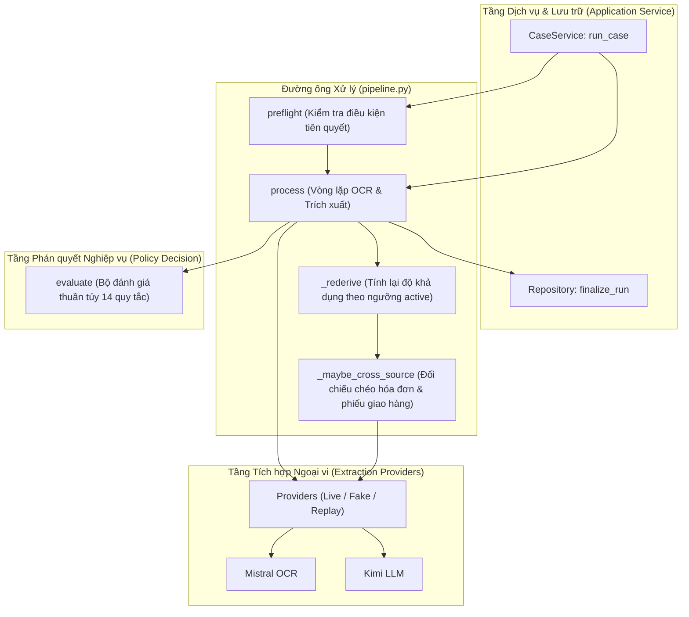
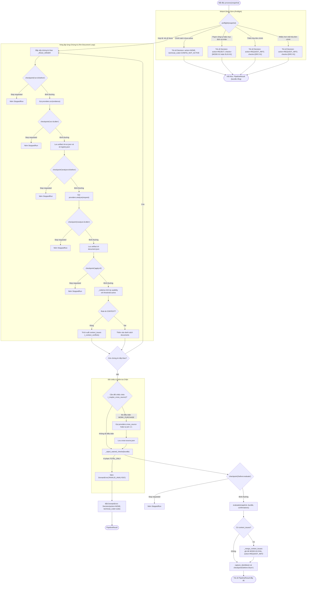

# P07 — Đường ống điều phối toàn trình (Production Pipeline & Vertical Slice)

> **Part ID:** P07  
> **Slug:** pipeline  
> **Phạm vi kiểm tra:** [src/invoice_referee/application/pipeline.py](file:///Users/tnhatnguyendev2805/Documents/Projects/InvoiceReferee/src/invoice_referee/application/pipeline.py), [tests/integration/test_pipeline.py](file:///Users/tnhatnguyendev2805/Documents/Projects/InvoiceReferee/tests/integration/test_pipeline.py), [docs/specs/B1_SYSTEM_SPEC.md §6](file:///Users/tnhatnguyendev2805/Documents/Projects/InvoiceReferee/docs/specs/B1_SYSTEM_SPEC.md#L160-L205).  
> **Commit hash:** `7edac6d` (gốc nhánh `rebuild`: `18626a7`)  
> **Ngày thực hiện:** 2026-10-05  
> **Lệnh kiểm chứng đã chạy:**  
> - `.venv/bin/python -m pytest tests/integration/test_pipeline.py -v` → [RUN 21 passed in 0.03s]  
> - `.venv/bin/python -m pytest tests/unit/test_provider_contracts.py -q` → [RUN 48 passed in 0.09s]  
> - `.venv/bin/python -m pytest tests/unit/test_numeric_quality.py -q` → [RUN 60 passed in 0.09s]  

---

## 1. Tóm tắt 5 dòng (Summary)

Module đường ống kết nối toàn bộ tiến trình từ chứng từ thô đến phán quyết cuối cùng.  
Hàm `preflight` ngắt sớm các hồ sơ không hợp lệ mà không tiêu tốn tài nguyên mạng.  
Hàm `process` duyệt từng chứng từ để lấy dữ liệu OCR và trích xuất dữ kiện.  
Cơ chế tính lại độ khả dụng áp dụng trực tiếp ngưỡng tin cậy của chính sách đang kích hoạt.  
Các điểm kiểm tra dừng khẩn cấp ngăn chặn triệt để dữ liệu đến muộn ghi đè vào hồ sơ.  

---

## 2. Vị trí trong hệ thống (System Placement)

Sơ đồ thể hiện vị trí trung tâm của module điều phối trong kiến trúc hệ thống [SOURCE](file:///Users/tnhatnguyendev2805/Documents/Projects/InvoiceReferee/src/invoice_referee/application/pipeline.py#L8-L13):



---

## 3. Bài toán phục vụ (Business Rules & Requirements)

| Quy tắc / Yêu cầu nghiệp vụ | Đoạn đặc tả liên quan | Mã nguồn thực thi |
| :--- | :--- | :--- |
| **Dừng sớm không tốn token:** Ngắt hồ sơ thiếu cấu hình hoặc vi phạm rõ ràng trước khi gọi AI. | [B1_SYSTEM_SPEC.md §6](file:///Users/tnhatnguyendev2805/Documents/Projects/InvoiceReferee/docs/specs/B1_SYSTEM_SPEC.md#L164-L168) | [pipeline.py: preflight](file:///Users/tnhatnguyendev2805/Documents/Projects/InvoiceReferee/src/invoice_referee/application/pipeline.py#L85-L100) |
| **Không dùng AI tìm file thiếu:** Thiếu hóa đơn chính gốc phải yêu cầu bổ sung bằng mã nguồn. | [B1_SYSTEM_SPEC.md §6](file:///Users/tnhatnguyendev2805/Documents/Projects/InvoiceReferee/docs/specs/B1_SYSTEM_SPEC.md#L198-L200) | [pipeline.py: _missing_primary](file:///Users/tnhatnguyendev2805/Documents/Projects/InvoiceReferee/src/invoice_referee/application/pipeline.py#L119-L133) |
| **Bảo đảm ngưỡng tin cậy động:** Tính lại độ khả dụng bằng ngưỡng rà soát đang hoạt động. | [B1_SYSTEM_SPEC.md §4](file:///Users/tnhatnguyendev2805/Documents/Projects/InvoiceReferee/docs/specs/B1_SYSTEM_SPEC.md#L106-L109) | [pipeline.py: _rederive](file:///Users/tnhatnguyendev2805/Documents/Projects/InvoiceReferee/src/invoice_referee/application/pipeline.py#L289-L311) |
| **Bảo vệ tính áp dụng của quy tắc:** Cấm dùng khuôn mẫu `TOTAL_ONLY` để trốn kiểm tra phân rã. | [B1_SYSTEM_SPEC.md §4](file:///Users/tnhatnguyendev2805/Documents/Projects/InvoiceReferee/docs/specs/B1_SYSTEM_SPEC.md#L104-L105) | [pipeline.py: _reject_waived_checks](file:///Users/tnhatnguyendev2805/Documents/Projects/InvoiceReferee/src/invoice_referee/application/pipeline.py#L313-L327) |
| **Triệt tiêu phản hồi đến muộn:** Điểm kiểm tra ném `StoppedRun` để hủy bỏ tiến trình ngay khi có lệnh dừng. | [B1_SYSTEM_SPEC.md §6](file:///Users/tnhatnguyendev2805/Documents/Projects/InvoiceReferee/docs/specs/B1_SYSTEM_SPEC.md#L182-L186) | [pipeline.py: run_stage](file:///Users/tnhatnguyendev2805/Documents/Projects/InvoiceReferee/src/invoice_referee/application/pipeline.py#L196-L202) |
| **Bảo toàn bằng chứng context:** Phát hiện mâu thuẫn người thanh toán từ tài liệu ngữ cảnh bổ trợ. | [B1_SYSTEM_SPEC.md §6](file:///Users/tnhatnguyendev2805/Documents/Projects/InvoiceReferee/docs/specs/B1_SYSTEM_SPEC.md#L177-L179) | [pipeline.py: _context_conflicts](file:///Users/tnhatnguyendev2805/Documents/Projects/InvoiceReferee/src/invoice_referee/application/pipeline.py#L434-L450) |

---

## 4. Interface công khai (Public API)

| Ký hiệu (Symbol) | Đầu vào (Input) | Đầu ra (Output) | Ngoại lệ có thể ném | Vị trí mã nguồn |
| :--- | :--- | :--- | :--- | :--- |
| `preflight` | `snapshot: CaseSnapshot` | `Decision \| None` | Không ném ngoại lệ | [pipeline.py:85](file:///Users/tnhatnguyendev2805/Documents/Projects/InvoiceReferee/src/invoice_referee/application/pipeline.py#L85) |
| `process` | `snapshot: CaseSnapshot`, `providers: Providers`, `checkpoint: Checkpoint`, `artifact_writer: ArtifactWriter`, `confirmations=None` | `PipelineResult` | `StoppedRun` | [pipeline.py:163](file:///Users/tnhatnguyendev2805/Documents/Projects/InvoiceReferee/src/invoice_referee/application/pipeline.py#L163) |
| `_rederive` | `document: DocumentFacts`, `registry: SourceRegistry`, `policy: PolicyConfig` | `DocumentFacts` | Không ném ngoại lệ | [pipeline.py:289](file:///Users/tnhatnguyendev2805/Documents/Projects/InvoiceReferee/src/invoice_referee/application/pipeline.py#L289) |
| `_maybe_cross_source` | `snapshot`, `documents`, `registries`, `providers`, `run_stage`, `artifact_writer`, `artifacts` | `MappingProposal \| None` | `StoppedRun`, `DomainError` | [pipeline.py:351](file:///Users/tnhatnguyendev2805/Documents/Projects/InvoiceReferee/src/invoice_referee/application/pipeline.py#L351) |

---

## 5. Mô hình dữ liệu & Ràng buộc (Data Models & Constraints)

### 5.1. Cấu trúc kết quả đường ống (`PipelineResult`)
Được tạo khi kết thúc hàm `process` để chuyển giao cho kho lưu trữ [SOURCE](file:///Users/tnhatnguyendev2805/Documents/Projects/InvoiceReferee/src/invoice_referee/domain/models.py#L273-L281):
- `decision: Decision`: Phán quyết nghiệp vụ cuối cùng cùng các kiểm tra và câu hỏi.
- `bundle: EvidenceBundle`: Toàn bộ dữ kiện chứng từ, sổ đăng ký và ánh xạ hàng hóa.
- `artifacts: list[str]`: Danh sách đường dẫn các tệp trung gian đã ghi vào đĩa.
- `identities: list[StageIdentity]`: Danh sách dấu vết kiểm toán của từng cuộc gọi AI.
- `stage_durations_ms: dict[str, int]`: Thời gian thực thi từng giai đoạn tính bằng mili-giây.
- `provider_calls: int`: Tổng số lượt gọi thực tế tới các nhà cung cấp ngoại vi.
- `repair_calls: int`: Số lượt đã kích hoạt cơ chế tự động sửa lỗi cấu trúc.

### 5.2. Thứ tự ưu tiên xử lý vai trò chứng từ (`_ROLE_ORDER`)
Đường ống sắp xếp các chứng từ đầu vào theo thứ tự cố định [SOURCE](file:///Users/tnhatnguyendev2805/Documents/Projects/InvoiceReferee/src/invoice_referee/application/pipeline.py#L77):
1. `PRIMARY_BILL` (độ ưu tiên 0): Hóa đơn bán hàng chính của hồ sơ.
2. `GOODS_RECEIPT` (độ ưu tiên 1): Phiếu giao nhận hàng hoặc biên bản bàn giao.
3. `CONTEXT` (độ ưu tiên 2): Tài liệu bổ trợ như email xác nhận hoặc hợp đồng.

---

## 6. Luồng chi tiết (Detailed Flows)

### 6.1. Flowchart Toàn trình: `preflight` và `process`



### 6.2. Các bước xử lý chi tiết trong hàm `process`
1. **Kiểm tra sơ bộ (`preflight`):**  
   Hàm gọi `preflight(snapshot)` tại dòng 217 [SOURCE](file:///Users/tnhatnguyendev2805/Documents/Projects/InvoiceReferee/src/invoice_referee/application/pipeline.py#L217). Nếu trả về một đối tượng `Decision`, đường ống trả về kết quả ngay và không gọi bất kỳ nhà cung cấp nào.
2. **Khởi tạo dữ liệu thu thập:**  
   Khởi tạo danh sách `documents`, từ điển `registries`, và danh sách câu hỏi ngữ cảnh `context_issues` [SOURCE](file:///Users/tnhatnguyendev2805/Documents/Projects/InvoiceReferee/src/invoice_referee/application/pipeline.py#L221-L223).
3. **Thực thi vòng lặp từng chứng từ:**  
   Duyệt qua danh sách chứng từ đã sắp xếp theo thứ tự `PRIMARY_BILL` $\rightarrow$ `GOODS_RECEIPT` $\rightarrow$ `CONTEXT` [SOURCE](file:///Users/tnhatnguyendev2805/Documents/Projects/InvoiceReferee/src/invoice_referee/application/pipeline.py#L226):
   - Chạy bước `ocr` qua hàm bọc `run_stage` có điểm dừng kiểm tra trước và sau [SOURCE](file:///Users/tnhatnguyendev2805/Documents/Projects/InvoiceReferee/src/invoice_referee/application/pipeline.py#L227).
   - Ghi tệp lưu trữ `{evidence.id}-ocr.json` và `{evidence.id}-registry.json` [SOURCE](file:///Users/tnhatnguyendev2805/Documents/Projects/InvoiceReferee/src/invoice_referee/application/pipeline.py#L228-L232).
   - Tạo yêu cầu `AnalysisRequest` và chạy bước `analyze` qua `run_stage` [SOURCE](file:///Users/tnhatnguyendev2805/Documents/Projects/InvoiceReferee/src/invoice_referee/application/pipeline.py#L235-L241).
   - Ghi tệp lưu trữ `{evidence.id}-document.json` [SOURCE](file:///Users/tnhatnguyendev2805/Documents/Projects/InvoiceReferee/src/invoice_referee/application/pipeline.py#L242).
   - Kiểm tra điểm dừng `checkpoint(f'apply:{evidence.id}')` [SOURCE](file:///Users/tnhatnguyendev2805/Documents/Projects/InvoiceReferee/src/invoice_referee/application/pipeline.py#L245).
   - Tính lại độ khả dụng bằng hàm `_rederive` với ngưỡng `policy.word_review_threshold` [SOURCE](file:///Users/tnhatnguyendev2805/Documents/Projects/InvoiceReferee/src/invoice_referee/application/pipeline.py#L246).
   - Nếu vai trò là `CONTEXT`, bóc tách mâu thuẫn thanh toán qua `_context_conflicts`; nếu không, đưa tài liệu vào `documents` [SOURCE](file:///Users/tnhatnguyendev2805/Documents/Projects/InvoiceReferee/src/invoice_referee/application/pipeline.py#L247-L250).
4. **Đối chiếu chéo và kiểm tra chống trốn luật:**  
   - Thực hiện `_maybe_cross_source` cho hồ sơ `WORK_PURCHASE` nếu đủ điều kiện dùng được [SOURCE](file:///Users/tnhatnguyendev2805/Documents/Projects/InvoiceReferee/src/invoice_referee/application/pipeline.py#L252).
   - Đóng gói gói bằng chứng `EvidenceBundle`. Gọi `_reject_waived_checks` để bắt lỗi khai báo `TOTAL_ONLY` trái phép [SOURCE](file:///Users/tnhatnguyendev2805/Documents/Projects/InvoiceReferee/src/invoice_referee/application/pipeline.py#L253-L254).
5. **Đánh giá phán quyết và trộn câu hỏi bổ trợ:**  
   - Kiểm tra điểm dừng `checkpoint('before:evaluate')` [SOURCE](file:///Users/tnhatnguyendev2805/Documents/Projects/InvoiceReferee/src/invoice_referee/application/pipeline.py#L261).
   - Thực thi hàm thuần túy `evaluate(snapshot, bundle, confirmations)` [SOURCE](file:///Users/tnhatnguyendev2805/Documents/Projects/InvoiceReferee/src/invoice_referee/application/pipeline.py#L262).
   - Nếu có mâu thuẫn từ tài liệu ngữ cảnh, ghi đè kiểm tra `MODE-02` thành `FAIL` và đổi hành động thành `REQUEST_INFO` [SOURCE](file:///Users/tnhatnguyendev2805/Documents/Projects/InvoiceReferee/src/invoice_referee/application/pipeline.py#L263-L264).
6. **Hoàn tất và đóng gói (`finish`):**  
   Thu thập toàn bộ `StageIdentity`, ghi nhận thời gian từng bước, kiểm tra điểm dừng cuối cùng `checkpoint('before:return')`, và trả về `PipelineResult` [SOURCE](file:///Users/tnhatnguyendev2805/Documents/Projects/InvoiceReferee/src/invoice_referee/application/pipeline.py#L204-L215).

---

## 7. Ví dụ chạy tay (Concrete Walkthrough)

Lấy ví dụ chạy thực tế từ bài kiểm thử quy trình thường quy hoàn ứng công tác [TEST](file:///Users/tnhatnguyendev2805/Documents/Projects/InvoiceReferee/tests/integration/test_pipeline.py#L146-L158) (`test_vertical_slice_routine_travel_creates_request`):

### 1. Dữ liệu đầu vào:
- **`snapshot.claim`:**
  - `employee_id = 'emp-demo'`, `profile = 'TRAVEL'`, `purpose_type = 'BUSINESS'`.
  - `purpose = 'Công tác demo'`, `requested_amount_vnd = 1200000`, `payer_type = 'PERSONAL'`.
- **`snapshot.evidence`:**
  - 1 chứng từ duy nhất: `id = 'e-primary'`, `role = 'PRIMARY_BILL'`.
- **`snapshot.policy`:**
  - `active = True`, `version = 'demo-expense-v0.1-proposed'`, `auto_approval_max = 2000000`.
  - `word_review_threshold = '0.85'`.
- **`providers` (`FakeProviders`):**
  - Chứa `DocumentFacts` với tổng tiền `total = '1200000'`.
  - Chứa `SourceRegistry` với điểm tin cậy từ `score = '0.99'`.

### 2. Các bước xử lý trong hàm `process`:
1. **Kiểm tra `preflight`:**
   - `policy.active` là `True`, có đủ phiên bản hợp lệ $\rightarrow$ Không dừng.
   - `payer_type` là `'PERSONAL'`, `purpose_type` là `'BUSINESS'` $\rightarrow$ Không bị từ chối.
   - Danh sách `primaries` có đúng 1 phần tử (`e-primary`) $\rightarrow$ Không thiếu, không thừa.
   - `preflight` trả về `None` [SOURCE](file:///Users/tnhatnguyendev2805/Documents/Projects/InvoiceReferee/src/invoice_referee/application/pipeline.py#L100).
2. **Bước OCR cho `e-primary`:**
   - Gọi `checkpoint('ocr:e-primary:before')`.
   - `providers.ocr(evidence)` trả về `raw` chứa payload từ điển.
   - `durations['ocr:e-primary']` ghi nhận thời gian thực thi (ví dụ 1 ms).
   - Gọi `checkpoint('ocr:e-primary:after')`.
   - Ghi tệp `e-primary-ocr.json` và `e-primary-registry.json`.
3. **Bước Phân tích trích xuất cho `e-primary`:**
   - Tạo `AnalysisRequest` với các trường bắt buộc `['merchant', 'date', 'total', 'currency']`.
   - Gọi `checkpoint('analyze:e-primary:before')`.
   - `providers.analyze(request)` trả về `DocumentFacts`.
   - Gọi `checkpoint('analyze:e-primary:after')`.
   - Ghi tệp `e-primary-document.json`.
4. **Bước Tính lại độ khả dụng (`_rederive`):**
   - Gọi `checkpoint('apply:e-primary')`.
   - Ngưỡng kích hoạt: `threshold = Decimal('0.85')`.
   - Điểm số của từ khóa số tiền `1200000` trong sổ đăng ký là `0.99`.
   - Vì $0.99 \ge 0.85$, hàm gán `usability = 'USABLE'` cho trường `total`.
   - Đưa tài liệu vào danh sách `documents`.
5. **Bước Đối chiếu chéo:**
   - Vì hồ sơ có `profile = 'TRAVEL'` (khác `'WORK_PURCHASE'`), hàm `_maybe_cross_source` bỏ qua và trả về `None`.
6. **Bước Kiểm tra chống trốn luật (`_reject_waived_checks`):**
   - Tài liệu có khuôn mẫu `TOTAL_ONLY` và không có bảng hàng hóa chi tiết. Kiểm tra hợp lệ.
7. **Bước Phán quyết nghiệp vụ (`evaluate`):**
   - Gọi `checkpoint('before:evaluate')`.
   - Bộ đánh giá kiểm tra 14 quy tắc: Tất cả kiểm tra áp dụng đều đạt (`PASS`).
   - Số tiền đề xuất `1200000` nằm dưới hạn mức tự động `2000000`.
   - `evaluate` trả về: `action = 'CREATE_PAYMENT_REQUEST'`, `accepted_amount_vnd = 1200000`, `completion_basis = 'ROUTINE_AUTO'`.
8. **Bước Hoàn tất (`finish`):**
   - Thu thập 2 bản ghi `StageIdentity` (bước `ocr` và bước `analyze`).
   - Gọi `checkpoint('before:return')`.
   - Trả về `PipelineResult` với `provider_calls = 2`, `repair_calls = 0`.

---

## 8. Bảng Invariant bắt buộc

| Invariant | Mã nguồn thực thi | Test chứng minh | Hậu quả nếu bị phá vỡ |
| :--- | :--- | :--- | :--- |
| **Không gọi provider khi dừng sớm:** Lỗi cấu hình, từ chối rõ ràng, hoặc thiếu hóa đơn không được gọi mạng. | [pipeline.py: preflight](file:///Users/tnhatnguyendev2805/Documents/Projects/InvoiceReferee/src/invoice_referee/application/pipeline.py#L85-L100) | [test_pipeline.py: test_missing_primary_does_not_call_provider](file:///Users/tnhatnguyendev2805/Documents/Projects/InvoiceReferee/tests/integration/test_pipeline.py#L75) | Lãng phí chi phí gọi API và token cho những hồ sơ chắc chắn bị từ chối. |
| **Không dùng AI phát hiện thiếu file:** Thiếu hoặc thừa hóa đơn chính phải do mã nguồn quyết định. | [pipeline.py: _missing_primary, _ambiguous_primary](file:///Users/tnhatnguyendev2805/Documents/Projects/InvoiceReferee/src/invoice_referee/application/pipeline.py#L119-L151) | [test_pipeline.py: test_multiple_primary_asks_clarification_no_provider](file:///Users/tnhatnguyendev2805/Documents/Projects/InvoiceReferee/tests/integration/test_pipeline.py#L113) | AI có thể tự ý đoán chứng từ chính hoặc tạo câu hỏi mơ hồ ngoài thẩm quyền. |
| **Áp dụng đúng ngưỡng active:** Phải tính lại độ khả dụng theo ngưỡng của cấu hình chính sách hiện hành. | [pipeline.py: _rederive](file:///Users/tnhatnguyendev2805/Documents/Projects/InvoiceReferee/src/invoice_referee/application/pipeline.py#L289-L311) | [test_pipeline.py: test_active_threshold_re_derivation](file:///Users/tnhatnguyendev2805/Documents/Projects/InvoiceReferee/tests/integration/test_pipeline.py#L169) | Chính sách B2 điều chỉnh ngưỡng không có tác dụng thực tế trong phán quyết. |
| **Cấm trốn kiểm tra phân rã:** Chứng từ có dòng hàng chi tiết không được tự xưng `TOTAL_ONLY`. | [pipeline.py: _reject_waived_checks](file:///Users/tnhatnguyendev2805/Documents/Projects/InvoiceReferee/src/invoice_referee/application/pipeline.py#L313-L327) | [test_pipeline.py: test_total_only_with_items_cannot_waive_breakdown](file:///Users/tnhatnguyendev2805/Documents/Projects/InvoiceReferee/tests/integration/test_pipeline.py#L129) | Hồ sơ trốn tránh kiểm tra số học từng món hàng để tự động nhận tiền hoàn ứng. |
| **Triệt tiêu phản hồi muộn khi Stop:** Ném ngoại lệ `StoppedRun` trước khi áp dụng bất kỳ dữ kiện nào. | [pipeline.py: run_stage](file:///Users/tnhatnguyendev2805/Documents/Projects/InvoiceReferee/src/invoice_referee/application/pipeline.py#L196-L202) | [test_pipeline.py: test_stop_after_provider_call_does_not_apply_facts](file:///Users/tnhatnguyendev2805/Documents/Projects/InvoiceReferee/tests/integration/test_pipeline.py#L276) | Kết quả trả về muộn từ mạng đè lên hồ sơ đã bị người dùng hủy bỏ. |
| **Tách biệt lỗi kỹ thuật:** Lỗi mạng hoặc schema sai phải ra `NONE`, không ra vi phạm nghiệp vụ. | [pipeline.py: process](file:///Users/tnhatnguyendev2805/Documents/Projects/InvoiceReferee/src/invoice_referee/application/pipeline.py#L257-L259) | [test_pipeline.py: test_transport_failure_is_technical_none](file:///Users/tnhatnguyendev2805/Documents/Projects/InvoiceReferee/tests/integration/test_pipeline.py#L242) | Nhân viên bị từ chối hoàn ứng oan do sự cố kỹ thuật của nhà cung cấp AI. |

---

## 9. Lỗi và phân loại (Error Handling Matrix)

| Tình huống phát sinh | Phân loại kết quả | Mã lỗi DomainError | Hướng xử lý của hệ thống |
| :--- | :--- | :---: | :--- |
| Chính sách chưa active hoặc thiếu thông tin phiên bản | Lỗi cấu hình | `CONFIG_NOT_ACTIVE` | Dừng ngay tại preflight, trả về `action='NONE'`. |
| Hồ sơ khai báo người trả tiền là công ty hoặc tạm ứng | Từ chối nghiệp vụ | *(Không có)* | Dừng tại preflight, trả về `action='REJECT'`. |
| Hồ sơ không đính kèm hóa đơn chính | Thiếu dữ kiện | *(Không có)* | Dừng tại preflight, trả về `action='REQUEST_INFO'`. |
| Lỗi rớt mạng khi gọi OCR hoặc phân tích Kimi | Sự cố hạ tầng | `PROVIDER_FAILED` | Bắt tại đường ống, trả về `action='NONE'`, mã `PROVIDER_FAILED`. |
| Mô hình AI trả về dữ liệu sai lược đồ sau khi hết sửa chữa | Vi phạm hợp đồng | `INVALID_ANALYSIS` | Bắt tại đường ống, trả về `action='NONE'`, mã `INVALID_ANALYSIS`. |
| Người dùng bấm nút Stop khi tiến trình đang chạy | Ngắt khẩn cấp | `StoppedRun` | Ném ngoại lệ lan truyền lên tầng trên, không lưu phán quyết. |

---

## 10. Quyết định thiết kế (Design Decisions)

1. **Thực hiện dừng sớm (`preflight`) hoàn toàn bằng mã nguồn thuần túy:**  
   - *Quyết định:* Kiểm tra cấu hình và các lời khai loại trừ trước khi khởi tạo bất kỳ lời gọi API nào [SOURCE](file:///Users/tnhatnguyendev2805/Documents/Projects/InvoiceReferee/src/invoice_referee/application/pipeline.py#L85-L100).  
   - *Lý do:* Tiết kiệm chi phí, giảm thiểu độ trễ, và ngăn chặn việc gọi AI không có mục đích rõ ràng.  
   - *Phương án bị loại:* Luôn gửi toàn bộ chứng từ sang mô hình AI để hỏi xem hồ sơ có hợp lệ hay không.
2. **Tính lại độ khả dụng dữ kiện theo ngưỡng tin cậy động (`_rederive`):**  
   - *Quyết định:* Tầng hợp đồng kiểm tra ở ngưỡng cứng 0.85, nhưng đường ống tính lại theo `policy.word_review_threshold` [SOURCE](file:///Users/tnhatnguyendev2805/Documents/Projects/InvoiceReferee/src/invoice_referee/application/pipeline.py#L289-L311).  
   - *Lý do:* Cho phép chính sách B2 hiệu chỉnh ngưỡng tin cậy mà không phá vỡ hợp đồng dữ liệu đóng băng B1.  
   - *Phương án bị loại:* Khóa cứng vĩnh viễn ngưỡng tin cậy 0.85 trong toàn bộ hệ thống.
3. **Cơ chế tự động ánh xạ hàng hóa bằng tên chuẩn hóa khi mô hình im lặng:**  
   - *Quyết định:* Nếu Kimi không trả về cặp ghép nối nào và không báo xung đột, mã nguồn tự ghép nối 1:1 nếu tên chuẩn hóa khớp nhau duy nhất [SOURCE](file:///Users/tnhatnguyendev2805/Documents/Projects/InvoiceReferee/src/invoice_referee/application/pipeline.py#L393-L397).  
   - *Lý do:* Ngăn chặn trường hợp mô hình AI bỏ sót cặp hàng hóa hiển nhiên làm nghẽn hồ sơ hợp lệ.  
   - *Phương án bị loại:* Bắt buộc con người phải can thiệp thủ công mọi trường hợp AI không trả về cặp ghép nối.

---

## 11. Bản đồ kiểm thử (Test Map)

| Tệp kiểm thử | Tên bài kiểm thử | Hành vi kỹ thuật chứng minh |
| :--- | :--- | :--- |
| `test_pipeline.py` | `test_missing_primary_does_not_call_provider` | Thiếu hóa đơn chính dừng ngay và không gọi provider [TEST](file:///Users/tnhatnguyendev2805/Documents/Projects/InvoiceReferee/tests/integration/test_pipeline.py#L75). |
| `test_pipeline.py` | `test_inactive_config_is_technical_none_no_provider` | Chính sách không active dừng ngay với mã `CONFIG_NOT_ACTIVE` [TEST](file:///Users/tnhatnguyendev2805/Documents/Projects/InvoiceReferee/tests/integration/test_pipeline.py#L84). |
| `test_pipeline.py` | `test_company_payer_refusal_no_provider` | Khai báo công ty trả tiền bị từ chối ngay mà không gọi AI [TEST](file:///Users/tnhatnguyendev2805/Documents/Projects/InvoiceReferee/tests/integration/test_pipeline.py#L93). |
| `test_pipeline.py` | `test_multiple_primary_asks_clarification_no_provider` | Nhiều hóa đơn chính yêu cầu làm rõ mà không tự chọn tệp đầu [TEST](file:///Users/tnhatnguyendev2805/Documents/Projects/InvoiceReferee/tests/integration/test_pipeline.py#L113). |
| `test_pipeline.py` | `test_total_only_with_items_cannot_waive_breakdown` | Bắt lỗi `INVALID_ANALYSIS` khi khai `TOTAL_ONLY` trái phép [TEST](file:///Users/tnhatnguyendev2805/Documents/Projects/InvoiceReferee/tests/integration/test_pipeline.py#L129). |
| `test_pipeline.py` | `test_vertical_slice_routine_travel_creates_request` | Toàn trình công tác thường quy tạo payment request thành công [TEST](file:///Users/tnhatnguyendev2805/Documents/Projects/InvoiceReferee/tests/integration/test_pipeline.py#L146). |
| `test_pipeline.py` | `test_over_auto_limit_escalates_to_approver` | Vượt hạn mức tự động chuyển sang người phê duyệt `APPROVER` [TEST](file:///Users/tnhatnguyendev2805/Documents/Projects/InvoiceReferee/tests/integration/test_pipeline.py#L160). |
| `test_pipeline.py` | `test_active_threshold_re_derivation` | Ngưỡng tin cậy động thay đổi độ khả dụng từ chối sang chấp thuận [TEST](file:///Users/tnhatnguyendev2805/Documents/Projects/InvoiceReferee/tests/integration/test_pipeline.py#L169). |
| `test_pipeline.py` | `test_work_purchase_runs_inventory_and_cross_source` | Hồ sơ mua sắm chạy đối chiếu chéo và kiểm tra hàng tồn kho [TEST](file:///Users/tnhatnguyendev2805/Documents/Projects/InvoiceReferee/tests/integration/test_pipeline.py#L186). |
| `test_pipeline.py` | `test_work_purchase_unique_names_map_without_model_pairs` | Tự động ghép nối tên chuẩn hóa 1:1 khi mô hình im lặng [TEST](file:///Users/tnhatnguyendev2805/Documents/Projects/InvoiceReferee/tests/integration/test_pipeline.py#L195). |
| `test_pipeline.py` | `test_transport_failure_is_technical_none` | Lỗi mạng được chuyển thành phán quyết kỹ thuật `PROVIDER_FAILED` [TEST](file:///Users/tnhatnguyendev2805/Documents/Projects/InvoiceReferee/tests/integration/test_pipeline.py#L242). |
| `test_pipeline.py` | `test_invalid_schema_is_technical_none` | Lỗi cấu hình schema chuyển thành phán quyết `INVALID_ANALYSIS` [TEST](file:///Users/tnhatnguyendev2805/Documents/Projects/InvoiceReferee/tests/integration/test_pipeline.py#L250). |
| `test_pipeline.py` | `test_stop_before_provider_call_prevents_call` | Dừng trước khi gọi provider ngăn chặn hoàn toàn cuộc gọi mạng [TEST](file:///Users/tnhatnguyendev2805/Documents/Projects/InvoiceReferee/tests/integration/test_pipeline.py#L263). |
| `test_pipeline.py` | `test_stop_after_provider_call_does_not_apply_facts` | Dừng sau khi gọi provider không áp dụng dữ kiện vào hồ sơ [TEST](file:///Users/tnhatnguyendev2805/Documents/Projects/InvoiceReferee/tests/integration/test_pipeline.py#L276). |
| `test_pipeline.py` | `test_duplicate_repair_identity_is_captured` | Giữ nguyên bản ghi nhận dạng của lần gọi sửa chữa trùng lặp [TEST](file:///Users/tnhatnguyendev2805/Documents/Projects/InvoiceReferee/tests/integration/test_pipeline.py#L319). |
| `test_pipeline.py` | `test_context_company_paid_contradiction_is_surfaced` | Phát hiện mâu thuẫn công ty trả tiền từ tài liệu ngữ cảnh [TEST](file:///Users/tnhatnguyendev2805/Documents/Projects/InvoiceReferee/tests/integration/test_pipeline.py#L359). |

---

## 12. Đầu ra đặc biệt: Flowchart và Ví dụ Chạy Thực Tế

### 12.1. Bảng tóm tắt các điểm kiểm tra Stop (Checkpoint Inventory)

| Tên Checkpoint | Vị trí gọi trong hàm `process` | Ý nghĩa bảo vệ kỹ thuật |
| :--- | :--- | :--- |
| `ocr:{evidence.id}:before` | Trước khi gọi `providers.ocr` | Không gửi tệp sang dịch vụ OCR nếu người dùng đã bấm dừng. |
| `ocr:{evidence.id}:after` | Ngay sau khi `providers.ocr` trả về | Hủy bỏ phản hồi OCR nếu lệnh dừng xuất hiện trong lúc chờ mạng. |
| `analyze:{evidence.id}:before`| Trước khi gọi `providers.analyze` | Không gửi yêu cầu trích xuất sang mô hình Kimi nếu đã dừng. |
| `analyze:{evidence.id}:after` | Ngay sau khi `providers.analyze` trả về | Hủy bỏ phản hồi Kimi nếu lệnh dừng xuất hiện trong lúc chờ LLM. |
| `apply:{evidence.id}` | Trước khi tính lại độ khả dụng | Ngăn không đưa dữ kiện của chứng từ vào danh sách xử lý. |
| `cross_source:before` | Trước khi gọi đối chiếu chéo | Không tốn chi phí gọi LLM so khớp hóa đơn và phiếu giao hàng. |
| `cross_source:after` | Ngay sau khi gọi đối chiếu chéo | Hủy bỏ kết quả bảng ánh xạ nếu có lệnh dừng khẩn cấp. |
| `before:evaluate` | Trước khi gọi hàm `evaluate` | Tuyệt đối không sinh phán quyết nghiệp vụ cho lượt chạy đã hủy. |
| `before:return` | Trước khi trả về `PipelineResult` | Bảo đảm kiểm tra trạng thái lần cuối trước khi giao cho repository. |

---

## 13. Trạng thái và lệch giữa Spec và Code

- **Trạng thái thực thi:** **`VERIFIED`** (toàn bộ 21 bài kiểm thử của `test_pipeline.py` chạy thành công trên commit `7edac6d`).
- **Lệch spec–code đã xác nhận:**
  1. *Cơ chế tự động ghép nối hàng hóa:* `B1_SYSTEM_SPEC.md §4` định hướng mô hình AI đề xuất ánh xạ, nhưng mã nguồn bổ sung hàm `_unique_name_mapping` để tự động ghép nối khi mô hình không trả về cặp nào [SOURCE](file:///Users/tnhatnguyendev2805/Documents/Projects/InvoiceReferee/src/invoice_referee/application/pipeline.py#L393-L397). Hành vi này giúp cải thiện tỷ lệ xử lý tự động mà không làm nới lỏng cổng an toàn `INV-02`.

---

## 14. Rủi ro và nghi vấn (Risks & Questions)

1. **Rủi ro rớt mạng giữa chừng khi xử lý nhiều chứng từ:**  
   - *Mức độ:* Trung bình (Medium).  
   - *Hiện tượng:* Hồ sơ có 2 chứng từ; chứng từ 1 xử lý xong, nhưng chứng từ 2 bị lỗi mạng `PROVIDER_FAILED`.  
   - *Thực tế:* Toàn bộ lượt chạy bị trả về `action='NONE'`. Hệ thống không lưu lại trạng thái trích xuất dở dang giữa các lần chạy.
2. **Khả năng xung đột giữa `confirmations` và Stop:**  
   - *Mức độ:* Thấp (Low).  
   - *Thực tế:* Việc kiểm tra Stop tại nhiều điểm checkpoint bảo đảm không có hành động xác nhận nào bị ghi đè sai lệch nếu tiến trình bị dừng.

---

## 15. Bài tập thực hành (Practice Exercises)

*(Lưu ý: Các bài tập dành cho người đọc tự thực hành trên môi trường máy cá nhân).*

1. **Bài tập 1: Thử bỏ qua bước dừng sớm khi thiếu hóa đơn chính.**  
   - Mở tệp [src/invoice_referee/application/pipeline.py](file:///Users/tnhatnguyendev2805/Documents/Projects/InvoiceReferee/src/invoice_referee/application/pipeline.py#L96).  
   - Tạm thời vô hiệu hóa kiểm tra: đổi `if not primaries:` thành `if False:`.  
   - Chạy lệnh: `.venv/bin/python -m pytest tests/integration/test_pipeline.py -k "test_missing_primary" -q`  
   - Quan sát bài kiểm thử bị thất bại vì hệ thống không trả về `REQUEST_INFO` ngay tại preflight.  
   - Hoàn tác: `git checkout -- src/invoice_referee/application/pipeline.py`
2. **Bài tập 2: Thử vô hiệu hóa tính lại ngưỡng tin cậy động.**  
   - Mở tệp [src/invoice_referee/application/pipeline.py](file:///Users/tnhatnguyendev2805/Documents/Projects/InvoiceReferee/src/invoice_referee/application/pipeline.py#L246).  
   - Thay dòng `document = _rederive(document, registry, snapshot.policy)` bằng `pass`.  
   - Chạy lệnh: `.venv/bin/python -m pytest tests/integration/test_pipeline.py -k "test_active_threshold" -q`  
   - Quan sát bài kiểm thử `test_active_threshold_re_derivation` bị thất bại vì độ khả dụng không đổi khi hạ ngưỡng xuống 0.75.  
   - Hoàn tác: `git checkout -- src/invoice_referee/application/pipeline.py`
3. **Bài tập 3: Thử xóa điểm kiểm tra dừng trước khi gọi OCR.**  
   - Mở tệp [src/invoice_referee/application/pipeline.py](file:///Users/tnhatnguyendev2805/Documents/Projects/InvoiceReferee/src/invoice_referee/application/pipeline.py#L197).  
   - Thay dòng `checkpoint(f'{stage}:before')` bằng `pass`.  
   - Chạy lệnh: `.venv/bin/python -m pytest tests/integration/test_pipeline.py -k "test_stop_before" -q`  
   - Quan sát bài kiểm thử `test_stop_before_provider_call_prevents_call` bị thất bại vì lệnh gọi provider vẫn diễn ra.  
   - Hoàn tác: `git checkout -- src/invoice_referee/application/pipeline.py`

---

## 16. Câu hỏi tự kiểm (Self-Check Questions)

1. *Dự đoán output:* Khi gửi một hồ sơ có `payer_type = 'COMPANY'`, hàm `process` sẽ gọi nhà cung cấp OCR bao nhiêu lần?
2. *Dự đoán output:* Nếu tệp hóa đơn có điểm tin cậy từ là 0.80, khi chạy với chính sách có `word_review_threshold = '0.75'`, trường số tiền có `usability` là gì?
3. *Dự đoán output:* Khi người dùng kích hoạt lệnh dừng khẩn cấp và checkpoint ném `StoppedRun`, phán quyết trong cơ sở dữ liệu có ghi nhận `CREATE_PAYMENT_REQUEST` không?
4. *Dự đoán output:* Trong hồ sơ `WORK_PURCHASE`, nếu mô hình AI không trả về cặp ghép nối nào nhưng tên các mặt hàng khớp 1:1, kết quả đối chiếu là gì?
5. *Sửa ở đâu:* Muốn thêm một điều kiện loại trừ mới không cần gọi AI thì chỉnh sửa ở hàm nào trong `pipeline.py`?
6. *Sửa ở đâu:* Nơi nào quy định thứ tự ưu tiên xử lý giữa Hóa đơn chính và Phiếu giao hàng?
7. *Sửa ở đâu:* Muốn điều chỉnh danh sách các trường bắt buộc của chứng từ `PRIMARY_BILL` thì sửa ở hằng số nào?
8. *Vì sao:* Vì sao hệ thống không gọi dịch vụ OCR để phát hiện ra một hồ sơ đang bị thiếu chứng từ?
9. *Vì sao:* Vì sao đường ống phải tính lại độ khả dụng bằng hàm `_rederive` thay vì dùng trực tiếp kết quả của `validate_document`?
10. *Vì sao:* Vì sao lỗi mạng `PROVIDER_FAILED` không được ghi nhận thành vi phạm nghiệp vụ để từ chối hoàn ứng?

<details>
<summary>👉 Xem đáp án chi tiết</summary>

1. **Đáp án:** 0 lần. Nhánh dừng sớm `preflight` phát hiện vi phạm quy tắc `MODE-01` và trả về ngay kết quả `REJECT` [SOURCE](file:///Users/tnhatnguyendev2805/Documents/Projects/InvoiceReferee/src/invoice_referee/application/pipeline.py#L92-L93).
2. **Đáp án:** `USABLE`. Vì hàm `_rederive` so sánh $0.80 \ge 0.75$, số tiền đủ điều kiện tin cậy [SOURCE](file:///Users/tnhatnguyendev2805/Documents/Projects/InvoiceReferee/src/invoice_referee/application/pipeline.py#L291-L296).
3. **Đáp án:** Không. Ngoại lệ `StoppedRun` lan truyền thẳng ra ngoài, toàn bộ mã lưu trữ phán quyết bị hủy bỏ hoàn toàn [SOURCE](file:///Users/tnhatnguyendev2805/Documents/Projects/InvoiceReferee/src/invoice_referee/application/pipeline.py#L255-L256).
4. **Đáp án:** Tự động ghép nối thành công nhờ hàm `_unique_name_mapping`, trả về cặp mặt hàng hợp lệ [SOURCE](file:///Users/tnhatnguyendev2805/Documents/Projects/InvoiceReferee/src/invoice_referee/application/pipeline.py#L393-L396).
5. **Đáp án:** Hàm `preflight` tại dòng [pipeline.py:85](file:///Users/tnhatnguyendev2805/Documents/Projects/InvoiceReferee/src/invoice_referee/application/pipeline.py#L85).
6. **Đáp án:** Từ điển `_ROLE_ORDER` tại dòng [pipeline.py:77](file:///Users/tnhatnguyendev2805/Documents/Projects/InvoiceReferee/src/invoice_referee/application/pipeline.py#L77).
7. **Đáp án:** Từ điển `_REQUIRED_FIELDS` tại dòng [pipeline.py:68-72](file:///Users/tnhatnguyendev2805/Documents/Projects/InvoiceReferee/src/invoice_referee/application/pipeline.py#L68-L72).
8. **Đáp án:** Vì danh sách tệp đính kèm đã có sẵn trong dữ liệu tiếp nhận; gọi AI để tìm tệp thiếu gây lãng phí chi phí và thời gian vô ích [SPEC §6](file:///Users/tnhatnguyendev2805/Documents/Projects/InvoiceReferee/docs/specs/B1_SYSTEM_SPEC.md#L198-L200).
9. **Đáp án:** Vì `validate_document` chỉ dùng ngưỡng cố định 0.85 của B1, trong khi đường ống cần hỗ trợ ngưỡng động được cấu hình theo từng phiên bản chính sách B2 [SOURCE](file:///Users/tnhatnguyendev2805/Documents/Projects/InvoiceReferee/src/invoice_referee/application/pipeline.py#L19-L22).
10. **Đáp án:** Để bảo đảm tính công bằng; sự cố hạ tầng kỹ thuật không phản ánh tính trung thực của người nộp hồ sơ [SPEC §6](file:///Users/tnhatnguyendev2805/Documents/Projects/InvoiceReferee/docs/specs/B1_SYSTEM_SPEC.md#L202-L204).
</details>

---

## 17. Hướng dẫn điều khiển AI (Directing AI)

### a. Ngữ cảnh tối thiểu phải cung cấp cho AI:
- File đường ống: `src/invoice_referee/application/pipeline.py`.
- File kiểm thử: `tests/integration/test_pipeline.py`.
- Đặc tả kỹ thuật: `docs/specs/B1_SYSTEM_SPEC.md §6`.
- File phán quyết: `src/invoice_referee/policy/decision.py`.

### b. Các Invariant bắt buộc nhắc AI duy trì:
1. "Tuyệt đối không được xóa bỏ hàm `preflight` hoặc đưa logic gọi AI vào bên trong `preflight`."
2. "Bắt buộc phải giữ nguyên lời gọi hàm `_rederive` để tính lại độ khả dụng trước khi đưa dữ kiện vào danh sách."
3. "Mọi lời gọi hàm nhà cung cấp phải được bọc trong hàm kiểm tra điểm dừng `run_stage` với checkpoint trước và sau."
4. "Mọi ngoại lệ `StoppedRun` phải được ném thẳng lên trên (`raise`), không được bắt nuốt bằng `except Exception`."

### c. 6 Dấu hiệu nguy hiểm (Red Flags) trong diff của AI:
1. Xóa bỏ kiểm tra `snapshot.policy.active` trong hàm `preflight`.
2. Thay thế `_rederive` bằng việc giữ nguyên đối tượng `document` trả về từ nhà cung cấp.
3. Bắt ngoại lệ chung `except Exception:` và chuyển `StoppedRun` thành phán quyết từ chối.
4. Bỏ qua hàm `_reject_waived_checks`, cho phép hồ sơ có bảng biểu tự nhận là `TOTAL_ONLY`.
5. Tự động chọn chứng từ đầu tiên khi phát hiện có nhiều hơn một hóa đơn chính thay vì hỏi lại.
6. Cho phép hàm `process` ghi trực tiếp dữ liệu vào bảng thanh toán mà không thông qua repository.

### d. Lệnh kiểm tra sau khi AI chỉnh sửa:
```bash
.venv/bin/python -m pytest tests/integration/test_pipeline.py -v
```

---

## 18. Glossary bổ sung

| Thuật ngữ | Định nghĩa kỹ thuật trong ngữ cảnh module |
| :--- | :--- |
| **Preflight** | Bước rà soát sơ bộ bằng mã nguồn thuần túy nhằm loại bỏ sớm các trường hợp không đủ điều kiện trước khi gọi AI. |
| **Pipeline Result** | Bản ghi kết quả toàn trình chứa phán quyết, gói bằng chứng, tệp lưu trữ, và dấu vết kiểm toán. |
| **Re-derivation** | Quá trình tính toán lại độ khả dụng của dữ kiện dựa trên ngưỡng tin cậy của phiên bản chính sách đang kích hoạt. |
| **Self-Join Mapping** | Cơ chế mã nguồn tự động đối chiếu ghép nối các dòng hàng có tên chuẩn hóa trùng khớp duy nhất 1:1. |
| **Late Output Guard** | Cơ chế chặn đứng và hủy bỏ các phản hồi mạng đến muộn khi tiến trình đã nhận được lệnh dừng khẩn cấp. |

---

## 19. Phụ lục (Appendix)

- **CodeGraph query đã chạy:**  
  `preflight _refusal process capture_identities checkpoint PipelineResult StageIdentity`
- **Các tệp mã nguồn và tài liệu đã đọc đầy đủ:**
  - `src/invoice_referee/application/pipeline.py` (toàn bộ 484 dòng).
  - `tests/integration/test_pipeline.py` (toàn bộ 386 dòng).
  - `docs/specs/B1_SYSTEM_SPEC.md` (§6, các dòng 160–205).
  - `tests/builders.py` (các dòng 1–260 liên quan đến synthetic builders).
- **Giới hạn kiểm tra:**
  - Toàn bộ 21 bài kiểm thử được chạy trong môi trường tích hợp cô lập với `FakeProviders`; chưa kiểm thử toàn trình với nhà cung cấp Mistral OCR và Kimi trực tiếp qua Internet (được bảo lưu cho giai đoạn nghiệm thu live).
