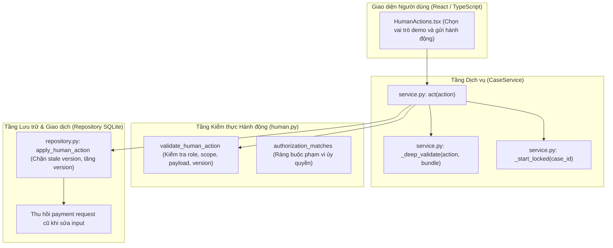
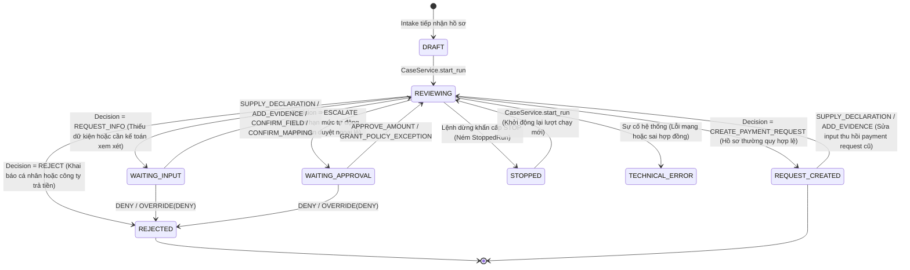
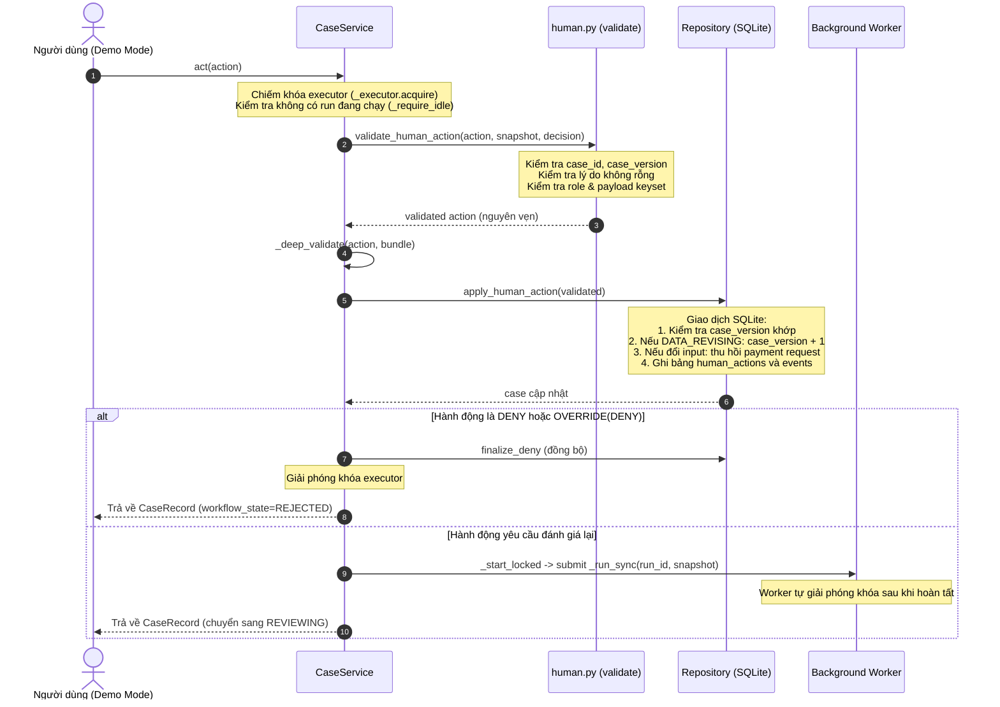

# P08 — Vòng lặp phản hồi của con người (Human-in-the-Loop & Controls)

> **Part ID:** P08  
> **Slug:** human-loop  
> **Phạm vi kiểm tra:** [src/invoice_referee/application/human.py](file:///Users/tnhatnguyendev2805/Documents/Projects/InvoiceReferee/src/invoice_referee/application/human.py), [tests/unit/test_human_actions.py](file:///Users/tnhatnguyendev2805/Documents/Projects/InvoiceReferee/tests/unit/test_human_actions.py), [tests/integration/test_human_closure.py](file:///Users/tnhatnguyendev2805/Documents/Projects/InvoiceReferee/tests/integration/test_human_closure.py), [docs/specs/B1_SYSTEM_SPEC.md §7](file:///Users/tnhatnguyendev2805/Documents/Projects/InvoiceReferee/docs/specs/B1_SYSTEM_SPEC.md#L206-L235), [docs/specs/B1_PRODUCT_SPEC.md §5–6](file:///Users/tnhatnguyendev2805/Documents/Projects/InvoiceReferee/docs/specs/B1_PRODUCT_SPEC.md#L80-L117).  
> **Commit hash:** `7edac6d` (gốc nhánh `rebuild`: `18626a7`)  
> **Ngày thực hiện:** 2026-10-05  
> **Lệnh kiểm chứng đã chạy:**  
> - `.venv/bin/python -m pytest tests/unit/test_human_actions.py tests/integration/test_human_closure.py -v` → [RUN 80 passed in 0.84s]  
> - `.venv/bin/python -m pytest tests/unit/test_human_actions.py -q` → [RUN 59 passed in 0.26s]  
> - `.venv/bin/python -m pytest tests/integration/test_human_closure.py -q` → [RUN 21 passed in 0.56s]  

---

## 1. Tóm tắt 5 dòng (Summary)

Module kiểm soát con người xử lý các phản hồi nghiệp vụ khi hệ thống cần làm rõ hoặc phê duyệt.  
Mã nguồn xác thực quyền hạn và phạm vi của từng vai trò trước khi lưu vào cơ sở dữ liệu.  
Hành vi sửa đổi dữ liệu làm tăng phiên bản hồ sơ và thu hồi toàn bộ ủy quyền cũ.  
Hành động phê duyệt số tiền kích hoạt đánh giá lại tự động mà không làm đổi dữ liệu nguồn.  
Cơ chế ghi đè lưu vết phán quyết gốc và không bao giờ vượt qua các cổng kiểm soát cốt lõi.  

---

## 2. Vị trí trong hệ thống (System Placement)

Sơ đồ thể hiện vị trí của module xử lý hành động con người làm cầu nối giữa giao diện và lưu trữ [SOURCE](file:///Users/tnhatnguyendev2805/Documents/Projects/InvoiceReferee/src/invoice_referee/application/human.py#L4-L8):



---

## 3. Bài toán phục vụ (Business Rules & Requirements)

| Quy tắc / Yêu cầu nghiệp vụ | Đoạn đặc tả liên quan | Mã nguồn thực thi |
| :--- | :--- | :--- |
| **Phân định quyền hạn theo vai trò:** Nhân viên không được duyệt tiền; Kế toán không được cấp ngoại lệ. | [B1_PRODUCT_SPEC.md §5](file:///Users/tnhatnguyendev2805/Documents/Projects/InvoiceReferee/docs/specs/B1_PRODUCT_SPEC.md#L80-L93) | [human.py: _require_mode](file:///Users/tnhatnguyendev2805/Documents/Projects/InvoiceReferee/src/invoice_referee/application/human.py#L146-L151) |
| **Mất hiệu lực ủy quyền khi sửa dữ liệu:** Sửa lời khai hoặc chứng từ hủy bỏ mọi phê duyệt trước đó. | [B1_SYSTEM_SPEC.md §7](file:///Users/tnhatnguyendev2805/Documents/Projects/InvoiceReferee/docs/specs/B1_SYSTEM_SPEC.md#L218-L220) | [repository.py: apply_human_action](file:///Users/tnhatnguyendev2805/Documents/Projects/InvoiceReferee/src/invoice_referee/storage/repository.py#L980-L983) |
| **Hạn mức phê duyệt tiêu chuẩn:** Người duyệt chỉ được duyệt tối đa 5.000.000 VND; vượt mức cần ngoại lệ. | [B1_RULEBOOK.md §5](file:///Users/tnhatnguyendev2805/Documents/Projects/InvoiceReferee/docs/specs/B1_RULEBOOK.md#L140-L155) | [human.py: _handle_approve_amount](file:///Users/tnhatnguyendev2805/Documents/Projects/InvoiceReferee/src/invoice_referee/application/human.py#L288-L305) |
| **Chống thao tác trên phiên bản cũ:** Chặn đứng hành động gửi từ màn hình mang phiên bản cũ (`STALE_VERSION`). | [B1_SYSTEM_SPEC.md §7](file:///Users/tnhatnguyendev2805/Documents/Projects/InvoiceReferee/docs/specs/B1_SYSTEM_SPEC.md#L212-L215) | [human.py:118](file:///Users/tnhatnguyendev2805/Documents/Projects/InvoiceReferee/src/invoice_referee/application/human.py#L118), [repository.py:971](file:///Users/tnhatnguyendev2805/Documents/Projects/InvoiceReferee/src/invoice_referee/storage/repository.py#L971) |
| **Lưu vết phán quyết gốc khi Override:** Ghi đè phải lưu quyết định ban đầu và giải trình lý do rõ ràng. | [B1_PRODUCT_SPEC.md §7](file:///Users/tnhatnguyendev2805/Documents/Projects/InvoiceReferee/docs/specs/B1_PRODUCT_SPEC.md#L125-L127) | [service.py: _apply_and_start](file:///Users/tnhatnguyendev2805/Documents/Projects/InvoiceReferee/src/invoice_referee/application/service.py#L384-L394) |

---

## 4. Interface công khai (Public API)

| Ký hiệu (Symbol) | Đầu vào (Input) | Đầu ra (Output) | Ngoại lệ có thể ném | Vị trí mã nguồn |
| :--- | :--- | :--- | :--- | :--- |
| `validate_human_action` | `action: HumanAction`, `snapshot: CaseSnapshot`, `decision: Decision` | `HumanAction` | `DomainError('INVALID_ACTION')` | [human.py:107](file:///Users/tnhatnguyendev2805/Documents/Projects/InvoiceReferee/src/invoice_referee/application/human.py#L107) |
| `authorization_matches` | `auth: Authorization`, `snapshot: CaseSnapshot`, `amount: int` | `bool` | Không ném ngoại lệ | [human.py:445](file:///Users/tnhatnguyendev2805/Documents/Projects/InvoiceReferee/src/invoice_referee/application/human.py#L445) |
| `CaseService.act` | `action: HumanAction` | `CaseRecord` | `DomainError('INVALID_ACTION')`, `RUN_BUSY` | [service.py:223](file:///Users/tnhatnguyendev2805/Documents/Projects/InvoiceReferee/src/invoice_referee/application/service.py#L223) |
| `Repository.apply_human_action` | `action: HumanAction` | `CaseRecord` | `DomainError('STALE_VERSION')`, `NOT_FOUND` | [repository.py:965](file:///Users/tnhatnguyendev2805/Documents/Projects/InvoiceReferee/src/invoice_referee/storage/repository.py#L965) |

---

## 5. Mô hình dữ liệu & Ràng buộc (Data Models & Constraints)

### 5.1. Mô hình hành động của con người (`HumanAction`)
Bản ghi bất biến ghi nhận mọi thao tác của người dùng trong hệ thống [SOURCE](file:///Users/tnhatnguyendev2805/Documents/Projects/InvoiceReferee/src/invoice_referee/domain/models.py#L285-L295):
- `id: str`: Mã định danh hành động (dạng chuỗi ngẫu nhiên không trùng lặp).
- `case_id: str`: Mã hồ sơ mục tiêu.
- `case_version: int`: Phiên bản dữ liệu của hồ sơ tại thời điểm người dùng bấm gửi.
- `issue_id: str | None`: Mã vấn đề đang mở được giải quyết (hoặc rỗng).
- `mode: DemoMode`: Vai trò người thực hiện (`'EMPLOYEE'`, `'REVIEWER'`, `'APPROVER'`, `'POLICY_OWNER'`).
- `kind: HumanActionKind`: Một trong 10 loại hành động nghiệp vụ được hỗ trợ.
- `payload: dict[str, JsonValue]`: Dữ liệu chi tiết đính kèm tuân thủ lược đồ nghiêm ngặt.
- `reason: str`: Lý do giải trình bắt buộc, không được để trống hoặc chỉ có khoảng trắng.
- `created_at: AwareDatetime`: Thời điểm tạo hành động theo múi giờ UTC.

### 5.2. Mô hình ủy quyền nghiệp vụ (`Authorization`)
Bản ghi lưu trữ quyền ngoại lệ hoặc quyền duyệt số tiền [SOURCE](file:///Users/tnhatnguyendev2805/Documents/Projects/InvoiceReferee/src/invoice_referee/domain/models.py#L251-L262):
- `action_id: str`: Mã hành động sinh ra ủy quyền này.
- `kind: AuthorizationKind`: `'POLICY_EXCEPTION'` hoặc `'AMOUNT_APPROVAL'`.
- `case_version: int`: Phiên bản hồ sơ tại thời điểm cấp (mất hiệu lực khi phiên bản tăng).
- `policy_version: str`: Phiên bản chính sách công ty đang áp dụng.
- `profile: Profile`: Hồ sơ chi phí (`'TRAVEL'`, `'CLIENT_MEAL'`, `'WORK_PURCHASE'`).
- `purpose: str`: Mục đích chi tiêu chính xác của hồ sơ.
- `amount_vnd: int`: Số tiền chính xác được ủy quyền tính bằng đồng nguyên dương.

---

## 6. Luồng chi tiết (Detailed Flows)

### 6.1. State Diagram: Vòng đời hồ sơ qua các hành động của con người



### 6.2. Toàn trình xử lý một hành động trong `CaseService.act`



---

## 7. Ví dụ chạy tay (Concrete Walkthrough)

Lấy ví dụ chạy thực tế từ bài kiểm thử quy trình duyệt số tiền vượt hạn mức tự động [TEST](file:///Users/tnhatnguyendev2805/Documents/Projects/InvoiceReferee/tests/integration/test_human_closure.py#L109-L135) (`test_approval_reevaluates_to_human_authorized_request`):

### 1. Dữ liệu ban đầu:
- **Hồ sơ:** `case_id = 'case-demo'`, `case_version = 1`.
- **Khai báo:** `profile = 'TRAVEL'`, `purpose = 'Công tác demo'`, `requested_amount_vnd = 2000001`.
- **Lượt chạy 1:** Đã chạy xong. Phán quyết là `action = 'ESCALATE'`, lý do vượt hạn mức tự động 2.000.000 VND (`AUTH-01`).
- **Vấn đề mở:** `Issue(id='AUTH-01:case', owner_mode='APPROVER', blockers=['AUTH-01'])`.

### 2. Người dùng gửi hành động:
- `action`:
  - `kind = 'APPROVE_AMOUNT'`
  - `mode = 'APPROVER'`
  - `case_version = 1`
  - `issue_id = 'AUTH-01:case'`
  - `reason = 'Duyệt chi phí công tác theo kế hoạch'`
  - `payload = {'amount_vnd': 2000001, 'profile': 'TRAVEL', 'purpose': 'Công tác demo', 'policy_version': 'demo-expense-v0.1-proposed'}`

### 3. Diễn tiến qua các tầng mã nguồn:
1. **Kiểm thực tại `validate_human_action`:**
   - So khớp phiên bản: `action.case_version (1) == snapshot.case_version (1)`. Hợp lệ.
   - Kiểm tra lý do: Chuỗi có nội dung, không rỗng. Hợp lệ.
   - Kiểm tra khóa dữ liệu: Khóa gồm đúng 4 trường bắt buộc, không có trường thừa. Hợp lệ.
   - Kiểm tra quyền hạn: Mode là `'APPROVER'`. Số tiền $2.000.001 \le 5.000.000$ VND (`standard_policy_max`). Hợp lệ [SOURCE](file:///Users/tnhatnguyendev2805/Documents/Projects/InvoiceReferee/src/invoice_referee/application/human.py#L291-L296).
2. **Lưu trữ tại `apply_human_action`:**
   - Vì `APPROVE_AMOUNT` thuộc nhóm `AUTHORIZATION_KINDS`, `case_version` **giữ nguyên là 1** [SOURCE](file:///Users/tnhatnguyendev2805/Documents/Projects/InvoiceReferee/src/invoice_referee/storage/repository.py#L988-L991).
   - Thêm bản ghi vào bảng `human_actions`. Đặt `input_hash = ''` để đánh dấu dữ liệu cần đánh giá lại.
3. **Kích hoạt đánh giá lại (`_start_locked`):**
   - Tạo `run_2` với snapshot mới chứa bản ghi ủy quyền `Authorization(kind='AMOUNT_APPROVAL', amount_vnd=2000001)`.
   - Giao việc cho worker nền chạy `pipeline.process(snapshot, ...)`.
4. **Kết quả đánh giá lại:**
   - Bộ đánh giá `evaluate` nhận thấy quy tắc `AUTH-01` đã có ủy quyền khớp phạm vi (`authorization_matches` trả về `True`).
   - Cổng an toàn mở. Phán quyết mới là `action = 'CREATE_PAYMENT_REQUEST'`.
   - Cơ sở hoàn thành ghi nhận `completion_basis = 'HUMAN_AUTHORIZED'` [SOURCE](file:///Users/tnhatnguyendev2805/Documents/Projects/InvoiceReferee/src/invoice_referee/storage/repository.py#L886).
   - Đề nghị thanh toán được tạo trong cơ sở dữ liệu. Lượt chạy 1 trước đó vẫn lưu trong lịch sử.

---

## 8. Bảng Invariant bắt buộc

| Invariant | Mã nguồn thực thi | Test chứng minh | Hậu quả nếu bị phá vỡ |
| :--- | :--- | :--- | :--- |
| **Sửa input làm mất hiệu lực ủy quyền:** Mọi thay đổi dữ liệu đầu vào bắt buộc tăng version và thu hồi ủy quyền. | [repository.py: apply_human_action](file:///Users/tnhatnguyendev2805/Documents/Projects/InvoiceReferee/src/invoice_referee/storage/repository.py#L980-L983) | [test_human_actions.py: test_confirmation_bumps_version_and_invalidates_authorization](file:///Users/tnhatnguyendev2805/Documents/Projects/InvoiceReferee/tests/unit/test_human_actions.py#L510) | Nhân viên có thể sửa tăng số tiền sau khi sếp đã duyệt mà vẫn nhận tiền chi trả. |
| **Khóa chặt hạn mức người phê duyệt:** Người duyệt thông thường tuyệt đối không được duyệt quá 5 triệu đồng. | [human.py: _handle_approve_amount](file:///Users/tnhatnguyendev2805/Documents/Projects/InvoiceReferee/src/invoice_referee/application/human.py#L291-L296) | [test_human_actions.py: test_approver_cannot_approve_above_standard_max](file:///Users/tnhatnguyendev2805/Documents/Projects/InvoiceReferee/tests/unit/test_human_actions.py#L97) | Phá vỡ phân cấp thẩm quyền tài chính của doanh nghiệp. |
| **Không sửa chữ OCR thô:** Xác nhận dữ kiện chỉ thêm bản ghi mới, không được sửa văn bản OCR gốc. | [human.py: _handle_confirm_field](file:///Users/tnhatnguyendev2805/Documents/Projects/InvoiceReferee/src/invoice_referee/application/human.py#L247-L256) | [test_human_actions.py: test_confirm_field_requires_owned_resolvable_refs](file:///Users/tnhatnguyendev2805/Documents/Projects/InvoiceReferee/tests/unit/test_human_actions.py#L241) | Mất tính nguyên vẹn của bằng chứng pháp lý khi kiểm toán độc lập. |
| **Chống thao tác phiên bản cũ (Stale Guard):** Chặn mọi hành động có `case_version` khác phiên bản hiện hành. | [human.py:118](file:///Users/tnhatnguyendev2805/Documents/Projects/InvoiceReferee/src/invoice_referee/application/human.py#L118), [repository.py:971](file:///Users/tnhatnguyendev2805/Documents/Projects/InvoiceReferee/src/invoice_referee/storage/repository.py#L971) | [test_human_actions.py: test_stale_case_version_is_rejected](file:///Users/tnhatnguyendev2805/Documents/Projects/InvoiceReferee/tests/unit/test_human_actions.py#L154) | Hai người cùng thao tác đồng thời sẽ ghi đè và làm sai lệch trạng thái hồ sơ. |
| **Override không phá vỡ cổng cứng:** Ghi đè bắt buộc phải tuân thủ kiểm tra toán học và tính có mặt của nguồn. | [human.py: _handle_override](file:///Users/tnhatnguyendev2805/Documents/Projects/InvoiceReferee/src/invoice_referee/application/human.py#L330-L358) | [test_human_closure.py: test_override_confirm_field_with_unresolvable_ref_is_rejected](file:///Users/tnhatnguyendev2805/Documents/Projects/InvoiceReferee/tests/integration/test_human_closure.py#L225) | Lãnh đạo có thể vô tình duyệt chi cho hóa đơn giả mạo hoặc tính sai số học. |

---

## 9. Lỗi và phân loại (Error Handling Matrix)

| Tình huống phát sinh | Phân loại kết quả | Mã lỗi DomainError | Hướng xử lý của hệ thống |
| :--- | :--- | :---: | :--- |
| Gửi hành động với `case_version` cũ hơn phiên bản hiện tại | Lỗi xung đột dữ liệu | `INVALID_ACTION` / `STALE_VERSION` | Từ chối thao tác, yêu cầu người dùng tải lại trang. |
| Nhân viên cố tình gửi hành động duyệt tiền hoặc cấp ngoại lệ | Vi phạm quyền hạn | `INVALID_ACTION` | Từ chối ngay lập tức, thông báo yêu cầu đúng vai trò. |
| Người duyệt phê duyệt số tiền lớn hơn 5.000.000 VND | Vượt hạn mức quyền hạn | `INVALID_ACTION` | Từ chối thao tác, yêu cầu chuyển lên Policy Owner. |
| Xác nhận trường số với định dạng có dấu phẩy hoặc kiểu float | Sai định dạng dữ liệu | `INVALID_ACTION` | Từ chối, yêu cầu nhập chuỗi số nguyên chuẩn hóa. |
| Tham chiếu chứng từ không thuộc sở hữu của hồ sơ hiện tại | Gian lận bằng chứng | `INVALID_ACTION` | Từ chối, chỉ cho phép dẫn chứng từ đã upload vào case. |
| Gửi hành động khi hồ sơ đang có một lượt chạy nền đang xử lý | Tranh chấp luồng xử lý | `RUN_BUSY` | Từ chối thao tác, yêu cầu dừng lượt chạy trước khi cập nhật. |

---

## 10. Quyết định thiết kế (Design Decisions)

1. **Phân tách rạch ròi giữa hành động sửa dữ liệu (`DATA_REVISING`) và hành động ủy quyền (`AUTHORIZATION`):**  
   - *Quyết định:* Sửa lời khai hoặc xác nhận dữ kiện làm tăng `case_version`; duyệt tiền hoặc cấp ngoại lệ giữ nguyên `case_version` [SOURCE](file:///Users/tnhatnguyendev2805/Documents/Projects/InvoiceReferee/src/invoice_referee/storage/repository.py#L980-L991).  
   - *Lý do:* Bảo đảm rằng việc duyệt tiền không làm biến đổi dữ kiện gốc, nhưng bất kỳ sự thay đổi dữ kiện nào cũng tự động vô hiệu hóa quyết định phê duyệt trước đó.  
   - *Phương án bị loại:* Tăng phiên bản hồ sơ cho mọi loại hành động.
2. **Xây dựng `OVERRIDE` như một lớp vỏ bọc (`wrapper`) có cấu trúc thay vì một cờ boolean tự do:**  
   - *Quyết định:* `OVERRIDE` chỉ chấp nhận 6 thao tác định sẵn và kiểm tra nghiêm ngặt dữ liệu bên trong [SOURCE](file:///Users/tnhatnguyendev2805/Documents/Projects/InvoiceReferee/src/invoice_referee/application/human.py#L81-L85).  
   - *Lý do:* Ngăn chặn việc tạo ra nút bấm "Bỏ qua mọi lỗi" nguy hiểm làm tê liệt các cổng an toàn tài chính.  
   - *Phương án bị loại:* Thêm trường `force_approve: bool` vào API để bỏ qua toàn bộ cảnh báo.
3. **Cơ chế khóa thực thi đơn nhiệm độc quyền (`Single-Slot Execution Window`):**  
   - *Quyết định:* Giữ khóa `_executor.acquire()` trong suốt quá trình xác thực, lưu cơ sở dữ liệu và gửi việc cho worker [SOURCE](file:///Users/tnhatnguyendev2805/Documents/Projects/InvoiceReferee/src/invoice_referee/application/service.py#L233-L241).  
   - *Lý do:* Đảm bảo không có hai thao tác của con người nào có thể xen ngang làm sai lệch trạng thái đánh giá lại.  
   - *Phương án bị loại:* Cho phép xử lý đồng thời nhiều hành động trên cùng một hồ sơ.

---

## 11. Bản đồ kiểm thử (Test Map)

| Tệp kiểm thử | Tên bài kiểm thử | Hành vi kỹ thuật chứng minh |
| :--- | :--- | :--- |
| `test_human_actions.py` | `test_employee_cannot_approve_amount` | Nhân viên không được phép duyệt số tiền [TEST](file:///Users/tnhatnguyendev2805/Documents/Projects/InvoiceReferee/tests/unit/test_human_actions.py#L67). |
| `test_human_actions.py` | `test_reviewer_cannot_grant_policy_exception` | Kế toán soát xét không được cấp ngoại lệ chính sách [TEST](file:///Users/tnhatnguyendev2805/Documents/Projects/InvoiceReferee/tests/unit/test_human_actions.py#L78). |
| `test_human_actions.py` | `test_approver_cannot_approve_above_standard_max` | Người duyệt bị chặn khi duyệt số tiền vượt 5 triệu đồng [TEST](file:///Users/tnhatnguyendev2805/Documents/Projects/InvoiceReferee/tests/unit/test_human_actions.py#L97). |
| `test_human_actions.py` | `test_policy_owner_above_standard_needs_matching_exception` | Policy Owner duyệt trên 5 triệu bắt buộc phải có ngoại lệ khớp [TEST](file:///Users/tnhatnguyendev2805/Documents/Projects/InvoiceReferee/tests/unit/test_human_actions.py#L128). |
| `test_human_actions.py` | `test_stale_case_version_is_rejected` | Chặn hành động gắn với phiên bản hồ sơ cũ [TEST](file:///Users/tnhatnguyendev2805/Documents/Projects/InvoiceReferee/tests/unit/test_human_actions.py#L154). |
| `test_human_actions.py` | `test_declaration_cannot_change_profile` | Nhân viên không được tự ý đổi phân loại profile trong khai báo [TEST](file:///Users/tnhatnguyendev2805/Documents/Projects/InvoiceReferee/tests/unit/test_human_actions.py#L170). |
| `test_human_actions.py` | `test_numeric_confirmation_must_be_canonical` | Xác nhận số bắt buộc phải ở định dạng chuỗi chuẩn hóa [TEST](file:///Users/tnhatnguyendev2805/Documents/Projects/InvoiceReferee/tests/unit/test_human_actions.py#L268). |
| `test_human_actions.py` | `test_confirmation_bumps_version_and_invalidates_authorization` | Xác nhận dữ kiện tăng version và làm vô hiệu hóa ủy quyền cũ [TEST](file:///Users/tnhatnguyendev2805/Documents/Projects/InvoiceReferee/tests/unit/test_human_actions.py#L510). |
| `test_human_actions.py` | `test_data_change_after_approval_invalidates_it_and_revokes_request` | Đổi dữ liệu sau khi duyệt sẽ thu hồi ngay payment request [TEST](file:///Users/tnhatnguyendev2805/Documents/Projects/InvoiceReferee/tests/unit/test_human_actions.py#L653). |
| `test_human_closure.py` | `test_deny_persists_reject_without_providers` | Từ chối hồ sơ lưu ngay trạng thái REJECT mà không gọi AI [TEST](file:///Users/tnhatnguyendev2805/Documents/Projects/InvoiceReferee/tests/integration/test_human_closure.py#L33). |
| `test_human_closure.py` | `test_approval_reevaluates_to_human_authorized_request` | Duyệt tiền kích hoạt đánh giá lại tạo đề nghị thanh toán [TEST](file:///Users/tnhatnguyendev2805/Documents/Projects/InvoiceReferee/tests/integration/test_human_closure.py#L109). |
| `test_human_closure.py` | `test_confirm_field_makes_low_score_fact_usable` | Xác nhận trường điểm thấp chuyển độ khả dụng thành USABLE [TEST](file:///Users/tnhatnguyendev2805/Documents/Projects/InvoiceReferee/tests/integration/test_human_closure.py#L139). |
| `test_human_closure.py` | `test_override_keeps_original_run_and_decision` | Ghi đè bảo toàn nguyên vẹn quyết định và lượt chạy ban đầu [TEST](file:///Users/tnhatnguyendev2805/Documents/Projects/InvoiceReferee/tests/integration/test_human_closure.py#L198). |

---

## 12. Đầu ra đặc biệt: Ma trận Phân Quyền (Role × Action Matrix)

Bảng tổng hợp quyền hạn của từng vai trò đối với 10 loại hành động của con người:

| Loại Hành động (`HumanActionKind`) | `EMPLOYEE` (Nhân viên) | `REVIEWER` (Kế toán soát xét) | `APPROVER` (Người duyệt cấp 1) | `POLICY_OWNER` (Chủ quản chính sách) | Ghi chú điều kiện ràng buộc kỹ thuật |
| :--- | :---: | :---: | :---: | :---: | :--- |
| **`SUPPLY_DECLARATION`** | ✅ Cho phép | ❌ Từ chối | ❌ Từ chối | ❌ Từ chối | Chỉ sửa các trường thuộc `Claim`, cấm tự đổi `profile`. |
| **`ADD_EVIDENCE`** | ✅ Cho phép | ❌ Từ chối | ❌ Từ chối | ❌ Từ chối | Chứng từ phải được tải lên backend trước khi gửi mã ID. |
| **`PROPOSE_CORRECTION`** | ✅ Cho phép | ❌ Từ chối | ❌ Từ chối | ❌ Từ chối | Đề xuất sửa đổi, không trở thành dữ kiện có hiệu lực ngay. |
| **`CONFIRM_FIELD`** | ❌ Từ chối | ✅ Cho phép | ❌ Từ chối | ❌ Từ chối | Bắt buộc có nguồn tham chiếu (`refs`) thuộc hồ sơ hiện tại. |
| **`CONFIRM_MAPPING`** | ❌ Từ chối | ✅ Cho phép | ❌ Từ chối | ❌ Từ chối | Ánh xạ dòng hàng 1:1, không được trùng lặp ID hai bên. |
| **`GRANT_POLICY_EXCEPTION`**| ❌ Từ chối | ❌ Từ chối | ❌ Từ chối | ✅ Cho phép | Đóng chặn `LIM-01`, phải khớp chính xác phạm vi hồ sơ. |
| **`APPROVE_AMOUNT`** | ❌ Từ chối | ❌ Từ chối | ✅ Tối đa 5 triệu | ✅ Trên 5 triệu (cần exception) | Đóng chặn `AUTH-01`, tạo đề nghị thanh toán ủy quyền. |
| **`DENY`** | ✅ *(Nếu là chủ issue)* | ✅ *(Nếu là chủ issue)* | ✅ *(Nếu là chủ issue)* | ✅ *(Nếu là chủ issue)* | Vai trò gửi phải khớp với `owner_mode` của issue đang mở. |
| **`OVERRIDE`** | ❌ Từ chối | ✅ *(Theo thao tác con)* | ✅ *(Theo thao tác con)* | ✅ *(Toàn quyền)* | Vỏ bọc bao quanh thao tác con; riêng `CLASSIFY_PROFILE` chỉ dành cho Policy Owner. |
| **`STOP`** | ✅ Cho phép | ✅ Cho phép | ✅ Cho phép | ✅ Cho phép | Tuyệt đối dừng khẩn cấp lượt chạy đang thực thi. |

---

## 13. Trạng thái và lệch giữa Spec và Code

- **Trạng thái thực thi:** **`VERIFIED`** (toàn bộ 80 bài kiểm thử liên quan đến vòng lặp con người chạy thành công trên commit `7edac6d`).
- **Lệch spec–code đã xác nhận:**
  1. *Đường dẫn gọi lệnh STOP:* `B1_SYSTEM_SPEC.md §7` liệt kê `STOP` như một `HumanActionKind`, nhưng mã nguồn thực tế tách `STOP` thành một endpoint API chuyên dụng `stop(run_id)` trong `service.py` [SOURCE](file:///Users/tnhatnguyendev2805/Documents/Projects/InvoiceReferee/src/invoice_referee/application/service.py#L217-L220). Nếu gửi `STOP` qua phương thức `act()`, hệ thống sẽ từ chối để tránh việc khóa slot thực thi không cần thiết.

---

## 14. Rủi ro và nghi vấn (Risks & Questions)

1. **Rủi ro người dùng nhầm lẫn vai trò trong chế độ demo:**  
   - *Mức độ:* Thấp (Low).  
   - *Hiện tượng:* Người kiểm thử chọn nhầm vai trò trên thanh công cụ và nhận thông báo lỗi quyền hạn `INVALID_ACTION`.  
   - *Giải pháp:* Giao diện frontend hiển thị rõ chế độ đang chọn và tự động gợi ý vai trò sở hữu của vấn đề đang mở.
2. **Khả năng bị nghẽn lượt chạy khi có nhiều người thao tác:**  
   - *Mức độ:* Thấp (Low).  
   - *Thực tế:* Thiết kế B1 áp dụng cho một người vận hành duy nhất (`one operator MVP`), cơ chế `_require_idle` bảo vệ toàn vẹn dữ liệu hiệu quả mà không cần hệ thống phân tán phức tạp.

---

## 15. Bài tập thực hành (Practice Exercises)

*(Lưu ý: Các bài tập dành cho người đọc tự thực hành trên môi trường máy cá nhân).*

1. **Bài tập 1: Thử cho phép nhân viên phê duyệt số tiền.**  
   - Mở tệp [src/invoice_referee/application/human.py](file:///Users/tnhatnguyendev2805/Documents/Projects/InvoiceReferee/src/invoice_referee/application/human.py#L289).  
   - Sửa dòng yêu cầu vai trò: đổi `_require_mode(action, 'APPROVER', 'POLICY_OWNER')` thành `_require_mode(action, 'EMPLOYEE', 'APPROVER', 'POLICY_OWNER')`.  
   - Chạy lệnh: `.venv/bin/python -m pytest tests/unit/test_human_actions.py -k "test_employee_cannot_approve_amount" -q`  
   - Quan sát bài kiểm thử bị thất bại vì nhân viên đã duyệt được tiền trái phép.  
   - Hoàn tác: `git checkout -- src/invoice_referee/application/human.py`
2. **Bài tập 2: Thử bỏ qua việc tăng phiên bản khi xác nhận dữ kiện.**  
   - Mở tệp [src/invoice_referee/storage/repository.py](file:///Users/tnhatnguyendev2805/Documents/Projects/InvoiceReferee/src/invoice_referee/storage/repository.py#L980).  
   - Tạm thời xóa `CONFIRM_FIELD` khỏi tập hợp `DATA_REVISING` tại đầu tệp.  
   - Chạy lệnh: `.venv/bin/python -m pytest tests/unit/test_human_actions.py -k "test_confirmation_bumps_version" -q`  
   - Quan sát bài kiểm thử bị thất bại vì `case_version` không tăng lên sau khi xác nhận trường.  
   - Hoàn tác: `git checkout -- src/invoice_referee/storage/repository.py`
3. **Bài tập 3: Thử chấp nhận số tiền dạng float trong xác nhận số.**  
   - Mở tệp [src/invoice_referee/application/human.py](file:///Users/tnhatnguyendev2805/Documents/Projects/InvoiceReferee/src/invoice_referee/application/human.py#L424).  
   - Cho phép kiểu số thực: sửa điều kiện kiểm tra không bắt buộc chuỗi dạng chuỗi (`not isinstance(value, str)`).  
   - Chạy lệnh: `.venv/bin/python -m pytest tests/unit/test_human_actions.py -k "test_numeric_confirmation_rejects_non_string" -q`  
   - Quan sát bài kiểm thử bị thất bại vì vi phạm quy ước chuỗi số chuẩn hóa.  
   - Hoàn tác: `git checkout -- src/invoice_referee/application/human.py`

---

## 16. Câu hỏi tự kiểm (Self-Check Questions)

1. *Dự đoán output:* Khi nhân viên gửi hành động `SUPPLY_DECLARATION` nhưng cố tình sửa trường `'profile': 'WORK_PURCHASE'`, hàm `validate_human_action` sẽ trả về kết quả gì?
2. *Dự đoán output:* Nếu một hồ sơ đã được duyệt số tiền ở phiên bản 1, sau đó nhân viên nộp thêm một hóa đơn qua `ADD_EVIDENCE`, điều gì xảy ra với đề nghị thanh toán cũ?
3. *Dự đoán output:* Khi người duyệt cấp 1 cố gắng phê duyệt số tiền 5.000.001 VND cho hồ sơ công tác, hệ thống xử lý thế nào?
4. *Dự đoán output:* Khi gửi hành động `CONFIRM_FIELD` nhưng đường dẫn trường là `'e-1.fields.supplier_name'`, hàm kiểm tra sẽ phản ứng ra sao?
5. *Sửa ở đâu:* Muốn bổ sung một trường mới được phép thay đổi trong khai báo nhân viên thì chỉnh sửa ở tập hợp nào trong `human.py`?
6. *Sửa ở đâu:* Nơi nào thực hiện việc thu hồi đề nghị thanh toán khi dữ liệu đầu vào của hồ sơ bị biến động?
7. *Sửa ở đâu:* Muốn điều chỉnh danh sách các thao tác hợp lệ bên trong một hành động `OVERRIDE` thì sửa ở hằng số nào?
8. *Vì sao:* Vì sao hệ thống không sử dụng JWT hoặc session để xác thực danh tính người dùng trong phiên bản B1?
9. *Vì sao:* Vì sao một đề xuất chỉnh sửa `PROPOSE_CORRECTION` của nhân viên không làm tăng phiên bản dữ liệu ngay lập tức?
10. *Vì sao:* Vì sao cơ chế ghi đè `OVERRIDE` không thể bỏ qua cổng kiểm soát số học `MATH-01`?

<details>
<summary>👉 Xem đáp án chi tiết</summary>

1. **Đáp án:** Ném ngoại lệ `DomainError('INVALID_ACTION', 'Phân loại profile chỉ do POLICY_OWNER thực hiện bằng OVERRIDE classify.')` [SOURCE](file:///Users/tnhatnguyendev2805/Documents/Projects/InvoiceReferee/src/invoice_referee/application/human.py#L211-L212).
2. **Đáp án:** Phiên bản hồ sơ tăng lên 2 (`case_version = 2`), đề nghị thanh toán cũ bị chuyển trạng thái thành `REVOKED`, và ủy quyền phê duyệt trước đó bị mất hiệu lực hoàn toàn [SOURCE](file:///Users/tnhatnguyendev2805/Documents/Projects/InvoiceReferee/src/invoice_referee/storage/repository.py#L1037-L1046).
3. **Đáp án:** Ném ngoại lệ `DomainError('INVALID_ACTION', 'APPROVER chỉ duyệt trong standard policy; vượt hạn mức cần POLICY_OWNER.')` [SOURCE](file:///Users/tnhatnguyendev2805/Documents/Projects/InvoiceReferee/src/invoice_referee/application/human.py#L292-L295).
4. **Đáp án:** Ném ngoại lệ `DomainError('INVALID_ACTION', \"fields path không hỗ trợ: 'e-1.fields.supplier_name'.\")` vì phân đoạn `fields` chỉ hỗ trợ `total` hoặc `merchant`, `date`, `currency` [SOURCE](file:///Users/tnhatnguyendev2805/Documents/Projects/InvoiceReferee/src/invoice_referee/application/human.py#L398-L400).
5. **Đáp án:** Tập hợp `_CLAIM_FIELDS` tại dòng [human.py:93-96](file:///Users/tnhatnguyendev2805/Documents/Projects/InvoiceReferee/src/invoice_referee/application/human.py#L93-L96).
6. **Đáp án:** Hàm `apply_human_action` tại các dòng [repository.py:1037-1046](file:///Users/tnhatnguyendev2805/Documents/Projects/InvoiceReferee/src/invoice_referee/storage/repository.py#L1037-L1046).
7. **Đáp án:** Tập hợp `_OVERRIDE_OPERATIONS` tại dòng [human.py:82-85](file:///Users/tnhatnguyendev2805/Documents/Projects/InvoiceReferee/src/invoice_referee/application/human.py#L82-L85).
8. **Đáp án:** Vì hệ thống được tối ưu hóa cho mô hình một người vận hành thử nghiệm (MVP Challenge A), tập trung vào tính đúng đắn nghiệp vụ thay vì hạ tầng danh tính doanh nghiệp phức tạp [SPEC §5](file:///Users/tnhatnguyendev2805/Documents/Projects/InvoiceReferee/docs/specs/B1_PRODUCT_SPEC.md#L90-L93).
9. **Đáp án:** Vì đề xuất của nhân viên chỉ mang tính chất tham khảo; chỉ khi kế toán soát xét (`REVIEWER`) xác nhận có căn cứ bằng chứng thì mới trở thành dữ kiện chính thức có hiệu lực [SOURCE](file:///Users/tnhatnguyendev2805/Documents/Projects/InvoiceReferee/src/invoice_referee/storage/repository.py#L88-L92).
10. **Đáp án:** Vì tính toàn vẹn số học là bất biến cốt lõi của hệ thống kế toán; không một cá nhân nào được phép tạo ra tiền từ các phép tính cộng trừ sai lệch [SPEC §6](file:///Users/tnhatnguyendev2805/Documents/Projects/InvoiceReferee/docs/specs/B1_PRODUCT_SPEC.md#L107-L109).
</details>

---

## 17. Hướng dẫn điều khiển AI (Directing AI)

### a. Ngữ cảnh tối thiểu phải cung cấp cho AI:
- File kiểm thực hành động: `src/invoice_referee/application/human.py`.
- File tích hợp dịch vụ: `src/invoice_referee/application/service.py`.
- File kho lưu trữ: `src/invoice_referee/storage/repository.py`.
- File kiểm thử: `tests/unit/test_human_actions.py` và `tests/integration/test_human_closure.py`.

### b. Các Invariant bắt buộc nhắc AI duy trì:
1. "Mọi hành động thuộc nhóm `DATA_REVISING` phải tăng `case_version` và thu hồi `payment_requests` trạng thái `CREATED`."
2. "Tuyệt đối không cấp quyền phê duyệt số tiền lớn hơn `standard_policy_max` (5.000.000 VND) cho vai trò `APPROVER`."
3. "Bắt buộc kiểm tra `case_version` ở cả hai tầng (tầng kiểm thực `human.py` và giao dịch SQLite `repository.py`)."
4. "Hành động `OVERRIDE` phải luôn kiểm tra quyền hạn của thao tác con được bao bọc bên trong."

### c. 6 Dấu hiệu nguy hiểm (Red Flags) trong diff của AI:
1. Thêm cờ boolean như `force_approve` hoặc `ignore_errors` vào payload của `HumanAction`.
2. Cho phép vai trò `EMPLOYEE` gửi hành động `APPROVE_AMOUNT` hoặc `CONFIRM_FIELD`.
3. Bỏ qua việc tăng `case_version` trong khối xử lý `CONFIRM_FIELD` hoặc `SUPPLY_DECLARATION`.
4. Xóa bỏ kiểm tra `action.case_version != snapshot.case_version` trong hàm `validate_human_action`.
5. Cho phép giá trị xác nhận số nhận kiểu dữ liệu `float` hoặc `int` thay vì chuỗi số chuẩn hóa.
6. Cho phép hàm `act()` tiếp tục xử lý khi có một lượt chạy nền chưa kết thúc mà không qua kiểm tra `_require_idle`.

### d. Lệnh kiểm tra sau khi AI chỉnh sửa:
```bash
.venv/bin/python -m pytest tests/unit/test_human_actions.py tests/integration/test_human_closure.py -v
```

---

## 18. Glossary bổ sung

| Thuật ngữ | Định nghĩa kỹ thuật trong ngữ cảnh module |
| :--- | :--- |
| **Human Action** | Thao tác phản hồi có cấu trúc của con người nhằm giải quyết các vấn đề nghiệp vụ hoặc điều khiển luồng xử lý. |
| **Data Revising Action** | Nhóm hành động làm thay đổi dữ kiện thực tế của hồ sơ, dẫn đến việc tăng phiên bản và hủy ủy quyền cũ. |
| **Authorization Action** | Nhóm hành động cấp quyền duyệt số tiền hoặc cấp ngoại lệ chính sách mà không làm thay đổi dữ liệu nguồn. |
| **Stale Version Guard** | Cơ chế hai lớp ngăn chặn các thao tác gửi từ màn hình mang phiên bản cũ nhằm tránh xung đột dữ liệu. |
| **Controlled Override** | Cơ chế ghi đè có lưu vết phán quyết gốc và bảo toàn tuyệt đối các cổng kiểm soát số học cốt lõi. |

---

## 19. Phụ lục (Appendix)

- **CodeGraph query đã chạy:**  
  `human.py HumanAction validate action role scope revision confirmation exception amount approval override`
- **Các tệp mã nguồn và tài liệu đã đọc đầy đủ:**
  - `src/invoice_referee/application/human.py` (toàn bộ 471 dòng).
  - `tests/unit/test_human_actions.py` (toàn bộ 714 dòng).
  - `tests/integration/test_human_closure.py` (toàn bộ 475 dòng).
  - `docs/specs/B1_SYSTEM_SPEC.md` (§7, các dòng 206–235).
  - `docs/specs/B1_PRODUCT_SPEC.md` (§5–6, các dòng 80–117).
  - `src/invoice_referee/application/service.py` (các dòng 210–405 liên quan đến `act`, `add_evidence`, `_apply_and_start`).
  - `src/invoice_referee/storage/repository.py` (các dòng 65–95 và 960–1055 liên quan đến `DATA_REVISING`, `apply_human_action`).
- **Giới hạn kiểm tra:**
  - Toàn bộ 80 bài kiểm thử được xác nhận trên tầng đơn vị và tích hợp sử dụng `FakeProviders` và cơ sở dữ liệu SQLite cục bộ; việc phân quyền dựa trên mô phỏng vai trò demo (`DemoMode`) thay vì hệ thống xác thực danh tính doanh nghiệp thực tế.
