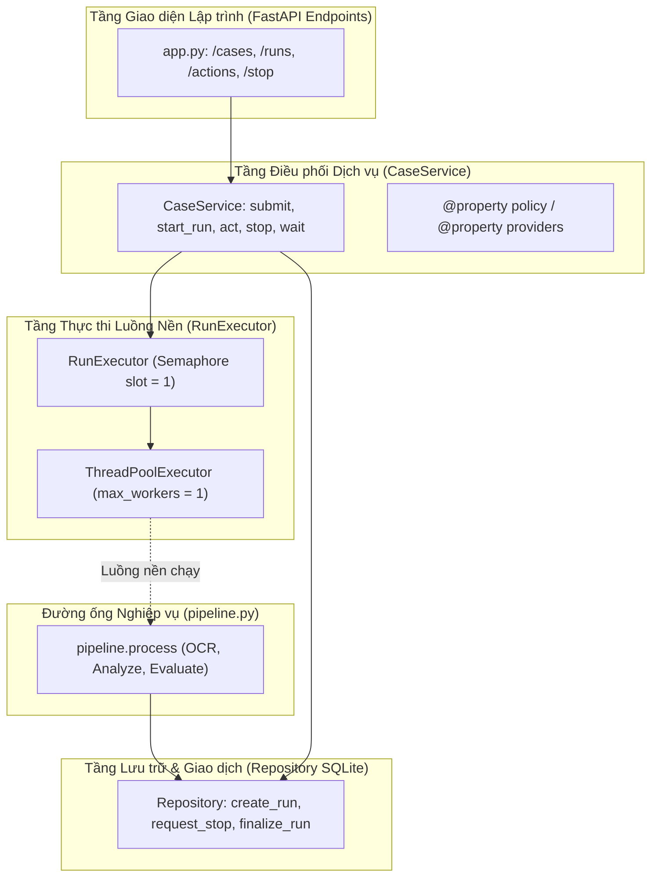
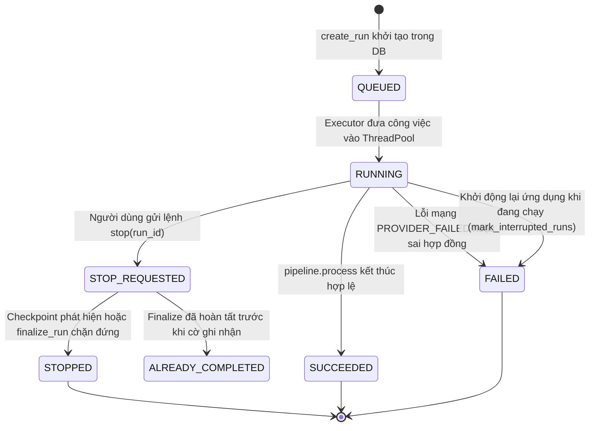
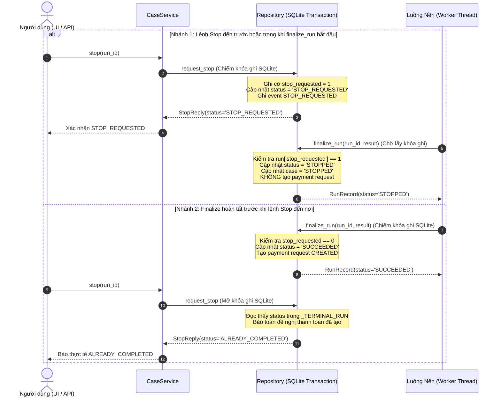

# P09 — Tầng điều phối dịch vụ và thực thi nền (CaseService & RunExecutor)

> **Part ID:** P09  
> **Slug:** service-executor  
> **Phạm vi kiểm tra:** [src/invoice_referee/application/service.py](file:///Users/tnhatnguyendev2805/Documents/Projects/InvoiceReferee/src/invoice_referee/application/service.py), [src/invoice_referee/application/executor.py](file:///Users/tnhatnguyendev2805/Documents/Projects/InvoiceReferee/src/invoice_referee/application/executor.py), [tests/integration/test_execution_controls.py](file:///Users/tnhatnguyendev2805/Documents/Projects/InvoiceReferee/tests/integration/test_execution_controls.py), [tests/integration/conftest.py](file:///Users/tnhatnguyendev2805/Documents/Projects/InvoiceReferee/tests/integration/conftest.py), [docs/specs/B1_SYSTEM_SPEC.md §6, §8](file:///Users/tnhatnguyendev2805/Documents/Projects/InvoiceReferee/docs/specs/B1_SYSTEM_SPEC.md#L160-L253).  
> **Commit hash:** `7edac6d` (gốc nhánh `rebuild`: `18626a7`)  
> **Ngày thực hiện:** 2026-10-05  
> **Lệnh kiểm chứng đã chạy:**  
> - `.venv/bin/python -m pytest tests/integration/test_execution_controls.py -v` → [RUN 11 passed in 0.48s]  
> - `.venv/bin/python -m pytest tests/integration/test_human_closure.py -q` → [RUN 21 passed in 0.56s]  
> - `.venv/bin/python -m pytest tests/integration/test_pipeline.py -q` → [RUN 21 passed in 0.03s]  

---

## 1. Tóm tắt 5 dòng (Summary)

Module dịch vụ quản lý toàn bộ vòng đời lượt chạy và giao tiếp tầng ứng dụng.  
Lớp thực thi sử dụng một luồng nền duy nhất với cơ chế khóa khe xử lý độc quyền.  
Lệnh dừng khẩn cấp được xác nhận và lưu vết ngay trước khi trả về cho người gọi.  
Ranh giới giao dịch cơ sở dữ liệu ngăn chặn triệt để phản hồi mạng đến muộn tạo đề nghị chi trả.  
Các lượt chạy luôn gắn chặt với ảnh chụp chính sách đóng băng tại thời điểm khởi tạo.  

---

## 2. Vị trí trong hệ thống (System Placement)

Sơ đồ thể hiện vai trò trung tâm của `CaseService` và `RunExecutor` kết nối giữa API, luồng nền và kho lưu trữ [SOURCE](file:///Users/tnhatnguyendev2805/Documents/Projects/InvoiceReferee/src/invoice_referee/application/service.py#L93-L110):



---

## 3. Bài toán phục vụ (Business Rules & Requirements)

| Quy tắc / Yêu cầu nghiệp vụ | Đoạn đặc tả liên quan | Mã nguồn thực thi |
| :--- | :--- | :--- |
| **Mô hình xử lý đơn nhiệm một chỗ:** Duy trì chính xác một lượt chạy hoạt động tại một thời điểm. | [B1_SYSTEM_SPEC.md §8](file:///Users/tnhatnguyendev2805/Documents/Projects/InvoiceReferee/docs/specs/B1_SYSTEM_SPEC.md#L228-L230) | [executor.py: RunExecutor](file:///Users/tnhatnguyendev2805/Documents/Projects/InvoiceReferee/src/invoice_referee/application/executor.py#L25-L40) |
| **Bảo đảm tính bận (Busy Semantics):** Từ chối thao tác sửa dữ liệu khi lượt chạy đang diễn ra. | [B1_SYSTEM_SPEC.md §8](file:///Users/tnhatnguyendev2805/Documents/Projects/InvoiceReferee/docs/specs/B1_SYSTEM_SPEC.md#L231-L234) | [service.py: _require_idle](file:///Users/tnhatnguyendev2805/Documents/Projects/InvoiceReferee/src/invoice_referee/application/service.py#L363-L375) |
| **Xác nhận dừng có ghi vết:** Ghi nhận cờ dừng và sự kiện kiểm toán trước khi phản hồi người dùng. | [B1_SYSTEM_SPEC.md §8](file:///Users/tnhatnguyendev2805/Documents/Projects/InvoiceReferee/docs/specs/B1_SYSTEM_SPEC.md#L235-L239) | [repository.py: request_stop](file:///Users/tnhatnguyendev2805/Documents/Projects/InvoiceReferee/src/invoice_referee/storage/repository.py#L550-L571) |
| **Chặn đứng kết quả muộn (Late Output Guard):** Dùng chung ranh giới giao dịch giữa Stop và Finalize. | [B1_SYSTEM_SPEC.md §8](file:///Users/tnhatnguyendev2805/Documents/Projects/InvoiceReferee/docs/specs/B1_SYSTEM_SPEC.md#L247-L253) | [repository.py: finalize_run](file:///Users/tnhatnguyendev2805/Documents/Projects/InvoiceReferee/src/invoice_referee/storage/repository.py#L586-L616) |
| **Đánh dấu gián đoạn khi khởi động:** Đánh dấu hỏng kỹ thuật các lượt chạy bị bỏ dở do tắt ứng dụng. | [B1_SYSTEM_SPEC.md §8](file:///Users/tnhatnguyendev2805/Documents/Projects/InvoiceReferee/docs/specs/B1_SYSTEM_SPEC.md#L239-L242) | [repository.py: mark_interrupted_runs](file:///Users/tnhatnguyendev2805/Documents/Projects/InvoiceReferee/src/invoice_referee/storage/repository.py#L461-L468) |

---

## 4. Interface công khai (Public API)

| Ký hiệu (Symbol) | Đầu vào (Input) | Đầu ra (Output) | Ngoại lệ có thể ném | Vị trí mã nguồn |
| :--- | :--- | :--- | :--- | :--- |
| `submit` | `claim: Claim`, `uploads: list[Upload]` | `CaseRecord` | `DomainError('OUT_OF_DOMAIN')` | [service.py:164](file:///Users/tnhatnguyendev2805/Documents/Projects/InvoiceReferee/src/invoice_referee/application/service.py#L164) |
| `start_run` | `case_id: str`, `owner_id: str \| None` | `RunRecord` | `RUN_BUSY`, `OUT_OF_DOMAIN` | [service.py:170](file:///Users/tnhatnguyendev2805/Documents/Projects/InvoiceReferee/src/invoice_referee/application/service.py#L170) |
| `get_run` | `run_id: str` | `RunRecord` | `DomainError('NOT_FOUND')` | [service.py:187](file:///Users/tnhatnguyendev2805/Documents/Projects/InvoiceReferee/src/invoice_referee/application/service.py#L187) |
| `act` | `action: HumanAction` | `CaseRecord` | `INVALID_ACTION`, `RUN_BUSY` | [service.py:223](file:///Users/tnhatnguyendev2805/Documents/Projects/InvoiceReferee/src/invoice_referee/application/service.py#L223) |
| `stop` | `run_id: str` | `StopReply` | `DomainError('NOT_FOUND')` | [service.py:217](file:///Users/tnhatnguyendev2805/Documents/Projects/InvoiceReferee/src/invoice_referee/application/service.py#L217) |
| `wait` | `run_id: str`, `timeout_seconds: float` | `RunRecord` | Không ném ngoại lệ | [service.py:190](file:///Users/tnhatnguyendev2805/Documents/Projects/InvoiceReferee/src/invoice_referee/application/service.py#L190) |
| `set_policy` | `policy: PolicyConfig`, `actor_mode`, `reason` | `None` | `RUN_BUSY`, `INVALID_INPUT` | [service.py:279](file:///Users/tnhatnguyendev2805/Documents/Projects/InvoiceReferee/src/invoice_referee/application/service.py#L279) |
| `close` | Không có | `None` | Không ném ngoại lệ | [service.py:296](file:///Users/tnhatnguyendev2805/Documents/Projects/InvoiceReferee/src/invoice_referee/application/service.py#L296) |

---

## 5. Mô hình dữ liệu & Ràng buộc (Data Models & Constraints)

### 5.1. Phản hồi yêu cầu dừng (`StopReply`)
Bản ghi xác nhận kết quả gửi lệnh dừng khẩn cấp [SOURCE](file:///Users/tnhatnguyendev2805/Documents/Projects/InvoiceReferee/src/invoice_referee/domain/models.py#L65):
- `run_id: str`: Mã định danh lượt chạy cần dừng.
- `status: StopStatus`:
  - `'STOP_REQUESTED'`: Yêu cầu dừng đã được ghi nhận vào cơ sở dữ liệu thành công.
  - `'STOPPED'`: Lượt chạy đã được chuyển sang trạng thái dừng hoàn tất.
  - `'ALREADY_COMPLETED'`: Lượt chạy đã kết thúc hoặc đã xuất đề nghị chi trả trước khi lệnh dừng tới.

### 5.2. Các trường được bảo vệ trong chính sách (`_SYSTEM_PROTECTED`)
Hệ thống tự động học thích ứng (`SYSTEM`) bị cấm thay đổi các trường cốt lõi này [SOURCE](file:///Users/tnhatnguyendev2805/Documents/Projects/InvoiceReferee/src/invoice_referee/application/service.py#L82-L86):
- `version`, `origin`, `activation_id`, `active`, `currency`.
- `auto_approval_max` (2.000.000 VND), `standard_policy_max` (5.000.000 VND).
- `inventory_date_gap_days` (7 ngày), `comparison_money_tolerance`, `normalized_unit_price_tolerance`.

---

## 6. Luồng chi tiết (Detailed Flows)

### 6.1. State Diagram: Vòng đời trạng thái của một Lượt chạy (RunRecord)



### 6.2. Sequence Diagram: Cuộc đua tranh chấp giữa Lệnh Stop và Bước Finalize

Sơ đồ minh họa ranh giới giao dịch tuần tự của SQLite bảo vệ hệ thống trước tình huống tranh chấp dữ liệu:



---

## 7. Ví dụ chạy tay (Concrete Walkthrough)

Lấy ví dụ chạy thực tế từ bài kiểm thử xác nhận lệnh dừng khẩn cấp chặn đứng đề nghị thanh toán [TEST](file:///Users/tnhatnguyendev2805/Documents/Projects/InvoiceReferee/tests/integration/test_execution_controls.py#L27-L38) (`test_acknowledged_stop_blocks_late_payment`):

### 1. Dữ liệu ban đầu:
- **Hồ sơ:** `case_id = 'case-demo'`, chi phí thường quy 1.200.000 VND.
- **Provider:** Sử dụng `BarrierProviders` chặn luồng tại lời gọi OCR qua đối tượng sự kiện `entered`.

### 2. Các bước xử lý trong mã nguồn:
1. **Khởi động lượt chạy (`start_run`):**  
   - `service.start_run('case-demo')` chiếm khóa `self._executor.acquire()`.
   - Tạo bản ghi chạy trong SQLite: `run.id = 'run-1'`, `status = 'RUNNING'`.
   - Worker nền bắt đầu chạy và dừng tại rào cản OCR `self.entered.set()`.
2. **Người dùng gửi lệnh dừng khẩn cấp (`stop`):**  
   - Người dùng gọi `service.stop('run-1')`.
   - Gọi `repo.request_stop('run-1')` mở giao dịch ghi SQLite:
     - Đặt `stop_requested = 1`, `status = 'STOP_REQUESTED'`.
     - Chèn sự kiện `STOP_REQUESTED` vào bảng `events`.
     - Trả về ngay `StopReply(status='STOP_REQUESTED')` cho người dùng [SOURCE](file:///Users/tnhatnguyendev2805/Documents/Projects/InvoiceReferee/src/invoice_referee/storage/repository.py#L562-L571).
3. **Giải phóng rào cản OCR (`release.set()`):**  
   - Luồng nền tiếp tục chạy qua OCR và nhận kết quả phân tích dữ kiện.
   - Khi gọi điểm kiểm tra tiếp theo, hàm `assert_run_current` phát hiện `stop_requested = 1` và ném ngoại lệ `StoppedRun` [SOURCE](file:///Users/tnhatnguyendev2805/Documents/Projects/InvoiceReferee/src/invoice_referee/storage/repository.py#L577-L578).
   - Hàm `_run_sync` bắt `StoppedRun` và gọi `repo.finalize_run(run_id, _stopped_result())` [SOURCE](file:///Users/tnhatnguyendev2805/Documents/Projects/InvoiceReferee/src/invoice_referee/application/service.py#L351-L353).
4. **Đóng kết quả tại `finalize_run`:**  
   - Bên trong giao dịch SQLite, hàm kiểm tra thấy `run['stop_requested'] == 1`.
   - Cập nhật lượt chạy thành `status = 'STOPPED'`.
   - Cập nhật hồ sơ thành `workflow_state = 'STOPPED'`.
   - **Tuyệt đối không có bản ghi nào được ghi vào bảng `payment_requests`** [SOURCE](file:///Users/tnhatnguyendev2805/Documents/Projects/InvoiceReferee/src/invoice_referee/storage/repository.py#L600-L612).
5. **Chờ đợi hoàn tất (`wait`):**  
   - `service.wait('run-1', 5)` phát hiện trạng thái đã là `STOPPED`.
   - Chờ worker giải phóng khe thực thi (`self._slot.release()`) rồi trả về `RunRecord(status='STOPPED')`.

---

## 8. Bảng Invariant bắt buộc

| Invariant | Mã nguồn thực thi | Test chứng minh | Hậu quả nếu bị phá vỡ |
| :--- | :--- | :--- | :--- |
| **Không cho chạy song song trên một case:** Chỉ cho phép đúng 1 lượt chạy hoạt động trong toàn ứng dụng. | [executor.py: acquire](file:///Users/tnhatnguyendev2805/Documents/Projects/InvoiceReferee/src/invoice_referee/application/executor.py#L32-L36) | [test_execution_controls.py: test_start_run_while_busy_is_run_busy](file:///Users/tnhatnguyendev2805/Documents/Projects/InvoiceReferee/tests/integration/test_execution_controls.py#L57) | Dữ liệu bị ghi đè hỗn loạn và xung đột trạng thái trong cơ sở dữ liệu. |
| **Acknowledge trước khi dừng thật:** Cờ dừng và sự kiện kiểm toán phải commit trước khi trả lời người dùng. | [repository.py: request_stop](file:///Users/tnhatnguyendev2805/Documents/Projects/InvoiceReferee/src/invoice_referee/storage/repository.py#L562-L571) | [test_execution_controls.py: test_acknowledged_stop_blocks_late_payment](file:///Users/tnhatnguyendev2805/Documents/Projects/InvoiceReferee/tests/integration/test_execution_controls.py#L27) | Người dùng tưởng đã dừng nhưng hệ thống vẫn âm thầm xuất tiền chi trả. |
| **Không lừa dối khi đã hoàn tất:** Nếu đề nghị chi trả đã chốt, trả về `ALREADY_COMPLETED`, không báo dừng. | [repository.py: request_stop](file:///Users/tnhatnguyendev2805/Documents/Projects/InvoiceReferee/src/invoice_referee/storage/repository.py#L556-L559) | [test_execution_controls.py: test_stop_after_completion_is_already_completed](file:///Users/tnhatnguyendev2805/Documents/Projects/InvoiceReferee/tests/integration/test_execution_controls.py#L81) | Sai lệch hồ sơ kiểm toán kế toán khi tiền đã thực tế được phê duyệt chi. |
| **Hết timeout không tự báo thành công:** Hàm `wait()` khi quá hạn trả về trạng thái hiện tại, cấm đổi sang `SUCCEEDED`. | [service.py: wait](file:///Users/tnhatnguyendev2805/Documents/Projects/InvoiceReferee/src/invoice_referee/application/service.py#L211-L215) | [test_execution_controls.py: test_wait_timeout_does_not_report_success](file:///Users/tnhatnguyendev2805/Documents/Projects/InvoiceReferee/tests/integration/test_execution_controls.py#L121) | Giao diện hiển thị thành công ảo trong khi tiến trình thực tế vẫn chưa xong. |
| **Chính sách chỉ đổi khi rảnh rỗi:** Hàm `set_policy` bị chặn đứng nếu đang có lượt chạy xử lý dở dang. | [service.py: set_policy](file:///Users/tnhatnguyendev2805/Documents/Projects/InvoiceReferee/src/invoice_referee/application/service.py#L286-L287) | [test_human_closure.py: test_set_policy_only_when_idle](file:///Users/tnhatnguyendev2805/Documents/Projects/InvoiceReferee/tests/integration/test_human_closure.py#L281) | Làm sai lệch luật kiểm tra của lượt chạy đang được thực thi trên nền. |

---

## 9. Lỗi và phân loại (Error Handling Matrix)

| Tình huống phát sinh | Phân loại kết quả | Mã lỗi DomainError | Hướng xử lý của hệ thống |
| :--- | :--- | :---: | :--- |
| Gửi yêu cầu chạy hoặc cập nhật khi có lượt chạy đang chạy | Xung đột khe xử lý | `RUN_BUSY` | Từ chối thao tác, yêu cầu chờ hoặc gửi lệnh dừng `stop()`. |
| Gọi phương thức sau khi `CaseService.close()` đã thực thi | Dịch vụ đã đóng | `OUT_OF_DOMAIN` | Từ chối tiếp nhận công việc mới. |
| Lỗi rớt mạng từ nhà cung cấp OCR hoặc Kimi LLM | Sự cố hạ tầng | `PROVIDER_FAILED` | Kết thúc run với trạng thái `FAILED`, không chế tạo vi phạm. |
| Sự cố biệt lệ không lường trước trong luồng worker nền | Lỗi hệ thống nội bộ | `EXECUTION_FAILED` | Bắt biệt lệ, ghi nhận run `FAILED`, không làm lộ traceback. |
| Ứng dụng bị tắt hoặc khởi động lại khi run đang xử lý | Gián đoạn tiến trình | *(Không có)* | Hàm khởi động đánh dấu `FAILED` và gán giai đoạn `interrupted`. |

---

## 10. Quyết định thiết kế (Design Decisions)

1. **Sử dụng `ThreadPoolExecutor(max_workers=1)` thay vì hệ thống hàng đợi phân tán Celery/Redis:**  
   - *Quyết định:* Giữ toàn bộ việc thực thi nền bên trong một tiến trình ứng dụng đơn lẻ [SOURCE](file:///Users/tnhatnguyendev2805/Documents/Projects/InvoiceReferee/src/invoice_referee/application/executor.py#L28-L30).  
   - *Lý do:* Tối ưu hóa cho mục tiêu MVP một người dùng duy nhất, loại bỏ sự phức tạp vận hành của hạ tầng phân tán.  
   - *Phương án bị loại:* Cài đặt Redis, Celery worker và RabbitMQ.
2. **Khóa slot bằng `Semaphore(1)` không chặn (`blocking=False`):**  
   - *Quyết định:* Ném ngoại lệ `RUN_BUSY` ngay lập tức thay vì bắt người dùng phải chờ đợi trong hàng đợi vô tận [SOURCE](file:///Users/tnhatnguyendev2805/Documents/Projects/InvoiceReferee/src/invoice_referee/application/executor.py#L34-L35).  
   - *Lý do:* Giúp giao diện phản hồi tức thì và cho phép người dùng đưa ra quyết định dừng công việc bị nghẽn.  
   - *Phương án bị loại:* Bắt luồng HTTP chờ đến khi có slot trống.
3. **Cơ chế thực thi từ chối đồng bộ (`_finalize_deny`):**  
   - *Quyết định:* Khi con người từ chối hồ sơ (`DENY`), hệ thống ghi nhận phán quyết `REJECT` đồng bộ mà không cần đưa vào worker nền [SOURCE](file:///Users/tnhatnguyendev2805/Documents/Projects/InvoiceReferee/src/invoice_referee/application/service.py#L408-L420).  
   - *Lý do:* Thao tác từ chối là quyết định dứt khoát của con người, không cần gọi lại AI giúp tiết kiệm chi phí và phản hồi ngay lập tức.  
   - *Phương án bị loại:* Luôn luôn kích hoạt worker nền cho mọi loại hành động.

---

## 11. Bản đồ kiểm thử (Test Map)

| Tệp kiểm thử | Tên bài kiểm thử | Hành vi kỹ thuật chứng minh |
| :--- | :--- | :--- |
| `test_execution_controls.py` | `test_acknowledged_stop_blocks_late_payment` | Lệnh dừng được xác nhận ngăn chặn việc xuất đề nghị chi trả [TEST](file:///Users/tnhatnguyendev2805/Documents/Projects/InvoiceReferee/tests/integration/test_execution_controls.py#L27). |
| `test_execution_controls.py` | `test_act_during_running_is_run_busy` | Thao tác sửa dữ liệu khi đang chạy bị từ chối với lỗi `RUN_BUSY` [TEST](file:///Users/tnhatnguyendev2805/Documents/Projects/InvoiceReferee/tests/integration/test_execution_controls.py#L42). |
| `test_execution_controls.py` | `test_start_run_while_busy_is_run_busy` | Bắt đầu lượt chạy mới khi khe đang bận bị từ chối với `RUN_BUSY` [TEST](file:///Users/tnhatnguyendev2805/Documents/Projects/InvoiceReferee/tests/integration/test_execution_controls.py#L57). |
| `test_execution_controls.py` | `test_repeated_stop_is_idempotent` | Lệnh dừng gửi nhiều lần có tính lũy đẳng cao [TEST](file:///Users/tnhatnguyendev2805/Documents/Projects/InvoiceReferee/tests/integration/test_execution_controls.py#L70). |
| `test_execution_controls.py` | `test_stop_after_completion_is_already_completed` | Dừng sau khi hoàn tất trả về `ALREADY_COMPLETED` [TEST](file:///Users/tnhatnguyendev2805/Documents/Projects/InvoiceReferee/tests/integration/test_execution_controls.py#L81). |
| `test_execution_controls.py` | `test_finalize_technical_honors_acknowledged_stop` | Lỗi kỹ thuật đến sau Stop vẫn ưu tiên kết thúc ở `STOPPED` [TEST](file:///Users/tnhatnguyendev2805/Documents/Projects/InvoiceReferee/tests/integration/test_execution_controls.py#L106). |
| `test_execution_controls.py` | `test_wait_timeout_does_not_report_success` | Hết thời gian chờ trong `wait()` không được tự ý báo thành công [TEST](file:///Users/tnhatnguyendev2805/Documents/Projects/InvoiceReferee/tests/integration/test_execution_controls.py#L121). |
| `test_execution_controls.py` | `test_slot_released_after_stopped_worker` | Khe thực thi được giải phóng chính xác sau khi lượt chạy dừng [TEST](file:///Users/tnhatnguyendev2805/Documents/Projects/InvoiceReferee/tests/integration/test_execution_controls.py#L135). |
| `test_execution_controls.py` | `test_startup_marks_interrupted_run` | Khởi động ứng dụng đánh dấu các lượt chạy dở dang là `FAILED` [TEST](file:///Users/tnhatnguyendev2805/Documents/Projects/InvoiceReferee/tests/integration/test_execution_controls.py#L151). |
| `test_execution_controls.py` | `test_provider_exception_run_is_failed` | Ngoại lệ từ nhà cung cấp AI kết thúc lượt chạy với mã `FAILED` [TEST](file:///Users/tnhatnguyendev2805/Documents/Projects/InvoiceReferee/tests/integration/test_execution_controls.py#L177). |

---

## 12. Đầu ra đặc biệt: Bảng Phương thức Công khai của CaseService

| Tên Phương thức | Mục đích Nghiệp vụ | Thành phần Phụ thuộc Được Gọi |
| :--- | :--- | :--- |
| `submit` | Tiếp nhận hồ sơ mới từ lời khai và tệp tải lên | `Repository.create_case` |
| `start_run` | Khởi động lượt chạy đánh giá nền không đồng bộ | `Repository.snapshot`, `Repository.create_run`, `RunExecutor.submit` |
| `get_run` | Đọc thông tin tiến độ và kết quả lượt chạy | `Repository.get_run` |
| `act` | Xử lý hành động con người và kích hoạt đánh giá lại | `validate_human_action`, `Repository.apply_human_action`, `_start_locked` |
| `stop` | Ghi nhận yêu cầu dừng khẩn cấp có lưu vết | `Repository.request_stop` |
| `wait` | Thăm dò đồng bộ chờ lượt chạy hoàn tất | `Repository.get_run`, `Future.result` |
| `set_policy` | Cập nhật cấu hình chính sách khi rảnh rỗi | `Repository.record_policy_change` |
| `close` | Đóng dịch vụ và thu dọn tài nguyên luồng nền | `RunExecutor.shutdown` |

---

## 13. Trạng thái và lệch giữa Spec và Code

- **Trạng thái thực thi:** **`VERIFIED`** (toàn bộ 11 bài kiểm thử của `test_execution_controls.py` chạy thành công trên commit `7edac6d`).
- **Lệch spec–code đã xác nhận:**
  1. *Giữ chỗ cho bộ kiểm chứng (Verify Reservation):* `B1_SYSTEM_SPEC.md §8` chỉ đề cập đến khe đơn nhiệm cho người thao tác, nhưng mã nguồn bổ sung thêm hai phương thức `reserve` và `release_reservation` trong `CaseService` [SOURCE](file:///Users/tnhatnguyendev2805/Documents/Projects/InvoiceReferee/src/invoice_referee/application/service.py#L132-L140). Cơ chế này giúp bộ công cụ `Verify` (T11) giữ độc quyền xử lý để chạy hàng loạt các bộ kiểm thử đánh giá mà không bị thao tác giao diện xen ngang.

---

## 14. Rủi ro và nghi vấn (Risks & Questions)

1. **Rủi ro treo luồng nếu nhà cung cấp AI không có timeout:**  
   - *Mức độ:* Thấp (Low).  
   - *Thực tế:* Tầng tích hợp nhà cung cấp đã được khóa cứng thời gian chờ 60 giây và cấm retry tự động, bảo đảm luồng nền luôn được giải phóng hữu hạn.
2. **Khả năng tràn bộ nhớ với danh sách Future:**  
   - *Mức độ:* Thấp (Low).  
   - *Thực tế:* Hàm `_start_locked` chủ động dọn dẹp các future đã hoàn tất (`not f.done()`), duy trì danh sách `_futures` chỉ xấp xỉ 1 phần tử trong suốt vòng đời.

---

## 15. Bài tập thực hành (Practice Exercises)

*(Lưu ý: Các bài tập dành cho người đọc tự thực hành trên môi trường máy cá nhân).*

1. **Bài tập 1: Thử cho phép hai lượt chạy song song.**  
   - Mở tệp [src/invoice_referee/application/executor.py](file:///Users/tnhatnguyendev2805/Documents/Projects/InvoiceReferee/src/invoice_referee/application/executor.py#L29-L30).  
   - Đổi `max_workers = 2` và `Semaphore(2)`.  
   - Chạy lệnh: `.venv/bin/python -m pytest tests/integration/test_execution_controls.py -k "test_start_run_while_busy" -q`  
   - Quan sát bài kiểm thử bị thất bại vì hệ thống không còn ném lỗi `RUN_BUSY`.  
   - Hoàn tác: `git checkout -- src/invoice_referee/application/executor.py`
2. **Bài tập 2: Thử đổi chính sách khi đang có lượt chạy.**  
   - Mở tệp [src/invoice_referee/application/service.py](file:///Users/tnhatnguyendev2805/Documents/Projects/InvoiceReferee/src/invoice_referee/application/service.py#L286).  
   - Tạm thời chú thích dòng `self._executor.acquire()`.  
   - Chạy lệnh: `.venv/bin/python -m pytest tests/integration/test_human_closure.py -k "test_set_policy_only_when_idle" -q`  
   - Quan sát bài kiểm thử bị thất bại vì hệ thống cho phép đổi policy khi đang bận.  
   - Hoàn tác: `git checkout -- src/invoice_referee/application/service.py`
3. **Bài tập 3: Thử xóa bỏ giao dịch ghi trong hàm `request_stop`.**  
   - Mở tệp [src/invoice_referee/storage/repository.py](file:///Users/tnhatnguyendev2805/Documents/Projects/InvoiceReferee/src/invoice_referee/storage/repository.py#L551).  
   - Thay `with self._write() as conn:` bằng `conn = self._conn`.  
   - Chạy lệnh: `.venv/bin/python -m pytest tests/integration/test_execution_controls.py -k "test_acknowledged_stop" -q`  
   - Quan sát hiện tượng tranh chấp ghi dữ liệu và nguy cơ khóa cơ sở dữ liệu.  
   - Hoàn tác: `git checkout -- src/invoice_referee/storage/repository.py`

---

## 16. Câu hỏi tự kiểm (Self-Check Questions)

1. *Dự đoán output:* Khi gọi `start_run()` trên một hồ sơ đang có tiến trình xử lý ở trạng thái `RUNNING`, hệ thống sẽ trả về lỗi gì?
2. *Dự đoán output:* Nếu người dùng gửi lệnh `stop()` sau khi lượt chạy đã hoàn thành và xuất đề nghị chi trả, phản hồi có trạng thái là gì?
3. *Dự đoán output:* Khi ứng dụng bị sập và khởi động lại, lượt chạy đang dở dang trước đó sẽ có trạng thái gì khi kiểm tra lại?
4. *Dự đoán output:* Khi gọi hàm `wait()` với thời gian chờ 0.1 giây trong khi lượt chạy cần 2 giây, hàm trả về kết quả gì?
5. *Sửa ở đâu:* Nơi nào cấu hình số lượng worker tối đa của luồng thực thi nền trong toàn hệ thống?
6. *Sửa ở đâu:* Nơi nào định nghĩa danh sách các trường được bảo vệ mà hệ thống tự động không được phép thay đổi?
7. *Sửa ở đâu:* Muốn thay đổi logic xử lý từ chối đồng bộ thì chỉnh sửa ở hàm nào trong `CaseService`?
8. *Vì sao:* Vì sao hệ thống không sử dụng hàng đợi phân tán Celery cho tác vụ xử lý nền?
9. *Vì sao:* Vì sao bước kiểm tra Stop và bước chèn đề nghị thanh toán bắt buộc phải nằm chung trong một giao dịch SQLite?
10. *Vì sao:* Vì sao lượt chạy đang thực thi không bị ảnh hưởng khi chính sách được cập nhật từ bên ngoài?

<details>
<summary>👉 Xem đáp án chi tiết</summary>

1. **Đáp án:** Ném ngoại lệ `DomainError('RUN_BUSY', 'Đang có một run chạy; hãy chờ hoặc Stop run hiện tại.')` [SOURCE](file:///Users/tnhatnguyendev2805/Documents/Projects/InvoiceReferee/src/invoice_referee/application/executor.py#L34-L35).
2. **Đáp án:** `StopReply(status='ALREADY_COMPLETED', run_id=run_id)` vì phán quyết cuối cùng đã hoàn tất trước đó [SOURCE](file:///Users/tnhatnguyendev2805/Documents/Projects/InvoiceReferee/src/invoice_referee/storage/repository.py#L556-L559).
3. **Đáp án:** `FAILED` với thuộc tính `stage = 'interrupted'` do hàm `mark_interrupted_runs` xử lý khi khởi động [SOURCE](file:///Users/tnhatnguyendev2805/Documents/Projects/InvoiceReferee/src/invoice_referee/storage/repository.py#L461-L468).
4. **Đáp án:** Trả về đối tượng `RunRecord` ở trạng thái hiện tại (`RUNNING`), không làm thay đổi trạng thái và không báo thành công [SOURCE](file:///Users/tnhatnguyendev2805/Documents/Projects/InvoiceReferee/src/invoice_referee/application/service.py#L213-L215).
5. **Đáp án:** Lớp `RunExecutor` tại dòng [executor.py:29](file:///Users/tnhatnguyendev2805/Documents/Projects/InvoiceReferee/src/invoice_referee/application/executor.py#L29).
6. **Đáp án:** Hằng số `_SYSTEM_PROTECTED` tại dòng [service.py:82-86](file:///Users/tnhatnguyendev2805/Documents/Projects/InvoiceReferee/src/invoice_referee/application/service.py#L82-L86).
7. **Đáp án:** Phương thức `_finalize_deny` tại dòng [service.py:408](file:///Users/tnhatnguyendev2805/Documents/Projects/InvoiceReferee/src/invoice_referee/application/service.py#L408).
8. **Đáp án:** Để tuân thủ nguyên tắc tinh gọn của MVP Challenge A, tránh kéo thêm các hạ tầng nặng nề (Broker, Redis) khi chỉ phục vụ một người dùng vận hành duy nhất [SPEC §8](file:///Users/tnhatnguyendev2805/Documents/Projects/InvoiceReferee/docs/specs/B1_SYSTEM_SPEC.md#L228-L230).
9. **Đáp án:** Để loại trừ hoàn toàn hiện tượng tranh chấp (race condition); bảo đảm lệnh dừng khẩn cấp đã được xác nhận không bao giờ bị phản hồi đến muộn vượt qua [SPEC §8](file:///Users/tnhatnguyendev2805/Documents/Projects/InvoiceReferee/docs/specs/B1_SYSTEM_SPEC.md#L247-L253).
10. **Đáp án:** Vì mỗi lượt chạy sử dụng một đối tượng ảnh chụp `CaseSnapshot` bất biến đã được đóng băng chính sách tại thời điểm bắt đầu [SOURCE](file:///Users/tnhatnguyendev2805/Documents/Projects/InvoiceReferee/src/invoice_referee/application/service.py#L325).
</details>

---

## 17. Hướng dẫn điều khiển AI (Directing AI)

### a. Ngữ cảnh tối thiểu phải cung cấp cho AI:
- File dịch vụ: `src/invoice_referee/application/service.py`.
- File thực thi: `src/invoice_referee/application/executor.py`.
- File kho lưu trữ: `src/invoice_referee/storage/repository.py`.
- File kiểm thử: `tests/integration/test_execution_controls.py`.

### b. Các Invariant bắt buộc nhắc AI duy trì:
1. "Luôn giữ nguyên cơ chế khóa khe đơn nhiệm `max_workers = 1` và `Semaphore(1)` không chặn trong `RunExecutor`."
2. "Bắt buộc phải kiểm tra cờ dừng `stop_requested` bên trong cùng giao dịch SQLite với bước chèn đề nghị thanh toán."
3. "Hàm `wait()` khi quá hạn thời gian chờ chỉ được trả về trạng thái hiện tại, tuyệt đối không được gán `SUCCEEDED`."
4. "Hàm `set_policy` bắt buộc phải là thao tác chỉ chạy khi rảnh rỗi (`idle-only`) thông qua `_executor.acquire()`."

### c. 6 Dấu hiệu nguy hiểm (Red Flags) trong diff của AI:
1. Chuyển `blocking=False` thành `blocking=True` trong hàm `acquire` của `RunExecutor`.
2. Tách bước kiểm tra Stop ra ngoài khối giao dịch `with self._write() as conn:` trong `finalize_run`.
3. Cho phép tự động chạy lại các lượt chạy bị gián đoạn (`auto crash recovery`) khi khởi động dịch vụ.
4. Xóa bỏ kiểm tra `_require_idle` trong các phương thức tiếp nhận hành động `act()`.
5. Cho phép vai trò `SYSTEM` thay đổi các hạn mức tiền mặt hoặc ngày tháng trong chính sách.
6. Gán trạng thái `SUCCEEDED` cho lượt chạy khi hàm `wait()` gặp lỗi hết thời gian chờ.

### d. Lệnh kiểm tra sau khi AI chỉnh sửa:
```bash
.venv/bin/python -m pytest tests/integration/test_execution_controls.py -v
```

---

## 18. Glossary bổ sung

| Thuật ngữ | Định nghĩa kỹ thuật trong ngữ cảnh module |
| :--- | :--- |
| **Run Executor** | Bộ điều phối luồng nền đơn nhiệm quản lý khe thực thi độc quyền cho một tiến trình ứng dụng. |
| **Slot Permit** | Quyền thực thi đơn lẻ được quản lý bằng Semaphore nhằm đảm bảo không có hai lượt chạy song song. |
| **Acknowledged Stop** | Trạng thái lệnh dừng đã được commit thành công vào cơ sở dữ liệu trước khi phản hồi người dùng. |
| **Interrupted Run** | Lượt chạy đang ở trạng thái dang dở bị gián đoạn do tiến trình ứng dụng bị khởi động lại đột ngột. |
| **Verify Reservation** | Cơ chế khóa giữ khe thực thi dành riêng cho phiên kiểm chứng đánh giá độc rộng (T11). |

---

## 19. Phụ lục (Appendix)

- **CodeGraph query đã chạy:**  
  `CaseService executor start_run stop _ensure_open _finalize_deny policy providers get_case get_run finalize_run StoppedRun`
- **Các tệp mã nguồn và tài liệu đã đọc đầy đủ:**
  - `src/invoice_referee/application/service.py` (toàn bộ 574 dòng).
  - `src/invoice_referee/application/executor.py` (toàn bộ 61 dòng).
  - `tests/integration/test_execution_controls.py` (toàn bộ 198 dòng).
  - `tests/integration/conftest.py` (toàn bộ 102 dòng).
  - `docs/specs/B1_SYSTEM_SPEC.md` (§6 và §8, các dòng 160–253).
  - `src/invoice_referee/storage/repository.py` (các dòng 550–650 liên quan đến `request_stop`, `finalize_run`).
- **Giới hạn kiểm tra:**
  - Kiểm thử ranh giới tranh chấp được mô phỏng tất định thông qua rào cản luồng `threading.Event` (`BarrierProviders`) và kiểm thử tích hợp SQLite; hệ thống chưa kiểm thử dưới áp lực tải hàng nghìn kết nối mạng đồng thời vì nằm ngoài phạm vi MVP Challenge A.
