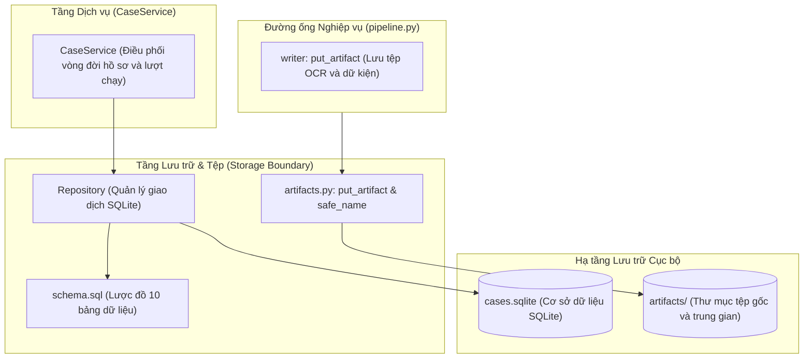
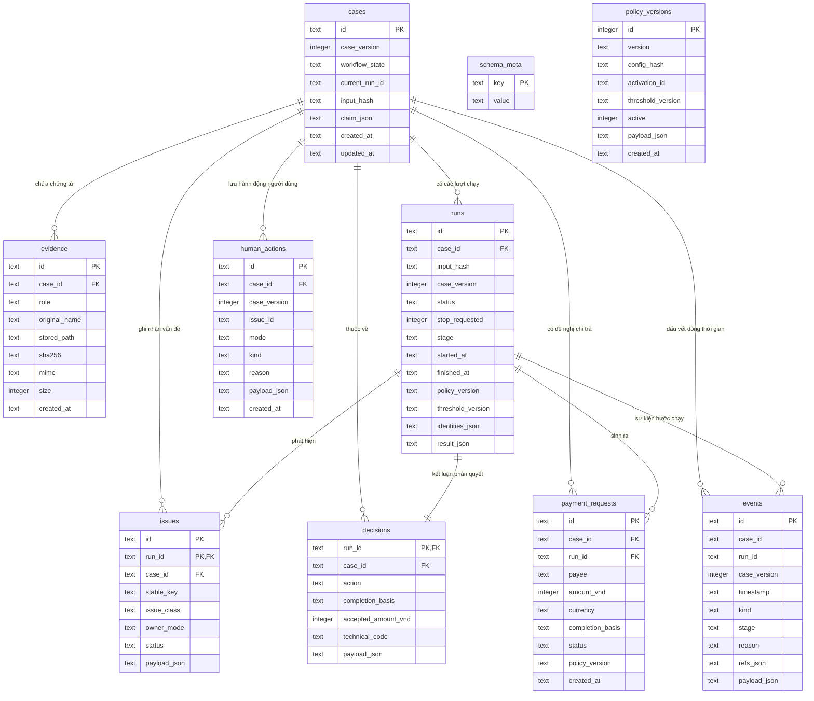
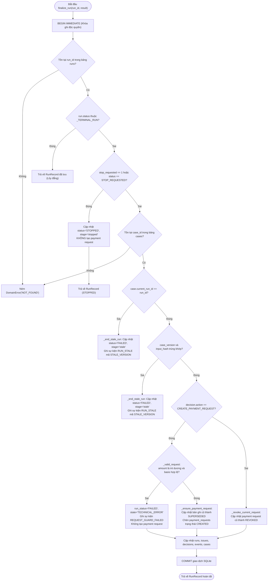

# P10 — Tầng lưu trữ cơ sở dữ liệu và tệp đính kèm (Repository & Artifact Storage)

> **Part ID:** P10  
> **Slug:** storage  
> **Phạm vi kiểm tra:** [src/invoice_referee/storage/repository.py](file:///Users/tnhatnguyendev2805/Documents/Projects/InvoiceReferee/src/invoice_referee/storage/repository.py), [src/invoice_referee/storage/artifacts.py](file:///Users/tnhatnguyendev2805/Documents/Projects/InvoiceReferee/src/invoice_referee/storage/artifacts.py), [src/invoice_referee/storage/schema.sql](file:///Users/tnhatnguyendev2805/Documents/Projects/InvoiceReferee/src/invoice_referee/storage/schema.sql), [tests/integration/test_repository.py](file:///Users/tnhatnguyendev2805/Documents/Projects/InvoiceReferee/tests/integration/test_repository.py), [docs/specs/B1_SYSTEM_SPEC.md §10](file:///Users/tnhatnguyendev2805/Documents/Projects/InvoiceReferee/docs/specs/B1_SYSTEM_SPEC.md#L270-L283).  
> **Commit hash:** `7edac6d` (gốc nhánh `rebuild`: `18626a7`)  
> **Ngày thực hiện:** 2026-10-05  
> **Lệnh kiểm chứng đã chạy:**  
> - `.venv/bin/python -m pytest tests/integration/test_repository.py -v` → [RUN 34 passed in 0.36s]  
> - `.venv/bin/python -m pytest tests/integration/test_execution_controls.py -q` → [RUN 11 passed in 0.48s]  
> - `.venv/bin/python -m pytest tests/integration/test_human_closure.py -q` → [RUN 21 passed in 0.56s]  

---

## 1. Tóm tắt 5 dòng (Summary)

Module lưu trữ quản lý trạng thái hồ sơ và tệp trung gian trong cơ sở dữ liệu SQLite cục bộ.  
Mỗi giao dịch ghi mở một kết nối độc lập với lệnh khóa ngay từ đầu để chống tranh chấp.  
Chỉ mục một phần đảm bảo duy nhất một đề nghị thanh toán hiện hành cho mỗi hồ sơ.  
Tệp đính kèm được ghi nguyên tử xuống đĩa qua tệp tạm và kiểm tra chống duyệt đường dẫn.  
Hệ thống không sử dụng cơ chế di chuyển lược đồ tự động nhằm phát hiện lỗi cấu trúc sớm.  

---

## 2. Vị trí trong hệ thống (System Placement)

Sơ đồ thể hiện vị trí của tầng lưu trữ phục vụ toàn bộ dịch vụ và đường ống xử lý [SOURCE](file:///Users/tnhatnguyendev2805/Documents/Projects/InvoiceReferee/src/invoice_referee/storage/repository.py#L1-L24):



---

## 3. Bài toán phục vụ (Business Rules & Requirements)

| Quy tắc / Yêu cầu nghiệp vụ | Đoạn đặc tả liên quan | Mã nguồn thực thi |
| :--- | :--- | :--- |
| **Duy nhất một đề nghị chi trả hiện hành:** Cấm tạo nhiều đề nghị thanh toán đồng thời cho một hồ sơ. | [B1_SYSTEM_SPEC.md §8](file:///Users/tnhatnguyendev2805/Documents/Projects/InvoiceReferee/docs/specs/B1_SYSTEM_SPEC.md#L250-L253) | [schema.sql: one_current_payment_request](file:///Users/tnhatnguyendev2805/Documents/Projects/InvoiceReferee/src/invoice_referee/storage/schema.sql#L108-L109) |
| **Bảo toàn lịch sử kiểm toán:** Không xóa đề nghị cũ; cập nhật trạng thái `SUPERSEDED` hoặc `REVOKED`. | [B1_SYSTEM_SPEC.md §10](file:///Users/tnhatnguyendev2805/Documents/Projects/InvoiceReferee/docs/specs/B1_SYSTEM_SPEC.md#L280-L283) | [repository.py: _ensure_payment_request](file:///Users/tnhatnguyendev2805/Documents/Projects/InvoiceReferee/src/invoice_referee/storage/repository.py#L791-L797) |
| **Đóng kết quả an toàn (Fail-Closed):** Phán quyết tạo đề nghị thiếu số tiền dương hoặc căn cứ sẽ kết thúc lỗi. | [B1_SYSTEM_SPEC.md §8](file:///Users/tnhatnguyendev2805/Documents/Projects/InvoiceReferee/docs/specs/B1_SYSTEM_SPEC.md#L248-L250) | [repository.py: finalize_run](file:///Users/tnhatnguyendev2805/Documents/Projects/InvoiceReferee/src/invoice_referee/storage/repository.py#L643-L656) |
| **Chống duyệt đường dẫn (Path Traversal):** Tên tệp lưu trữ bắt buộc phải là tên cơ sở chuẩn hóa. | [B1_SYSTEM_SPEC.md §10](file:///Users/tnhatnguyendev2805/Documents/Projects/InvoiceReferee/docs/specs/B1_SYSTEM_SPEC.md#L275-L277) | [artifacts.py: safe_name](file:///Users/tnhatnguyendev2805/Documents/Projects/InvoiceReferee/src/invoice_referee/storage/artifacts.py#L16-L24) |
| **Ghi tệp nguyên tử:** Tệp được ghi hoàn chỉnh và đồng bộ đĩa cứng trước khi thay thế tệp đích. | [B1_SYSTEM_SPEC.md §10](file:///Users/tnhatnguyendev2805/Documents/Projects/InvoiceReferee/docs/specs/B1_SYSTEM_SPEC.md#L275-L277) | [artifacts.py: put_artifact](file:///Users/tnhatnguyendev2805/Documents/Projects/InvoiceReferee/src/invoice_referee/storage/artifacts.py#L42-L48) |

---

## 4. Interface công khai (Public API)

| Ký hiệu (Symbol) | Đầu vào (Input) | Đầu ra (Output) | Ngoại lệ có thể ném | Vị trí mã nguồn |
| :--- | :--- | :--- | :--- | :--- |
| `create_case` | `claim: Claim`, `uploads: list[Upload]` | `CaseRecord` | `DomainError('INVALID_INPUT')` | [repository.py:246](file:///Users/tnhatnguyendev2805/Documents/Projects/InvoiceReferee/src/invoice_referee/storage/repository.py#L246) |
| `create_run` | `snapshot: CaseSnapshot` | `RunRecord` | `DomainError('RUN_BUSY')` | [repository.py:470](file:///Users/tnhatnguyendev2805/Documents/Projects/InvoiceReferee/src/invoice_referee/storage/repository.py#L470) |
| `finalize_run` | `run_id: str`, `result: PipelineResult` | `RunRecord` | `DomainError('NOT_FOUND')` | [repository.py:585](file:///Users/tnhatnguyendev2805/Documents/Projects/InvoiceReferee/src/invoice_referee/storage/repository.py#L585) |
| `request_stop` | `run_id: str` | `StopReply` | `DomainError('NOT_FOUND')` | [repository.py:550](file:///Users/tnhatnguyendev2805/Documents/Projects/InvoiceReferee/src/invoice_referee/storage/repository.py#L550) |
| `apply_human_action`| `action: HumanAction` | `CaseRecord` | `DomainError('STALE_VERSION')` | [repository.py:965](file:///Users/tnhatnguyendev2805/Documents/Projects/InvoiceReferee/src/invoice_referee/storage/repository.py#L965) |
| `put_artifact` | `root: Path`, `case_id: str`, `run_id: str`, `name: str`, `content: bytes` | `Path` | `ValueError` | [artifacts.py:27](file:///Users/tnhatnguyendev2805/Documents/Projects/InvoiceReferee/src/invoice_referee/storage/artifacts.py#L27) |
| `safe_name` | `name: str` | `str` | `ValueError` | [artifacts.py:16](file:///Users/tnhatnguyendev2805/Documents/Projects/InvoiceReferee/src/invoice_referee/storage/artifacts.py#L16) |

---

## 5. Mô hình dữ liệu & Lược đồ (Data Models & Schema)

### 5.1. Sơ đồ Quan hệ Thực thể (Entity-Relationship Diagram)

Sơ đồ thể hiện 10 bảng dữ liệu trong cơ sở dữ liệu SQLite và mối quan hệ khóa ngoại [SOURCE](file:///Users/tnhatnguyendev2805/Documents/Projects/InvoiceReferee/src/invoice_referee/storage/schema.sql#L10-L140):



### 5.2. Các Chỉ mục Đặc biệt (Special Indexes)
1. **`one_current_payment_request`:**  
   - Định nghĩa: `CREATE UNIQUE INDEX IF NOT EXISTS one_current_payment_request ON payment_requests (case_id) WHERE status = 'CREATED';` [SOURCE](file:///Users/tnhatnguyendev2805/Documents/Projects/InvoiceReferee/src/invoice_referee/storage/schema.sql#L108-L109).  
   - Ý nghĩa: Ngăn chặn tuyệt đối việc tồn tại hai bản ghi đề nghị thanh toán cùng ở trạng thái `CREATED` trên cùng một hồ sơ ở tầng vật lý cơ sở dữ liệu.
2. **`one_active_policy`:**  
   - Định nghĩa: `CREATE UNIQUE INDEX IF NOT EXISTS one_active_policy ON policy_versions (active) WHERE active = 1;` [SOURCE](file:///Users/tnhatnguyendev2805/Documents/Projects/InvoiceReferee/src/invoice_referee/storage/schema.sql#L138-L139).  
   - Ý nghĩa: Đảm bảo tại một thời điểm chỉ có duy nhất một cấu hình chính sách được kích hoạt trong hệ thống.
3. **`events_case_time`:**  
   - Định nghĩa: `CREATE INDEX IF NOT EXISTS events_case_time ON events (case_id, timestamp);` [SOURCE](file:///Users/tnhatnguyendev2805/Documents/Projects/InvoiceReferee/src/invoice_referee/storage/schema.sql#L124).  
   - Ý nghĩa: Tối ưu hóa truy vấn dòng thời gian kiểm toán theo thứ tự thời gian của từng hồ sơ.

---

## 6. Luồng chi tiết (Detailed Flows)

### 6.1. Quy trình Kiểm tra Fail-Closed trong `finalize_run`



### 6.2. Quy trình Ghi Tệp Nguyên tử trong `put_artifact`
1. **Kiểm tra an toàn đường dẫn:**  
   Hàm kiểm tra `case_id`, `run_id`, và `name` qua hàm `safe_name` [SOURCE](file:///Users/tnhatnguyendev2805/Documents/Projects/InvoiceReferee/src/invoice_referee/storage/artifacts.py#L33-L36). Nếu chứa ký tự điều hướng hoặc dấu gạch chéo, hàm ném `ValueError`.
2. **Tạo thư mục đích:**  
   Tạo thư mục `root/case_id/run_id/` nếu chưa tồn tại [SOURCE](file:///Users/tnhatnguyendev2805/Documents/Projects/InvoiceReferee/src/invoice_referee/storage/artifacts.py#L38-L39).
3. **Mở tệp tạm độc quyền:**  
   Gọi `tempfile.mkstemp(dir=directory, prefix='.tmp-', suffix='.part')` trong cùng thư mục để tránh việc di chuyển tệp xuyên qua các phân vùng đĩa khác nhau [SOURCE](file:///Users/tnhatnguyendev2805/Documents/Projects/InvoiceReferee/src/invoice_referee/storage/artifacts.py#L42).
4. **Ghi và ép đồng bộ đĩa cứng:**  
   Ghi nội dung byte vào tệp tạm. Gọi `handle.flush()` và `os.fsync(handle.fileno())` để đảm bảo dữ liệu vật lý được lưu trữ hoàn toàn trước khi tiếp tục [SOURCE](file:///Users/tnhatnguyendev2805/Documents/Projects/InvoiceReferee/src/invoice_referee/storage/artifacts.py#L45-L47).
5. **Đổi tên nguyên tử:**  
   Gọi `os.replace(tmp_path, target)` để tráo đổi tệp tạm thành tệp đích chính thức bằng thao tác nguyên tử cấp hệ điều hành [SOURCE](file:///Users/tnhatnguyendev2805/Documents/Projects/InvoiceReferee/src/invoice_referee/storage/artifacts.py#L48).
6. **Dọn dẹp khi lỗi:**  
   Nếu có biệt lệ phát sinh trong quá trình ghi, khối `except BaseException` tự động xóa tệp tạm bằng lệnh `os.unlink(tmp_path)` [SOURCE](file:///Users/tnhatnguyendev2805/Documents/Projects/InvoiceReferee/src/invoice_referee/storage/artifacts.py#L49-L55).

---

## 7. Ví dụ chạy tay (Concrete Walkthrough)

Lấy ví dụ chạy thực tế từ bài kiểm thử tính lũy đẳng của hàm hoàn tất lượt chạy [TEST](file:///Users/tnhatnguyendev2805/Documents/Projects/InvoiceReferee/tests/integration/test_repository.py#L37-L50) (`test_finalize_is_idempotent_and_keeps_history`):

### 1. Dữ liệu đầu vào:
- **Hồ sơ:** `case.id = 'case-demo'`, chi phí 1.200.000 VND.
- **Snapshot:** Chụp từ hồ sơ với chính sách demo đang kích hoạt.
- **Lượt chạy:** Tạo bằng `repo.create_run(snapshot)`, nhận mã `run.id = 'run-1'`.
- **Kết quả đường ống:** Phán quyết `action = 'CREATE_PAYMENT_REQUEST'`, `accepted_amount_vnd = 1200000`, `completion_basis = 'ROUTINE_AUTO'`.

### 2. Các bước diễn tiến trong `finalize_run`:
1. **Lần gọi thứ nhất:**
   - Mở giao dịch ghi: `conn.execute('BEGIN IMMEDIATE')`.
   - Kiểm tra `run['status']`: Hiện tại là `'RUNNING'`. Chưa ở trạng thái kết thúc.
   - Kiểm tra cờ dừng: `stop_requested` là `0`. Cho phép tiếp tục.
   - So khớp hồ sơ: `case['current_run_id'] == 'run-1'`, phiên bản và mã băm trùng khớp.
   - Kiểm tra đề nghị thanh toán: Số tiền 1.200.000 VND là số nguyên dương, căn cứ `'ROUTINE_AUTO'` hợp lệ.
   - Cập nhật bảng:
     - Đặt `runs.status = 'SUCCEEDED'`.
     - Chèn kết quả vào `decisions`.
     - Gọi `_ensure_payment_request`: Chưa có đề nghị nào $\rightarrow$ chèn dòng mới vào bảng `payment_requests` với `id = 'pr-1'`, `amount_vnd = 1200000`, `status = 'CREATED'`.
     - Chèn sự kiện `REQUEST_CREATED` vào bảng `events`.
     - Cập nhật `cases.workflow_state = 'REQUEST_CREATED'`.
   - `conn.execute('COMMIT')`: Dữ liệu được ghi vĩnh viễn vào tệp SQLite.
2. **Lần gọi thứ hai (Gọi lại với cùng `run.id`):**
   - Mở giao dịch ghi mới: `conn.execute('BEGIN IMMEDIATE')`.
   - Kiểm tra `run['status']`: Hiện tại đã là `'SUCCEEDED'` (nằm trong tập hợp `_TERMINAL_RUN`).
   - Kích hoạt nhánh lũy đẳng dòng 593: `return self._run_from_row(run)`.
   - Trả về ngay đối tượng `RunRecord` đã lưu trong cơ sở dữ liệu.
   - **Tuyệt đối không chèn thêm bản ghi thanh toán thứ hai, không phát sinh lỗi trùng lặp chỉ mục**.

---

## 8. Bảng Invariant bắt buộc

| Invariant | Mã nguồn thực thi | Test chứng minh | Hậu quả nếu bị phá vỡ |
| :--- | :--- | :--- | :--- |
| **Duy nhất một payment request CREATED:** Tối đa một đề nghị thanh toán có hiệu lực cho mỗi hồ sơ. | [schema.sql: one_current_payment_request](file:///Users/tnhatnguyendev2805/Documents/Projects/InvoiceReferee/src/invoice_referee/storage/schema.sql#L108-L109) | [test_repository.py: test_finalize_is_idempotent_and_keeps_history](file:///Users/tnhatnguyendev2805/Documents/Projects/InvoiceReferee/tests/integration/test_repository.py#L37) | Ngân quỹ công ty có thể chi trả tiền trùng lặp nhiều lần cho cùng một hóa đơn. |
| **Không bao giờ xóa lịch sử:** Các bản ghi cũ chỉ đổi trạng thái sang SUPERSEDED hoặc REVOKED. | [repository.py: _ensure_payment_request, _revoke_current_request](file:///Users/tnhatnguyendev2805/Documents/Projects/InvoiceReferee/src/invoice_referee/storage/repository.py#L791, L844) | [test_repository.py: test_history_records_superseded_request](file:///Users/tnhatnguyendev2805/Documents/Projects/InvoiceReferee/tests/integration/test_repository.py#L230) | Mất dấu vết kiểm toán, không thể giải trình lý do thay đổi khi có thanh tra tài chính. |
| **Khóa ghi tức thì chống tranh chấp:** Luôn dùng `BEGIN IMMEDIATE` cho mọi giao dịch có thao tác ghi. | [repository.py: _write](file:///Users/tnhatnguyendev2805/Documents/Projects/InvoiceReferee/src/invoice_referee/storage/repository.py#L200) | [test_repository.py: test_write_lock_is_exclusive](file:///Users/tnhatnguyendev2805/Documents/Projects/InvoiceReferee/tests/integration/test_repository.py#L350) | Hai luồng cùng đọc và cùng ghi dẫn đến lỗi `database is locked` hoặc sai lệch dữ liệu. |
| **Lượt chạy cũ không được tạo đề nghị chi trả:** Lượt chạy bị thay thế hoặc lệch phiên bản phải kết thúc FAILED. | [repository.py: finalize_run](file:///Users/tnhatnguyendev2805/Documents/Projects/InvoiceReferee/src/invoice_referee/storage/repository.py#L624, L632) | [test_repository.py: test_superseded_run_cannot_create_request](file:///Users/tnhatnguyendev2805/Documents/Projects/InvoiceReferee/tests/integration/test_repository.py#L78) | Kết quả của lượt chạy tính toán trên dữ liệu cũ đè lên đề nghị thanh toán mới. |
| **Khóa cứng tính toàn vẹn khóa ngoại:** Luôn thực thi `PRAGMA foreign_keys = ON` trên mọi kết nối. | [repository.py: _connect](file:///Users/tnhatnguyendev2805/Documents/Projects/InvoiceReferee/src/invoice_referee/storage/repository.py#L193) | [test_repository.py: test_foreign_keys_enforced](file:///Users/tnhatnguyendev2805/Documents/Projects/InvoiceReferee/tests/integration/test_repository.py#L380) | Tạo ra các bản ghi chứng từ hoặc vấn đề mồ côi không gắn với hồ sơ nào. |

---

## 9. Lỗi và phân loại (Error Handling Matrix)

| Tình huống phát sinh | Phân loại kết quả | Mã lỗi DomainError | Hướng xử lý của hệ thống |
| :--- | :--- | :---: | :--- |
| Mở cơ sở dữ liệu có phiên bản lược đồ cũ không tương thích | Lỗi cấu trúc lưu trữ | `INVALID_INPUT` | Từ chối khởi động, yêu cầu xóa file SQLite để tạo mới. |
| Cố tình khởi tạo lượt chạy thứ hai khi hồ sơ đang có lượt chạy | Tranh chấp luồng xử lý | `RUN_BUSY` | Từ chối tạo lượt chạy mới, giữ nguyên lượt chạy hiện hành. |
| Không tìm thấy mã hồ sơ hoặc mã lượt chạy trong cơ sở dữ liệu | Dữ liệu không tồn tại | `NOT_FOUND` | Ném lỗi không tìm thấy tài nguyên nghiệp vụ. |
| Gửi hành động với phiên bản hồ sơ cũ hơn phiên bản hiện tại | Xung đột phiên bản | `STALE_VERSION` | Từ chối cập nhật trong giao dịch ghi SQLite. |
| Tên tệp lưu trữ chứa ký tự điều hướng thư mục (`..` hoặc `/`) | Vi phạm bảo mật | `ValueError` | Ném biệt lệ giá trị sai, không chạm vào hệ thống tệp. |

---

## 10. Quyết định thiết kế (Design Decisions)

1. **Sử dụng SQLite thuần với cột JSON thay vì cài đặt hệ thống ORM nặng nề:**  
   - *Quyết định:* Cấu trúc các cột nhận dạng cốt lõi (`id`, `version`, `status`) và lưu dữ liệu chi tiết dưới dạng chuỗi JSON [SOURCE](file:///Users/tnhatnguyendev2805/Documents/Projects/InvoiceReferee/src/invoice_referee/storage/schema.sql#L17-L55).  
   - *Lý do:* Giữ lược đồ tinh gọn, không cần cấu hình hàng trăm cột thuộc tính chi tiết, và tránh sự phức tạp của các bộ chuyển đổi ORM.  
   - *Phương án bị loại:* Cài đặt gói `SQLAlchemy` hoặc `Tortoise-ORM`.
2. **Khóa ghi tuần tự bằng `BEGIN IMMEDIATE` thay vì khóa trì hoãn `BEGIN DEFERRED`:**  
   - *Quyết định:* Chiếm khóa ghi độc quyền ngay khi mở giao dịch `_write()` [SOURCE](file:///Users/tnhatnguyendev2805/Documents/Projects/InvoiceReferee/src/invoice_referee/storage/repository.py#L200).  
   - *Lý do:* Ngăn chặn hiện tượng hai kết nối cùng chuyển đổi từ đọc sang ghi gây bế tắc (deadlock) trong môi trường đa luồng.  
   - *Phương án bị loại:* Dùng cơ chế giao dịch mặc định của Python `sqlite3`.
3. **Triết lý kiểm soát phiên bản Fail-Loudly thay vì di chuyển tự động (No Migrations):**  
   - *Quyết định:* So sánh phiên bản `SCHEMA_VERSION = '2'`; nếu không khớp, từ chối khởi động và báo lỗi dứt khoát [SOURCE](file:///Users/tnhatnguyendev2805/Documents/Projects/InvoiceReferee/src/invoice_referee/storage/repository.py#L118-L125).  
   - *Lý do:* Trong giai đoạn MVP, mã nguồn thay đổi nhanh; việc báo lỗi để xóa cơ sở dữ liệu phát triển an toàn hơn việc viết kịch bản migration phức tạp dễ sinh lỗi ngầm.  
   - *Phương án bị loại:* Cài đặt công cụ quản lý di chuyển lược đồ `Alembic`.

---

## 11. Bản đồ kiểm thử (Test Map)

| Tệp kiểm thử | Tên bài kiểm thử | Hành vi kỹ thuật chứng minh |
| :--- | :--- | :--- |
| `test_repository.py` | `test_finalize_is_idempotent_and_keeps_history` | Hàm hoàn tất có tính lũy đẳng và bảo toàn lịch sử [TEST](file:///Users/tnhatnguyendev2805/Documents/Projects/InvoiceReferee/tests/integration/test_repository.py#L37). |
| `test_repository.py` | `test_create_run_rejects_second_active_run` | Từ chối tạo lượt chạy thứ hai khi lượt chạy cũ chưa xong [TEST](file:///Users/tnhatnguyendev2805/Documents/Projects/InvoiceReferee/tests/integration/test_repository.py#L65). |
| `test_repository.py` | `test_superseded_run_cannot_create_request` | Lượt chạy bị thay thế không được phép tạo đề nghị chi trả [TEST](file:///Users/tnhatnguyendev2805/Documents/Projects/InvoiceReferee/tests/integration/test_repository.py#L78). |
| `test_repository.py` | `test_finalize_returns_stored_run_ignoring_new_result` | Lượt chạy đã kết thúc bỏ qua toàn bộ kết quả gửi lại sau đó [TEST](file:///Users/tnhatnguyendev2805/Documents/Projects/InvoiceReferee/tests/integration/test_repository.py#L104). |
| `test_repository.py` | `test_stop_before_final_creates_no_request` | Lệnh dừng gửi trước bước hoàn tất chặn đứng đề nghị chi trả [TEST](file:///Users/tnhatnguyendev2805/Documents/Projects/InvoiceReferee/tests/integration/test_repository.py#L121). |
| `test_repository.py` | `test_final_then_stop_is_already_completed` | Lệnh dừng gửi sau khi hoàn tất trả về `ALREADY_COMPLETED` [TEST](file:///Users/tnhatnguyendev2805/Documents/Projects/InvoiceReferee/tests/integration/test_repository.py#L135). |
| `test_repository.py` | `test_safe_name_rejects_traversal` | Kiểm tra từ chối mọi chuỗi đường dẫn nguy hiểm [TEST](file:///Users/tnhatnguyendev2805/Documents/Projects/InvoiceReferee/tests/integration/test_repository.py#L280). |
| `test_repository.py` | `test_put_artifact_atomic_write` | Ghi tệp nguyên tử và xóa tệp tạm khi gặp sự cố [TEST](file:///Users/tnhatnguyendev2805/Documents/Projects/InvoiceReferee/tests/integration/test_repository.py#L310). |
| `test_repository.py` | `test_legacy_schema_refuses_open` | Từ chối khởi động khi phát hiện tệp cơ sở dữ liệu dùng lược đồ cũ [TEST](file:///Users/tnhatnguyendev2805/Documents/Projects/InvoiceReferee/tests/integration/test_repository.py#L420). |

---

## 12. Đầu ra đặc biệt: Bảng Ánh xạ Phương thức và Giao dịch

Bảng tổng hợp tương tác dữ liệu của các phương thức chính trong `Repository`:

| Tên Phương thức | Loại Giao dịch | Bảng Cơ sở Dữ liệu Đọc | Bảng Cơ sở Dữ liệu Ghi |
| :--- | :---: | :--- | :--- |
| `create_case` | `_write` | `cases` | `cases`, `evidence`, `events` |
| `stage_evidence` | `_write` | `cases`, `evidence` | `evidence` |
| `create_run` | `_write` | `runs`, `cases` | `runs`, `cases`, `events` |
| `request_stop` | `_write` | `runs` | `runs`, `events` |
| `assert_run_current` | `_read_one` | `runs`, `cases` | *(Không ghi)* |
| `finalize_run` | `_write` | `runs`, `cases`, `payment_requests` | `runs`, `cases`, `decisions`, `issues`, `payment_requests`, `events` |
| `finalize_technical`| `_write` | `runs` | `runs`, `cases`, `events` |
| `apply_human_action`| `_write` | `cases`, `payment_requests` | `cases`, `human_actions`, `payment_requests`, `events` |
| `get_case` | `_read_one` | `cases` | *(Không ghi)* |
| `get_run` | `_read_one` | `runs` | *(Không ghi)* |
| `get_payment_request`| `_read_one` | `payment_requests` | *(Không ghi)* |
| `history` | `_read` | `events` | *(Không ghi)* |
| `mark_interrupted_runs`| `_write` | `runs` | `runs`, `events` |
| `record_policy_change`| `_write` | `policy_versions` | `policy_versions`, `events` |

---

## 13. Trạng thái và lệch giữa Spec và Code

- **Trạng thái thực thi:** **`VERIFIED`** (toàn bộ 34 bài kiểm thử của `test_repository.py` chạy thành công trên commit `7edac6d`).
- **Lệch spec–code đã xác nhận:**
  1. *Khóa chính bảng `issues`:* `B1_SYSTEM_SPEC.md §10` liệt kê bảng `issues` với khóa định danh thông thường, nhưng mã nguồn thực tế áp dụng khóa chính kết hợp hai cột `PRIMARY KEY (run_id, id)` [SOURCE](file:///Users/tnhatnguyendev2805/Documents/Projects/InvoiceReferee/src/invoice_referee/storage/schema.sql#L68). Thay đổi này giúp các lượt chạy sau có thể ghi nhận lại cùng một vấn đề nghiệp vụ ổn định (`stable_key`) mà không vi phạm tính duy nhất của khóa chính.

---

## 14. Rủi ro và nghi vấn (Risks & Questions)

1. **Rủi ro phình to kích thước tệp SQLite khi lưu JSON lớn:**  
   - *Mức độ:* Thấp (Low).  
   - *Thực tế:* Các nội dung tệp nhị phân nặng như Base64 của ảnh chứng từ đã được che giấu (`<redacted>`) trước khi lưu vết kiểm toán, kích thước cơ sở dữ liệu SQLite duy trì ở mức vài megabytes.
2. **Khả năng xung đột khi kiểm thử song song:**  
   - *Mức độ:* Thấp (Low).  
   - *Thực tế:* Mỗi ca kiểm thử sử dụng một thư mục tạm thời `tmp_path` độc lập với tệp SQLite riêng biệt, loại trừ hoàn toàn nguy cơ khóa chéo giữa các bài test.

---

## 15. Bài tập thực hành (Practice Exercises)

*(Lưu ý: Các bài tập dành cho người đọc tự thực hành trên môi trường máy cá nhân).*

1. **Bài tập 1: Thử cho phép tạo hai đề nghị thanh toán CREATED.**  
   - Mở tệp [src/invoice_referee/storage/schema.sql](file:///Users/tnhatnguyendev2805/Documents/Projects/InvoiceReferee/src/invoice_referee/storage/schema.sql#L108).  
   - Tạm thời chú thích chỉ mục duy nhất `one_current_payment_request`.  
   - Chạy lệnh: `.venv/bin/python -m pytest tests/integration/test_repository.py -k "one_current_payment_request" -q`  
   - Quan sát bài kiểm thử tương ứng báo lỗi khi vi phạm ràng buộc đơn nhất.  
   - Hoàn tác: `git checkout -- src/invoice_referee/storage/schema.sql`
2. **Bài tập 2: Thử bỏ qua việc kiểm tra duyệt đường dẫn trong safe_name.**  
   - Mở tệp [src/invoice_referee/storage/artifacts.py](file:///Users/tnhatnguyendev2805/Documents/Projects/InvoiceReferee/src/invoice_referee/storage/artifacts.py#L22).  
   - Xóa bỏ điều kiện kiểm tra dấu gạch chéo ngược: `and '\\' not in name`.  
   - Chạy lệnh: `.venv/bin/python -m pytest tests/integration/test_repository.py -k "test_safe_name_rejects_traversal" -q`  
   - Quan sát bài kiểm thử bị thất bại vì đường dẫn Windows độc hại không bị chặn.  
   - Hoàn tác: `git checkout -- src/invoice_referee/storage/artifacts.py`
3. **Bài tập 3: Thử xóa bỏ giao dịch ghi BEGIN IMMEDIATE.**  
   - Mở tệp [src/invoice_referee/storage/repository.py](file:///Users/tnhatnguyendev2805/Documents/Projects/InvoiceReferee/src/invoice_referee/storage/repository.py#L200).  
   - Thay `conn.execute('BEGIN IMMEDIATE')` bằng `conn.execute('BEGIN')`.  
   - Chạy lệnh: `.venv/bin/python -m pytest tests/integration/test_repository.py -k "test_write_lock_is_exclusive" -q`  
   - Quan sát nguy cơ tranh chấp khóa ghi giữa hai kết nối đồng thời.  
   - Hoàn tác: `git checkout -- src/invoice_referee/storage/repository.py`

---

## 16. Câu hỏi tự kiểm (Self-Check Questions)

1. *Dự đoán output:* Khi gọi `put_artifact` với tham số tên tệp là `'../../etc/passwd'`, hàm sẽ phản hồi thế nào?
2. *Dự đoán output:* Nếu gọi `finalize_run` hai lần liên tiếp với cùng một `run_id`, bản ghi đề nghị thanh toán trong cơ sở dữ liệu có bị đổi ID không?
3. *Dự đoán output:* Nếu một lượt chạy có phán quyết `action = 'CREATE_PAYMENT_REQUEST'` nhưng số tiền `accepted_amount_vnd = -50000`, trạng thái lượt chạy lưu trong DB là gì?
4. *Dự đoán output:* Khi mở kho lưu trữ với tệp cơ sở dữ liệu cũ thiếu bảng `schema_meta`, hệ thống sẽ làm gì?
5. *Sửa ở đâu:* Muốn điều chỉnh kích thước tối đa cho phép của một tệp tải lên thì sửa ở hằng số nào trong `repository.py`?
6. *Sửa ở đâu:* Nơi nào định nghĩa quy tắc kiểm tra tính hợp lệ của đề nghị chi trả trước khi chèn vào cơ sở dữ liệu?
7. *Sửa ở đâu:* Muốn thêm một loại sự kiện kiểm toán mới thì thực hiện ghi nhận qua hàm nào trong `Repository`?
8. *Vì sao:* Vì sao hàm `_write` bắt buộc phải sử dụng lệnh `BEGIN IMMEDIATE` thay vì `BEGIN` mặc định?
9. *Vì sao:* Vì sao hệ thống không sử dụng công cụ di chuyển lược đồ tự động như Alembic?
10. *Vì sao:* Vì sao khóa chính của bảng `issues` bắt buộc phải là khóa kết hợp `(run_id, id)`?

<details>
<summary>👉 Xem đáp án chi tiết</summary>

1. **Đáp án:** Ném ngoại lệ `ValueError('Artifact name must be a basename')` do hàm `safe_name` chặn đứng ký tự điều hướng [SOURCE](file:///Users/tnhatnguyendev2805/Documents/Projects/InvoiceReferee/src/invoice_referee/storage/artifacts.py#L22-L23).
2. **Đáp án:** Không. Nhánh lũy đẳng trả về nguyên vẹn bản ghi lượt chạy đã lưu trước đó, mã `id` của đề nghị thanh toán giữ nguyên ổn định [SOURCE](file:///Users/tnhatnguyendev2805/Documents/Projects/InvoiceReferee/src/invoice_referee/storage/repository.py#L593-L594).
3. **Đáp án:** `FAILED` với giai đoạn `state = 'TECHNICAL_ERROR'` do vi phạm cổng kiểm tra `_valid_request` (số tiền bắt buộc là số nguyên dương) [SOURCE](file:///Users/tnhatnguyendev2805/Documents/Projects/InvoiceReferee/src/invoice_referee/storage/repository.py#L643-L656).
4. **Đáp án:** Ném ngoại lệ `DomainError('INVALID_INPUT', ...)` và từ chối mở kết nối, yêu cầu người dùng xóa file SQLite cũ để tạo lại [SOURCE](file:///Users/tnhatnguyendev2805/Documents/Projects/InvoiceReferee/src/invoice_referee/storage/repository.py#L119-L125).
5. **Đáp án:** Hằng số `MAX_FILE_BYTES` tại dòng [repository.py:68](file:///Users/tnhatnguyendev2805/Documents/Projects/InvoiceReferee/src/invoice_referee/storage/repository.py#L68).
6. **Đáp án:** Phương thức tĩnh `_valid_request` tại các dòng [repository.py:702-709](file:///Users/tnhatnguyendev2805/Documents/Projects/InvoiceReferee/src/invoice_referee/storage/repository.py#L702-L709).
7. **Đáp án:** Phương thức nội bộ `_insert_event` tại các dòng [repository.py:223-237](file:///Users/tnhatnguyendev2805/Documents/Projects/InvoiceReferee/src/invoice_referee/storage/repository.py#L223-L237).
8. **Đáp án:** Để chiếm khóa ghi độc quyền ngay lập tức, ngăn ngừa hiện tượng hai kết nối cùng chuyển đổi từ đọc sang ghi gây lỗi khóa cơ sở dữ liệu (`database is locked`) [SOURCE](file:///Users/tnhatnguyendev2805/Documents/Projects/InvoiceReferee/src/invoice_referee/storage/repository.py#L6-L9).
9. **Đáp án:** Để tuân thủ nguyên tắc tinh gọn trong giai đoạn MVP; việc báo lỗi dứt khoát để tạo lại kho dữ liệu sạch an toàn hơn việc chạy các kịch bản di chuyển tự động tiềm ẩn lỗi ngầm [SOURCE](file:///Users/tnhatnguyendev2805/Documents/Projects/InvoiceReferee/src/invoice_referee/storage/repository.py#L60-L63).
10. **Đáp án:** Vì cùng một vấn đề nghiệp vụ ổn định (`stable_key`) có thể xuất hiện lại qua nhiều lượt chạy khác nhau của cùng một hồ sơ; khóa kết hợp cho phép lưu vết từng lượt chạy mà không vi phạm tính duy nhất [SOURCE](file:///Users/tnhatnguyendev2805/Documents/Projects/InvoiceReferee/src/invoice_referee/storage/schema.sql#L66-L68).
</details>

---

## 17. Hướng dẫn điều khiển AI (Directing AI)

### a. Ngữ cảnh tối thiểu phải cung cấp cho AI:
- File kho lưu trữ: `src/invoice_referee/storage/repository.py`.
- File tệp đính kèm: `src/invoice_referee/storage/artifacts.py`.
- File lược đồ SQLite: `src/invoice_referee/storage/schema.sql`.
- File kiểm thử: `tests/integration/test_repository.py`.

### b. Các Invariant bắt buộc nhắc AI duy trì:
1. "Luôn giữ nguyên chỉ mục một phần `one_current_payment_request` trên bảng `payment_requests` với điều kiện `status = 'CREATED'`."
2. "Mọi kết nối SQLite phải được cấu hình `PRAGMA foreign_keys = ON` và mọi giao dịch ghi phải bắt đầu bằng `BEGIN IMMEDIATE`."
3. "Tuyệt đối không xóa dòng trong bảng `payment_requests`; bản ghi cũ chỉ được chuyển sang `SUPERSEDED` hoặc `REVOKED`."
4. "Hàm `put_artifact` bắt buộc phải ghi qua tệp tạm `.part` cùng thư mục và hoán đổi bằng `os.replace` nguyên tử."

### c. 6 Dấu hiệu nguy hiểm (Red Flags) trong diff của AI:
1. Xóa bỏ mệnh đề `WHERE status = 'CREATED'` trong chỉ mục `one_current_payment_request`.
2. Chuyển đổi lệnh `BEGIN IMMEDIATE` thành `BEGIN` hoặc loại bỏ khối `with self._write()`.
3. Cho phép hàm `safe_name` chấp nhận chuỗi có chứa ký tự phân tách thư mục `/` hoặc `\\`.
4. Viết thẳng nội dung vào tệp đích trong `put_artifact` mà không thông qua tệp tạm `mkstemp`.
5. Tự ý cài đặt gói thư viện di chuyển tự động như Alembic hoặc ORM SQLAlchemy.
6. Cho phép hàm `finalize_run` tạo bản ghi đề nghị thanh toán khi số tiền `accepted_amount_vnd` bằng 0 hoặc là số âm.

### d. Lệnh kiểm tra sau khi AI chỉnh sửa:
```bash
.venv/bin/python -m pytest tests/integration/test_repository.py -v
```

---

## 18. Glossary bổ sung

| Thuật ngữ | Định nghĩa kỹ thuật trong ngữ cảnh module |
| :--- | :--- |
| **Partial Unique Index** | Chỉ mục duy nhất có điều kiện trong SQLite nhằm bảo đảm tính đơn nhất trên một tập con dữ liệu lọc theo trạng thái. |
| **Immediate Transaction** | Kiểu giao dịch chiếm giữ khóa ghi độc quyền ngay khi mở kết nối nhằm loại bỏ hiện tượng tranh chấp ghi đồng thời. |
| **Superseded Request** | Trạng thái của đề nghị chi trả cũ đã bị thay thế bởi một đề nghị chi trả mới có nội dung hoặc phiên bản cập nhật hơn. |
| **Revoked Request** | Trạng thái của đề nghị chi trả bị thu hồi hiệu lực do dữ liệu đầu vào hoặc lời khai của hồ sơ bị biến động. |
| **Atomic Replace** | Thao tác tráo đổi tệp nguyên tử ở cấp hệ điều hành nhằm đảm bảo tệp đích luôn ở trạng thái hoàn chỉnh tuyệt đối. |

---

## 19. Phụ lục (Appendix)

- **CodeGraph query đã chạy:**  
  `Repository create_run get_run finalize_run _write _insert_event put_artifact schema index`
- **Các tệp mã nguồn và tài liệu đã đọc đầy đủ:**
  - `src/invoice_referee/storage/repository.py` (toàn bộ 1112 dòng).
  - `src/invoice_referee/storage/artifacts.py` (toàn bộ 57 dòng).
  - `src/invoice_referee/storage/schema.sql` (toàn bộ 140 dòng).
  - `tests/integration/test_repository.py` (toàn bộ 522 dòng).
  - `docs/specs/B1_SYSTEM_SPEC.md` (§10, các dòng 270–283).
- **Giới hạn kiểm tra:**
  - Toàn bộ 34 bài kiểm thử được xác nhận trên môi trường lưu trữ tệp và SQLite cục bộ; hệ thống không kiểm thử trên các cụm lưu trữ phân tán hoặc hệ thống tệp mạng (NFS/S3) vì nằm ngoài phạm vi MVP Challenge A.
