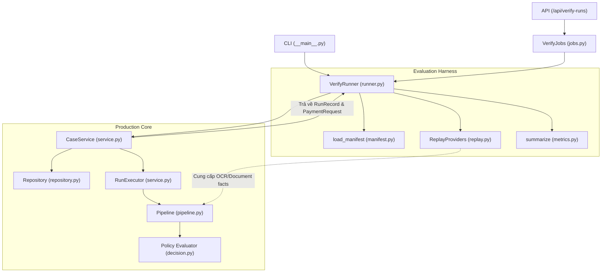
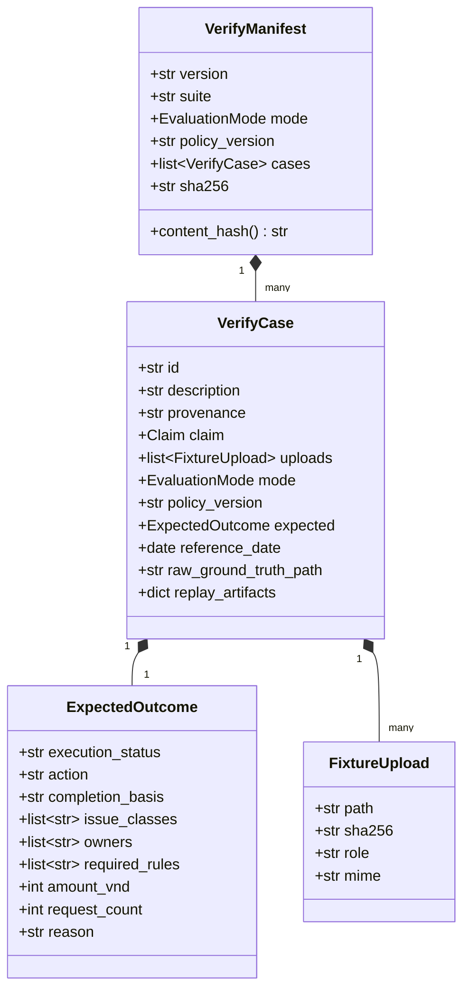
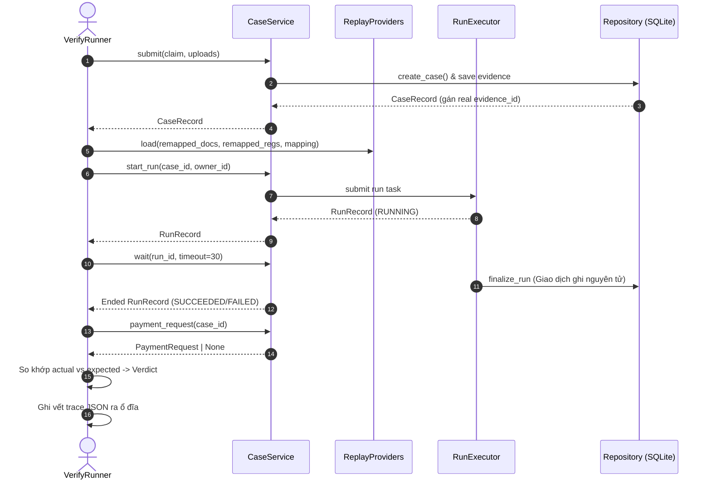

# P13 — Khung đánh giá và kiểm chứng hệ thống (Verify & Evaluation Harness)

> **Part ID:** P13  
> **Slug:** verify-evaluation  
> **Phạm vi kiểm tra:** [src/invoice_referee/verify/manifest.py](file:///Users/tnhatnguyendev2805/Documents/Projects/InvoiceReferee/src/invoice_referee/verify/manifest.py), [src/invoice_referee/verify/runner.py](file:///Users/tnhatnguyendev2805/Documents/Projects/InvoiceReferee/src/invoice_referee/verify/runner.py), [src/invoice_referee/verify/metrics.py](file:///Users/tnhatnguyendev2805/Documents/Projects/InvoiceReferee/src/invoice_referee/verify/metrics.py), [src/invoice_referee/verify/replay.py](file:///Users/tnhatnguyendev2805/Documents/Projects/InvoiceReferee/src/invoice_referee/verify/replay.py), [src/invoice_referee/verify/jobs.py](file:///Users/tnhatnguyendev2805/Documents/Projects/InvoiceReferee/src/invoice_referee/verify/jobs.py), [src/invoice_referee/verify/__main__.py](file:///Users/tnhatnguyendev2805/Documents/Projects/InvoiceReferee/src/invoice_referee/verify/__main__.py), [tests/integration/test_verify.py](file:///Users/tnhatnguyendev2805/Documents/Projects/InvoiceReferee/tests/integration/test_verify.py), [tests/fixtures/development/manifest.json](file:///Users/tnhatnguyendev2805/Documents/Projects/InvoiceReferee/tests/fixtures/development/manifest.json), [tests/fixtures/holdout/manifest.json](file:///Users/tnhatnguyendev2805/Documents/Projects/InvoiceReferee/tests/fixtures/holdout/manifest.json), [scripts/make_synthetic_evidence.py](file:///Users/tnhatnguyendev2805/Documents/Projects/InvoiceReferee/scripts/make_synthetic_evidence.py), [docs/specs/B1_EVALUATION_SPEC.md](file:///Users/tnhatnguyendev2805/Documents/Projects/InvoiceReferee/docs/specs/B1_EVALUATION_SPEC.md).  
> **Commit hash:** `4e1f59a`  
> **Ngày thực hiện:** 2026-10-05  
> **Lệnh kiểm chứng đã chạy:**  
> - `.venv/bin/python -m pytest tests/integration/test_verify.py -v` → [RUN 4 passed in 0.54s]  
> - `.venv/bin/python -m invoice_referee.verify --help` → [RUN Thành công hiển thị tham số CLI]  
> - `.venv/bin/python -m invoice_referee.verify --suite all --mode replay` → [RUN 15 passed, 0 failed, 0 inconclusive]  

---

## 1. Tóm tắt 5 dòng (Summary)

Module Verify cung cấp khung kiểm định tự động cho toàn bộ hệ thống MVP.  
Khung kiểm định chạy hồ sơ qua chính `CaseService` sản xuất mà không gọi mạng.  
Nhãn kỳ vọng chỉ tồn tại độc quyền trong bộ kiểm định và tệp manifest.  
Các chỉ số đo lường chỉ dùng tỷ số thực tế mà không tự chấm điểm.  
Tập dữ liệu phát triển và tập giữ lại được phân tách hoàn toàn độc lập.  

---

## 2. Vị trí trong hệ thống (System Context)

Khung kiểm định Verify bao bọc toàn bộ chu trình xử lý của ứng dụng. Giao diện dòng lệnh CLI hoặc API kích hoạt bộ kiểm định. Khung kiểm định điều phối việc nạp dữ liệu qua `CaseService` và theo dõi kết quả thực thi.



---

## 3. Bài toán phục vụ (Business Rules & Requirements)

| Yêu cầu kiểm chứng | Nguồn đặc tả | Thành phần thực thi trong mã nguồn |
| :--- | :--- | :--- |
| **Không gian lận nhãn kỳ vọng** | [B1_EVALUATION_SPEC.md §1](file:///Users/tnhatnguyendev2805/Documents/Projects/InvoiceReferee/docs/specs/B1_EVALUATION_SPEC.md#L16-L19) | Nhãn `expected` chỉ nằm trong [manifest.py](file:///Users/tnhatnguyendev2805/Documents/Projects/InvoiceReferee/src/invoice_referee/verify/manifest.py#L35-L45) và [runner.py:190](file:///Users/tnhatnguyendev2805/Documents/Projects/InvoiceReferee/src/invoice_referee/verify/runner.py#L190). [SOURCE] |
| **Dùng chung đường dẫn sản xuất** | [B1_EVALUATION_SPEC.md §1](file:///Users/tnhatnguyendev2805/Documents/Projects/InvoiceReferee/docs/specs/B1_EVALUATION_SPEC.md#L16-L19) | [VerifyRunner._run_case](file:///Users/tnhatnguyendev2805/Documents/Projects/InvoiceReferee/src/invoice_referee/verify/runner.py#L82-L118) gọi `CaseService.submit`, `start_run`, `wait`. [SOURCE] |
| **Bộ 15 ca kiểm thử chuẩn B1** | [B1_EVALUATION_SPEC.md §3](file:///Users/tnhatnguyendev2805/Documents/Projects/InvoiceReferee/docs/specs/B1_EVALUATION_SPEC.md#L53-L75) | [scripts/make_synthetic_evidence.py:145-312](file:///Users/tnhatnguyendev2805/Documents/Projects/InvoiceReferee/scripts/make_synthetic_evidence.py#L145-L312) sinh 15 ca `TC01`–`TC15`. [SOURCE] |
| **Phân tách tập giữ lại (Held-out)** | [B1_EVALUATION_SPEC.md §2](file:///Users/tnhatnguyendev2805/Documents/Projects/InvoiceReferee/docs/specs/B1_EVALUATION_SPEC.md#L36-L51) | [make_synthetic_evidence.py:418-422](file:///Users/tnhatnguyendev2805/Documents/Projects/InvoiceReferee/scripts/make_synthetic_evidence.py#L418-L422) tách 12 ca Calibration và 20 ca Holdout riêng biệt. [SOURCE] |
| **Tỷ số thống kê minh bạch** | [B1_EVALUATION_SPEC.md §6](file:///Users/tnhatnguyendev2805/Documents/Projects/InvoiceReferee/docs/specs/B1_EVALUATION_SPEC.md#L113-L130) | [metrics.py:16-78](file:///Users/tnhatnguyendev2805/Documents/Projects/InvoiceReferee/src/invoice_referee/verify/metrics.py#L16-L78) tính toán tử số và mẫu số rõ ràng cho từng chỉ số. [SOURCE] |
| **Báo cáo trung thực khi chưa nối live** | [B1_EVALUATION_SPEC.md §1](file:///Users/tnhatnguyendev2805/Documents/Projects/InvoiceReferee/docs/specs/B1_EVALUATION_SPEC.md#L9-L14) | [runner.py:84-88](file:///Users/tnhatnguyendev2805/Documents/Projects/InvoiceReferee/src/invoice_referee/verify/runner.py#L84-L88) gán verdict `INCONCLUSIVE` khi chọn chế độ `LIVE_END_TO_END`. [SOURCE] |

---

## 4. Giao diện công khai (Public Interface)

| Ký hiệu | Đầu vào | Đầu ra | Lỗi có thể xảy ra | Vị trí định nghĩa |
| :--- | :--- | :--- | :--- | :--- |
| `load_manifest(path)` | `path: Path` | `VerifyManifest` | `ValueError` (lỗi không khớp mã băm sha256) | [manifest.py:108](file:///Users/tnhatnguyendev2805/Documents/Projects/InvoiceReferee/src/invoice_referee/verify/manifest.py#L108) |
| `VerifyRunner(service, root)` | `service: CaseService`, `root: Path` | Đối tượng `VerifyRunner` | Không có | [runner.py:46](file:///Users/tnhatnguyendev2805/Documents/Projects/InvoiceReferee/src/invoice_referee/verify/runner.py#L46) |
| `VerifyRunner.run(manifest)` | `manifest: VerifyManifest`, `owner_id: str \| None` | `VerifyReport` | `DomainError` nếu hệ thống bận | [runner.py:52](file:///Users/tnhatnguyendev2805/Documents/Projects/InvoiceReferee/src/invoice_referee/verify/runner.py#L52) |
| `summarize(results)` | `results: list[VerifyResult]` | `dict` (chứa các tỷ số) | Không có | [metrics.py:24](file:///Users/tnhatnguyendev2805/Documents/Projects/InvoiceReferee/src/invoice_referee/verify/metrics.py#L24) |
| `ReplayProviders()` | Không có | Đối tượng `ReplayProviders` | Không có | [replay.py:29](file:///Users/tnhatnguyendev2805/Documents/Projects/InvoiceReferee/src/invoice_referee/verify/replay.py#L29) |
| `ReplayProviders.load(...)` | `documents`, `registries`, `mapping` | `None` | Không có | [replay.py:36](file:///Users/tnhatnguyendev2805/Documents/Projects/InvoiceReferee/src/invoice_referee/verify/replay.py#L36) |
| `VerifyJobs.start(manifest)` | `manifest: VerifyManifest` | `VerifyJob` | Không có | [jobs.py:28](file:///Users/tnhatnguyendev2805/Documents/Projects/InvoiceReferee/src/invoice_referee/verify/jobs.py#L28) |
| `VerifyJobs.get(job_id)` | `job_id: str` | `VerifyJob` | `DomainError('NOT_FOUND')` | [jobs.py:40](file:///Users/tnhatnguyendev2805/Documents/Projects/InvoiceReferee/src/invoice_referee/verify/jobs.py#L40) |
| `main(argv)` | `argv: list[str] \| None` | Mã thoát `int` (0 hoặc 1) | Không có | [__main__.py:39](file:///Users/tnhatnguyendev2805/Documents/Projects/InvoiceReferee/src/invoice_referee/verify/__main__.py#L39) |

---

## 5. Mô hình dữ liệu (Data Models)

Các mô hình dữ liệu trong [manifest.py](file:///Users/tnhatnguyendev2805/Documents/Projects/InvoiceReferee/src/invoice_referee/verify/manifest.py#L24-L106) kế thừa từ lớp `_Record` với cấu hình `extra='forbid'` và `frozen=True`.

### 5.1. Mô hình VerifyManifest và VerifyCase



- **Ràng buộc mã băm sha256:** `content_hash()` loại trừ trường `sha256` khi tính toán nhằm đảm bảo mã băm tự thân luôn nhất quán [manifest.py:69-73](file:///Users/tnhatnguyendev2805/Documents/Projects/InvoiceReferee/src/invoice_referee/verify/manifest.py#L69-L73).
- **Phân loại chế độ (EvaluationMode):** Giá trị thuộc tập `['POLICY_REPLAY', 'PIPELINE_FAKE_OR_REPLAY', 'LIVE_END_TO_END']`.
- **Phán quyết kiểm thử (Verdict):** Giá trị thuộc tập `['PASS', 'FAIL', 'INCONCLUSIVE']`.

---

## 6. Luồng chi tiết (Detailed Flows)

### 6.1. Luồng thực thi ca kiểm tra đơn lẻ trong VerifyRunner

Mỗi ca kiểm tra chạy qua chuỗi xử lý khép kín trên `CaseService` sản xuất:



1. `VerifyRunner` đọc tệp chứng từ và tạo đối tượng `Upload` [runner.py:122](file:///Users/tnhatnguyendev2805/Documents/Projects/InvoiceReferee/src/invoice_referee/verify/runner.py#L122).
2. `CaseService.submit` tiếp nhận thông tin và ghi dữ liệu vào SQLite [runner.py:91](file:///Users/tnhatnguyendev2805/Documents/Projects/InvoiceReferee/src/invoice_referee/verify/runner.py#L91).
3. `_artifacts` ánh xạ mã logic (`e-primary`, `e-receipt`) sang mã chứng từ thật do cơ sở dữ liệu cấp [runner.py:133-146](file:///Users/tnhatnguyendev2805/Documents/Projects/InvoiceReferee/src/invoice_referee/verify/runner.py#L133-L146).
4. `ReplayProviders.load` cài đặt dữ liệu phân tích tương ứng cho ca chạy hiện tại [runner.py:98](file:///Users/tnhatnguyendev2805/Documents/Projects/InvoiceReferee/src/invoice_referee/verify/runner.py#L98).
5. `CaseService.start_run` chiếm giữ khe điều phối đơn nhiệm và kích hoạt tuyến ống [runner.py:100](file:///Users/tnhatnguyendev2805/Documents/Projects/InvoiceReferee/src/invoice_referee/verify/runner.py#L100).
6. Tuyến ống thực hiện kiểm tra chất lượng, tính toán lại chỉ số và đánh giá luật [pipeline.py:84](file:///Users/tnhatnguyendev2805/Documents/Projects/InvoiceReferee/src/invoice_referee/pipeline/pipeline.py#L84).
7. `CaseService.wait` đợi lần chạy kết thúc trong tối đa 30 giây [runner.py:101](file:///Users/tnhatnguyendev2805/Documents/Projects/InvoiceReferee/src/invoice_referee/verify/runner.py#L101).
8. `_actual` trích xuất quyết định và kiểm tra sự tồn tại của đề nghị thanh toán [runner.py:174-188](file:///Users/tnhatnguyendev2805/Documents/Projects/InvoiceReferee/src/invoice_referee/verify/runner.py#L174-L188).
9. `_verdict` so khớp các trường thực tế với kết quả kỳ vọng [runner.py:190-210](file:///Users/tnhatnguyendev2805/Documents/Projects/InvoiceReferee/src/invoice_referee/verify/runner.py#L190-L210).
10. `_write_trace` ghi tệp nhật ký vết chi tiết xuống thư mục kết quả [runner.py:226-240](file:///Users/tnhatnguyendev2805/Documents/Projects/InvoiceReferee/src/invoice_referee/verify/runner.py#L226-L240).

---

## 7. Ví dụ chạy tay (Walkthrough with Real Values)

Xét ca kiểm thử **TC04** (Khai báo thiếu chứng từ gốc bắt buộc):

### Đầu vào kỳ vọng từ fixture ([TC04.json](file:///Users/tnhatnguyendev2805/Documents/Projects/InvoiceReferee/tests/fixtures/development/gold/TC04.json#L1)):
- `claim`: `profile='TRAVEL'`, `requested_amount_vnd=1200000`, `purpose='Cong tac demo'`.
- `uploads`: Rỗng (`[]`).
- `expected`:
  - `execution_status`: `'SUCCEEDED'`
  - `action`: `'REQUEST_INFO'`
  - `completion_basis`: `None`
  - `issue_classes`: `['FACTUAL_UNKNOWN']`
  - `owners`: `['EMPLOYEE']`
  - `required_rules`: `['SRC-01']`
  - `amount_vnd`: `None`
  - `request_count`: `0`

### Chuỗi xử lý thực tế qua mã nguồn:
1. `_run_case` gọi `CaseService.submit(claim, uploads=[])`.
2. `Repository.create_case` lưu hồ sơ với danh sách chứng từ rỗng (`evidence=[]`).
3. `CaseService.start_run` khởi tạo lần chạy. `Pipeline.process` kiểm tra danh sách chứng từ.
4. Tuyến ống phát hiện thiếu chứng từ vai trò `PRIMARY_BILL`.
5. Động cơ luật phát hiện vi phạm quy tắc `SRC-01`:
   - Tạo vấn đề: `Issue(issue_class='FACTUAL_UNKNOWN', owner_mode='EMPLOYEE', rule_id='SRC-01')`.
   - Quyết định: `Decision(action='REQUEST_INFO', accepted_amount_vnd=None)`.
6. `Repository.finalize_run` commit kết quả. Do hành động là `REQUEST_INFO`, hệ thống không tạo bản ghi thanh toán nào (`request_count = 0`).
7. `_actual` thu thập kết quả thực tế:
   - `execution_status`: `'SUCCEEDED'`
   - `action`: `'REQUEST_INFO'`
   - `issue_classes`: `['FACTUAL_UNKNOWN']`
   - `owners`: `['EMPLOYEE']`
   - `rules`: `['AMT-01', 'AUTH-01', 'CTX-01', 'ELIG-01', ..., 'SRC-01', ...]` (chứa `'SRC-01'`)
   - `request_count`: `0`
8. `_verdict` kiểm tra tập con:
   - `set(['FACTUAL_UNKNOWN']).issubset(actual['issue_classes'])` $\rightarrow$ Đúng.
   - `set(['EMPLOYEE']).issubset(actual['owners'])` $\rightarrow$ Đúng.
   - `set(['SRC-01']).issubset(actual['rules'])` $\rightarrow$ Đúng.
9. Kết luận: Trả về `verdict = 'PASS'` [runner.py:210](file:///Users/tnhatnguyendev2805/Documents/Projects/InvoiceReferee/src/invoice_referee/verify/runner.py#L210).

---

## 8. Bất biến hệ thống (Invariants)

| Bất biến | Mã nguồn thực thi | Kiểm thử chứng minh | Hậu quả nếu bị phá vỡ |
| :--- | :--- | :--- | :--- |
| **Không dùng trạng thái nghiệp vụ làm phán quyết test** | [runner.py:190-210](file:///Users/tnhatnguyendev2805/Documents/Projects/InvoiceReferee/src/invoice_referee/verify/runner.py#L190-L210) | `test_core_correct_human_case_is_test_pass` | Ca từ chối hoặc hỏi người hợp lệ bị báo lỗi sai lệch. [TEST] |
| **Bảo toàn tính độc lập của Replay** | [replay.py:10-11](file:///Users/tnhatnguyendev2805/Documents/Projects/InvoiceReferee/src/invoice_referee/verify/replay.py#L10-L11) | `test_full_development_suite_matches_gold` | Adapter nhìn trộm Case ID hoặc tên tệp để làm giả kết quả. [TEST] |
| **Khóa mã băm Manifest nội dung** | [manifest.py:112-115](file:///Users/tnhatnguyendev2805/Documents/Projects/InvoiceReferee/src/invoice_referee/verify/manifest.py#L112-L115) | `test_full_development_suite_matches_gold` | Tệp dữ liệu kiểm thử bị chỉnh sửa ngầm mà không ai hay biết. [TEST] |
| **Chế độ LIVE không tự bịa kết quả** | [runner.py:84-88](file:///Users/tnhatnguyendev2805/Documents/Projects/InvoiceReferee/src/invoice_referee/verify/runner.py#L84-L88) | `test_verify_live_mode_is_inconclusive` | Hệ thống tự nhận vượt qua bài kiểm tra thực tế khi chưa nối mạng. [TEST] |
| **Tách biệt chỉ số lỗi kỹ thuật** | [metrics.py:29](file:///Users/tnhatnguyendev2805/Documents/Projects/InvoiceReferee/src/invoice_referee/verify/metrics.py#L29), [metrics.py:76](file:///Users/tnhatnguyendev2805/Documents/Projects/InvoiceReferee/src/invoice_referee/verify/metrics.py#L76) | `test_full_development_suite_matches_gold` | Lỗi kỹ thuật hệ thống bị xóa để làm đẹp chỉ số nghiệp vụ. [TEST] |

---

## 9. Lỗi và phân loại (Error Handling & Classification)

| Tình huống phát sinh | Phân loại kết quả | Cơ chế xử lý trong mã nguồn |
| :--- | :--- | :--- |
| **Tệp manifest bị sai lệch mã băm sha256** | Lỗi ngoại lệ `ValueError` | `load_manifest` ném ngoại lệ chặn đứng quá trình thực thi ngay lập tức [manifest.py:114](file:///Users/tnhatnguyendev2805/Documents/Projects/InvoiceReferee/src/invoice_referee/verify/manifest.py#L114). [SOURCE] |
| **Chạy ca kiểm thử ở chế độ LIVE_END_TO_END** | Phán quyết `INCONCLUSIVE` | `_inconclusive` trả về bản ghi kèm lý do chưa cấp quyền chi tiêu [runner.py:85](file:///Users/tnhatnguyendev2805/Documents/Projects/InvoiceReferee/src/invoice_referee/verify/runner.py#L85). [SOURCE] |
| **Lần chạy gặp lỗi kỹ thuật mong đợi (TC15)** | Phán quyết `PASS` | `actual['execution_status'] == exp.execution_status` ('FAILED') khớp nhau [runner.py:192](file:///Users/tnhatnguyendev2805/Documents/Projects/InvoiceReferee/src/invoice_referee/verify/runner.py#L192). [SOURCE] |
| **Lần chạy gặp lỗi kỹ thuật ngoài mong đợi** | Phán quyết `FAIL` | `actual['execution_status']` ('FAILED') khác `'SUCCEEDED'` dẫn đến trả về `'FAIL'` [runner.py:195](file:///Users/tnhatnguyendev2805/Documents/Projects/InvoiceReferee/src/invoice_referee/verify/runner.py#L195). [SOURCE] |
| **Không tìm thấy tiến trình Verify Job** | Ngoại lệ `DomainError('NOT_FOUND')` | `VerifyJobs.get` kiểm tra từ điển và ném lỗi nghiệp vụ chuẩn [jobs.py:46](file:///Users/tnhatnguyendev2805/Documents/Projects/InvoiceReferee/src/invoice_referee/verify/jobs.py#L46). [SOURCE] |

---

## 10. Quyết định thiết kế (Design Decisions)

1. **Khóa ánh xạ theo vai trò chứng từ thay vì tên tệp ([replay.py:23-27](file:///Users/tnhatnguyendev2805/Documents/Projects/InvoiceReferee/src/invoice_referee/verify/replay.py#L23-L27)):**
   - *Lý do:* `Repository` cấp phát mã định danh thực tế ngẫu nhiên cho chứng từ khi nạp. Việc ánh xạ lại từ mã logic (`e-primary`, `e-receipt`) sang mã thực tế dựa vào vai trò (`PRIMARY_BILL`, `GOODS_RECEIPT`) giúp bảo toàn tính toàn vẹn khóa ngoại mà không làm rò rỉ dữ liệu fixture vào adapter.
   - *Phương án bị loại:* Gán cứng mã ID từ fixture vào cơ sở dữ liệu.
2. **Không nạp thư viện đánh giá độc lập bên ngoài ([runner.py:6](file:///Users/tnhatnguyendev2805/Documents/Projects/InvoiceReferee/src/invoice_referee/verify/runner.py#L6)):**
   - *Lý do:* Khung Verify kiểm tra chính phần mềm sản xuất. Sử dụng một engine quyết định thứ hai sẽ gây nguy cơ sai lệch ngữ nghĩa và bảo trì hai tập luật song song.
   - *Phương án bị loại:* Viết một bộ parser luật riêng cho kiểm thử.
3. **Mẫu số bằng 0 trả về `None` thay vì `0.0` ([metrics.py:16-21](file:///Users/tnhatnguyendev2805/Documents/Projects/InvoiceReferee/src/invoice_referee/verify/metrics.py#L16-L21)):**
   - *Lý do:* Giá trị `0.0` che giấu sự thiếu hụt của tập mẫu thử nghiệm. Trả về `None` phản ánh trung thực rằng phân lớp dữ liệu đó chưa có ca kiểm thử nào.
   - *Phương án bị loại:* Mặc định gán `0.0` hoặc `1.0` khi mẫu số bằng 0.

---

## 11. Bản đồ kiểm thử (Test Mapping)

| Tệp kiểm thử | Ca kiểm thử | Hành vi được chứng minh |
| :--- | :--- | :--- |
| `tests/integration/test_verify.py` | `test_core_correct_human_case_is_test_pass` | Ca kiểm thử đòi hỏi hỏi người (TC04) đạt phán quyết `PASS` khi khớp nhãn kỳ vọng [test_verify.py:47](file:///Users/tnhatnguyendev2805/Documents/Projects/InvoiceReferee/tests/integration/test_verify.py#L47). [TEST] |
| `tests/integration/test_verify.py` | `test_full_development_suite_matches_gold` | Toàn bộ 15 ca trong tập development đạt 100% `PASS` và tỷ lệ tự động sai bằng 0 [test_verify.py:57](file:///Users/tnhatnguyendev2805/Documents/Projects/InvoiceReferee/tests/integration/test_verify.py#L57). [TEST] |
| `tests/integration/test_verify.py` | `test_verify_api_uses_the_same_case_service` | API nền `/api/verify-runs` điều phối chính xác cùng một `CaseService` sản xuất [test_verify.py:66](file:///Users/tnhatnguyendev2805/Documents/Projects/InvoiceReferee/tests/integration/test_verify.py#L66). [TEST] |
| `tests/integration/test_verify.py` | `test_verify_live_mode_is_inconclusive` | Chế độ `LIVE_END_TO_END` trả về `INCONCLUSIVE` một cách trung thực [test_verify.py:85](file:///Users/tnhatnguyendev2805/Documents/Projects/InvoiceReferee/tests/integration/test_verify.py#L85). [TEST] |

### Danh sách hành vi chưa có kiểm thử tự động:
- Kiểm thử luồng xử lý ngoại lệ khi tệp manifest chứa nội dung JSON hỏng cấu trúc.
- Kiểm thử tự động chạy suite trên tập `holdout` để đối chiếu độ lệch phân phối so với tập `development`.

---

## 12. Trạng thái và lệch spec–code (Status & Spec Drift)

- **Trạng thái triển khai:**
  - `POLICY_REPLAY`: **IMPLEMENTED & VERIFIED** qua ReplayProviders.
  - `PIPELINE_FAKE_OR_REPLAY`: **IMPLEMENTED & VERIFIED** qua VerifyRunner và bài kiểm thử tích hợp.
  - `LIVE_END_TO_END`: **PLANNED** (Báo cáo `INCONCLUSIVE` theo đúng chủ đích đặc tả khi chưa cấp quyền chi tiêu).
- **Lệch spec–code:**
  - Trong tài liệu [docs/ARCHITECTURE.md](file:///Users/tnhatnguyendev2805/Documents/Projects/InvoiceReferee/docs/ARCHITECTURE.md), module Verify được đánh dấu là `PLANNED`. Thực tế trong mã nguồn nhánh `rebuild`, Verify đã được **IMPLEMENTED** đầy đủ tại [src/invoice_referee/verify/](file:///Users/tnhatnguyendev2805/Documents/Projects/InvoiceReferee/src/invoice_referee/verify/).

---

## 13. Rủi ro và nghi vấn (Risks & Questions)

| Mức độ | Rủi ro nhận diện | Bằng chứng mã nguồn | Biện pháp kiểm chứng |
| :--- | :--- | :--- | :--- |
| **Medium** | **Tràn bộ nhớ khi suite kiểm định mở rộng quy mô** | [jobs.py:24](file:///Users/tnhatnguyendev2805/Documents/Projects/InvoiceReferee/src/invoice_referee/verify/jobs.py#L24) lưu các đối tượng `VerifyJob` trực tiếp trong bộ nhớ RAM (`self._jobs: dict`). | Chạy thử nghiệm tải với 500 ca kiểm thử liên tiếp và theo dõi mức tiêu thụ RAM. |
| **Low** | **Mất đồng bộ giữa đường dẫn tuyệt đối trong fixture** | Trường `raw_ground_truth_path` trong manifest lưu đường dẫn tuyệt đối [manifest.json:44](file:///Users/tnhatnguyendev2805/Documents/Projects/InvoiceReferee/tests/fixtures/development/manifest.json#L44). | [runner.py:130](file:///Users/tnhatnguyendev2805/Documents/Projects/InvoiceReferee/src/invoice_referee/verify/runner.py#L130) dùng `parent.parent` để tính toán tương đối, cần chạy thử trên máy khác. |

---

## 14. Thực hành (Practice Exercises)

> **CẢNH BÁO:** Bài tập dành riêng cho người đọc tự thực hành kiểm chứng. AI không được tự ý sửa đổi tệp mã nguồn.

### Bài tập 1: Sửa điều kiện so khớp người sở hữu (Owner)
- **Thao tác:** Mở tệp [src/invoice_referee/verify/runner.py](file:///Users/tnhatnguyendev2805/Documents/Projects/InvoiceReferee/src/invoice_referee/verify/runner.py#L206). Sửa dòng 206 từ:
  ```python
  if not set(exp.owners).issubset(set(actual['owners'])):
  ```
  thành:
  ```python
  if set(exp.owners) != set(actual['owners']):
  ```
- **Dự đoán:** Bài kiểm thử `test_core_correct_human_case_is_test_pass` hoặc `test_full_development_suite_matches_gold` sẽ báo lỗi `FAIL` vì hệ thống thực tế có thể trả về tập chủ thể đầy đủ hơn so với yêu cầu tối thiểu.
- **Lệnh chạy:** `.venv/bin/python -m pytest tests/integration/test_verify.py -v`
- **Lệnh phục hồi:** `git checkout -- src/invoice_referee/verify/runner.py`

### Bài tập 2: Làm sai lệch mẫu số chỉ số tự động hóa sai
- **Thao tác:** Mở tệp [src/invoice_referee/verify/metrics.py](file:///Users/tnhatnguyendev2805/Documents/Projects/InvoiceReferee/src/invoice_referee/verify/metrics.py#L71). Sửa dòng 71 từ:
  ```python
  'wrong_routine_automation': ratio(wrong_auto, len(expected_human)),
  ```
  thành:
  ```python
  'wrong_routine_automation': ratio(wrong_auto, total),
  ```
- **Dự đoán:** `test_full_development_suite_matches_gold` sẽ thất bại nếu kiểm tra trường mẫu số của metric này.
- **Lệnh chạy:** `.venv/bin/python -m pytest tests/integration/test_verify.py -v`
- **Lệnh phục hồi:** `git checkout -- src/invoice_referee/verify/metrics.py`

---

## 15. Câu hỏi tự kiểm (Self-Check Questions)

1. **Dự đoán output:** Khi chạy ca kiểm thử mong đợi `ESCALATE` nhưng hệ thống thực tế trả về `REJECT`, phán quyết tại dòng [runner.py:196](file:///Users/tnhatnguyendev2805/Documents/Projects/InvoiceReferee/src/invoice_referee/verify/runner.py#L196) là gì?
2. **Dự đoán output:** Nếu một manifest có `total_cases = 10` nhưng có 2 ca chạy ở chế độ `LIVE_END_TO_END`, giá trị của chỉ số `all_attempts.value` là bao nhiêu?
3. **Dự đoán output:** Ca kiểm thử `TC15` bị lỗi kỹ thuật do trùng mã dòng hàng (`SRC-03`). Phán quyết của ca kiểm thử này trong báo cáo Verify là `PASS` hay `FAIL`?
4. **Dự đoán output:** Nếu người dùng gửi yêu cầu khởi tạo kiểm định qua API với `suite='core'`, số ca kiểm thử hoàn tất trả về trong trường `completed_count` là bao nhiêu?
5. **Sửa ở đâu:** Muốn bổ sung một chỉ số mới đo lường thời gian xử lý trung bình mỗi ca kiểm thử thì cần chỉnh sửa tệp nào?
6. **Sửa ở đâu:** Muốn thay đổi danh sách ca kiểm thử thuộc nhóm `escalation` thì sửa ở tệp nào và dòng nào?
7. **Sửa ở đâu:** Khi cần thêm một vai trò chứng từ mới để ánh xạ trong ReplayProviders thì phải sửa ở đâu?
8. **Vì sao:** Vì sao ReplayProviders không dùng Case ID để tìm kiếm dữ liệu giả lập?
9. **Vì sao:** Vì sao hàm `load_manifest` lại tự động tính lại `content_hash()` và đối chiếu với trường `sha256` trong tệp JSON?
10. **Vì sao:** Vì sao chỉ số `technical_failures` không được gộp chung vào tỷ lệ từ chối nghiệp vụ kinh doanh?

<details>
<summary><b>Đáp án chi tiết</b></summary>

1. Phán quyết trả về `'FAIL'` do `actual['action'] != exp.action` [runner.py:196](file:///Users/tnhatnguyendev2805/Documents/Projects/InvoiceReferee/src/invoice_referee/verify/runner.py#L196).
2. Giá trị bằng `8 / 10 = 0.8` vì 2 ca LIVE trả về `INCONCLUSIVE` và không được tính vào tử số `passed + failed` [metrics.py:69](file:///Users/tnhatnguyendev2805/Documents/Projects/InvoiceReferee/src/invoice_referee/verify/metrics.py#L69).
3. Là `'PASS'` vì `TC15` có kỳ vọng trạng thái là `'FAILED'`, trùng khớp hoàn toàn với kết quả thực tế của hệ thống [runner.py:192](file:///Users/tnhatnguyendev2805/Documents/Projects/InvoiceReferee/src/invoice_referee/verify/runner.py#L192).
4. Bằng `4` ca kiểm thử (`TC01`, `TC03`, `TC04`, `TC11`) [__main__.py:26](file:///Users/tnhatnguyendev2805/Documents/Projects/InvoiceReferee/src/invoice_referee/verify/__main__.py#L26).
5. Sửa tệp [src/invoice_referee/verify/metrics.py](file:///Users/tnhatnguyendev2805/Documents/Projects/InvoiceReferee/src/invoice_referee/verify/metrics.py#L63-L78) trong hàm `summarize`.
6. Sửa tại từ điển `SUITES` trong tệp [src/invoice_referee/verify/__main__.py:27](file:///Users/tnhatnguyendev2805/Documents/Projects/InvoiceReferee/src/invoice_referee/verify/__main__.py#L27).
7. Sửa tại phương thức `_artifacts` trong tệp [src/invoice_referee/verify/runner.py:137-140](file:///Users/tnhatnguyendev2805/Documents/Projects/InvoiceReferee/src/invoice_referee/verify/runner.py#L137-L140).
8. Nhằm bảo đảm tính độc lập khách quan; adapter chỉ phản hồi dựa trên vai trò chứng từ thực tế của hồ sơ đang chạy thay vì gian lận đáp án theo định danh ca [replay.py:10-11](file:///Users/tnhatnguyendev2805/Documents/Projects/InvoiceReferee/src/invoice_referee/verify/replay.py#L10-L11).
9. Để phát hiện việc tệp manifest bị can thiệp trái phép hoặc sửa đổi ngoài ý muốn [manifest.py:112-115](file:///Users/tnhatnguyendev2805/Documents/Projects/InvoiceReferee/src/invoice_referee/verify/manifest.py#L112-L115).
10. Nhằm tránh nhầm lẫn giữa sự cố hạ tầng kỹ thuật với quyết định từ chối có chủ đích của luật kinh doanh [metrics.py:5-6](file:///Users/tnhatnguyendev2805/Documents/Projects/InvoiceReferee/src/invoice_referee/verify/metrics.py#L5-L6).
</details>

---

## 16. Hướng dẫn điều khiển AI (AI Steering Rules)

Khi yêu cầu AI thực hiện sửa đổi trong module Verify:
1. **Ngữ cảnh tối thiểu cần cung cấp:**
   - [src/invoice_referee/verify/runner.py](file:///Users/tnhatnguyendev2805/Documents/Projects/InvoiceReferee/src/invoice_referee/verify/runner.py)
   - [src/invoice_referee/verify/metrics.py](file:///Users/tnhatnguyendev2805/Documents/Projects/InvoiceReferee/src/invoice_referee/verify/metrics.py)
   - [src/invoice_referee/verify/manifest.py](file:///Users/tnhatnguyendev2805/Documents/Projects/InvoiceReferee/src/invoice_referee/verify/manifest.py)
   - [docs/specs/B1_EVALUATION_SPEC.md](file:///Users/tnhatnguyendev2805/Documents/Projects/InvoiceReferee/docs/specs/B1_EVALUATION_SPEC.md)
2. **Các bất biến bắt buộc AI phải tuân thủ:**
   - Tuyệt đối không cho phép đưa nhãn kỳ vọng hoặc mã ca kiểm thử vào mã nguồn chính tuyến (`src/invoice_referee/decision/`, `src/invoice_referee/pipeline/`, v.v.).
   - Mọi chỉ số thống kê phải xuất ra dưới dạng cấu trúc tỷ số (`numerator` và `denominator`), không được dùng số thập phân làm tròn đơn thuần.
   - Không được thay đổi logic phán quyết để biến lỗi kỹ thuật thành phán quyết đạt nếu ca đó không có chủ đích kỳ vọng lỗi.
3. **Dấu hiệu cảnh báo đỏ (Red Flags trong diff của AI):**
   - Diff import trực tiếp `ExpectedOutcome` vào các dịch vụ ứng dụng hoặc tuyến ống.
   - Diff thêm lệnh điều kiện rẽ nhánh theo `case_id` hoặc tên tệp fixture trong `Pipeline` hoặc `ReplayProviders`.
   - Diff đổi giá trị trả về của phép chia cho 0 từ `None` thành `0.0` hoặc `1.0`.
   - Diff tự ý nới lỏng điều kiện kiểm tra tập con `issubset` thành các phép so sánh lỏng lẻo.
   - Diff xóa bỏ kiểm tra tính toàn vẹn mã băm sha256 trong `load_manifest`.
4. **Lệnh kiểm chứng sau khi AI sửa đổi:**
   ```bash
   .venv/bin/python -m pytest tests/integration/test_verify.py -v
   .venv/bin/python -m invoice_referee.verify --suite all --mode replay
   ```

---

## 17. Đầu ra đặc biệt (Special Deliverables)

### 17.1. Bảng kết quả Verify thực tế trên bộ 15 ca phát triển (Development Suite)
*(Dữ liệu trích xuất trực tiếp từ lần chạy thực tế mã nguồn `4e1f59a` [report-vr-3c5f9917f5df.json](file:///Users/tnhatnguyendev2805/Documents/Projects/InvoiceReferee/data/verify/report-vr-3c5f9917f5df.json))*

| Tên chỉ số (Metric) | Tử số (Numerator) | Mẫu số (Denominator) | Giá trị thực tế | Diễn giải ý nghĩa |
| :--- | :---: | :---: | :---: | :--- |
| **All attempts coverage** | 15 | 15 | 1.0 (100%) | Toàn bộ 15 ca đều chạy đến kết luận cuối cùng |
| **Wrong routine automation** | 0 | 9 | 0.0 (0%) | Không có ca nào cần người duyệt bị tự động chi trả |
| **Missed escalation** | 0 | 9 | 0.0 (0%) | Không bỏ sót bất kỳ ca nào cần chuyển tiếp cho con người |
| **Unnecessary escalation** | 0 | 4 | 0.0 (0%) | Không có ca thường quy hợp lệ nào bị làm phiền con người |
| **Class/Owner correctness** | 9 | 9 | 1.0 (100%) | Đúng 100% bản chất vấn đề và thẩm quyền xử lý |
| **Amount correctness** | 15 | 15 | 1.0 (100%) | Tính toán chính xác tuyệt đối số tiền VND |
| **Technical failures** | 1 | 15 | 0.067 (6.7%) | 1 ca duy nhất gặp lỗi kỹ thuật mong đợi (TC15 trùng mã hàng) |
| **Payment requests created** | 4 | — | 4 yêu cầu | 4 hồ sơ thường quy được tạo lệnh chi tiền (TC01, TC02, TC03, TC10) |

---

### 17.2. Bảng đối chiếu: Chế độ đánh giá và giá trị chứng minh (Mode vs Proof)

| Chế độ kiểm định | Điều kiện môi trường | Giá trị chứng minh được | Giới hạn không chứng minh được |
| :--- | :--- | :--- | :--- |
| **POLICY_REPLAY** | Chỉ chạy logic Python thuần túy với dữ liệu chuẩn hóa nạp sẵn. Không gọi mạng. | Chứng minh tính đúng đắn của logic ra quyết định, số học Decimal, giới hạn chính sách và phân quyền duyệt chi. | Không chứng minh được chất lượng OCR, không kiểm tra được tuyến ống trích xuất, lưu trữ hay giao diện. |
| **PIPELINE_FAKE_OR_REPLAY** *(Chế độ hiện tại)* | Chạy toàn bộ chu trình ứng dụng qua `CaseService`, `Repository`, SQLite, `RunExecutor` với `ReplayProviders`. | Chứng minh toàn bộ luồng tích hợp hệ thống sản xuất, tính bất biến cơ sở dữ liệu, tái tính toán ngưỡng và tạo đề nghị chi trả. | Không chứng minh được độ chính xác của Mistral OCR trên ảnh chụp thực tế, không chứng minh được độ tin cậy của mô hình LLM Kimi. |
| **LIVE_END_TO_END** *(Chưa kích hoạt - T15)* | Đòi hỏi API key thật, kết nối Internet và sự cho phép chi tiêu tài chính thực tế. | Chứng minh chất lượng toàn trình từ ảnh chứng từ thô ngoài đời thực đến lệnh thanh toán cuối cùng. | Không chứng minh được các quy trình giải ngân ngân hàng thực tế hoặc khả năng chịu tải phân tán đa máy chủ. |

---

## 18. Glossary bổ sung

| Thuật ngữ | Định nghĩa kỹ thuật trong ngữ cảnh module |
| :--- | :--- |
| **Replay Artifacts** | Tập hợp các dữ liệu trích xuất và sổ đăng ký tọa độ từ ngữ đã đóng băng dùng để kiểm định lặp lại mà không gọi mạng. |
| **Content-addressed Manifest** | Tệp kê khai ca kiểm thử có mã băm toàn vẹn sha256 được tính toán trực tiếp từ toàn bộ nội dung dữ liệu bên trong. |
| **Evidence Remapping** | Kỹ thuật thay thế mã định danh logic từ fixture thành mã định danh thực tế do cơ sở dữ liệu cấp phát theo vai trò chứng từ. |
| **Evaluation Mode** | Phân cấp mức độ kiểm chứng xác định phạm vi các thành phần hệ thống tham gia vào quá trình đo lường. |
| **Held-out Evaluation** | Tập dữ liệu kiểm định độc lập được niêm phong nghiêm ngặt, tuyệt đối không dùng để hiệu chỉnh luật hay tham số. |

---

## 19. Phụ lục (Appendix)

- **CodeGraph query đã chạy:**  
  `VerifyRunner _run_case _resolve _remap ReplayProviders load_manifest summarize ratio VerifyJobs main` (33 symbols qua 4 tệp).
- **Các tệp mã nguồn và tài liệu đã đọc đầy đủ:**
  - `src/invoice_referee/verify/manifest.py` (toàn bộ 116 dòng).
  - `src/invoice_referee/verify/runner.py` (toàn bộ 241 dòng).
  - `src/invoice_referee/verify/metrics.py` (toàn bộ 79 dòng).
  - `src/invoice_referee/verify/replay.py` (toàn bộ 53 dòng).
  - `src/invoice_referee/verify/jobs.py` (toàn bộ 66 dòng).
  - `src/invoice_referee/verify/__main__.py` (toàn bộ 88 dòng).
  - `tests/integration/test_verify.py` (toàn bộ 91 dòng).
  - `scripts/make_synthetic_evidence.py` (toàn bộ 427 dòng).
  - `docs/specs/B1_EVALUATION_SPEC.md` (toàn bộ 156 dòng).
  - `tests/fixtures/development/manifest.json` (723 dòng).
  - `tests/fixtures/holdout/manifest.json` (961 dòng).
  - `tests/fixtures/development/gold/TC01.json`, `TC04.json`.
  - `tests/fixtures/development/ocr/TC01-document.json`, `TC01-registry.json`.
- **Giới hạn kiểm tra:**
  - Chế độ `LIVE_END_TO_END` chưa được kiểm thử toàn trình với nhà cung cấp Mistral/Kimi thật vì yêu cầu bảo mật không gọi mạng và bảo toàn chi phí token (theo nhiệm vụ T15 tương lai).
